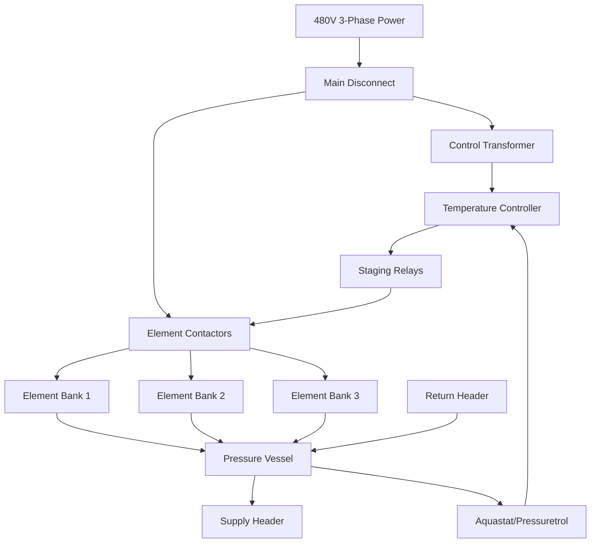
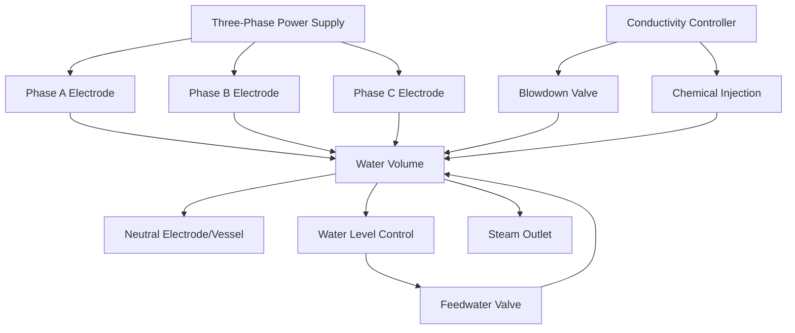

Electric boilers convert electrical energy directly into thermal energy for hydronic heating and steam generation applications. Unlike combustion-based boilers, electric boilers require no fuel storage, combustion air, or flue gas venting, offering simplified installation and 100% efficiency at the point of use. The physics of electric heating relies on Joule heating (resistance) or ionic conduction (electrode), making these systems ideal for clean, precise temperature control in buildings where electrification is prioritized.

## Fundamental Heating Mechanisms

### Resistance Heating Physics

Resistance heating converts electrical energy to heat through collisions between electrons and atoms in a conductor. The power dissipated follows Joule's first law:

$$P = I^2 R = \frac{V^2}{R}$$

where $P$ is power (W), $I$ is current (A), $R$ is resistance (Ω), and $V$ is voltage (V).

For a resistance element immersed in water, the heat transfer rate to the fluid is:

$$q = h A_s (T_s - T_w)$$

where $h$ is the convective heat transfer coefficient (W/m²·K), $A_s$ is element surface area (m²), $T_s$ is surface temperature (K), and $T_w$ is water temperature (K). Proper element design maintains surface temperatures below 250°F to prevent scale formation and element burnout.

### Electrode Heating Physics

Electrode boilers use the electrical conductivity of water itself as the heating element. When AC voltage is applied across submerged electrodes, ions in the water conduct current:

$$I = \sigma A \frac{V}{d}$$

where $\sigma$ is water electrical conductivity (S/m), $A$ is electrode area (m²), $V$ is applied voltage (V), and $d$ is electrode spacing (m).

The generated heat is distributed throughout the water volume between electrodes:

$$P = I^2 \rho_w V_{water}$$

where $\rho_w$ is water electrical resistivity (Ω·m) and $V_{water}$ is water volume (m³). This volumetric heating eliminates hot surfaces and provides rapid, uniform temperature rise.

## Electric Boiler Types

| Type | Heating Method | Capacity Range | Typical Applications | Advantages |
|------|---------------|----------------|---------------------|------------|
| **Immersion Resistance** | Metallic heating elements | 10-3,000 kW | Commercial/residential hydronic | Simple, modular, easy maintenance |
| **Electrode Boiler** | Ionic conduction in water | 100-30,000 kW | Large commercial, industrial steam | Compact, fast response, no elements |
| **Electric Steam Generator** | Resistance or electrode | 5-10,000 kW | Process steam, humidification | Clean steam, precise control |
| **Flow-Through Electric** | Inline resistance | 5-150 kW | Radiant floor, snow melt | Instantaneous, space-saving |

## Resistance Element Boilers

### Element Configuration

Resistance boilers employ tubular or screw-plug heating elements arranged in banks. Each element is controlled by a contactor and protected by fusing or circuit breakers per NEC Article 424.

### Capacity Staging

To prevent electrical demand spikes, elements are staged sequentially. The time delay between stages follows:

$$\Delta t = \frac{P_{stage}}{C_p \dot{m} \Delta T_{target}}$$

where $P_{stage}$ is power per stage (kW), $C_p$ is water specific heat (4.186 kJ/kg·K), $\dot{m}$ is mass flow rate (kg/s), and $\Delta T_{target}$ is desired temperature rise per stage (K).

ASHRAE Guideline 36 recommends minimum 30-second staging intervals to avoid nuisance trips and electrical system disturbances.

### Element Design Specifications

Resistance elements are typically constructed from nickel-chromium alloy (Nichrome) or Incoloy sheathed in copper or stainless steel. Key design parameters:

- **Power density**: 15-40 W/in² (element manufacturers limit to prevent scale)
- **Sheath temperature**: <250°F in water to minimize scaling
- **Element voltage**: 240V, 480V, or 600V three-phase
- **Temperature coefficient**: Resistance increases ~0.4%/°C

## Electrode Boilers

### Operating Principle

Electrode boilers modulate output by varying the water level between fixed electrodes or adjusting electrode immersion depth. The output power relationship is:

$$P = k \cdot L \cdot \sigma \cdot V^2$$

where $k$ is a geometry constant, $L$ is electrode immersion length (m), $\sigma$ is water conductivity (S/m), and $V$ is applied voltage (V).

### Water Conductivity Requirements

Electrode boilers require specific water conductivity ranges:

- **Low-pressure steam (0-15 psig)**: 2,000-5,000 μS/cm
- **Medium-pressure steam (15-150 psig)**: 1,500-3,000 μS/cm
- **High-pressure steam (>150 psig)**: 500-2,000 μS/cm

Conductivity is maintained by automatic blowdown and chemical injection (typically sodium carbonate or sodium hydroxide). The blowdown rate required is:

$$BD = \frac{\sigma_{feedwater}}{\sigma_{boiler} - \sigma_{feedwater}} \times \dot{m}_{steam}$$

### Electrode Configuration

The neutral electrode (often the vessel shell) completes the circuit. Current flows through the conductive water between phase electrodes and neutral, generating heat uniformly throughout the water volume.

## Efficiency Considerations

### Point-of-Use Efficiency

Electric boilers achieve 100% thermal efficiency at the point of use because all electrical input converts to heat within the boiler:

$$\eta_{boiler} = \frac{Q_{output}}{P_{input}} = 1.0$$

However, source-to-site efficiency accounting for power generation and transmission losses is:

$$\eta_{overall} = \eta_{generation} \times \eta_{transmission} \times \eta_{boiler}$$

For typical U.S. grid mix: $\eta_{overall} = 0.33 \times 0.92 \times 1.0 = 0.30$ (30%)

As grid decarbonization increases renewable penetration, this improves significantly for solar/wind electricity.

### Standby Heat Loss

Electric boilers have minimal standby losses due to compact insulated jackets. The standby loss rate is:

$$q_{standby} = U \cdot A \cdot (T_{boiler} - T_{ambient})$$

where $U$ is overall heat transfer coefficient (typically 0.3-0.8 W/m²·K for 2-inch mineral wool insulation), $A$ is surface area (m²), and temperatures are in Kelvin.

For a 500 kW electric boiler at 180°F in 70°F space: $q_{standby} \approx 1.2$ kW (0.24% of rated capacity).

## Installation Requirements

### Electrical Specifications

Per NEC Article 424.82, electric boiler circuits must be sized at 125% of nameplate rating:

$$I_{circuit} = 1.25 \times \frac{P_{nameplate}}{V \times \sqrt{3} \times PF}$$

For three-phase equipment, where $PF$ is power factor (typically 1.0 for resistive loads).

**Example**: A 250 kW, 480V three-phase boiler requires:

$$I_{circuit} = 1.25 \times \frac{250,000}{480 \times 1.732 \times 1.0} = 377 \text{ A}$$

This requires 500 kcmil copper conductors (400A ampacity) in appropriate raceway.

### Space and Ventilation Requirements

Electric boilers require no combustion air or flue gas venting. Minimum clearances per ASME CSD-1:

- **Front**: 36 inches (service access)
- **Sides**: 6 inches (air circulation)
- **Top**: 12 inches (control access)
- **Rear**: 6 inches (minimum)

Room ventilation requirements are minimal—only sufficient to dissipate standby heat losses and maintain equipment room below 104°F per ASHRAE Standard 15.

## Applications and Advantages

### Electrification Scenarios

Electric boilers are optimal for:

1. **Buildings with no gas service**: Eliminates gas infrastructure costs ($50,000-$200,000 for service extensions)
2. **Low-temperature hydronic systems**: Radiant floors, baseboards operating 90-140°F
3. **Decarbonization mandates**: Cities banning fossil fuel combustion (Berkeley, Seattle, New York proposals)
4. **Grid-interactive buildings**: Load shifting with thermal storage during low-cost/renewable-heavy hours

### Load Shifting with Thermal Storage

Combined with insulated storage tanks, electric boilers can shift heating loads to off-peak hours:

$$V_{storage} = \frac{Q_{daily} \times t_{peak}}{\rho C_p \Delta T \times \eta_{delivery}}$$

where $Q_{daily}$ is daily heating load (kWh), $t_{peak}$ is peak demand period (hours), $\rho$ is water density (1000 kg/m³), and $\Delta T$ is storage temperature swing (typically 20-40°F).

For a building requiring 500 kWh/day heating during 12-hour peak period with 30°F storage swing:

$$V_{storage} = \frac{500 \times 12}{1000 \times 4.186 \times 16.7 \times 0.90} = 954 \text{ liters} \approx 250 \text{ gallons}$$

### Comparison to Combustion Boilers

| Parameter | Electric Boiler | Natural Gas Boiler |
|-----------|----------------|-------------------|
| Thermal efficiency | 100% (point of use) | 80-98% (combustion) |
| Source efficiency | 30-40% (grid avg) | 95% (pipeline) |
| Operating cost ($/MMBtu) | $30-50 (at $0.10/kWh) | $8-15 (at $1.00/therm) |
| Emissions (on-site) | Zero | CO₂, NOₓ, CO |
| Maintenance | Minimal (no combustion) | Annual tune-up required |
| Space requirements | Compact (no flue) | Larger (flue, combustion air) |
| Turndown ratio | Infinite (0-100%) | 5:1 to 10:1 typical |

## Controls and Safety

### Temperature Control

Electric boilers employ proportional-integral-derivative (PID) control for precise temperature maintenance:

$$P_{output}(t) = K_p e(t) + K_i \int e(t)dt + K_d \frac{de(t)}{dt}$$

where $e(t)$ is error between setpoint and actual temperature. Typical tuning parameters for hydronic systems: $K_p = 8$, $K_i = 0.3$, $K_d = 0.5$.

### Safety Controls

Required safety devices per ASME CSD-1 Section HLW-140:

- **High-limit aquastat**: 240°F typical for hydronic, prevents overheating
- **Low-water cutoff**: Electrode-type or float switch prevents dry firing
- **Pressure relief valve**: Sized per ASME Section IV for full boiler output
- **Ground fault protection**: Required per NEC 424.22 for all electric boilers >50 kW

Electrode boilers additionally require conductivity limit controls to prevent overcurrent conditions from excessive water treatment chemical concentration.

## References

- ASME CSD-1: Controls and Safety Devices for Automatically Fired Boilers
- NEC Article 424: Fixed Electric Space-Heating Equipment
- ASHRAE Handbook—HVAC Systems and Equipment, Chapter 32: Boilers
- ASHRAE Standard 90.1: Energy Standard for Buildings (Section 6 Heating Equipment)

