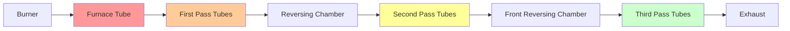

## Fundamental Operating Principle

Fire-tube boilers operate by passing hot combustion gases through tubes that are surrounded by water. This configuration contrasts with water-tube boilers where water flows through tubes surrounded by combustion gases. The heat transfer mechanism relies on forced convection from the hot gas side and natural convection on the water side, with the tube wall acting as the conductive heat transfer medium.

The total heat transfer rate follows:

$$Q = U \cdot A \cdot \Delta T_{lm}$$

Where:
- $Q$ = heat transfer rate (Btu/hr)
- $U$ = overall heat transfer coefficient (Btu/hr·ft²·°F)
- $A$ = tube surface area (ft²)
- $\Delta T_{lm}$ = log mean temperature difference (°F)

The log mean temperature difference accounts for the changing gas temperature as it travels through the tubes:

$$\Delta T_{lm} = \frac{(T_{gas,in} - T_{water}) - (T_{gas,out} - T_{water})}{\ln\left(\frac{T_{gas,in} - T_{water}}{T_{gas,out} - T_{water}}\right)}$$

## Scotch Marine Design

The Scotch marine boiler represents the most common fire-tube configuration in commercial applications. This design features a large cylindrical pressure vessel with one or more internal furnace tubes (combustion chambers) and multiple small-diameter fire tubes arranged in passes.

### Construction Features

The Scotch marine design incorporates:

**Furnace tube**: Large-diameter corrugated tube (24-36 inches) that contains the burner flame. Corrugations provide structural strength against external pressure and increase heat transfer surface area by promoting turbulence.

**Fire tube bundle**: Multiple small-diameter tubes (2-4 inches) arranged in 2, 3, or 4 passes. Each pass represents a reversal of gas flow direction.

**Reversing chamber**: Located at the rear of the boiler, this chamber redirects combustion gases between passes.

**Wet-back vs. dry-back**: Wet-back designs have the reversing chamber surrounded by water, improving efficiency by 2-3% but increasing complexity. Dry-back designs have an external, refractory-lined chamber.

## Combustion Gas Flow Mechanics

Combustion gases follow a serpentine path through the boiler, with each pass extracting thermal energy. The gas-side heat transfer coefficient varies significantly between the furnace tube and fire tubes due to differences in velocity and temperature.

### Furnace Tube Heat Transfer

In the furnace tube, heat transfer occurs through:

1. **Radiation**: Dominates at flame temperatures (2200-2800°F)
2. **Convection**: Increases as gas temperature drops

The radiant heat transfer follows Stefan-Boltzmann:

$$q_{rad} = \sigma \cdot \epsilon \cdot A \cdot (T_{flame}^4 - T_{wall}^4)$$

Where:
- $\sigma$ = Stefan-Boltzmann constant = $0.1714 \times 10^{-8}$ Btu/hr·ft²·°R⁴
- $\epsilon$ = effective emissivity (0.6-0.8 for oil/gas flames)
- $T$ = absolute temperature (°R)

### Fire Tube Convective Transfer

In the fire tubes, convective heat transfer dominates. The gas-side heat transfer coefficient depends on Reynolds number:

$$Re = \frac{\rho \cdot V \cdot D}{\mu}$$

For turbulent flow (Re > 10,000), the Dittus-Boelter correlation applies:

$$Nu = 0.023 \cdot Re^{0.8} \cdot Pr^{0.4}$$

Where $Nu$ is the Nusselt number and $Pr$ is the Prandtl number. This yields the convective coefficient:

$$h = \frac{Nu \cdot k}{D}$$

Typical gas-side coefficients range from 15-30 Btu/hr·ft²·°F in fire tubes, compared to 200-500 Btu/hr·ft²·°F on the water side.

## Water-Side Design Principles

The water side of a fire-tube boiler operates under principles of natural circulation. As water contacts hot tube surfaces, it absorbs heat and forms steam bubbles. The density difference between the steam-water mixture near tubes and cooler water in the bulk volume creates circulation currents.

### Water Volume and Steam Storage

Fire-tube boilers contain large water volumes relative to their steam output, providing thermal mass that dampens load fluctuations. The ratio of water volume to evaporation rate determines steam storage capacity:

$$t_{storage} = \frac{V_{water} \cdot \rho \cdot c_p \cdot \Delta T}{\.m_{steam} \cdot h_{fg}}$$

Where:
- $t_{storage}$ = time to supply steam from stored energy (minutes)
- $V_{water}$ = water volume (ft³)
- $\Delta T$ = allowable temperature drop (°F)
- $\.m_{steam}$ = steam demand (lb/hr)
- $h_{fg}$ = latent heat of vaporization (Btu/lb)

Typical fire-tube boilers can supply 3-5 minutes of steam from storage, compared to less than 1 minute for water-tube designs.

### Waterside Pressure Drop

Natural circulation in fire-tube boilers results in minimal pressure drop on the water side. The driving head for circulation derives from buoyancy:

$$\Delta P_{buoyancy} = g \cdot H \cdot (\rho_{cool} - \rho_{hot})$$

This natural circulation eliminates the need for circulation pumps but limits the boiler to moderate heat flux values (15,000-30,000 Btu/hr·ft²).

## Pressure Ratings and ASME Code Requirements

Fire-tube boilers are constructed to ASME Boiler and Pressure Vessel Code requirements. The applicable section depends on pressure and intended use:

| ASME Section | Application | Maximum Pressure | Maximum Capacity |
|--------------|-------------|------------------|------------------|
| Section I | Power boilers | >15 psig | >500,000 Btu/hr |
| Section IV | Low-pressure heating | ≤160 psig | ≤500,000 Btu/hr |

### Shell Thickness Calculation

The minimum shell thickness for the cylindrical pressure vessel follows ASME Section I formula:

$$t = \frac{P \cdot R}{S \cdot E - 0.6 \cdot P} + C$$

Where:
- $t$ = minimum thickness (inches)
- $P$ = maximum allowable working pressure (psig)
- $R$ = inside radius (inches)
- $S$ = maximum allowable stress (psi)
- $E$ = joint efficiency (0.7-1.0)
- $C$ = corrosion allowance (inches)

For SA-285 Grade C steel at 400°F: $S = 13,700$ psi

### Tube Sheet Design

Tube sheets must withstand the pressure differential between water side and fire side (during operation) or full water pressure (when off-line). Thickness requirements follow:

$$t_s = F \cdot G \cdot \sqrt{\frac{P}{S}}$$

Where:
- $t_s$ = tube sheet thickness (inches)
- $F$ = calculation constant based on tube pattern
- $G$ = diameter or short span (inches)
- $P$ = differential pressure (psi)
- $S$ = allowable stress (psi)

## Commercial Building Applications

Fire-tube boilers dominate commercial heating applications in the 10-800 horsepower (345-27,600 MBH) range due to several advantages:

### Application Comparison

| Feature | Fire-Tube | Water-Tube |
|---------|-----------|------------|
| Capacity range | 10-800 HP | 200-100,000+ HP |
| Space efficiency | Compact | Requires more space |
| Response time | Slower (3-5 min) | Faster (<1 min) |
| Water quality | Tolerant | Demanding |
| Initial cost | Lower | Higher |
| Efficiency | 80-85% | 85-90% |

### Typical Applications

**Office buildings**: 150-600 HP units for space heating and domestic hot water via heat exchangers.

**Schools**: 100-400 HP for classroom heating, often with multiple smaller units for redundancy.

**Hospitals**: 400-800 HP for space heating, sterilization, and laundry. Requires redundant capacity for critical loads.

**Industrial facilities**: 300-800 HP for process steam up to 150 psig.

### Load Matching Considerations

Fire-tube boilers operate most efficiently at 70-100% of rated capacity. The combustion efficiency drops at low fire due to increased excess air:

$$\eta_{combustion} = \frac{Q_{absorbed}}{Q_{fuel}} = 1 - \frac{\.m_{flue} \cdot c_p \cdot (T_{flue} - T_{ambient})}{\.m_{fuel} \cdot LHV}$$

Multiple smaller boilers often provide better seasonal efficiency than a single large unit by allowing better load matching and sequential operation.

## Performance Optimization

### Turndown Ratio

Modern fire-tube boilers achieve turndown ratios of 5:1 to 10:1, meaning they can modulate from 100% to 10-20% of rated capacity while maintaining stable combustion. This capability reduces cycling losses and improves seasonal efficiency.

### Thermal Efficiency

Overall thermal efficiency accounts for combustion efficiency, radiation losses, and jacket losses:

$$\eta_{thermal} = \eta_{combustion} - \eta_{radiation} - \eta_{jacket}$$

Typical values:
- Combustion efficiency: 81-85%
- Radiation/jacket losses: 1-2%
- Net thermal efficiency: 80-83%

High-efficiency designs with stack economizers can achieve 85-88% thermal efficiency.

## Components

- Scotch Marine Boilers
- Locomotive Boilers
- Vertical Fire Tube
- Horizontal Return Tubular
- Firebox Boilers
- Packaged Fire Tube
