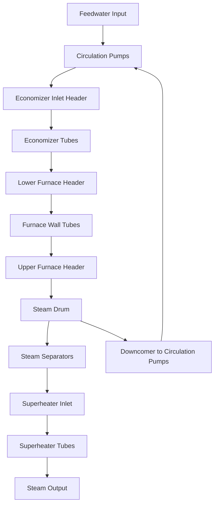
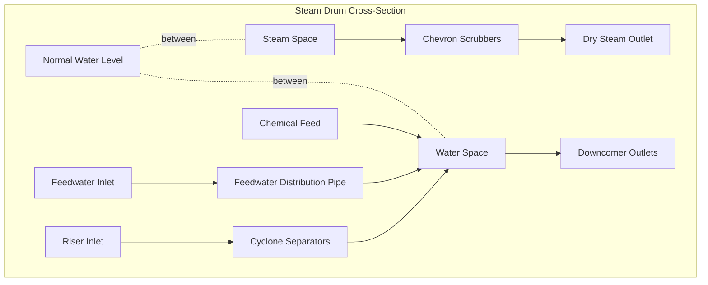

## Fundamental Operating Principles

Water-tube boilers represent the predominant technology for high-capacity, high-pressure steam generation where water circulates through tubes heated externally by combustion gases. This configuration provides superior pressure capability compared to fire-tube designs, with operating pressures ranging from 150 psi (1,035 kPa) to over 3,200 psi (22 MPa) in utility applications.

The fundamental advantage of water-tube construction lies in stress distribution. Tubes experience tensile hoop stress that scales linearly with diameter, enabling high-pressure operation through small-diameter tubes rather than large pressure vessels.

### Hoop Stress Analysis

The hoop stress in cylindrical tubes under internal pressure follows:

$$\sigma_h = \frac{P \cdot d_i}{2 \cdot t}$$

Where:
- $\sigma_h$ = hoop stress (Pa)
- $P$ = internal pressure (Pa)
- $d_i$ = inner tube diameter (m)
- $t$ = tube wall thickness (m)

For ASME Section I compliance, allowable stress values range from 11,000 to 20,000 psi (76 to 138 MPa) depending on material and temperature. A 2-inch (50 mm) outer diameter tube with 0.165-inch (4.2 mm) wall thickness experiences hoop stress of approximately 5,300 psi (37 MPa) at 1,000 psi (6.9 MPa) operating pressure, providing adequate safety margin.

In contrast, a fire-tube boiler shell 48 inches (1,220 mm) in diameter would require wall thickness exceeding 2 inches (51 mm) for the same pressure, demonstrating water-tube superiority for high-pressure applications.

## Circulation Mechanisms

Water circulation through boiler tubes occurs through natural convection (thermosyphon effect) or mechanical pumping (forced circulation). The circulation rate critically affects heat transfer, steam quality, and tube integrity.

### Natural Circulation Systems

Natural circulation develops from density differences between water-filled downcomers and steam-water mixture in heated riser tubes. The circulation driving force equals:

$$\Delta P_{circ} = g \cdot H \cdot (\rho_{down} - \rho_{up})$$

Where:
- $\Delta P_{circ}$ = circulation driving pressure (Pa)
- $g$ = gravitational acceleration (9.81 m/s²)
- $H$ = vertical height between drum centers (m)
- $\rho_{down}$ = saturated water density in downcomers (kg/m³)
- $\rho_{up}$ = average two-phase mixture density in risers (kg/m³)

The two-phase mixture density in riser tubes depends on steam quality (dryness fraction):

$$\rho_{up} = \frac{1}{\frac{x}{\rho_g} + \frac{1-x}{\rho_f}}$$

Where:
- $x$ = steam quality (mass fraction)
- $\rho_g$ = steam density (kg/m³)
- $\rho_f$ = liquid water density (kg/m³)

At 600 psi (4.14 MPa) saturation, water density equals 733 kg/m³ while steam density equals 20.2 kg/m³. A riser with 15% quality (x = 0.15) exhibits average density of 120 kg/m³. With 30-foot (9.1 m) height difference, the driving pressure reaches:

$$\Delta P_{circ} = 9.81 \times 9.1 \times (733 - 120) = 54,700 \text{ Pa (7.9 psi)}$$

This driving force overcomes friction losses in tubes, headers, and fittings. Typical circulation rates range from 5:1 to 20:1, meaning 5 to 20 kg of water circulates per kg of steam generated.

**Advantages of Natural Circulation:**
- No auxiliary power consumption
- Inherent reliability with no pumps
- Self-adjusting to load changes
- Lower maintenance requirements

**Limitations:**
- Requires sufficient vertical height (minimum 20-25 feet/6-8 m)
- Limited to pressures below 2,400 psi (16.5 MPa)
- Slower response to rapid load changes
- Sensitivity to tube fouling affecting flow distribution

### Forced Circulation Systems

Forced circulation employs centrifugal pumps to circulate water through boiler tubes at rates independent of thermosyphon effects. Circulation pumps typically provide 50-150 psi (345-1,035 kPa) differential pressure.

**Heat Flux Capability:**

Forced circulation enables higher heat flux rates by maintaining adequate tube-wall wetting. The critical heat flux (burnout point) increases with mass velocity:

$$q_{critical} \propto G^{0.8}$$

Where $G$ = mass velocity (kg/m²·s)

Forced circulation systems achieve mass velocities of 1,000-3,000 kg/m²·s compared to 300-800 kg/m²·s in natural circulation, permitting furnace heat flux rates exceeding 300,000 Btu/hr·ft² (946 kW/m²).

**Applications:**
- Supercritical pressure boilers (>3,208 psi/22.1 MPa)
- Compact high-output designs
- Waste heat recovery with low-temperature approach
- Horizontal tube configurations
- Once-through boiler designs

**Considerations:**
- Circulation pump power consumption (0.5-2% of boiler output)
- Pump reliability and redundancy requirements
- Flow distribution control across parallel circuits
- Startup procedure complexity

## Steam Drum Design and Function

The steam drum serves as the separation and collection point for steam generation, housing mechanical separation equipment and providing water storage capacity. Drum sizing follows ASME Section I requirements with consideration for steam separation effectiveness.

### Drum Sizing Criteria

Drum volume provides:
1. Steam/water separation distance
2. Water level control range
3. Thermal inertia for load changes
4. Chemical dosing mixing volume

Minimum drum volume relates to evaporation rate:

$$V_{drum,min} = \frac{\dot{m}_{steam} \cdot t_{res}}{\rho_f}$$

Where:
- $V_{drum,min}$ = minimum drum volume (m³)
- $\dot{m}_{steam}$ = steam generation rate (kg/s)
- $t_{res}$ = residence time, typically 3-5 seconds
- $\rho_f$ = water density (kg/m³)

For a 100,000 lb/hr (12.6 kg/s) boiler at 600 psi (4.14 MPa), minimum drum volume equals:

$$V_{drum,min} = \frac{12.6 \times 4}{733} = 0.069 \text{ m}^3 \text{ (18 gallons)}$$

Actual drums incorporate 5-10 times minimum volume for control range and surge capacity. Typical dimensions: 36-60 inches (0.9-1.5 m) diameter, 10-40 feet (3-12 m) length.

### Steam Separation Mechanisms

Multiple separation stages remove water droplets from steam:

**Primary Separation (Gravity):**

Terminal velocity of water droplets in steam follows Stokes' law:

$$v_t = \frac{d_p^2 \cdot (\rho_f - \rho_g) \cdot g}{18 \cdot \mu_g}$$

Where:
- $v_t$ = terminal settling velocity (m/s)
- $d_p$ = droplet diameter (m)
- $\mu_g$ = steam dynamic viscosity (Pa·s)

At 600 psi, 100-micron droplets settle at 0.52 m/s, while 20-micron droplets settle at only 0.021 m/s. Primary separation removes droplets larger than 100 microns.

**Secondary Separation (Cyclone Separators):**

Cyclone separators impart centrifugal acceleration 50-100 times gravity, removing droplets down to 10-20 microns. Steam moisture content after cyclone separation: 0.1-0.5% by mass.

**Tertiary Separation (Chevron Scrubbers):**

Corrugated plate separators cause directional changes forcing droplet impingement and drainage. Final steam quality: 99.5-99.9% dry (0.1-0.5% moisture maximum per ASME PTC 4.1).

### Drum Internals Configuration

## Tube Configuration Types

Water-tube boilers employ various tube arrangements optimizing heat transfer, structural integrity, and manufacturability.

### Straight-Tube Designs

Straight-tube boilers use vertical or inclined straight tubes expanded into upper and lower headers. This configuration dominated early water-tube designs due to manufacturing simplicity.

**Advantages:**
- Easy tube inspection and replacement
- Simplified hydrostatic testing
- Accessible for mechanical cleaning
- Lower fabrication cost

**Limitations:**
- Requires expansion joints for thermal growth
- Limited to lower pressures (<600 psi/4.1 MPa)
- Larger footprint
- Header thermal stress concerns

### Bent-Tube Designs

Modern water-tube boilers employ bent tubes following furnace contours, welded directly to headers or drums. Tube bending accommodates thermal expansion without expansion joints.

**Design Types:**

**D-Type Configuration:**
- Single steam drum
- Lower headers at furnace base
- D-shaped footprint
- Capacity: 20,000-400,000 lb/hr (2.5-50 kg/s)
- Pressure range: 150-900 psi (1.0-6.2 MPa)

**O-Type Configuration:**
- Single drum centered over furnace
- Headers at furnace sides
- Symmetrical design
- Capacity: 50,000-600,000 lb/hr (6.3-75 kg/s)
- Pressure range: 150-1,500 psi (1.0-10.3 MPa)

**A-Type Configuration:**
- Two drums (steam and mud)
- Inclined tubes between drums
- Compact footprint
- Capacity: 10,000-100,000 lb/hr (1.3-12.6 kg/s)
- Common in marine applications

## Performance Comparison Table

| Configuration | Pressure Range | Capacity Range | Circulation Type | Footprint | Response Time | Application |
|--------------|----------------|----------------|------------------|-----------|---------------|-------------|
| **Straight-Tube** | 150-600 psi | 10,000-150,000 lb/hr | Natural | Large | Slow | Legacy industrial |
| **D-Type Bent** | 150-900 psi | 20,000-400,000 lb/hr | Natural | Medium | Medium | Industrial process |
| **O-Type Bent** | 150-1,500 psi | 50,000-600,000 lb/hr | Natural | Medium | Medium | Power generation |
| **A-Type Bent** | 150-600 psi | 10,000-100,000 lb/hr | Natural | Small | Fast | Marine, mobile |
| **Forced Circ.** | 600-2,400 psi | 100,000-1,000,000 lb/hr | Forced | Small | Fast | Utility power |
| **Once-Through** | >2,400 psi | 500,000+ lb/hr | Forced | Minimal | Very Fast | Supercritical |

## Industrial Applications

### Power Generation

Utility boilers generate steam for turbine-driven electrical generation, representing the largest water-tube boiler application. Modern utility units produce 500-1,000 MW electrical output requiring steam generation rates of 1.5-3.5 million lb/hr (190-440 kg/s).

**Operating Parameters:**
- Subcritical units: 1,800-2,400 psi (12.4-16.5 MPa), 1,000°F (538°C)
- Supercritical units: 3,500-3,800 psi (24.1-26.2 MPa), 1,100°F (593°C)
- Ultra-supercritical: 4,500+ psi (31+ MPa), 1,200°F (649°C)

### Process Industries

Chemical, petrochemical, refining, and pulp/paper industries require process steam at various pressure levels. Water-tube boilers provide flexibility for multiple pressure outputs through extraction points.

**Typical Pressure Classes:**
- High pressure: 600-900 psi (4.1-6.2 MPa) for turbine drives
- Medium pressure: 150-250 psi (1.0-1.7 MPa) for process heating
- Low pressure: 15-50 psi (0.1-0.3 MPa) for building heating

### Cogeneration Systems

Combined heat and power (CHP) installations use high-pressure steam for electricity generation with exhaust steam supplying thermal loads. Water-tube boilers operating at 600-1,500 psi (4.1-10.3 MPa) feed back-pressure or extraction turbines.

**Efficiency Advantages:**

Overall system efficiency:

$$\eta_{CHP} = \frac{W_{electric} + Q_{thermal}}{Q_{fuel}}$$

CHP systems achieve 70-85% total efficiency compared to 35-45% for electricity-only generation, representing substantial fuel savings.

### District Heating

Large district heating systems employ water-tube boilers generating high-temperature water (HTW) at 350-450°F (177-232°C) and 250-500 psi (1.7-3.4 MPa). HTW distribution minimizes pipe sizing and pumping costs compared to low-temperature systems.

## ASME Code Requirements

Water-tube boilers operating above 15 psi steam pressure fall under ASME Boiler and Pressure Vessel Code Section I (Power Boilers). Key requirements include:

**Design Standards:**
- Maximum allowable working pressure (MAWP) calculations per Section I, Part PG
- Minimum wall thickness requirements including corrosion allowance
- Drum and header stress analysis for internal pressure and external loads
- Tube attachment weld qualification per Section IX
- Safety valve capacity: 100% of maximum continuous rating

**Material Requirements:**
- Drum shells: SA-516 Grade 70 carbon steel (common) or SA-299 alloy steel
- Tubes: SA-178 Grade A (low pressure) or SA-210 Grade A1 (high pressure)
- Superheater tubes: SA-213 T11, T22, or T91 alloy steel for high temperature
- Headers: SA-106 Grade B seamless carbon steel pipe

**Inspection and Testing:**
- Hydrostatic test pressure: 1.5 × MAWP
- Radiographic examination of longitudinal drum seams
- Authorized Inspector witnessing during fabrication
- National Board registration and stamping
- Periodic in-service inspections per jurisdictional requirements

**Documentation:**
- Form P-1 boiler data report
- Design calculations and stress analysis
- Quality control procedures
- Operating and maintenance manuals
- As-built drawings

## Conclusion

Water-tube boilers provide superior performance for high-pressure, high-capacity steam generation through efficient stress distribution in small-diameter tubes. Natural circulation designs serve the majority of industrial applications below 2,400 psi (16.5 MPa), while forced circulation extends operating ranges to supercritical pressures. Steam drum design critically affects steam quality and operational stability. Bent-tube configurations (D-type, O-type, A-type) dominate modern installations, offering compact footprints and improved thermal expansion accommodation. Proper application selection considers required pressure, capacity, response characteristics, and ASME Section I compliance requirements. Understanding circulation physics, heat transfer mechanisms, and structural design principles enables optimal water-tube boiler specification for industrial and utility applications.
