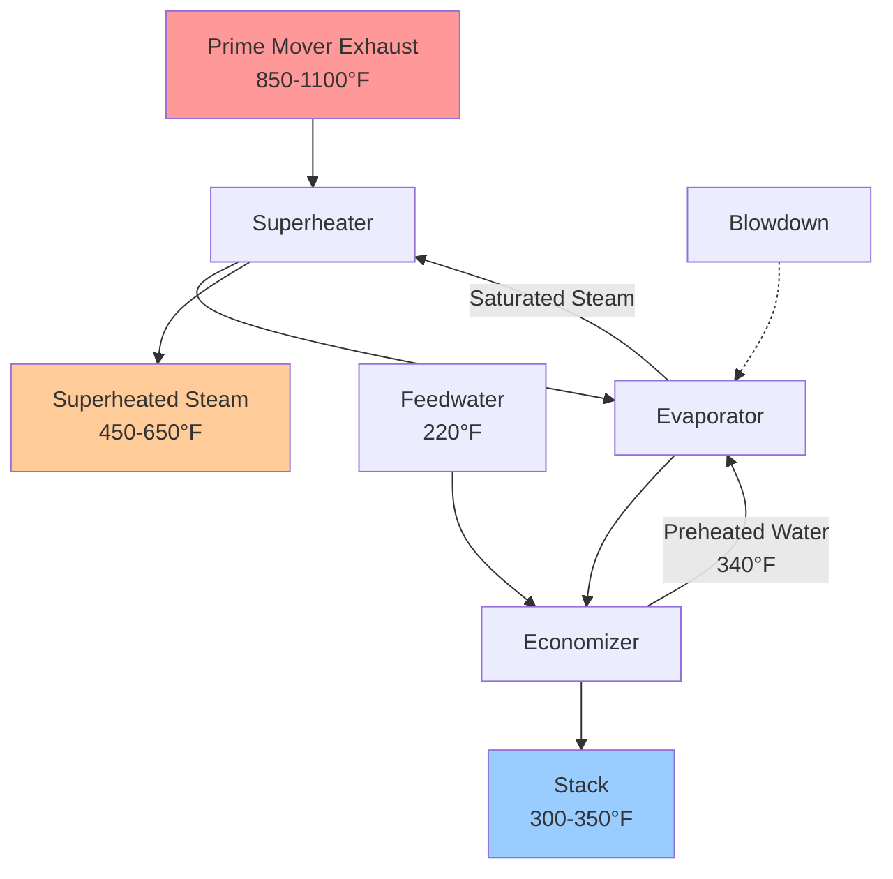
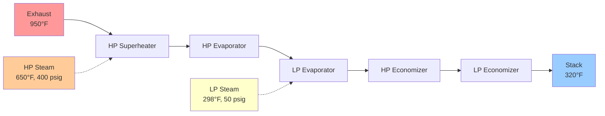

Exhaust heat recovery systems extract thermal energy from prime mover combustion products, representing the largest recoverable waste heat stream in combined heat and power installations. Gas turbine exhaust temperatures range from 850-1100°F (454-593°C) depending on turbine design and load condition, while reciprocating engine exhaust exits at 700-900°F (371-482°C). These high-temperature streams enable steam generation across pressure ranges from low-pressure saturated steam at 15 psig (366°F saturation) to superheated high-pressure steam exceeding 600 psig (489°F saturation). The thermodynamic potential for heat recovery stems from the substantial temperature difference between exhaust gas and required thermal delivery conditions, governed by fundamental heat transfer principles and constrained by acid dew point considerations.

## Thermodynamic Basis for Heat Recovery

The available thermal energy in exhaust gas follows from the first law of thermodynamics applied to the gas stream cooling from exhaust temperature to minimum stack temperature:

$$Q_{available} = \dot{m}_{exh} \cdot c_p \cdot (T_{exh,in} - T_{stack,min})$$

Where $\dot{m}_{exh}$ represents exhaust mass flow rate (lb/hr), $c_p$ denotes gas specific heat capacity (Btu/lb-°F), $T_{exh,in}$ indicates entering exhaust temperature (°F), and $T_{stack,min}$ represents minimum allowable stack temperature (°F). Natural gas combustion products exhibit specific heat capacity of approximately 0.26 Btu/lb-°F at temperatures between 400-1000°F, with modest temperature dependence requiring integration for precise calculations.

The minimum stack temperature is dictated by acid dew point constraints. Sulfur in fuel oxidizes to SO₂ during combustion, with further oxidation to SO₃ at high temperatures. SO₃ combines with water vapor to form sulfuric acid vapor, which condenses on cold heat exchanger surfaces below the acid dew point temperature:

$$\text{SO}_3 + \text{H}_2\text{O} \rightarrow \text{H}_2\text{SO}_4$$

The acid dew point temperature depends on SO₃ and H₂O partial pressures according to empirical correlation:

$$T_{dewpoint} = \frac{1000}{2.276 - 0.0294 \log_{10}(p_{SO_3}) - 0.0858 \log_{10}(p_{H_2O})} \text{ (K)}$$

For natural gas with typical sulfur content of 0.5-4 grains/100 ft³ (0.1-0.6 ppm by volume), acid dew point ranges from 250-290°F. Conservative design maintains stack temperature above 300°F to prevent acid condensation and subsequent corrosion of heat exchanger tubes and downstream ductwork. Higher sulfur fuels such as diesel or heavy fuel oil require stack temperatures of 320-360°F.

The actual recovered thermal energy depends on heat recovery equipment effectiveness:

$$Q_{recovered} = \varepsilon \cdot Q_{available} = \varepsilon \cdot \dot{m}_{exh} \cdot c_p \cdot (T_{exh,in} - T_{stack,min})$$

Effectiveness $\varepsilon$ typically ranges from 0.70-0.90 for well-designed heat recovery steam generators. Higher effectiveness requires larger heat transfer area with correspondingly higher capital cost, establishing an economic optimization problem.

## Heat Recovery Steam Generator Configuration

Heat recovery steam generators transfer thermal energy from exhaust gas to water, producing steam through three sequential heat transfer sections: economizer, evaporator, and superheater. The arrangement follows the counterflow principle with exhaust gas entering the hottest section (superheater) and exiting through the coldest section (economizer), maximizing thermodynamic efficiency.

### Economizer Section

The economizer preheats liquid feedwater from deaerator temperature (typically 220-240°F at atmospheric deaerator pressure) to approach saturation temperature. Heat transfer occurs through forced convection on both gas and water sides, with overall heat transfer coefficients ranging from 10-18 Btu/hr-ft²-°F depending on gas velocity, tube arrangement, and fouling factors.

The economizer thermal duty follows from water-side energy balance:

$$Q_{econ} = \dot{m}_{fw} \cdot (h_{fw,out} - h_{fw,in})$$

Where $\dot{m}_{fw}$ represents feedwater flow rate and $h$ denotes specific enthalpy. The required heat transfer area follows from:

$$A_{econ} = \frac{Q_{econ}}{U_{econ} \cdot \Delta T_{lm,econ}}$$

The log-mean temperature difference accounts for varying temperature gradients along the heat exchanger length:

$$\Delta T_{lm} = \frac{(T_{g,in} - T_{w,out}) - (T_{g,out} - T_{w,in})}{\ln\left(\frac{T_{g,in} - T_{w,out}}{T_{g,out} - T_{w,in}}\right)}$$

For counterflow configuration with gas entering at 520°F and water entering at 230°F, with gas exiting at 330°F and water approaching saturation at 350°F (assuming 15°F approach):

$$\Delta T_{lm,econ} = \frac{(520 - 350) - (330 - 230)}{\ln(170/100)} = 132°F$$

### Evaporator Section

The evaporator generates saturated steam at constant pressure and temperature through boiling heat transfer. Water circulates through the evaporator tubes or shell side, absorbing heat from exhaust gas and converting liquid to vapor. The latent heat of vaporization at typical CHP steam pressures (50-200 psig) ranges from 880-920 Btu/lb, substantially exceeding sensible heating requirements.

Steam production rate follows from energy balance:

$$\dot{m}_{steam} = \frac{Q_{evap}}{h_g - h_f} = \frac{Q_{evap}}{h_{fg}}$$

Where $h_g$ represents saturated vapor enthalpy, $h_f$ represents saturated liquid enthalpy, and $h_{fg}$ denotes latent heat of vaporization. For 150 psig steam (366°F saturation temperature):

- $h_f$ = 338 Btu/lb
- $h_g$ = 1195 Btu/lb
- $h_{fg}$ = 857 Btu/lb

The pinch point—the minimum temperature difference between gas and saturation temperature—occurs at the evaporator inlet where saturated water begins boiling. Pinch point values of 20-40°F balance heat transfer area requirements against achievable heat recovery. Smaller pinch points increase heat recovery but require disproportionately larger heat transfer area due to logarithmic mean temperature difference behavior.

### Superheater Section

The superheater elevates steam temperature above saturation, increasing thermal energy content and delivery temperature. Superheated steam provides greater energy per unit mass and enables higher temperature thermal processes. The degree of superheat (temperature rise above saturation) typically ranges from 50-200°F depending on application requirements and exhaust temperature availability.

Superheater thermal duty:

$$Q_{superheat} = \dot{m}_{steam} \cdot (h_{sh,out} - h_g)$$

For 150 psig saturated steam at 366°F (h = 1195 Btu/lb) superheated to 550°F (h = 1290 Btu/lb):

$$\Delta h = 1290 - 1195 = 95 \text{ Btu/lb}$$

This represents approximately 11% additional energy content compared to saturated steam. The superheater operates in the highest temperature exhaust region immediately downstream from the prime mover, experiencing the most severe thermal and mechanical stresses.

## Pinch Point Analysis and Optimization

Pinch point analysis determines the optimal balance between heat recovery depth and capital cost. The pinch point constrains the temperature profile through the HRSG, establishing minimum heat transfer area requirements.

Consider a single-pressure HRSG producing 150 psig saturated steam (366°F) from a gas turbine with 100,000 lb/hr exhaust at 950°F. Feedwater enters at 230°F. Assume target stack temperature of 330°F with pinch point of 30°F.

The pinch point occurs where exhaust gas cools to saturation temperature plus pinch:

$$T_{gas,pinch} = T_{sat} + \Delta T_{pinch} = 366 + 30 = 396°F$$

Evaporator gas-side cooling from pinch to economizer inlet:

$$Q_{evap} = \dot{m}_{exh} \cdot c_p \cdot (T_{g,evap,in} - T_{g,pinch})$$

The temperature $T_{g,evap,in}$ depends on economizer outlet conditions. Using iterative energy balance:

Economizer duty heating feedwater from 230°F to approach temperature 336°F (30°F approach to saturation):

$$Q_{econ} = \dot{m}_{fw} \cdot c_p \cdot (336 - 230) = \dot{m}_{fw} \cdot 1.0 \cdot 106$$

Economizer gas-side cooling:

$$Q_{econ} = \dot{m}_{exh} \cdot c_p \cdot (T_{g,pinch} - T_{stack}) = 100000 \cdot 0.26 \cdot (396 - 330) = 1.716 \text{ MMBtu/hr}$$

Feedwater flow requirement:

$$\dot{m}_{fw} = \frac{1716000}{106} = 16190 \text{ lb/hr}$$

Steam production from evaporator (assuming all feedwater vaporizes):

$$\dot{m}_{steam} = 16190 \text{ lb/hr}$$

Evaporator duty:

$$Q_{evap} = 16190 \cdot 857 = 13.9 \text{ MMBtu/hr}$$

Required gas cooling in evaporator:

$$T_{g,evap,in} - T_{g,pinch} = \frac{13.9 \times 10^6}{100000 \cdot 0.26} = 535°F$$

$$T_{g,evap,in} = 396 + 535 = 931°F$$

Total heat recovery from 950°F to 330°F:

$$Q_{total} = 100000 \cdot 0.26 \cdot (950 - 330) = 16.1 \text{ MMBtu/hr}$$

Effectiveness:

$$\varepsilon = \frac{Q_{recovered}}{Q_{available}} = \frac{950 - 330}{950 - 300} = 0.954$$

This analysis demonstrates how pinch point selection affects steam production and overall heat recovery effectiveness.

| Pinch Point (°F) | Steam Production (lb/hr) | Heat Recovery (%) | Relative Heat Transfer Area |
|------------------|--------------------------|-------------------|------------------------------|
| 50 | 14,200 | 91.2 | 1.00 |
| 40 | 15,100 | 93.5 | 1.18 |
| 30 | 16,200 | 95.4 | 1.42 |
| 20 | 17,500 | 97.0 | 1.78 |
| 10 | 19,200 | 98.3 | 2.35 |

Smaller pinch points increase steam production but require progressively larger heat transfer area. The economic optimum typically occurs at 25-35°F pinch point where incremental capital cost equals incremental energy value.

## Multi-Pressure Level HRSGs

Multi-pressure HRSGs incorporate two or three pressure levels to improve heat recovery across the full exhaust temperature range. High-pressure sections operate near turbine exhaust temperature while low-pressure sections recover heat from cooler gas approaching stack conditions.

A dual-pressure HRSG might produce:
- High-pressure steam: 400 psig (448°F saturation) superheated to 650°F
- Low-pressure steam: 50 psig (298°F saturation)

The high-pressure evaporator operates between 950°F and approximately 550°F gas temperature. The low-pressure evaporator recovers heat from 550°F down toward stack temperature of 320°F.

Multi-pressure configurations increase heat recovery by 8-15% compared to single-pressure designs operating at the higher pressure. The additional complexity and capital cost must justify the incremental energy recovery.

## Supplementary Firing

Supplementary firing burns additional fuel in the HRSG to increase steam production or raise steam temperature beyond unfired capability. Gas turbine exhaust contains 15-18% oxygen by volume—sufficient to support combustion without additional air. Duct burners installed upstream of the superheater combust natural gas, raising exhaust temperature from 950°F to 1400-1600°F.

The supplementary fuel flow rate required for target temperature increase:

$$\dot{m}_{fuel,supp} = \frac{\dot{m}_{exh} \cdot c_p \cdot (T_{target} - T_{exh})}{\eta_{burner} \cdot LHV_{fuel}}$$

Where $\eta_{burner}$ represents burner efficiency (typically 0.98-0.99) and $LHV_{fuel}$ denotes fuel lower heating value (21,500 Btu/lb for natural gas).

To raise 100,000 lb/hr exhaust from 950°F to 1500°F:

$$\dot{m}_{fuel} = \frac{100000 \cdot 0.26 \cdot (1500 - 950)}{0.98 \cdot 21500} = 680 \text{ lb/hr natural gas}$$

This corresponds to 14.6 MMBtu/hr (LHV basis) supplementary fuel consumption.

Supplementary firing increases steam production but decreases overall electrical efficiency since fuel energy bypasses the gas turbine. The heat rate penalty must be evaluated against the value of increased thermal output. Applications include:

- Meeting peak steam demands exceeding unfired capacity
- Providing temperature control for absorption chillers
- Enabling independent thermal output adjustment
- Improving economics when thermal load exceeds available waste heat

## Economizer Design Considerations

Shell-and-tube economizers arrange water flow through tubes with exhaust gas passing over the tube exterior. Tube materials include carbon steel for gas temperatures below 650°F and low-alloy steel (1-2.25% Cr-Mo) for higher temperatures. Finned tubes increase gas-side heat transfer area, improving compactness. Fin density of 3-5 fins per inch balances heat transfer enhancement against fouling susceptibility.

The overall heat transfer coefficient combines gas-side, tube wall, and water-side thermal resistances:

$$\frac{1}{UA} = \frac{1}{h_g A_g} + \frac{\ln(r_o/r_i)}{2\pi k L} + \frac{1}{h_w A_w}$$

Gas-side heat transfer coefficients for crossflow over tube banks range from 8-15 Btu/hr-ft²-°F depending on gas velocity (40-80 ft/sec typical). Water-side coefficients reach 400-800 Btu/hr-ft²-°F in turbulent flow. The gas-side resistance dominates, making finned tubes effective.

Fouling accumulation reduces heat transfer over time. Fouling factors of 0.001-0.002 hr-ft²-°F/Btu account for expected deposition on gas and water sides. Soot blowers remove gas-side deposits through periodic steam or compressed air cleaning.

## Thermal Efficiency Optimization

Overall CHP thermal efficiency depends on heat recovery effectiveness, prime mover electrical efficiency, and parasite losses:

$$\eta_{CHP,thermal} = \frac{Q_{recovered} - Q_{parasite}}{Q_{fuel,total}}$$

Parasitic thermal losses include:
- HRSG surface heat loss: 1-2% of thermal output
- Blowdown heat loss: 2-5% depending on water quality
- Stack sensible heat: remaining exhaust energy above stack temperature
- Piping and distribution losses: 3-8% for poorly insulated systems

The net thermal efficiency optimization requires balancing heat recovery depth against capital cost. ASHRAE Standard 90.1 establishes minimum CHP system efficiency requirements, with total system efficiency (electrical plus thermal) exceeding 60% for systems below 10 MW and 70% for larger systems.

Life cycle cost analysis determines the economic optimum:

$$LCC = C_{capital} + \sum_{t=1}^{n} \frac{C_{O\&M,t} + C_{fuel,t} - S_{energy,t}}{(1+r)^t}$$

Where $C_{capital}$ represents installed cost, $C_{O\&M}$ denotes operations and maintenance cost, $C_{fuel}$ indicates fuel cost, $S_{energy}$ represents energy cost savings, $r$ denotes discount rate, and $n$ indicates analysis period.

Optimization typically yields heat recovery effectiveness of 75-85% as the economic optimum, though site-specific factors including fuel costs, electricity prices, thermal load characteristics, and available incentives significantly influence the result.

## Stack Temperature and Acid Dew Point Management

Maintaining stack temperature above acid dew point prevents sulfuric acid condensation that causes rapid corrosion failure. Stack temperature monitoring and control systems adjust heat recovery to maintain safe operating conditions.

Control strategies include:
- Exhaust gas bypass damper modulation to limit heat recovery during low thermal demand
- Feedwater temperature control to adjust heat extraction
- Variable-speed induced draft fan to regulate gas flow
- Automatic shutdown on low stack temperature alarm

Natural gas fuel with <1 ppm sulfur content enables stack temperatures as low as 250-270°F with appropriate materials (316L stainless steel). Higher sulfur content requires stack temperatures of 300-350°F and may necessitate flue gas condensing heat recovery with corrosion-resistant materials.

Condensing economizers intentionally cool exhaust below water dew point (120-140°F) to recover latent heat of water vapor condensation. This yields additional 5-10% heat recovery but requires stainless steel or specialty alloy construction. The condensate must be neutralized (pH 4-6 typical) before discharge.

## Performance Monitoring and Efficiency Verification

Continuous monitoring quantifies heat recovery performance and identifies degradation. Key measurements include:

**Exhaust gas parameters:**
- Temperature (inlet and outlet)
- Flow rate (measured or calculated from fuel flow and combustion analysis)
- Composition (O₂, CO₂, CO, NOₓ)

**Steam parameters:**
- Pressure
- Temperature
- Flow rate
- Quality (saturation vs. superheat)

**Feedwater parameters:**
- Temperature
- Flow rate
- Chemistry (conductivity, pH, dissolved oxygen)

Measured heat recovery:

$$Q_{measured} = \dot{m}_{steam}(h_{steam} - h_{feedwater}) + \dot{m}_{blowdown}(h_{blowdown} - h_{feedwater})$$

Comparison to design values identifies performance degradation from fouling, tube leaks, or control issues. Heat recovery effectiveness below design by more than 5% warrants investigation and potential cleaning or repair.

ASME Performance Test Code PTC 4.4 establishes standardized procedures for HRSG performance testing, specifying measurement locations, instrument accuracy requirements, and calculation methodologies. Regular testing per manufacturer recommendations (typically annual or biennial) maintains system performance and supports warranty compliance.
