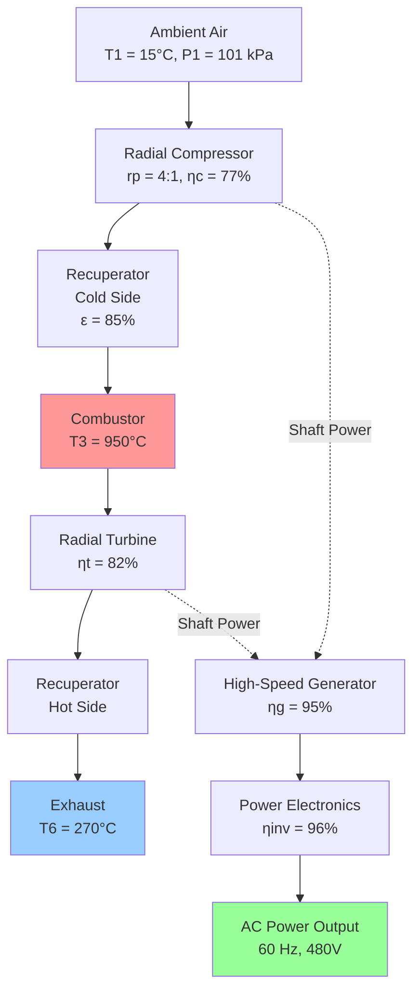
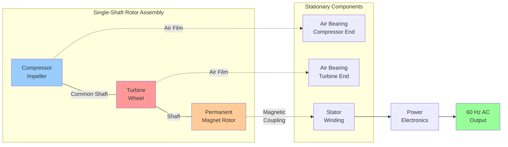

Microturbines represent compact gas turbine prime movers operating in the 30-500 kW capacity range, featuring single-shaft radial flow compressors and turbines rotating at extremely high speeds (50,000-120,000 rpm). These systems convert fuel energy to electrical power through the Brayton thermodynamic cycle while producing recoverable thermal energy from exhaust gases. The integration of recuperators, air bearings, and high-frequency permanent magnet generators distinguishes microturbines from conventional gas turbines and enables distributed generation applications where compact footprint, low emissions, and minimal maintenance requirements are essential.

## Brayton Cycle Thermodynamics

Microturbines operate on the open Brayton cycle, consisting of four fundamental processes: isentropic compression, constant-pressure heat addition through combustion, isentropic expansion through the turbine, and constant-pressure heat rejection to the environment. The thermodynamic efficiency of this cycle depends critically on the pressure ratio and the effectiveness of heat recuperation.

The ideal Brayton cycle efficiency follows from the first law of thermodynamics applied to each component. For an ideal cycle with no recuperation, the thermal efficiency is:

$$\eta_{Brayton} = 1 - \frac{1}{r_p^{(\gamma-1)/\gamma}}$$

Where $r_p$ represents the compressor pressure ratio and $\gamma$ represents the ratio of specific heats (approximately 1.4 for air). This relationship demonstrates that efficiency increases with pressure ratio, but practical limitations constrain microturbine pressure ratios to 3.5:1 to 5:1, yielding ideal cycle efficiencies of 30-37%.

Real cycle performance deviates from ideal due to component inefficiencies. The actual compressor work exceeds ideal isentropic compression:

$$W_c = \frac{\dot{m} c_p T_1}{η_c} \left(r_p^{(\gamma-1)/\gamma} - 1\right)$$

Where $\dot{m}$ represents mass flow rate, $c_p$ represents specific heat at constant pressure, $T_1$ represents compressor inlet temperature, and $η_c$ represents compressor isentropic efficiency (typically 75-80% for radial compressors).

Similarly, turbine work output falls below ideal isentropic expansion:

$$W_t = \dot{m} c_p T_3 η_t \left(1 - \frac{1}{r_p^{(\gamma-1)/\gamma}}\right)$$

Where $T_3$ represents turbine inlet temperature and $η_t$ represents turbine isentropic efficiency (typically 80-85%). The net work output equals turbine work minus compressor work, with the remainder consumed by generator losses and auxiliary systems.

## Recuperator Integration

The recuperator represents the critical component enabling practical microturbine electrical efficiency. This compact heat exchanger transfers thermal energy from the hot turbine exhaust to the compressed air entering the combustor, reducing fuel consumption required to achieve turbine inlet temperature. Without recuperation, microturbine electrical efficiency would fall to 15-18%, rendering the technology uneconomical.

Recuperator effectiveness quantifies heat transfer performance:

$$\varepsilon = \frac{T_3' - T_2}{T_5 - T_2}$$

Where $T_3'$ represents actual combustor inlet temperature, $T_2$ represents compressor discharge temperature, and $T_5$ represents turbine exhaust temperature. Modern plate-fin or primary surface recuperators achieve effectiveness values of 80-90%, dramatically improving cycle efficiency.

The fuel savings from recuperation can be quantified by comparing fuel flow with and without heat recovery. The combustor heat input for a recuperated cycle becomes:

$$\dot{Q}_{fuel,recup} = \dot{m} c_p (T_3 - T_3') = \dot{m} c_p (T_3 - T_2 - \varepsilon(T_5 - T_2))$$

Versus the simple cycle requirement:

$$\dot{Q}_{fuel,simple} = \dot{m} c_p (T_3 - T_2)$$

The fuel reduction ratio directly equals the recuperator effectiveness multiplied by the exhaust-to-discharge temperature ratio, typically achieving 40-50% fuel savings for electrical generation.

Recuperator construction uses primary surface heat exchangers where metal fins provide heat transfer area between hot and cold gas streams. The extremely compact design achieves surface area densities exceeding 1,000 ft²/ft³ of core volume. Thin-gauge stainless steel foil (0.002-0.004 inch) forms offset or louvered fins arranged in counterflow orientation to maximize temperature approach.

Pressure drop through the recuperator consumes a portion of the pressure ratio developed by the compressor, reducing net work output. Total pressure drop typically ranges from 3-5% on both hot and cold sides, representing a compromise between heat transfer effectiveness and pressure loss penalty.

## Single-Shaft Architecture

Microturbines employ single-shaft configuration where the compressor, turbine, and generator rotate on a common shaft supported by air bearings. This arrangement contrasts with larger gas turbines using two-shaft designs with separate power turbines. The single-shaft architecture simplifies mechanical design, eliminates gearbox losses, reduces maintenance requirements, but constrains operating speed since all components must rotate at identical speed.

The rotor dynamics of single-shaft microturbines present unique challenges due to the extremely high rotational speeds required for efficient radial turbomachinery at small scales. Centrifugal stress in the compressor impeller scales with the square of tip speed:

$$\sigma = \rho \omega^2 r^2$$

Where $\rho$ represents material density, $\omega$ represents angular velocity, and $r$ represents radius. At 90,000 rpm, a 4-inch diameter compressor impeller experiences centrifugal accelerations exceeding 100,000 g, requiring advanced titanium or aluminum alloys with exceptional strength-to-weight ratios.

Air bearing technology eliminates oil lubrication systems while enabling high-speed operation with minimal friction. Hydrodynamic air bearings generate load-carrying pressure through the viscous pumping action of the rotating shaft in the thin air film separating shaft and bearing surfaces. The load capacity of a simple journal air bearing can be estimated from:

$$W = \frac{\mu \omega R^3 L}{c^2} S(\varepsilon)$$

Where $\mu$ represents air viscosity, $R$ represents bearing radius, $L$ represents bearing length, $c$ represents radial clearance (typically 0.001-0.003 inches), $\varepsilon$ represents eccentricity ratio, and $S(\varepsilon)$ represents the Sommerfeld number function. The minimal clearances require precision machining and careful filtration of bearing air to prevent contamination damage.

Permanent magnet generators coupled directly to the high-speed shaft eliminate the gearbox required for conventional 3,600 rpm synchronous generators. Rare-earth permanent magnets (samarium-cobalt or neodymium-iron-boron) provide the magnetic field, while the rotor spins within a three-phase stator winding. The generator produces high-frequency AC power (1,500 Hz at 90,000 rpm for a two-pole machine) requiring full power electronics conversion to utility-compatible 60 Hz power.

## Performance Characteristics

Microturbine electrical efficiency ranges from 26-33% (LHV basis) depending on size, design, and operating conditions. Larger units within the 200-500 kW range achieve higher efficiencies due to improved component performance at larger scale. The efficiency remains relatively constant across the operating range from 50-100% load due to the favorable part-load characteristics of recuperated gas turbine cycles.

The overall CHP efficiency combining electrical and useful thermal output typically reaches 70-80% when thermal energy from the recuperator exhaust is fully utilized. The exhaust temperature after the recuperator ranges from 250-300°C (480-570°F), suitable for low-pressure steam generation, hot water production, or single-effect absorption cooling.

| Parameter | Value | Notes |
|-----------|-------|-------|
| Capacity Range | 30-500 kW | Electrical output |
| Electrical Efficiency | 26-33% | LHV basis, full load |
| Overall CHP Efficiency | 70-80% | With full thermal recovery |
| Pressure Ratio | 3.5:1 to 5:1 | Compressor discharge/inlet |
| Turbine Inlet Temp | 900-1000°C | Metallurgical limit |
| Exhaust Temperature | 250-300°C | After recuperator |
| Rotational Speed | 50,000-120,000 rpm | Depending on size |
| Power-to-Heat Ratio | 0.5-0.7 | Electrical/thermal output |
| NOx Emissions | <9 ppm | @15% O₂, dry basis |
| CO Emissions | <10 ppm | @15% O₂, dry basis |

The part-load performance of microturbines differs from reciprocating engines. Electrical efficiency remains relatively stable down to 50% load, then decreases gradually at lower outputs. This characteristic results from the recuperator maintaining high combustor inlet temperatures even as fuel flow and turbine inlet temperature decrease proportionally with load reduction.

Heat rate, the inverse of efficiency expressed in Btu/kWh, provides an alternative performance metric commonly used in the power generation industry:

$$\text{Heat Rate} = \frac{3412.14}{\eta_{elec}}$$

A microturbine operating at 30% electrical efficiency exhibits a heat rate of 11,374 Btu/kWh (LHV), compared to 7,500-9,000 Btu/kWh for larger gas turbines and 8,000-10,000 Btu/kWh for reciprocating engines.

## Emissions Performance

Microturbines achieve exceptionally low emissions through lean premixed combustion operating with excess air ratios of 3:1 to 5:1, well beyond the stoichiometric mixture ratio of approximately 1.02:1 for natural gas. The lean combustion reduces peak flame temperatures, suppressing thermal NOx formation according to the exponential Zeldovich mechanism temperature dependence.

The thermal NOx formation rate follows an Arrhenius-type relationship:

$$\frac{d[NO]}{dt} = k_f [O][N_2] \exp\left(-\frac{E_a}{RT_{flame}}\right)$$

Where $k_f$ represents the forward reaction rate constant, $[O]$ and $[N_2]$ represent oxygen and nitrogen concentrations, $E_a$ represents activation energy (approximately 319 kJ/mol), $R$ represents the universal gas constant, and $T_{flame}$ represents absolute flame temperature. The exponential temperature dependence means that reducing peak flame temperature from 2000 K to 1700 K decreases NOx formation rate by approximately 90%.

Lean premixed combustion achieves flame temperatures of 1500-1700 K, resulting in NOx emissions typically below 9 ppm (@15% O₂, dry basis) without post-combustion controls. Some advanced designs achieve sub-5 ppm NOx through further optimization of fuel-air mixing and combustion zone residence time.

Carbon monoxide emissions remain low (typically <10 ppm) despite lean combustion due to the high turbine inlet temperature providing adequate energy for CO oxidation. The residence time in the combustor and turbine, combined with the available oxygen, ensures near-complete CO burnout according to the global reaction:

$$\text{CO} + \frac{1}{2}\text{O}_2 \rightarrow \text{CO}_2$$

Unburned hydrocarbons similarly remain below 10 ppm due to complete combustion promoted by the lean mixture and high combustion temperature. The excess air ensures oxygen availability for all fuel molecules while the turbulence induced by the radial diffuser and combustor swirlers promotes thorough fuel-air mixing.

## Distributed Generation Applications

Microturbines suit distributed generation applications requiring 30-500 kW of electrical capacity with simultaneous thermal loads. The compact footprint (typically 4 ft × 4 ft × 8 ft for a 200 kW unit including controls), low vibration due to high rotational speed, and quiet operation enable installation in noise-sensitive environments without massive foundations or vibration isolation.

Common applications include:

**Commercial Buildings**: Hotels, hospitals, universities, and office complexes with consistent year-round thermal loads for space heating, cooling via absorption chillers, and domestic hot water. The 0.5-0.7 power-to-heat ratio matches facilities with moderate electrical demand relative to thermal requirements.

**Industrial Facilities**: Light manufacturing, food processing, and chemical plants requiring both electrical power and process heat or steam. The clean exhaust allows direct product contact applications where exhaust gas contamination poses risks.

**Landfill and Digester Gas**: Renewable energy generation from biogas containing 50-65% methane. Microturbines tolerate the lower heating value fuel (500-650 Btu/ft³ versus 1,000 Btu/ft³ for natural gas) with minimal modifications, though electrical efficiency decreases by 2-3 percentage points.

**Remote Power**: Off-grid installations powered by pipeline natural gas, propane, or diesel fuel where grid connection costs exceed distributed generation economics. The minimal water consumption (only for inlet cooling in hot climates) enables desert installations.

The grid interconnection for grid-parallel operation requires power electronics to convert the high-frequency generator output to utility-compatible 60 Hz power with voltage and power factor control. The inverter maintains power quality meeting IEEE 1547 interconnection standards, including voltage regulation within ±5%, power factor above 0.9, and harmonic distortion below 5% THD.

## Fuel Flexibility

Microturbines operate on multiple gaseous and liquid fuels with varying degrees of modification. Natural gas represents the preferred fuel due to clean combustion, wide availability, and pipeline delivery eliminating onsite storage. The fuel delivery system includes pressure regulation to 50-150 psig, filtration to remove particles and liquids, and flow control proportional to load demand.

The fuel heating value affects power output and efficiency. Lower heating value fuels require increased fuel flow to maintain turbine inlet temperature:

$$\dot{V}_{fuel} = \frac{\dot{m} c_p (T_3 - T_3')}{LHV \cdot \eta_{combustor}}$$

Where $\dot{V}_{fuel}$ represents volumetric fuel flow rate, and LHV represents lower heating value. Operating on 600 Btu/ft³ digester gas requires approximately 65% greater fuel volume than 1,000 Btu/ft³ natural gas for equivalent power output.

Liquid fuels including diesel, kerosene, and biodiesel require fuel atomization systems to achieve the fine spray necessary for complete combustion in the short residence time available. Dual-fuel capability enables fuel switching based on availability and economics, though liquid fuel operation typically increases maintenance intervals due to combustion deposits.

## Maintenance Requirements

Microturbines exhibit extended maintenance intervals compared to reciprocating engines due to the continuous rotational motion without reciprocating parts, oil-free operation from air bearings, and single-shaft simplicity. Major maintenance intervals typically reach 40,000-80,000 operating hours depending on fuel quality, operating conditions, and manufacturer design.

Maintenance tasks include:

**Air Filter Replacement**: Every 2,000-8,000 hours depending on environment. Differential pressure indication signals replacement need. Filter restriction directly reduces airflow and power output while increasing compressor discharge temperature.

**Recuperator Inspection**: Every 10,000-20,000 hours for leak detection and fouling assessment. External leakage reduces efficiency by bypassing heat recovery, while internal leakage between hot and cold streams disrupts pressure balance.

**Combustor Inspection**: Every 20,000-40,000 hours for liner condition and fuel injector deposits. Lean premixed combustion minimizes deposits, but some accumulation occurs over extended operation.

**Hot Section Replacement**: Every 40,000-80,000 hours replacing turbine components experiencing high-temperature exposure and thermal cycling stress. The complete hot section assembly includes turbine wheel, combustor, and recuperator.

The predictable degradation allows scheduled maintenance planning. Electrical efficiency decreases approximately 0.5-1.0 percentage points per 10,000 operating hours due to gradual increases in compressor and turbine tip clearances, recuperator fouling, and combustor pattern deterioration.

## References

ASHRAE. (2020). *ASHRAE Handbook—HVAC Systems and Equipment*, Chapter 7: Cogeneration Systems and Engine and Turbine Drives. Atlanta: ASHRAE.

U.S. Department of Energy. (2015). *Combined Heat and Power Technology Fact Sheet Series: Microturbines*. DOE/EE-1334.

Soares, C. (2014). *Microturbines: Applications for Distributed Energy Systems*. Butterworth-Heinemann.

Capstone Turbine Corporation. (2021). *Technical Reference: Microturbine Technology*. Product documentation.

International Energy Agency. (2020). *Energy Technology Systems Analysis Programme: Microturbine Systems*. IEA ETSAP Technology Brief.
