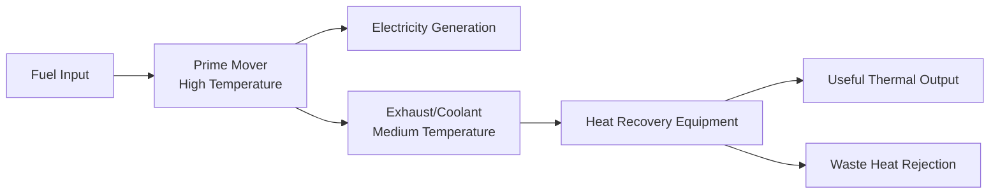
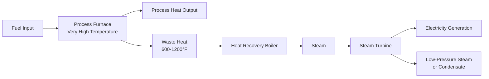
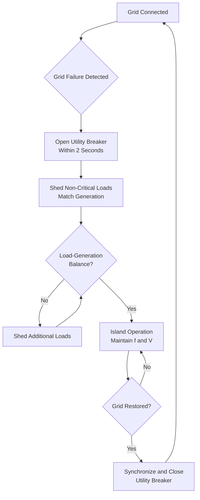

CHP system configurations determine how prime movers, heat recovery equipment, and electrical systems integrate to match facility loads while maintaining reliability and optimizing efficiency. The fundamental distinction between topping and bottoming cycles establishes the thermodynamic approach, while operational modes define grid interaction and control strategies. Proper configuration matching to facility load profiles maximizes economic and environmental benefits.

## Topping Cycle Configurations

Topping cycles generate electricity first from high-temperature energy, then recover lower-temperature thermal energy from the power generation process. This represents the dominant CHP configuration, accounting for over 95% of installed capacity. The thermodynamic advantage derives from extracting maximum work potential before degrading energy quality through heat extraction.

The topping cycle follows this energy cascade:

Gas turbine topping cycles combust fuel at temperatures exceeding 2400°F, expanding products through turbine stages to atmospheric pressure while extracting mechanical work. Exhaust temperatures of 900-1100°F enable high-pressure steam generation or direct process heating. The electrical efficiency ranges from 25-42% depending on turbine size and technology, while thermal recovery captures an additional 40-50% of fuel energy.

Reciprocating engine topping cycles achieve higher electrical efficiency (32-42%) but produce lower temperature thermal output. Exhaust temperatures of 800-1000°F support low to medium-pressure steam generation. Additional thermal recovery from jacket water (180-230°F) and lubricating oil (160-200°F) increases total efficiency but limits thermal application temperatures.

The power-to-heat ratio (PHR) characterizes topping cycle output relationships:

$$\text{PHR} = \frac{W_{elec}}{Q_{thermal}} = \frac{\eta_{elec}}{\eta_{thermal}}$$

Gas turbines exhibit PHRs from 0.5 to 1.0, while reciprocating engines range from 0.8 to 1.5. Microturbines fall between these ranges at 0.6 to 1.2. Matching PHR to facility load characteristics determines configuration suitability.

### Topping Cycle Efficiency

Total efficiency combines electrical conversion with thermal recovery:

$$\eta_{total} = \eta_{elec} + \eta_{thermal} = \frac{W_{elec}}{Q_{fuel}} + \frac{Q_{thermal}}{Q_{fuel}}$$

Typical topping cycle efficiencies reach 70-85%, with advanced combined cycles exceeding 90%. The thermal recovery efficiency depends on heat exchanger effectiveness and minimum thermal delivery temperature requirements:

$$\eta_{thermal} = \varepsilon \cdot \left(1 - \frac{T_{min}}{T_{exhaust}}\right) \cdot \eta_{mech}$$

Where $\varepsilon$ represents heat exchanger effectiveness (0.85-0.95), $T_{min}$ represents minimum allowable exhaust temperature to prevent condensation corrosion, and $\eta_{mech}$ accounts for mechanical losses.

## Bottoming Cycle Configurations

Bottoming cycles reverse the energy hierarchy by first satisfying high-temperature thermal requirements, then generating electricity from lower-temperature waste heat. These configurations suit facilities with substantial high-temperature process loads and available waste heat streams. Industrial applications including steel production, cement manufacturing, and glass production commonly employ bottoming cycles.

The bottoming cycle energy flow:

Heat recovery steam generators (HRSG) in bottoming cycles convert waste heat to steam at pressures from 150 to 1500 psig. Steam turbines extract work while expanding to back-pressure conditions suitable for additional process use or condensing operation for maximum power generation. Back-pressure turbines maintain exhaust pressure at 15-150 psig for downstream thermal applications, while condensing turbines maximize electrical output by expanding to sub-atmospheric pressures.

Bottoming cycle electrical efficiency remains inherently lower than topping cycles due to the reduced temperature differential available for work extraction. Carnot efficiency establishes the theoretical maximum:

$$\eta_{Carnot} = 1 - \frac{T_{condenser}}{T_{boiler}}$$

With waste heat temperatures of 800-1200°F (700-920 K) and condensing temperatures of 100-150°F (310-340 K), maximum theoretical efficiency reaches 55-65%. Practical steam turbine bottoming cycles achieve 15-25% electrical efficiency, with actual power output:

$$W_{elec} = \dot{m}_{steam} \cdot (h_{inlet} - h_{outlet}) \cdot \eta_{turbine} \cdot \eta_{generator}$$

Where steam mass flow rate $\dot{m}_{steam}$ depends on waste heat availability, enthalpy change $(h_{inlet} - h_{outlet})$ reflects steam expansion work, and $\eta_{turbine} \cdot \eta_{generator}$ represents combined mechanical and electrical conversion efficiency (0.85-0.92).

## Combined Cycle Configurations

Combined cycle systems integrate gas turbine topping cycles with steam turbine bottoming cycles to maximize electrical efficiency. The gas turbine exhausts into an HRSG generating high-pressure steam for the steam turbine, which extracts additional work before final heat rejection or thermal utilization.

| Configuration | Electrical Efficiency | Thermal Output | Total Efficiency | PHR |
|--------------|---------------------|----------------|------------------|-----|
| Simple Cycle Gas Turbine | 28-36% | 50-60% | 78-90% | 0.5-0.7 |
| Combined Cycle Non-CHP | 50-60% | Minimal | 52-62% | >10 |
| Combined Cycle CHP | 45-52% | 30-35% | 75-85% | 1.3-1.7 |
| Reciprocating Engine | 35-42% | 40-50% | 75-85% | 0.8-1.0 |

Combined cycle CHP configurations extract steam at intermediate pressures for thermal applications while maintaining high electrical efficiency. Extraction steam turbines withdraw steam at one or more pressure levels, balancing electrical and thermal outputs to match facility requirements.

## Grid Parallel Operation

Grid parallel operation maintains continuous connection to the electrical utility, allowing bidirectional power flow based on facility load and CHP generation. This configuration maximizes reliability by providing backup power during CHP maintenance or failure while enabling excess generation export.

### Interconnection Requirements

Electrical utilities mandate specific interconnection equipment and protection schemes per IEEE 1547 standards. Essential components include:

**Protective Relays**
- Under/over voltage protection (typical: 88-110% nominal)
- Under/over frequency protection (typical: 59.3-60.5 Hz)
- Anti-islanding protection detecting grid separation within 2 seconds
- Ground fault protection coordinated with utility protection
- Reverse power relay (optional, depending on utility requirements)

**Synchronization Equipment**
- Automatic synchronizers matching voltage magnitude, frequency, and phase angle
- Voltage differential tolerance: ±5%
- Frequency differential tolerance: ±0.1 Hz
- Phase angle differential tolerance: ±10°

**Power Quality Equipment**
- Harmonic filters limiting THD below 5% (IEEE 519)
- Power factor correction maintaining 0.95-1.0 power factor
- Voltage regulation ±5% at point of common coupling

The interconnection process involves utility application, system design review, protection scheme approval, installation inspection, and commissioning tests verifying proper operation during normal and fault conditions.

### Parallel Operation Modes

**Grid-Following Mode**
The CHP system operates at constant output while the grid supplies or absorbs load variations. This simple control strategy maintains optimal CHP efficiency but provides no load-following capability.

**Load-Following Mode**
The CHP system modulates output to match facility load, minimizing grid interaction. This reduces demand charges and maximizes on-site generation but may compromise thermal utilization and efficiency during partial load operation.

**Peak-Shaving Mode**
The CHP system operates during high-cost peak demand periods, reducing grid purchases when electricity prices or demand charges are highest. Off-peak operation follows economics.

**Base-Load Mode**
The CHP system runs continuously at rated capacity, providing baseload power and thermal output. This maximizes equipment utilization and capacity factor (typically 85-95%) while minimizing maintenance and operational complexity.

## Island Operation

Island operation completely disconnects from the utility grid, requiring the CHP system to precisely match facility electrical load while maintaining acceptable voltage and frequency regulation. This mode provides continuity during grid outages but demands sophisticated controls and load management.

The fundamental challenge in island operation is instantaneous power balance:

$$P_{CHP}(t) = P_{load}(t) + P_{losses}(t)$$

Any mismatch creates frequency excursions governed by system inertia:

$$\frac{df}{dt} = \frac{P_{CHP} - P_{load}}{2H \cdot S_{base}}$$

Where $H$ represents combined inertia constant (typically 2-5 seconds for CHP generators) and $S_{base}$ represents system capacity. Maintaining frequency within ±0.5 Hz requires load changes below 5-10% per second or fast-acting load management.

### Island Operation Requirements

**Load Management**
Automatic load shedding disconnects non-critical loads when generation capacity is insufficient, maintaining system stability for critical loads. Priority levels determine shedding sequence:
1. Priority 1 (Critical): Life safety, emergency systems
2. Priority 2 (Essential): HVAC, lighting, communications
3. Priority 3 (Non-Essential): Plug loads, amenities

**Governor Control**
Fast-acting governors adjust prime mover fuel input to maintain frequency during load changes. Droop control establishes frequency-power relationship:

$$f = f_{rated} - \frac{R \cdot (P - P_{rated})}{P_{rated}}$$

Where $R$ represents droop setting (typically 3-5%), allowing parallel operation of multiple generators while sharing load changes.

**Voltage Regulation**
Automatic voltage regulators (AVR) maintain terminal voltage within ±5% during load changes by adjusting excitation current. Reactive power demand from motors and transformers requires sufficient generator capacity:

$$S_{gen} = \sqrt{P_{load}^2 + Q_{load}^2}$$

Where apparent power $S_{gen}$ must exceed the vector sum of real power $P_{load}$ and reactive power $Q_{load}$.

## Thermal-to-Electric Ratio Optimization

The thermal-to-electric ratio (inverse of PHR) quantifies the relationship between recoverable thermal output and electrical generation:

$$\text{TER} = \frac{Q_{thermal}}{W_{elec}} = \frac{1}{\text{PHR}}$$

Facility load characteristics exhibit time-varying thermal and electrical demands, represented by annual load duration curves. Optimal CHP sizing matches system TER to facility load characteristics while maximizing operating hours and capacity factor.

### Facility Load Analysis

The electrical-to-thermal load ratio varies hourly, daily, and seasonally:

$$\text{Facility Ratio}(t) = \frac{P_{elec}(t)}{Q_{thermal}(t)}$$

Summer-peaking facilities with substantial cooling loads exhibit high electrical demand relative to thermal needs, requiring low-TER systems (high PHR) such as reciprocating engines or combined cycles. Winter-peaking facilities with dominant space heating loads favor high-TER systems (low PHR) including simple cycle gas turbines or extraction steam turbines.

### Sizing Strategies

**Thermal-Following**
Size CHP to meet baseload thermal demand, generating maximum thermal output continuously. This strategy maximizes thermal utilization but may underproduce electricity, requiring substantial grid purchases. Optimal for facilities with high, stable thermal loads:

$$W_{CHP} = \frac{Q_{thermal,base}}{\text{TER}_{system}}$$

**Electric-Following**
Size CHP to meet baseload electrical demand, accepting variable thermal utilization. Thermal energy storage or supplementary firing compensates for mismatches between thermal production and demand. Optimal for facilities with high electrical costs and variable thermal loads:

$$W_{CHP} = P_{elec,base}$$

**Economic Optimization**
Size CHP to maximize net present value by balancing capital costs, energy savings, and operating hours. This typically results in baseload sizing at 60-80% of peak demand:

$$\text{NPV} = \max_{W_{CHP}} \left[\sum_{t=1}^n \frac{(\text{Energy Savings} - \text{O\&M})_t}{(1+r)^t} - C_0(W_{CHP})\right]$$

The optimal size balances decreasing specific capital costs ($/kW) with decreasing capacity factors and increasing standby charges for larger systems.

### Configuration Comparison

| Configuration Type | TER Range | Applications | Advantages | Limitations |
|-------------------|-----------|--------------|------------|-------------|
| Gas Turbine Simple Cycle | 1.5-2.0 | Industrial steam, District heating | High thermal output, Steam generation | Lower electrical efficiency |
| Gas Turbine Combined Cycle | 0.6-0.8 | Large facilities, Campuses | High electrical efficiency | Lower thermal output |
| Reciprocating Engine | 0.7-1.2 | Commercial buildings, Small industrial | High electrical efficiency, Flexible | Lower exhaust temperature |
| Steam Turbine Back-Pressure | 3.0-6.0 | Process steam facilities | Maximum thermal output | Low electrical output |
| Steam Turbine Extraction | 1.5-4.0 | Variable thermal loads | Adjustable TER | Complex controls |
| Microturbine | 1.0-1.6 | Small commercial | Compact, Low maintenance | Lower efficiency |

## System Integration Considerations

Successful CHP configurations integrate electrical generation, thermal recovery, and facility systems while maintaining reliability and optimizing performance. Key integration requirements include:

**Electrical Integration**
- Adequate fault current capacity for protection coordination
- Power quality meeting IEEE 519 harmonic limits
- Voltage regulation within ANSI C84.1 ranges (±5%)
- Synchronization capability for grid parallel operation

**Thermal Integration**
- Heat exchanger sizing for full thermal recovery at design conditions
- Thermal energy storage buffering generation-load mismatches (4-8 hours typical)
- Distribution system capacity for CHP thermal output
- Temperature levels matching facility requirements

**Control Integration**
- SCADA monitoring of electrical and thermal parameters
- Automatic load management for island operation
- Predictive controls optimizing operation based on weather and schedules
- Integration with building automation systems (BAS)

**Operational Flexibility**
- Turndown capability (minimum load 50-70% of rated capacity)
- Start-up time to rated output (engines: 1-2 min, turbines: 10-30 min)
- Transient response for load following (5-20% per minute)
- Maintenance accessibility and redundancy for critical applications

Proper configuration selection requires comprehensive facility load analysis, economic evaluation considering utility rate structures, and technical assessment of integration requirements. The optimal configuration maximizes value by matching system characteristics to facility needs while maintaining reliability and operational flexibility.

## References

- ASHRAE Handbook - HVAC Applications, Chapter 8: Combined Heat and Power Systems
- DOE Combined Heat and Power Technology Fact Sheets
- IEEE 1547 Standard for Interconnecting Distributed Resources with Electric Power Systems
- ASHRAE Standard 90.1, Energy Standard for Buildings Except Low-Rise Residential Buildings
