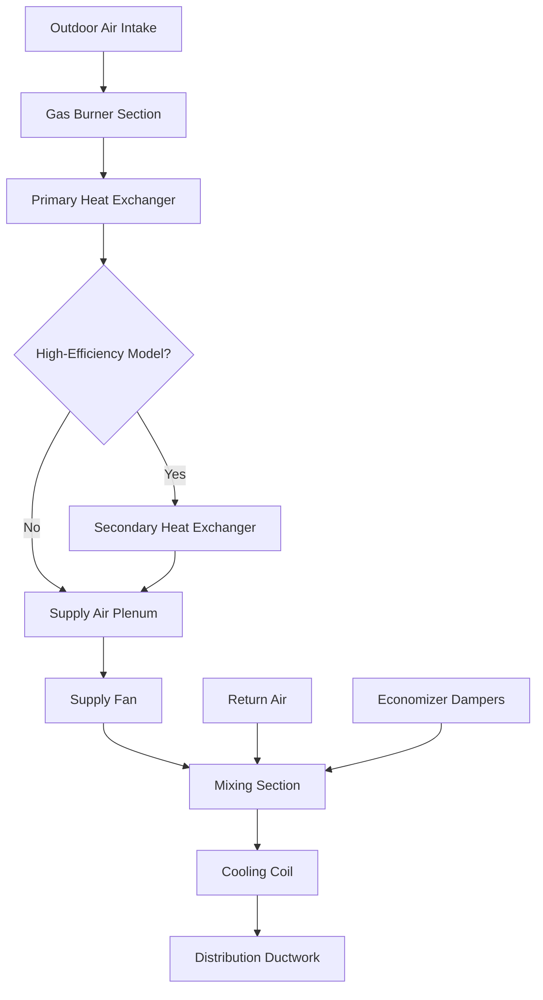
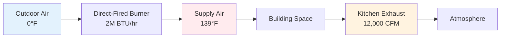

Commercial warm air furnaces represent a critical component in industrial and large-scale heating systems, ranging from 75,000 BTU/hr to over 5,000,000 BTU/hr input capacity. These systems employ advanced combustion technology, heat exchange principles, and integrated controls to deliver reliable space heating and ventilation air tempering.

## Heat Transfer Physics

Commercial furnace operation centers on three sequential heat transfer modes. Combustion releases chemical energy following the complete combustion equation for natural gas:

$$\text{CH}_4 + 2\text{O}_2 \rightarrow \text{CO}_2 + 2\text{H}_2\text{O} + 891 \text{ kJ/mol}$$

Convective heat transfer from combustion gases to heat exchanger surfaces follows Newton's law of cooling:

$$Q = hA(T_g - T_s)$$

where $h$ is the convective heat transfer coefficient (typically 50-150 W/m²·K for gas flows), $A$ is heat exchanger surface area, $T_g$ is gas temperature, and $T_s$ is surface temperature. Secondary convection transfers energy from heat exchanger surfaces to supply air, with effectiveness determined by exchanger geometry and airflow velocity.

## Rooftop Unit Integration

Rooftop furnace sections integrate with cooling components, economizers, and ventilation systems in packaged configurations. The heating capacity must align with cooling tonnage and ventilation requirements:

$$\text{Heating Capacity (BTU/hr)} = 1.08 \times \text{CFM} \times \Delta T$$

For a 20-ton rooftop unit delivering 8,000 CFM, achieving a 40°F temperature rise requires:

$$Q = 1.08 \times 8000 \times 40 = 345,600 \text{ BTU/hr output}$$

At 80% efficiency, input capacity equals 432,000 BTU/hr. RTU gas sections typically operate at 400,000 to 1,200,000 BTU/hr for commercial buildings.

## High-Efficiency Condensing Models

High-efficiency commercial furnaces achieve 90-96% thermal efficiency through secondary heat recovery. The condensing process extracts latent heat from water vapor in combustion products:

$$Q_{latent} = m_{H_2O} \times h_{fg}$$

where $m_{H_2O}$ is water vapor mass flow rate and $h_{fg}$ is enthalpy of vaporization (approximately 2,260 kJ/kg at atmospheric pressure). For each pound of natural gas burned producing roughly 1.1 lbs of water vapor, condensing heat recovery adds approximately 1,000 BTU/lb fuel.

The efficiency improvement from condensing operation:

$$\eta_{condensing} = \eta_{non-condensing} + \frac{Q_{latent}}{Q_{HHV}} \times 100$$

Standard furnaces operating at 80% efficiency increase to 92-95% by recovering condensation energy, representing 12-15 percentage points improvement.

| Furnace Type | Thermal Efficiency | Heat Exchanger | Flue Temperature | Condensate Production |
|--------------|-------------------|----------------|------------------|----------------------|
| Standard Non-Condensing | 78-82% | Steel/Aluminized | 300-500°F | None |
| Mid-Efficiency | 82-85% | Stainless Steel | 250-350°F | Minimal |
| Condensing | 90-96% | Stainless/AL29-4C | 100-140°F | 2-5 gal/day per 1M BTU |
| Ultra-High Efficiency | 95-98% | Advanced Alloys | 80-120°F | 5-8 gal/day per 1M BTU |

## Modulating Burner Technology

Modulating gas valves adjust firing rate continuously from 20-100% capacity, matching heat output to building load. The turndown ratio defines operational range:

$$\text{Turndown Ratio} = \frac{\text{Maximum Firing Rate}}{\text{Minimum Firing Rate}}$$

A 5:1 turndown ratio allows a 1,000,000 BTU/hr furnace to modulate from 200,000 to 1,000,000 BTU/hr. Advanced modulating systems achieve 10:1 or 20:1 turndown.

Modulation benefits include:

1. **Reduced cycling losses**: Continuous operation eliminates pre-purge and post-purge energy waste
2. **Improved comfort**: Gradual capacity adjustment prevents temperature swings
3. **Higher seasonal efficiency**: Extended operation at part-load conditions where efficiency peaks
4. **Lower NOx emissions**: Controlled combustion at reduced firing rates produces fewer nitrogen oxides

The relationship between firing rate and efficiency follows:

$$\eta(x) = \eta_{max} - k(x - x_{opt})^2$$

where $x$ is firing rate fraction, $\eta_{max}$ is peak efficiency, $x_{opt}$ is optimal firing rate (typically 0.4-0.6), and $k$ is an efficiency degradation constant.

## Make-Up Air Heating Applications

Make-up air units (MAU) replace air exhausted from commercial kitchens, industrial processes, and laboratory fume hoods. Direct-fired make-up air heaters combust gas directly into the supply airstream, achieving 90-92% efficiency by eliminating heat exchanger losses.

Temperature rise in direct-fired systems:

$$\Delta T = \frac{Q_{input} \times 0.90}{1.08 \times \text{CFM}}$$

For a 2,000,000 BTU/hr direct-fired MAU supplying 12,000 CFM:

$$\Delta T = \frac{2,000,000 \times 0.90}{1.08 \times 12,000} = 139°F$$

Indirect-fired MAUs use heat exchangers to separate combustion products from supply air, required when product contamination concerns exist or when ASHRAE 62.1 outdoor air delivery mandates apply.

| MAU Configuration | Efficiency | Combustion Products | Application | Code Reference |
|-------------------|-----------|---------------------|-------------|----------------|
| Direct-Fired | 90-92% | Enter airstream | Industrial, warehouses | IMC 510 |
| Indirect-Fired | 75-85% | Vented separately | Laboratories, clean rooms | ASHRAE 62.1 |
| Tempered Only | N/A | N/A | Mild climates | Local codes |
| Heat Recovery | 60-75% effective | Vented separately | Energy-conscious | ASHRAE 90.1 |

## Capacity Selection and Staging

Commercial furnace capacity selection requires accurate heat loss calculation per ASHRAE Fundamentals. Multi-stage or modulating burners provide superior performance compared to single-stage operation.

For stepped staging, each stage contributes:

$$Q_{stage,i} = \frac{Q_{total}}{n_{stages}}$$

A 4-stage 800,000 BTU/hr furnace operates at 200k, 400k, 600k, and 800k BTU/hr increments, providing better load matching than on/off control.

## Standards and Testing

Commercial furnaces must comply with:

- **UL 795**: Commercial-Industrial Gas Heating Equipment
- **ANSI Z83.8/CSA 2.6**: Gas Unit Heaters, Duct Furnaces, and Gas-Fired Infrared Heaters
- **ASHRAE 90.1**: Energy Standard for Buildings (minimum 80% thermal efficiency for most applications)
- **NFPA 54**: National Fuel Gas Code
- **IMC Chapter 9**: Specific Installation Requirements

Furnace testing per ANSI Z21.47/CSA 2.3 establishes steady-state efficiency, temperature rise range, and safety controls verification.

## Performance Optimization

Optimal commercial furnace performance requires proper airflow across heat exchangers. The temperature rise must fall within manufacturer specifications:

$$\Delta T_{actual} = \frac{Q_{output}}{1.08 \times \text{CFM}_{actual}}$$

If $\Delta T_{actual}$ exceeds maximum rated temperature rise, inadequate airflow risks heat exchanger overheating and premature failure. Conversely, excessive airflow reduces efficiency and comfort.

Combustion air supply must provide sufficient oxygen for complete combustion, calculated as:

$$\text{Combustion Air (CFM)} = \frac{Q_{input} \text{ (BTU/hr)}}{10,000 \times 21\%}$$

A 1,000,000 BTU/hr furnace theoretically requires 47.6 CFM, but actual requirements include safety factors and altitude corrections per NFPA 54.

Commercial furnaces deliver reliable, efficient heating for diverse applications when properly selected, installed, and maintained according to manufacturer specifications and applicable codes.
