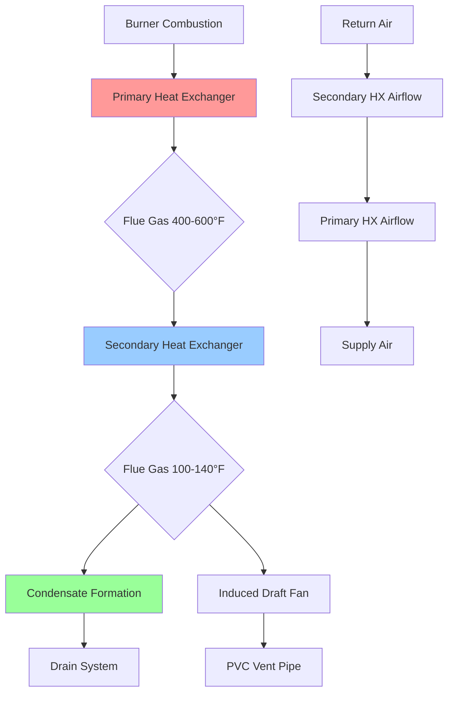

Furnace heat exchangers constitute the critical thermal transfer boundary separating combustion gases from conditioned airstreams. These components determine system efficiency, operational safety, and service life through their material properties, geometric configurations, and thermal performance characteristics. Heat exchanger design fundamentally balances thermal effectiveness against structural integrity under extreme temperature cycling and corrosive condensate exposure.

## Heat Transfer Fundamentals

Heat transfer within furnace heat exchangers occurs through three simultaneous mechanisms: convection from hot flue gases to interior surfaces, conduction through metallic walls, and convection from exterior surfaces to supply air. The overall thermal resistance relationship governs total heat flow:

$$\frac{1}{UA} = \frac{1}{h_i A_i} + \frac{t}{k A_m} + \frac{1}{h_o A_o}$$

Where $U$ represents the overall heat transfer coefficient, $h_i$ and $h_o$ denote interior and exterior convection coefficients, $t$ indicates wall thickness, $k$ represents thermal conductivity, and $A$ terms specify surface areas. For typical furnace conditions, the interior convection resistance (flue gas side) dominates total thermal resistance due to lower gas-phase heat transfer coefficients compared to air-side convection.

The log mean temperature difference (LMTD) method quantifies driving force for counterflow heat exchange:

$$LMTD = \frac{(T_{fg,in} - T_{a,out}) - (T_{fg,out} - T_{a,in})}{\ln\left(\frac{T_{fg,in} - T_{a,out}}{T_{fg,out} - T_{a,in}}\right)}$$

Where subscripts $fg$ and $a$ denote flue gas and air streams. Total heat transfer becomes:

$$Q = UA \times LMTD$$

This relationship demonstrates that increasing surface area ($A$) or improving heat transfer coefficient ($U$) through turbulence enhancement directly increases thermal capacity.

## Primary Heat Exchanger Configurations

Primary heat exchangers operate at elevated temperatures ranging 400-600°F for flue gas inlet conditions, requiring materials tolerant of thermal stress cycling and oxidation. Three dominant design philosophies characterize residential and light commercial applications:

### Tubular Heat Exchangers

Tubular designs employ cylindrical passages where combustion occurs within sealed tubes, with supply air flowing across external surfaces. This configuration optimizes surface area-to-volume ratios while providing structural rigidity through circular geometry.

**Thermal Performance Characteristics:**

- Heat transfer area: 0.8-1.5 ft² per 10,000 Btuh capacity
- Flue gas velocity: 15-25 ft/s promoting turbulent convection
- Air-side face velocity: 500-800 FPM across tube banks
- Thermal effectiveness: 75-82% for non-condensing designs

The circular cross-section minimizes thermal stress concentrations during expansion-contraction cycles. Internal baffles or turbulators increase heat transfer coefficients by 20-40% through enhanced gas-phase turbulence, though pressure drop penalties increase proportionally.

Material selection typically specifies aluminized steel (Type 1 or Type 2 coating) providing oxidation resistance to 1200°F. The aluminum-silicon alloy coating forms a protective oxide layer preventing substrate corrosion while maintaining thermal conductivity of 25-30 Btu/(hr·ft·°F).

### Clamshell Heat Exchangers

Clamshell configurations consist of formed sheet metal sections creating enclosed combustion chambers through welded or crimped seams. This design reduces manufacturing costs while accommodating compact furnace footprints.

**Design Features:**

- Formed from 18-22 gauge aluminized steel
- Welded or crimped longitudinal seams
- Internal ribbing for structural reinforcement
- Reduced material thickness compared to tubular designs

Heat transfer performance typically falls 5-10% below equivalent tubular designs due to less optimal flow patterns and reduced surface area. However, manufacturing economies make clamshell exchangers dominant in mid-tier furnace products.

Thermal expansion stresses concentrate at seam locations, requiring robust welding or crimping processes. Inadequate seam integrity represents the primary failure mode, manifesting as hairline cracks allowing flue gas infiltration into supply airstreams.

### Drum Heat Exchangers

Drum-type heat exchangers feature cylindrical combustion chambers with radial heat flow to surrounding air passages. This configuration appears in older furnace designs and specialized commercial applications.

**Performance Attributes:**

- Large combustion volume reducing flame impingement
- Radial heat flow providing uniform temperature distribution
- Heavy-gauge construction (14-16 gauge steel)
- Extended service life through robust material thickness

Modern residential applications rarely specify drum exchangers due to size, weight, and cost considerations, though industrial heating equipment continues utilizing this proven geometry.

## Secondary Condensing Heat Exchangers

Condensing furnaces incorporate secondary heat exchangers recovering latent energy from water vapor condensation, achieving AFUE ratings of 90-98%. These components operate at reduced temperatures (100-140°F flue gas outlet) where sustained condensation occurs.

### Condensing Heat Recovery Physics

Water vapor produced during natural gas combustion (approximately 1 lb water per therm) contains latent energy of 1,050 Btu/lb. Cooling flue gases below the dew point (135-140°F for natural gas) releases this energy, increasing total heat recovery:

$$Q_{total} = Q_{sensible} + Q_{latent} = \dot{m}_{fg} c_p \Delta T + \dot{m}_{condensate} h_{fg}$$

Where $h_{fg}$ represents the enthalpy of vaporization. This latent energy recovery accounts for 10-15% efficiency improvement over non-condensing designs.

### Secondary Heat Exchanger Materials

Condensate acidity (pH 2.5-4.0) results from dissolved CO₂ and NOₓ forming carbonic and nitric acids. Corrosion resistance requires specialized materials:

| Material | Composition | Service Life | Cost Factor | Applications |
|----------|-------------|--------------|-------------|--------------|
| AL29-4C Stainless | 29% Cr, 4% Mo, 2% Ni | 20-25 years | 2.5x | Premium condensing exchangers |
| 316L Stainless | 18% Cr, 14% Ni, 3% Mo | 15-20 years | 3.0x | High-efficiency residential |
| 439 Stainless | 17% Cr, titanium stabilized | 15-18 years | 2.0x | Standard condensing units |
| Coated Aluminum | Polymer or ceramic coating | 12-15 years | 1.5x | Entry-level condensing |

AL29-4C stainless steel dominates premium applications through superior resistance to chloride and acid attack. The high chromium content forms protective passive oxide layers regenerating under oxidizing conditions.

### Geometric Design Approaches

Secondary heat exchangers employ configurations maximizing surface contact with cooled flue gases:

**Tubular Serpentine Coils:**
- Extended flow path ensuring residence time for condensation
- Continuous downward slope for condensate drainage
- Typical path length: 15-30 feet for 100,000 Btuh capacity
- Internal turbulators enhancing gas-side heat transfer

**Cellular Designs:**
- Stacked plates creating multiple narrow passages
- Compact footprint fitting residential furnace cabinets
- High surface area-to-volume ratios (8-12 ft²/ft³)
- Parallel flow paths reducing pressure drop

**Fin-and-Tube Configurations:**
- Stamped fins brazed to stainless steel tubes
- Air-side fin spacing: 12-16 fins per inch
- Enhanced air-side convection through extended surface
- Susceptible to fouling in dusty environments

## Heat Exchanger Thermal Effectiveness

The effectiveness-NTU method quantifies heat exchanger performance independent of flow configuration:

$$\epsilon = \frac{Q_{actual}}{Q_{maximum}} = \frac{T_{a,out} - T_{a,in}}{T_{fg,in} - T_{a,in}}$$

For counterflow heat exchangers, effectiveness relates to Number of Transfer Units (NTU) and capacity rate ratio ($C_r$):

$$\epsilon = \frac{1 - \exp[-NTU(1-C_r)]}{1 - C_r \exp[-NTU(1-C_r)]}$$

Where:

$$NTU = \frac{UA}{C_{min}}$$

And $C_{min}$ represents the minimum thermal capacity rate. Non-condensing primary heat exchangers typically achieve effectiveness of 0.75-0.85, while condensing secondary sections reach 0.85-0.95 due to extended surface area and enhanced heat transfer from phase change.

## Thermal Stress and Failure Mechanisms

Heat exchanger durability depends on resistance to cyclic thermal fatigue, corrosion, and mechanical stress. Thermal expansion during heating cycles creates strain:

$$\epsilon_{thermal} = \alpha \Delta T$$

Where $\alpha$ denotes coefficient of thermal expansion (7-9 × 10⁻⁶ /°F for steel alloys) and $\Delta T$ represents temperature change. For primary heat exchangers experiencing 500°F temperature swings, expansion strain reaches 0.35-0.45%, generating significant stress in constrained sections.

### Common Failure Modes

**Thermal Fatigue Cracking:**
- Occurs at stress concentration points (welds, bends, transitions)
- Low-cycle fatigue from daily thermal cycling
- Crack initiation after 100,000-500,000 cycles (15-40 years typical)
- Accelerated by flame impingement creating localized overheating

**Corrosion-Induced Failures:**
- Condensate attack on primary exchangers during cold startups
- Chloride stress corrosion in coastal environments
- Preferential attack at grain boundaries and welds
- Pitting corrosion penetrating thin-gauge materials

**Mechanical Stress:**
- Support bracket deformation from weight and expansion
- Pressure pulsations from burner cycling
- Vibration from induced draft fans
- Improper installation creating structural loading

## Heat Exchanger Crack Detection

Heat exchanger cracks pose serious safety hazards by allowing carbon monoxide infiltration into supply air. Multiple detection methodologies identify compromised exchangers:

### Visual Inspection Techniques

Direct observation requires heat exchanger access and adequate lighting:

- Mirror and flashlight examination of internal surfaces
- Borescope inspection through burner openings
- Disassembly inspection removing blower assemblies
- Surface staining indicating exhaust gas leakage

Visible cracks typically indicate advanced deterioration, as initial failures manifest as microscopic fissures undetectable visually.

### Combustion Analysis Methods

Flue gas composition analysis identifies abnormal conditions suggesting heat exchanger compromise:

**Carbon Monoxide Monitoring:**
- Elevated supply air CO levels (>9 ppm indicates potential issue)
- Flue gas CO exceeding 400 ppm suggests incomplete combustion
- Comparison between supply and return air CO concentrations
- Continuous monitoring during entire firing cycle

**Oxygen Level Analysis:**
- Supply air O₂ content exceeding normal levels
- Indicates flue gas mixing with conditioned air
- Requires precise analyzers (±0.1% O₂ sensitivity)

### Pressure Differential Testing

This methodology exploits pressure differences between combustion and air zones:

1. Block furnace vent pipe creating positive pressure in heat exchanger
2. Operate induced draft fan generating 0.3-0.8 in. w.c. internal pressure
3. Spray soap solution on external surfaces
4. Observe bubble formation indicating leak paths

Limitations include detection threshold (cracks must exceed ~0.010 in. width) and accessibility to external surfaces.

### Thermal Imaging Analysis

Infrared cameras detect temperature anomalies indicating hot flue gas escaping through cracks:

- Operating heat exchanger temperature uniformity assessment
- Cold spots suggesting internal blockage or flow disruption
- Hot spots indicating flame impingement or crack locations
- Requires temperature differential >20°F for reliable detection

Advanced thermography identifies developing problems before catastrophic failure, though equipment cost limits widespread application.

### Tracer Gas Testing

Tracer gas injection provides quantitative leak detection:

1. Introduce harmless tracer (helium, sulfur hexafluoride) into combustion zone
2. Sample supply air for tracer gas presence
3. Quantify concentration indicating leak severity
4. Correlate tracer levels with crack dimensions

This method offers high sensitivity but requires specialized equipment and trained technicians.

## Condensate Management Systems

Condensing furnaces produce 1-2 gallons of acidic condensate per 100,000 Btuh daily operation. Proper drainage prevents exchanger flooding and premature corrosion:

**Drainage System Components:**

- Internal drain pans with continuous slope (1/4 in. per foot minimum)
- Condensate traps maintaining 2-3 inch water seal
- PVC or CPVC drain piping (Schedule 40 or SDR-35)
- Neutralization cartridges for pH adjustment (optional)
- Floor drain or condensate pump discharge

Inadequate drainage floods secondary heat exchangers, reducing thermal performance and accelerating corrosion. Trap seal loss allows combustion gases entering living spaces, creating safety hazards.

## Material Selection for Service Life

Heat exchanger longevity correlates directly with material appropriateness for operating conditions:

**Primary Heat Exchangers (Non-Condensing):**
- Aluminized steel Type 1 (10% Al-Si coating): 15-25 year life
- Aluminized steel Type 2 (5% Al-Si coating): 12-20 year life
- 409 stainless steel: 20-30 year life (premium applications)
- Avoid plain carbon steel (rapid oxidation above 400°F)

**Primary Heat Exchangers (Condensing Section):**
- 439 stainless steel: standard service life expectancy
- AL29-4C stainless: extended life in aggressive environments
- 316L stainless: maximum corrosion resistance
- Ceramic coatings: experimental extended-life treatments

Material thickness directly impacts durability, with 18-gauge construction outlasting 22-gauge equivalents by 40-60% under identical operating conditions. However, increased thickness raises manufacturing costs and furnace weight.

## Performance Verification Standards

ASHRAE Standard 103 establishes test methods for residential furnace efficiency and capacity verification. Heat exchanger performance evaluation includes:

- Steady-state efficiency at maximum firing rate
- Flue gas temperature profiles through exchanger sections
- Heat transfer effectiveness calculations
- Surface temperature mapping identifying hotspots
- Condensate production rates for condensing units

ANSI Z21.47/CSA 2.3 specifies safety requirements including heat exchanger integrity testing and CO production limits under normal and abnormal operating conditions. Manufacturers perform accelerated life testing simulating 15-20 years operation through continuous thermal cycling.

## Maintenance and Inspection Protocols

Regular heat exchanger inspection extends service life and ensures safe operation:

**Annual Inspection Items:**
- Visual examination for corrosion, discoloration, or deformation
- Combustion analysis documenting CO and O₂ levels
- Flame pattern observation detecting impingement
- Blower compartment cleanliness affecting airflow
- Condensate drain verification preventing backups

**Multi-Year Inspection:**
- Comprehensive heat exchanger integrity testing (pressure or camera)
- Detailed thermal imaging analysis
- Flue gas composition trending identifying deterioration
- Physical measurements documenting expansion or warping

Proper maintenance combined with appropriate material selection routinely achieves 20-30 year heat exchanger service life, while neglected systems fail prematurely at 8-12 years through accelerated corrosion and thermal fatigue.

Heat exchanger technology continues advancing through improved materials, computational fluid dynamics optimizing geometries, and enhanced manufacturing processes producing robust, efficient thermal transfer components for modern high-efficiency furnace systems.
