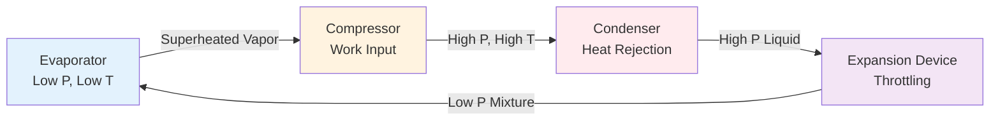

Heat pumps represent a thermodynamically elegant solution to space conditioning by transferring thermal energy from a low-temperature reservoir to a high-temperature zone. Unlike furnaces that generate heat through combustion, heat pumps exploit the reversible vapor compression refrigeration cycle to move heat against its natural gradient, achieving heating efficiencies exceeding 100% when measured by traditional metrics.

## Fundamental Operating Principle

The heat pump operates on the Carnot cycle's practical implementation—the vapor compression cycle. During heating mode, the system extracts heat from an outdoor source (air, ground, or water) and delivers it indoors at elevated temperature. The process reverses the conventional refrigeration cycle's purpose while maintaining identical thermodynamic mechanisms.

The theoretical maximum efficiency of any heat pump follows from Carnot's theorem:

$$\text{COP}_{\text{Carnot}} = \frac{T_{\text{hot}}}{T_{\text{hot}} - T_{\text{cold}}}$$

where temperatures are absolute (Kelvin). For a system delivering heat at 21°C (294 K) while extracting from 0°C (273 K), the theoretical maximum COP equals 14.0. Real systems achieve 25-50% of this ideal due to irreversibilities.

## Vapor Compression Cycle for Heating

The heat pump cycle comprises four essential components and state change processes:

**Process Details:**

1. **Evaporation (4→1)**: Liquid refrigerant at low pressure absorbs heat from the outdoor environment, vaporizing at constant temperature. Heat transfer rate: $\dot{Q}_{\text{evap}} = \dot{m} (h_1 - h_4)$

2. **Compression (1→2)**: The compressor increases refrigerant pressure and temperature through work input: $\dot{W}_{\text{comp}} = \dot{m} (h_2 - h_1)$. Compression is non-isentropic in practice, with isentropic efficiency typically 0.70-0.85.

3. **Condensation (2→3)**: High-pressure, high-temperature vapor condenses in the indoor coil, rejecting heat to the conditioned space: $\dot{Q}_{\text{cond}} = \dot{m} (h_2 - h_3)$

4. **Expansion (3→4)**: The expansion device (TXV or EEV) reduces refrigerant pressure through isenthalpic throttling: $h_3 = h_4$. This process creates the low-pressure condition necessary for evaporation.

## Coefficient of Performance

The Coefficient of Performance (COP) quantifies heat pump efficiency as the ratio of useful heating delivered to electrical energy consumed:

$$\text{COP}_{\text{heating}} = \frac{\dot{Q}_{\text{delivered}}}{\dot{W}_{\text{input}}} = \frac{h_2 - h_3}{h_2 - h_1}$$

For cooling mode, COP is defined differently:

$$\text{COP}_{\text{cooling}} = \frac{\dot{Q}_{\text{removed}}}{\dot{W}_{\text{input}}} = \frac{h_1 - h_4}{h_2 - h_1}$$

The energy balance dictates: $\text{COP}_{\text{heating}} = \text{COP}_{\text{cooling}} + 1$

ASHRAE Standard 116 specifies standardized testing conditions for rating heat pump performance. Typical residential air-source heat pumps achieve COP values of 2.5-4.0 in heating mode at 47°F (8.3°C) outdoor temperature, declining to 1.5-2.5 at 17°F (-8.3°C).

### Performance Comparison Table

| Heat Source Type | Heating COP Range | Cooling EER Range | Temperature Stability |
|-----------------|-------------------|-------------------|----------------------|
| Air-Source | 2.0-4.5 | 10-20 | Variable, climate-dependent |
| Ground-Source (vertical) | 3.0-5.0 | 15-25 | Excellent, earth-coupled |
| Ground-Source (horizontal) | 2.8-4.5 | 14-22 | Good, seasonal lag |
| Water-Source (lake/well) | 3.5-5.5 | 16-28 | Excellent if source stable |

## Heat Source Categories

### Air-Source Heat Pumps (ASHP)

Air-source systems utilize outdoor air as the heat reservoir. The evaporator coil exchanges heat with ambient air forced across finned tubes by fans. Performance degrades as outdoor temperature decreases due to:

- Reduced temperature differential ($\Delta T$ decreases)
- Frost formation on outdoor coil requiring defrost cycles
- Increased compression ratio and compressor work

ASHRAE Standard 37 defines supplementary heating capacity requirements when outdoor temperature falls below the balance point—typically 25-35°F (-4 to 2°C) for moderate climates.

### Ground-Source Heat Pumps (GSHP)

Ground-coupled systems exchange heat with the earth through buried pipe loops containing water-antifreeze solution. The ground temperature remains relatively constant at 45-75°F (7-24°C) year-round below 15-20 feet depth, providing:

- Higher average COP (30-40% better than ASHP)
- Elimination of defrost cycles
- Extended equipment life due to reduced thermal stress

Loop configurations include vertical boreholes (150-500 ft deep), horizontal trenches (4-6 ft deep), or pond/lake submersion. Sizing follows ASHRAE Handbook—HVAC Applications guidelines, requiring 150-250 ft of bore per ton of capacity for vertical systems.

### Water-Source Heat Pumps (WSHP)

Water-source systems extract or reject heat to a central water loop maintained at 60-90°F (15-32°C). Applications include:

- Large commercial buildings with simultaneous heating/cooling zones
- District heating/cooling systems
- Industrial facilities with process cooling loads

The shared water loop enables heat recovery, allowing heat rejected from cooling zones to serve heating zones, improving overall system efficiency by 20-40% versus independent systems.

## Reversing Valve Operation

Heat pumps achieve bidirectional heat transfer through a four-way reversing valve that redirects refrigerant flow:

**Heating Mode**: Indoor coil = condenser, outdoor coil = evaporator
**Cooling Mode**: Indoor coil = evaporator, outdoor coil = condenser

The valve responds to thermostat demand, repositioning within 1-3 seconds. This reversibility distinguishes heat pumps from unidirectional air conditioners or refrigeration systems.

## Applications and Design Considerations

Heat pumps excel in moderate climates (ASHRAE Climate Zones 1-4) where heating loads remain manageable and winter temperatures stay above 20°F (-7°C) most of the time. Modern cold-climate heat pumps extend viable operation to -13°F (-25°C) through:

- Enhanced vapor injection (EVI) technology
- Variable-speed compressors maintaining capacity
- Optimized refrigerant circuits with flash gas bypass

Proper sizing per ASHRAE/ACCA Manual J prevents oversizing that causes short cycling and undersizing requiring excessive supplementary heat. The optimal design point balances installed cost against operating efficiency, typically sizing for 100-125% of cooling load in mixed climates.

## Performance Degradation Mechanisms

Heat pump efficiency decreases under several conditions:

1. **Low outdoor temperature**: Compression ratio increases, reducing volumetric efficiency
2. **Defrost cycles**: Reverse operation temporarily to melt coil frost, consuming 5-15% of heating season energy
3. **Refrigerant charge deviation**: ±10% charge error reduces COP by 5-15%
4. **Airflow restriction**: Dirty filters or blocked coils decrease heat transfer coefficients

Regular maintenance per ASHRAE Standard 180 maintains design performance throughout the 15-20 year equipment service life.

## References

- ASHRAE Standard 116: Methods of Testing for Rating Seasonal Efficiency of Unitary Air-Conditioners and Heat Pumps
- ASHRAE Standard 37: Methods of Testing for Rating Electrically Driven Unitary Air-Conditioning and Heat Pump Equipment
- ASHRAE Handbook—HVAC Systems and Equipment, Chapter 9: Applied Heat Pump and Heat Recovery Systems
- ASHRAE Standard 180: Standard Practice for Inspection and Maintenance of Commercial Building HVAC Systems
