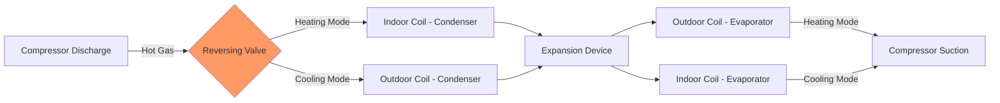
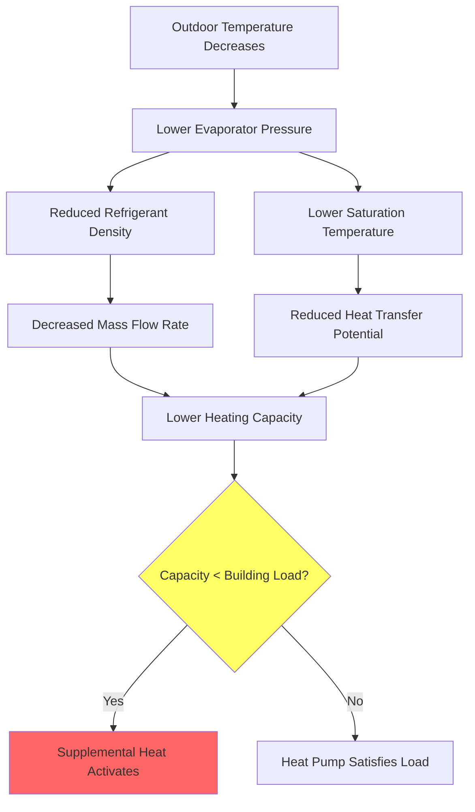

Air source heat pumps (ASHP) transfer thermal energy between outdoor air and conditioned space using the vapor compression refrigeration cycle. Unlike conventional heating systems that convert fuel to heat, ASHPs move existing thermal energy, achieving heating efficiencies exceeding 300% under favorable conditions.

## Thermodynamic Operating Principles

The vapor compression cycle operates on the Carnot efficiency principle, modified for real-world losses. Heat transfer rate in heating mode:

$$Q_h = \dot{m} \cdot (h_2 - h_3)$$

Where $\dot{m}$ represents refrigerant mass flow rate (kg/s), $h_2$ is enthalpy after compression (kJ/kg), and $h_3$ is enthalpy after condensation (kJ/kg).

Compressor work input:

$$W_{comp} = \dot{m} \cdot (h_2 - h_1)$$

The coefficient of performance (COP) for heating:

$$COP_h = \frac{Q_h}{W_{comp}} = \frac{h_2 - h_3}{h_2 - h_1}$$

For cooling mode, the COP becomes:

$$COP_c = \frac{Q_c}{W_{comp}} = \frac{h_1 - h_4}{h_2 - h_1}$$

Where $h_1$ is evaporator outlet enthalpy and $h_4$ is expansion valve outlet enthalpy.

## Reversing Valve Operation

The four-way reversing valve redirects refrigerant flow to alternate between heating and cooling modes without changing compressor rotation direction.

### Valve Actuation Mechanism

The solenoid pilot valve controls high-side pressure application to either end of the sliding piston. In heating mode, discharge pressure applies to the left side, forcing the piston right. Cooling mode reverses this pressure differential. Transition time typically ranges 1-3 seconds. During transition, both coils temporarily receive high-pressure gas, causing momentary pressure spikes that design engineers must accommodate in system protection schemes.

## Heating and Cooling Mode Operation

### Heating Mode Refrigerant Path

1. Compressor elevates low-pressure vapor to high temperature/pressure
2. Hot gas flows through reversing valve to indoor coil
3. Indoor coil acts as condenser, rejecting heat at $T_{cond} = 90-120°F$
4. Liquid refrigerant passes through expansion device
5. Outdoor coil functions as evaporator, absorbing heat at $T_{evap} = 20-50°F$
6. Cold vapor returns through reversing valve to compressor

### Cooling Mode Refrigerant Path

Flow reverses completely. Outdoor coil becomes condenser ($T_{cond} = 100-140°F$), indoor coil becomes evaporator ($T_{evap} = 40-50°F$). Expansion device location varies by design: some systems employ two metering devices with check valve bypasses.

## Capacity-Temperature Relationship

Heat pump heating capacity decreases with outdoor temperature due to fundamental thermodynamic constraints:

$$Q_{available} \propto (T_{source} - T_{evap})$$

As outdoor temperature drops, evaporator temperature must decrease correspondingly to maintain heat transfer driving force. Lower evaporator pressure reduces refrigerant density and mass flow rate.

### Capacity Degradation Curve

| Outdoor Temp (°F) | Capacity (% Rated) | COP | Notes |
|-------------------|-------------------|-----|-------|
| 47 | 100 | 3.4 | AHRI Standard Rating Point |
| 35 | 85 | 2.8 | Defrost cycles begin |
| 17 | 65 | 2.2 | Balance point concern |
| 5 | 50 | 1.8 | Supplemental heat required |
| -10 | 35 | 1.5 | Extended operation limit |

Balance point temperature occurs where heat pump capacity equals building heat loss:

$$Q_{HP}(T_{bal}) = UA(T_{indoor} - T_{bal})$$

Where $UA$ represents building heat loss coefficient (Btu/hr·°F).

## Defrost Cycle Operation

Frost accumulation on outdoor coils occurs when coil surface temperature drops below 32°F with sufficient moisture. Ice formation blocks airflow and degrades heat transfer:

$$\eta_{coil} = \frac{1}{1 + R_{frost}/R_{coil}}$$

Defrost initiates based on time-temperature logic or differential pressure sensing. Typical sequence:

1. Reverse to cooling mode (outdoor coil receives hot gas)
2. Outdoor fan stops
3. Indoor fan continues or cycles to prevent cold air discharge
4. Duration: 2-10 minutes
5. Terminate on coil temperature (typically 60-70°F) or time limit

Defrost penalty reduces seasonal efficiency 5-15% depending on climate humidity and operating hours below 40°F.

## Efficiency Ratings and Standards

### Heating Seasonal Performance Factor (HSPF)

HSPF represents total heating output during heating season divided by total electrical energy input, expressed in Btu/Wh. Per AHRI 210/240 Standard (2023):

$$HSPF = \frac{\sum_{i=1}^{n} Q_{h,i}}{\sum_{i=1}^{n} E_{i} + \sum_{j=1}^{m} E_{defrost,j}}$$

Current minimum standards:
- HSPF 8.8 for split systems (Northern regions)
- HSPF 8.5 for split systems (Southern regions)
- ENERGY STAR: HSPF ≥ 9.0

### Seasonal Energy Efficiency Ratio (SEER)

Cooling efficiency over entire season:

$$SEER = \frac{\sum_{k=1}^{p} Q_{c,k}}{\sum_{k=1}^{p} E_{k}}$$

Minimum standards (2023):
- SEER 14.0 (Northern regions)
- SEER 15.0 (Southern regions)
- ENERGY STAR: SEER ≥ 15.0

### SEER2 and HSPF2 Transition

Updated DOE test procedures (effective January 2023) implement SEER2 and HSPF2 with more realistic test conditions including external static pressure. Conversion approximately:

$$SEER2 \approx 0.95 \times SEER$$
$$HSPF2 \approx 0.85 \times HSPF$$

## Performance Comparison Table

| Parameter | Standard Efficiency | High Efficiency | Cold Climate |
|-----------|-------------------|----------------|--------------|
| HSPF2 | 7.5-8.0 | 9.0-10.0 | 10.0-13.0 |
| SEER2 | 14.0-15.0 | 16.0-20.0 | 16.0-19.0 |
| Heating Capacity at 5°F | 50-60% rated | 65-75% rated | 75-90% rated |
| COP at 47°F | 2.8-3.2 | 3.4-4.0 | 3.6-4.5 |
| Min Operating Temp | 0°F | -10°F | -25°F |
| Compressor Type | Single-stage | Variable-speed | Enhanced vapor injection |

## Variable-Speed Compressor Advantages

Inverter-driven compressors modulate capacity 25-100% through frequency variation. Part-load efficiency improvements result from:

- Reduced cycling losses
- Optimized superheat/subcooling at varying loads
- Lower compressor displacement at reduced frequency maintains adequate oil return velocity
- Better humidity control in cooling mode

Part-load COP enhancement:

$$COP_{part} = COP_{rated} \times \left(1 + k \cdot \left(1 - \frac{Q_{actual}}{Q_{rated}}\right)\right)$$

Where $k = 0.2-0.4$ represents part-load efficiency gain factor.

## Cold Climate Heat Pump Technology

Enhanced vapor injection (EVI) maintains capacity at low temperatures through intermediate pressure refrigerant injection:

1. Flash tank separates liquid refrigerant at intermediate pressure
2. Vapor phase injects into compression chamber mid-cycle
3. Additional refrigerant mass increases heating capacity
4. Subcooled liquid to expansion valve improves efficiency

Capacity retention at 5°F reaches 75-85% of rated capacity versus 50-60% for standard units.

## Standards References

- **AHRI 210/240-2023**: Performance Rating of Unitary Air-Conditioning and Air-Source Heat Pump Equipment
- **ASHRAE 37-2009**: Methods of Testing for Rating Electrically Driven Unitary Air-Conditioning and Heat Pump Equipment
- **DOE 10 CFR 430**: Energy Conservation Program for Consumer Products

## Application Considerations

Select air-source heat pumps based on:

1. **Balance point analysis**: Calculate building heat loss at outdoor design temperature
2. **Supplemental heat requirement**: Determine electric resistance or dual-fuel backup sizing
3. **Duct system capacity**: Verify airflow capacity for both heating and cooling modes
4. **Defrost strategy**: Consider demand defrost in moderate climates
5. **Sound levels**: AHRI certified sound ratings, typically 50-75 dBA at 10 feet

Proper refrigerant charge verification using superheat/subcool method ensures rated performance. Deviation of ±10% from manufacturer specification degrades efficiency 5-20%.
