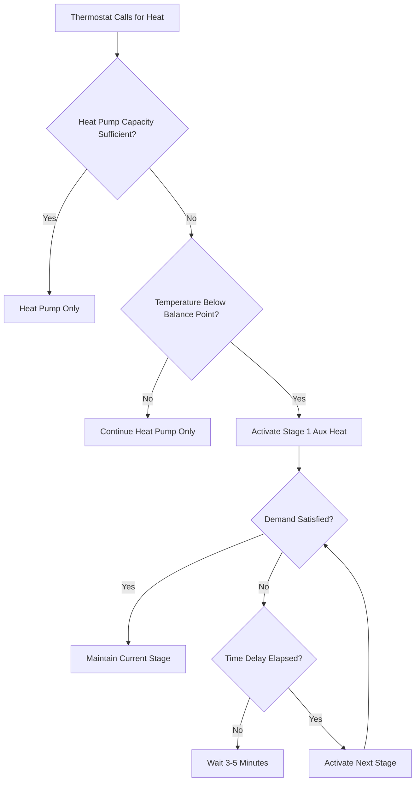

## Fundamental Principles

Air-source heat pumps experience declining heating capacity and efficiency as outdoor temperatures decrease. When the heat pump's output falls below the building's heating demand, auxiliary heating activates to maintain comfort. This supplemental heating represents a critical design consideration for cold-climate applications.

The balance point defines the outdoor temperature where heat pump capacity equals building heat loss. Below this temperature, supplemental heat becomes necessary.

$$Q_{hp}(T_{oa}) = Q_{load}(T_{oa})$$

Where $Q_{hp}$ represents heat pump capacity and $Q_{load}$ represents building heating demand, both functions of outdoor air temperature $T_{oa}$.

## Balance Point Analysis

The balance point calculation determines when auxiliary heating engages. Heat pump capacity varies with outdoor temperature following manufacturer performance data:

$$Q_{hp} = Q_{rated} \times CF(T_{oa})$$

Building heat loss increases linearly with temperature differential:

$$Q_{load} = UA(T_{indoor} - T_{oa}) + Q_{infiltration} + Q_{ventilation}$$

The balance point occurs where these curves intersect. For a typical residential installation with a heat pump rated at 36,000 BTU/h at 47°F and a building heat loss coefficient of 800 BTU/h·°F:

$$T_{balance} = T_{indoor} - \frac{Q_{hp,rated} \times CF(T_{balance})}{UA_{total}}$$

Iterative solution yields the balance point, typically between 25°F and 40°F for modern cold-climate heat pumps in well-insulated buildings.

## Electric Resistance Backup

Electric resistance heating provides the most common auxiliary heat source. Heating elements installed in the air handler or ductwork generate heat through resistive dissipation:

$$Q_{elec} = 3.412 \times P_{kW}$$

Where power $P_{kW}$ converts to heating capacity at exactly 1.0 COP, compared to heat pump COPs of 2.0-4.0 at typical operating conditions.

### Staging Configuration

Electric heat elements typically install in stages of 5-10 kW capacity:

| Stage | Capacity | Activation Temperature | Application |
|-------|----------|------------------------|-------------|
| Stage 1 | 5 kW (17,060 BTU/h) | Balance point | Light supplementation |
| Stage 2 | 10 kW (34,120 BTU/h) | Balance point - 5°F | Moderate deficiency |
| Stage 3 | 15 kW (51,180 BTU/h) | Balance point - 10°F | Severe conditions |
| Emergency | Full capacity | Compressor failure | Backup operation |

Staging prevents excessive electrical demand and moderates supply air temperature. ASHRAE Standard 90.1 requires time-delay controls preventing simultaneous activation of all stages.

### Control Sequence

The control logic incorporates time delays between stages (typically 3-5 minutes) preventing rapid cycling and reducing peak electrical demand.

## Dual Fuel and Hybrid Systems

Dual fuel systems combine an electric heat pump with fossil fuel heating (typically natural gas or propane furnace). Control strategies switch between heat sources based on economic and capacity considerations.

### Economic Switchover Point

The optimal fuel selection depends on relative energy costs:

$$COP_{hp} \times C_{electric} < \frac{AFUE_{furnace}}{3.412} \times C_{fuel}$$

Where $C_{electric}$ represents electricity cost ($/kWh) and $C_{fuel}$ represents gas cost ($/therm or $/gallon). With typical values:
- Electricity: $0.13/kWh
- Natural gas: $1.20/therm
- Heat pump COP: 2.5 at switchover
- Furnace AFUE: 95%

$$2.5 \times 0.13 < \frac{0.95}{3.412} \times 1.20$$
$$0.325 > 0.334$$

This analysis yields a switchover outdoor temperature of approximately 30-35°F for most systems, though site-specific energy costs require individual calculation.

### Hybrid System Comparison

| System Type | Heating Source | Efficiency | Operating Cost | Installation Cost | Best Application |
|-------------|----------------|------------|----------------|-------------------|------------------|
| Heat Pump + Electric | Electric HP + Resistance | COP 2.0-4.0 / 1.0 | Moderate-High | Low | Moderate climates |
| Dual Fuel HP/Gas | Electric HP + Gas Furnace | COP 2.0-4.0 / 95% AFUE | Low-Moderate | High | Cold climates |
| Dual Fuel HP/Oil | Electric HP + Oil Furnace | COP 2.0-4.0 / 85% AFUE | Moderate | High | No gas available |
| Cold Climate HP | Advanced HP only | COP 1.5-3.0 | Moderate | Moderate | Modern cold climate |

## Emergency Heat Operation

Emergency heat mode deactivates the heat pump compressor and operates auxiliary heating exclusively. This function serves three purposes:

1. **Compressor failure backup** - Maintains heating during equipment malfunction
2. **Defrost cycle supplementation** - Prevents cold air discharge during reverse cycle defrost
3. **Temporary high-demand response** - Addresses rapid setpoint recovery

The energy penalty for emergency heat operation is substantial:

$$\text{Energy Penalty} = \frac{COP_{hp}}{COP_{aux}} - 1$$

For a heat pump operating at COP 3.0 versus electric resistance at COP 1.0:

$$\text{Penalty} = \frac{3.0}{1.0} - 1 = 200\%$$

Emergency heat operation costs triple the energy of normal heat pump operation, making prolonged use economically unfavorable.

## Staging Strategies and Optimization

Advanced control strategies optimize auxiliary heat activation:

### Temperature-Based Staging

Controllers measure outdoor temperature and calculate required capacity:

$$Q_{aux} = Q_{load} - Q_{hp}(T_{oa})$$

Stage activation follows capacity deficiency rather than simple temperature thresholds.

### Time-Integrated Deviation

Some systems integrate thermostat error over time:

$$\int_{t_0}^{t} (T_{setpoint} - T_{actual}) \, dt > \text{Threshold}$$

This approach prevents nuisance activation during minor temperature fluctuations while responding to sustained heating deficiencies.

### Outdoor Reset Control

Auxiliary heat staging adjusts based on outdoor temperature trends, anticipating capacity requirements before indoor temperature drops significantly.

## Design Considerations

Proper auxiliary heat sizing requires:

1. **Capacity Analysis** - Auxiliary heat plus minimum heat pump capacity must meet design heating load at extreme conditions
2. **Electrical Service** - Resistance heating may require service upgrades (typical 200A minimum for whole-house backup)
3. **Duct Sizing** - Higher airflow temperatures from resistance heat require temperature limit controls (typically 140-160°F maximum)
4. **Control Integration** - Staging logic must coordinate with heat pump operation and defrost cycles

ASHRAE Standard 90.1 and IECC require that auxiliary heat not activate during normal heat pump operation above the balance point, enforcing efficient staging controls. Local amendments may further restrict electric resistance heating in favor of higher-efficiency alternatives.

## Performance Implications

Auxiliary heat activation significantly impacts seasonal performance. The Heating Seasonal Performance Factor (HSPF) accounts for auxiliary heat use:

$$HSPF = \frac{Q_{total,seasonal}}{E_{hp,seasonal} + E_{aux,seasonal}}$$

Systems with frequent auxiliary heat operation show reduced HSPF values. Modern cold-climate heat pumps extend capacity at low temperatures, minimizing auxiliary heat runtime and improving seasonal efficiency. Proper equipment selection, accurate load calculations, and optimized control strategies maximize the proportion of heating delivered by high-efficiency heat pump operation.
