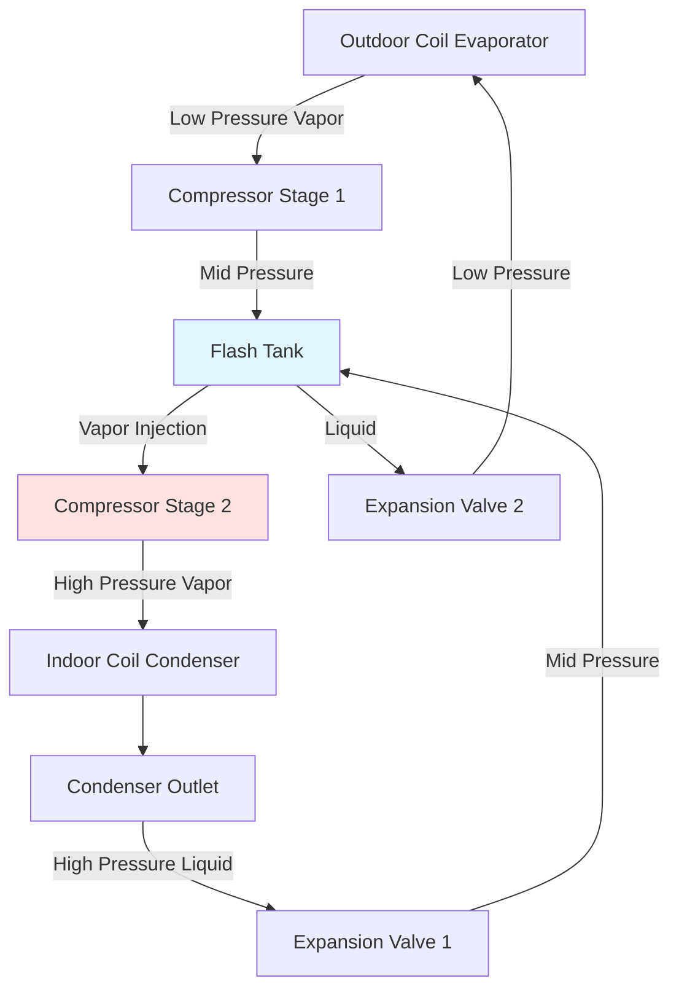
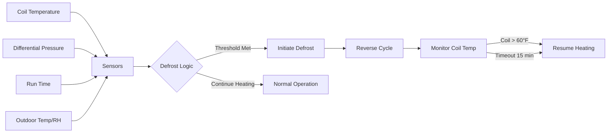

Air source heat pump performance degrades substantially as outdoor ambient temperature decreases due to fundamental thermodynamic limitations. Understanding capacity reduction mechanisms, enhanced refrigeration cycles, and defrost losses enables accurate system sizing and economic analysis for cold climate applications.

## Carnot Efficiency and Temperature Limits

Heat pump theoretical maximum coefficient of performance derives from Carnot cycle analysis:

$$COP_{Carnot} = \frac{T_{cond}}{T_{cond} - T_{evap}}$$

where temperatures are absolute (Kelvin). As outdoor temperature drops, evaporator temperature decreases, expanding the temperature lift and reducing theoretical efficiency. Real heat pumps achieve 30-50% of Carnot COP due to irreversibilities including pressure drops, heat transfer limitations, and compressor inefficiency.

For a heat pump delivering 120°F supply temperature with 5°F outdoor air:
- Condensing temperature: ~130°F (403K)
- Evaporating temperature: ~-10°F (250K)
- $COP_{Carnot} = 403/(403-250) = 2.63$
- Actual COP: ~1.05-1.30 (40-50% of Carnot)

## Capacity Degradation Mechanisms

Heat pump heating capacity decreases at low ambient temperatures through three primary mechanisms:

**1. Reduced Refrigerant Mass Flow**

Evaporator pressure drops with outdoor temperature, reducing suction vapor density. Compressor volumetric capacity remains constant, but mass flow decreases:

$$\dot{m} = \rho_{suction} \cdot V_{displacement} \cdot \eta_{vol}$$

For R-410A at 5°F evaporating vs. 47°F:
- Suction density drops ~45%
- Mass flow decreases proportionally
- Heating capacity reduces significantly

**2. Increased Temperature Lift**

Higher pressure ratio requires more compressor work per unit refrigerant circulated. Discharge temperature rises, limiting compression ratio due to thermal limits (typically 225-250°F maximum).

**3. Reduced Evaporator Heat Transfer**

Lower temperature difference between outdoor air and refrigerant reduces heat absorption rate. For constant evaporator size:

$$Q_{evap} = UA \cdot \Delta T_{lm}$$

As $\Delta T$ decreases, capacity drops unless refrigerant pressure (and therefore temperature) decreases further, creating a negative feedback loop.

## Typical Capacity Degradation Profile

Standard air source heat pumps exhibit the following capacity retention characteristics:

| Outdoor Temperature | Capacity Retention | Typical COP | Notes |
|---------------------|-------------------|-------------|-------|
| 47°F (8.3°C) | 100% (rated) | 3.0-4.0 | AHRI rating condition |
| 35°F (1.7°C) | 85-90% | 2.5-3.2 | Occasional defrost |
| 17°F (-8.3°C) | 65-75% | 1.8-2.4 | Frequent defrost |
| 5°F (-15°C) | 45-55% | 1.3-1.8 | Continuous defrost |
| -5°F (-20.6°C) | 25-35% | 0.9-1.3 | Approaching cutoff |

Cold climate models maintain significantly higher capacity through enhanced refrigeration cycles.

## Enhanced Vapor Injection (EVI) Technology

Enhanced vapor injection addresses capacity degradation through intermediate-pressure refrigerant injection into the compression process. This technology represents the most significant advancement in cold climate heat pump capability.

### Flash Tank Economizer Cycle

The flash tank operates at intermediate pressure between evaporator and condenser. High-pressure liquid from the condenser expands partially, creating:
- Saturated liquid at mid-pressure (to evaporator)
- Saturated vapor at mid-pressure (injected into compression)

### Thermodynamic Advantages

Vapor injection provides three distinct benefits:

**1. Increased Refrigerant Mass Flow**

Additional refrigerant injected mid-compression increases total mass flow through the condenser without increasing evaporator pressure drop:

$$\dot{m}_{total} = \dot{m}_{evap} + \dot{m}_{injection}$$

Typical injection ratios: 15-25% of evaporator flow at low ambient.

**2. Compressor Cooling**

Injected vapor cools the compression process, reducing discharge temperature and enabling higher pressure ratios:

$$T_{discharge} = T_{suction} \cdot r_p^{(k-1)/k} \cdot \frac{1}{\eta_{isentropic}}$$

Injection reduces effective $T_{suction}$ for second stage, lowering $T_{discharge}$ by 30-50°F.

**3. Improved Cycle Efficiency**

Two-stage compression with intercooling approaches ideal isothermal compression, reducing work input per unit heating delivered.

### Performance Comparison

| Outdoor Temp | Standard ASHP Capacity | EVI ASHP Capacity | Capacity Improvement |
|--------------|------------------------|-------------------|----------------------|
| 47°F | 36,000 BTU/h (100%) | 36,000 BTU/h (100%) | Baseline |
| 17°F | 24,000 BTU/h (67%) | 30,000 BTU/h (83%) | +25% |
| 5°F | 18,000 BTU/h (50%) | 26,000 BTU/h (72%) | +44% |
| -13°F | 12,000 BTU/h (33%) | 20,000 BTU/h (56%) | +67% |

Data representative of quality cold-climate equipment. Northeast Energy Efficiency Partnerships (NEEP) maintains performance databases for qualified cold-climate heat pumps.

## Defrost Cycle Losses

Frost accumulates on outdoor coils when surface temperature drops below 32°F and humidity exists in outdoor air. Ice formation blocks airflow and reduces heat transfer, necessitating periodic defrost.

### Defrost Energy Balance

Reverse-cycle defrost temporarily operates the heat pump in cooling mode, extracting heat from conditioned space:

$$Q_{defrost} = Q_{ice\ melt} + Q_{coil\ warmup} + Q_{fan\ off}$$

Components:
- Ice melting: 144 BTU/lb ice (latent heat of fusion)
- Coil thermal mass: ~20-40 BTU/°F per ton capacity
- Heat loss during fan-off period

Typical defrost cycle:
- Duration: 5-12 minutes
- Frequency: Every 30-90 minutes (temperature and humidity dependent)
- Energy penalty: 8-15% of heating output at 17°F, 50% RH

### Defrost Control Strategies

Modern systems employ demand-based defrost:

Advanced algorithms reduce unnecessary defrost cycles by 20-40%, improving average seasonal efficiency.

## Balance Point Calculation

Balance point represents the outdoor temperature where heat pump capacity equals building heat loss. Below this temperature, supplementary heat activates.

### Heat Loss Function

Building heat loss varies linearly with indoor-outdoor temperature difference:

$$Q_{loss} = UA \cdot (T_{indoor} - T_{outdoor}) + Q_{infiltration}$$

For typical residential construction:
- $UA = 300-600$ BTU/h·°F (depends on size, insulation, infiltration)
- Indoor setpoint: 68-72°F

### Heat Pump Capacity Function

Capacity decreases approximately linearly over operating range:

$$Q_{HP}(T_{OD}) = Q_{47} \cdot \left(1 - \alpha \cdot (47 - T_{OD})\right)$$

where $\alpha$ represents capacity degradation coefficient:
- Standard ASHP: $\alpha \approx 0.012$ (1.2% per °F)
- Cold-climate ASHP: $\alpha \approx 0.006-0.008$ (0.6-0.8% per °F)

### Balance Point Determination

Balance point occurs where $Q_{HP} = Q_{loss}$:

$$Q_{47} \cdot \left(1 - \alpha \cdot (47 - T_{BP})\right) = UA \cdot (T_{indoor} - T_{BP})$$

Solving for $T_{BP}$:

$$T_{BP} = \frac{Q_{47} \cdot (1 + 47\alpha) - UA \cdot T_{indoor}}{Q_{47} \cdot \alpha + UA}$$

**Example Calculation:**
- Heat pump capacity at 47°F: 36,000 BTU/h
- Building loss coefficient: 400 BTU/h·°F
- Indoor temperature: 70°F
- Cold-climate unit: $\alpha = 0.007$

$$T_{BP} = \frac{36000(1 + 47 \times 0.007) - 400 \times 70}{36000 \times 0.007 + 400} = \frac{46,980 - 28,000}{252 + 400} = 29°F$$

This installation requires supplementary heat below 29°F outdoor temperature.

## Dual Fuel Integration

Dual fuel systems integrate air source heat pumps with fossil fuel backup, optimizing for either economic or carbon objectives.

### Economic Switchover Point

Switchover temperature minimizes operating cost:

$$T_{switch} = T_{outdoor}\ where\ \frac{Cost_{elec}}{COP} = \frac{Cost_{gas}}{\eta_{furnace}}$$

For typical conditions:
- Electricity: $0.14/kWh ($0.041/kBTU)
- Natural gas: $1.20/therm ($0.012/kBTU)
- Furnace efficiency: 95%

Economic switchover occurs when:

$$COP_{HP} = \frac{0.041 \times 0.95}{0.012} = 3.24$$

Most cold-climate heat pumps fall below COP 3.24 around 20-30°F, making fossil fuel more economical at lower temperatures despite lower emissions.

## Cold Climate Design Recommendations

1. **Size heat pump for 50-80% of design heating load** at outdoor design temperature. Oversizing reduces efficiency during moderate weather.

2. **Verify rated capacity at 5°F or -13°F**, not just AHRI 47°F ratings. DOE's cold-climate specification requires minimum COP 1.75 at 5°F.

3. **Calculate balance point** for specific building and equipment combination. Supplementary heat capacity must cover difference between heat loss and heat pump capacity at design temperature.

4. **Consider defrost losses** in sizing. Use average capacity including defrost penalties, not peak capacity between defrost cycles.

5. **Evaluate dual fuel economics** based on local utility rates and equipment efficiency. Carbon considerations may favor all-electric operation despite higher costs.

Northeast Energy Efficiency Partnerships (NEEP) maintains a cold-climate heat pump specification requiring heating capacity ≥70% of rated capacity at 5°F and COP ≥1.75 at 5°F. Equipment meeting these criteria demonstrates suitable cold-climate performance.

---

**References:**
- NEEP Cold Climate Air Source Heat Pump Specification
- DOE Cold Climate Heat Pump Technology Challenge
- AHRI Standard 210/240 Performance Rating
- ASHRAE Handbook - HVAC Systems and Equipment, Chapter 9
