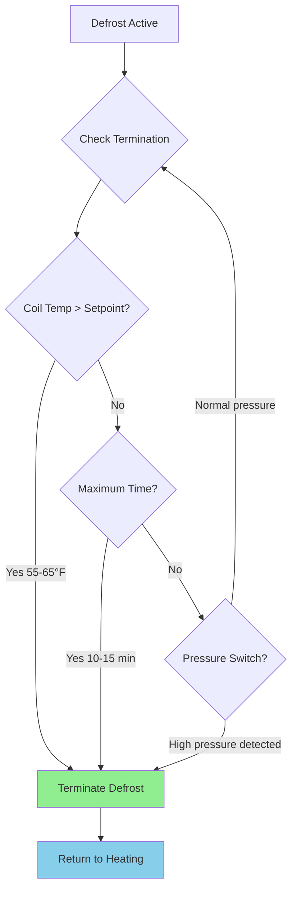

## Frost Accumulation Physics

Frost formation on air-source heat pump outdoor coils occurs when surface temperature falls below the dew point of ambient air and below 32°F (0°C). The accumulation rate depends on three coupled transport phenomena.

**Mass Transfer Process:**

The frost mass accumulation rate per unit area follows:

$$\dot{m}_f = h_m \cdot (w_{amb} - w_{sat,surf})$$

where $h_m$ is the mass transfer coefficient (lb/h·ft²), $w_{amb}$ is ambient air humidity ratio, and $w_{sat,surf}$ is the saturation humidity ratio at the coil surface temperature.

**Critical Conditions for Frosting:**

Frost accumulates when all three conditions are met simultaneously:

1. Coil surface temperature $T_{surf} < 32°F$
2. Ambient dew point $T_{dp} > T_{surf}$
3. Air humidity ratio $w_{amb} > 0$ (any moisture present)

The surface temperature during heating mode operation is:

$$T_{surf} = T_{ref} - \frac{q_{evap}}{h_{air} \cdot A_{coil}}$$

where $T_{ref}$ is refrigerant evaporation temperature, $q_{evap}$ is evaporator heat transfer rate, $h_{air}$ is air-side convection coefficient, and $A_{coil}$ is coil surface area.

**Frost Growth Mechanisms:**

Frost develops through three distinct phases:

| Phase | Duration | Characteristics | Impact on Performance |
|-------|----------|-----------------|----------------------|
| Crystal growth | 5-15 min | Needle-like crystals, minimal airflow restriction | Capacity: -2 to -5%, Pressure drop: +5-10% |
| Frost layer | 15-45 min | Dense layer formation, bridging between fins | Capacity: -10 to -20%, Pressure drop: +30-50% |
| Blockage | 45+ min | Complete fin blockage, severe restriction | Capacity: -25 to -40%, Pressure drop: +100-200% |

The frost layer thermal resistance adds to the overall heat transfer resistance:

$$\frac{1}{U_{total}} = \frac{1}{h_{air}} + \frac{t_{frost}}{k_{frost}} + \frac{1}{h_{ref}} + R_{tube}$$

where $t_{frost}$ is frost layer thickness and $k_{frost} \approx 0.25$ BTU/h·ft·°F is frost thermal conductivity (approximately one-tenth that of ice due to air pockets).

## Reverse Cycle Defrost

Reverse cycle defrost reverses refrigerant flow direction, temporarily operating the heat pump in cooling mode to supply hot refrigerant gas to the outdoor coil.

**Thermodynamic Process:**

During reverse cycle defrost, the outdoor coil receives high-temperature refrigerant:

$$T_{coil} = T_{cond} = T_{amb} + \frac{Q_{cond}}{h_{air} \cdot A_{coil}}$$

Condensing temperature typically reaches 90-110°F, providing sufficient thermal energy to melt frost. The defrost heat requirement is:

$$Q_{defrost} = m_{frost} \cdot h_{fusion} + m_{coil} \cdot c_{p,metal} \cdot \Delta T_{coil}$$

where $m_{frost}$ is frost mass, $h_{fusion} = 144$ BTU/lb is latent heat of fusion for ice, $m_{coil}$ is coil mass, and $\Delta T_{coil}$ is coil temperature rise.

**System Configuration:**

Reverse cycle defrost requires:

1. Four-way reversing valve
2. Defrost control board
3. Outdoor coil temperature sensor
4. Defrost termination thermostat (typically 55-65°F)
5. Auxiliary heat lockout (prevents simultaneous operation)

**Operational Sequence:**

1. Compressor continues running
2. Reversing valve energizes (heating → cooling)
3. Indoor fan stops (prevents cold air discharge)
4. Outdoor fan stops (minimizes heat loss to ambient)
5. Hot gas flows to outdoor coil
6. Frost melts and drains
7. Coil temperature sensor terminates defrost
8. System returns to heating mode

## Defrost Control Strategies

### Time-Temperature Defrost

Time-temperature defrost initiates based on accumulated compressor runtime and outdoor coil temperature.

**Control Logic:**

$$\text{Initiate Defrost} = (t_{runtime} \geq t_{threshold}) \land (T_{coil} \leq T_{frost})$$

Typical parameters:
- $t_{threshold}$ = 30, 45, 60, or 90 minutes of compressor runtime
- $T_{frost}$ = 26-32°F (coil temperature indicating frost presence)

**Advantages:**
- Simple, low-cost implementation
- Predictable defrost intervals
- No additional sensors required beyond coil temperature

**Limitations:**
- May defrost when unnecessary (low humidity conditions)
- May delay defrost excessively (high humidity conditions)
- Fixed time intervals don't adapt to conditions

### Demand Defrost

Demand defrost monitors system performance parameters to determine actual frost accumulation, initiating defrost only when needed.

**Performance-Based Indicators:**

| Parameter | Frost Indication | Typical Threshold |
|-----------|------------------|-------------------|
| Airflow pressure drop | Increases as fins block | +0.3 to +0.5 in. w.c. above baseline |
| Coil temperature depression | Decreases as frost insulates | 5-10°F below normal operating point |
| Suction pressure | Decreases with reduced airflow | 10-15 psig below baseline |
| Capacity degradation | Calculated from temperatures | 15-20% below rated capacity |

**Algorithm Example:**

Defrost initiates when:

$$\frac{Q_{actual}}{Q_{baseline}} < 0.80 \quad \text{AND} \quad T_{coil} < 32°F$$

where actual capacity is estimated from:

$$Q_{actual} = \dot{m}_{air} \cdot c_{p,air} \cdot (T_{discharge} - T_{ambient})$$

**Advantages:**
- Reduces unnecessary defrost cycles
- Adapts to actual operating conditions
- Improves seasonal efficiency (5-10% vs. time-temperature)

**Limitations:**
- Higher cost (additional sensors, logic)
- Calibration required for accurate baselines
- Complex diagnostics

## Defrost Energy Penalty

Defrost operation imposes significant energy penalties on heat pump performance.

**Energy Components:**

1. **Lost heating capacity** during defrost cycle (typically 5-10 minutes)
2. **Building heat loss** continues without replacement
3. **Coil sensible heat** required to warm thermal mass
4. **Latent heat of fusion** to melt accumulated frost
5. **Outdoor heat rejection** to ambient air
6. **Auxiliary heat** often energized to offset capacity loss

**Quantifying the Penalty:**

The integrated defrost energy penalty over a heating season:

$$COP_{seasonal} = \frac{Q_{heating,delivered}}{W_{compressor} + W_{defrost} + W_{aux}}$$

where:

$$W_{defrost} = n_{defrost} \cdot (W_{comp,defrost} \cdot t_{defrost} + Q_{coil,sensible} + Q_{frost,latent})$$

Typical defrost energy represents 3-10% of total heating energy consumption, depending on climate:

| Climate Zone | Defrost Frequency | Seasonal Energy Penalty |
|--------------|-------------------|------------------------|
| Mild (ASHRAE Zone 3) | 1-2 cycles/day | 2-4% |
| Moderate (ASHRAE Zone 4-5) | 2-4 cycles/day | 4-7% |
| Cold (ASHRAE Zone 6-7) | 4-8 cycles/day | 7-12% |

**Minimizing Defrost Penalty:**

Design strategies to reduce energy impact:

1. **Demand defrost controls** reduce unnecessary cycles
2. **Optimized fin spacing** (14-20 FPI for frost-prone climates vs. 20-25 FPI for mild climates)
3. **Hydrophobic coil coatings** reduce frost adhesion
4. **Low-temperature compressor optimization** maintains capacity, reducing frost accumulation rate
5. **Economizer defrost** uses hot gas bypass instead of full reversal (less common in residential)

## Defrost Termination Controls

Proper termination prevents excessive defrost duration while ensuring complete frost removal.

**Termination Methods:**

**Temperature-Based Termination:**

The most common method uses a coil sensor:

$$T_{coil} \geq T_{term} \quad \text{where } T_{term} = 55-65°F$$

This ensures sufficient coil temperature to melt all frost and drain condensate.

**Time-Based Backup:**

Maximum defrost duration (typically 10-15 minutes) prevents:
- Excessive energy consumption
- Indoor temperature drop
- Nuisance lockouts from failed sensors

**Pressure-Based Termination:**

High-side pressure rise indicates frost removal completion:

$$P_{discharge} \geq P_{term} \quad \text{(typically 300-350 psig for R-410A)}$$

## ASHRAE Standards and References

**ASHRAE 206-2013** (Method of Test for Rating of Multipurpose Heat Pumps for Residential Space Conditioning and Water Heating) specifies:
- Frost accumulation test conditions: 35°F DB, 33°F WB outdoor
- Maximum defrost interval testing
- Integrated seasonal performance including defrost effects

**ASHRAE 37-2009** (Methods of Testing for Rating Electrically Driven Unitary Air-Conditioning and Heat Pump Equipment) establishes:
- High-temperature (47°F) and low-temperature (17°F) rating conditions
- Defrost cycle measurement protocols
- COP degradation coefficient calculation

Defrost performance significantly impacts HSPF (Heating Seasonal Performance Factor) ratings, with well-optimized demand defrost systems achieving 8-10% higher seasonal efficiency compared to basic time-temperature controls in moderate climates.

