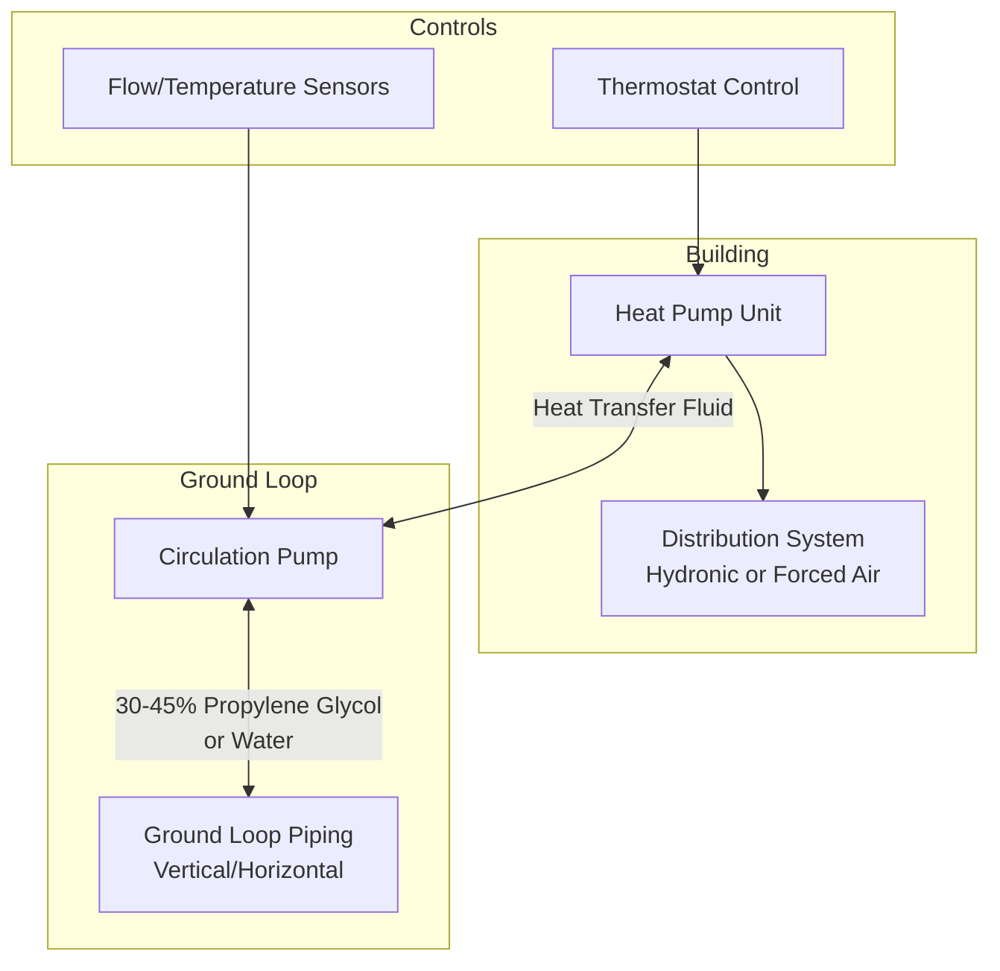

Ground source heat pumps (GSHPs) extract thermal energy from the earth's subsurface, leveraging the stable temperature regime that exists below the frost line. Unlike air source systems that contend with extreme outdoor temperature swings, GSHPs interface with a heat source/sink that maintains relatively constant temperatures year-round, resulting in superior coefficient of performance (COP) and energy efficiency ratio (EER) values across all operating conditions.

## Fundamental Heat Transfer Mechanism

The earth functions as both a heat source during heating mode and a heat sink during cooling mode. Below the frost line (typically 4-8 ft in temperate climates), ground temperatures approximate the annual average air temperature for that location, exhibiting minimal seasonal variation. At depths of 10-20 ft, ground temperatures in the continental United States range from 45°F to 75°F depending on latitude.

The heat transfer rate between the ground loop and surrounding soil follows Fourier's law of heat conduction:

$$Q = k \cdot A \cdot \frac{\Delta T}{L}$$

where $Q$ is heat transfer rate (Btu/hr), $k$ is soil thermal conductivity (Btu/hr·ft·°F), $A$ is heat exchange surface area (ft²), $\Delta T$ is temperature difference between fluid and soil (°F), and $L$ is effective heat transfer distance (ft).

Soil thermal conductivity varies significantly with composition, moisture content, and density:

| Soil Type | Thermal Conductivity (Btu/hr·ft·°F) | Diffusivity (ft²/day) |
|-----------|--------------------------------------|------------------------|
| Dry sand | 0.15-0.25 | 0.40-0.65 |
| Moist sand | 0.60-1.20 | 0.80-1.60 |
| Dry clay | 0.20-0.35 | 0.35-0.55 |
| Saturated clay | 0.75-1.30 | 0.65-1.20 |
| Solid rock | 1.20-2.40 | 1.30-2.80 |

## Ground Loop Configurations

GSHP systems employ closed-loop or open-loop configurations to facilitate thermal exchange with the ground.

### Closed-Loop Systems

Closed-loop systems circulate a heat transfer fluid (water or water-antifreeze mixture) through buried piping in a continuous circuit.

**Vertical Loops**

Vertical boreholes typically extend 100-500 ft deep with 15-25 ft spacing between adjacent bores. U-bend piping (0.75-1.25 in diameter HDPE) is inserted into boreholes and grouted with thermally enhanced material. Heat exchange occurs along the entire bore depth.

Required bore length depends on building loads, soil thermal properties, and operating temperature range:

$$L_{total} = \frac{Q_{a}}{q_{eff}}$$

where $L_{total}$ is total required bore length (ft), $Q_{a}$ is annual average heat exchange rate (Btu/hr), and $q_{eff}$ is effective heat extraction/rejection rate per unit length (Btu/hr·ft), typically 15-35 Btu/hr·ft depending on soil conditions.

**Horizontal Loops**

Horizontal loops consist of piping buried 4-6 ft deep in trenches. Multiple pipe configurations exist:

- **Single pipe:** One pipe per trench, requires extensive land area
- **Double pipe:** Two parallel pipes per trench, reduces land requirement by ~40%
- **Slinky coil:** Overlapping loops increase surface area per trench foot by 3-5×

Horizontal loops require approximately 400-600 ft of pipe per ton of capacity, demanding 0.15-0.30 acres per ton depending on configuration and soil thermal properties.

**Pond/Lake Loops**

Submerged coils in bodies of water provide excellent thermal exchange when water depth exceeds 8-10 ft and volume is sufficient to prevent excessive temperature change. Requires approximately 200-300 ft² of surface area per ton.

### Open-Loop Systems

Open-loop systems pump groundwater directly through the heat pump heat exchanger and discharge to a surface water body, recharge well, or drainage field. Groundwater maintains constant temperature (typically 50-60°F) and provides superior heat transfer compared to closed-loop antifreeze solutions.

Flow rate requirement:

$$\dot{m} = \frac{Q}{c_p \cdot \Delta T}$$

For water with $c_p = 1.0$ Btu/lb·°F and design $\Delta T = 10°F$, flow rate is approximately 3 gpm per ton of capacity.

Open-loop systems require adequate well yield (typically 5-10 gpm per ton), acceptable water quality (low mineral content to prevent fouling/scaling), and regulatory approval for discharge.

## System Performance Characteristics

GSHP systems demonstrate exceptional efficiency across all operating conditions due to the relatively constant source/sink temperature.

### Heating Mode Performance

Heating COP for GSHPs ranges from 3.0-5.0 depending on entering water temperature (EWT) and load conditions:

$$COP_{heating} = \frac{Q_{heating}}{W_{compressor}}$$

A GSHP with EWT of 50°F delivering 120°F water to a hydronic distribution system achieves COP of 3.8-4.2, compared to 2.0-2.5 for an air source heat pump operating at 20°F outdoor air.

### Cooling Mode Performance

Cooling EER ranges from 15-25 when rejecting heat to 70-80°F ground temperature, compared to EER of 10-14 for air-cooled systems rejecting to 95°F outdoor air.

The performance advantage stems from reduced lift (temperature difference between evaporator and condenser):

$$W_{compressor} \propto \frac{T_{cond} - T_{evap}}{T_{evap}}$$

Lower condenser temperature during cooling (or higher evaporator temperature during heating) directly reduces compressor power consumption.

## System Configuration Components

Key components include:

- **Heat pump unit:** Water-to-air or water-to-water configuration
- **Circulation pump:** Maintains design flow rate (2.5-3.0 gpm per ton)
- **Flow center:** Houses pump, valves, pressure relief, expansion tank
- **Heat transfer fluid:** Water (open-loop) or water-antifreeze mixture (closed-loop)
- **Ground loop piping:** HDPE (high-density polyethylene), thermally fused joints

## Design Considerations

Proper GSHP design requires accurate determination of:

1. **Building loads:** Peak heating/cooling demands and annual energy consumption
2. **Soil thermal properties:** Conductivity and diffusivity via thermal response test
3. **Loop sizing:** Adequate length/area to prevent long-term ground temperature drift
4. **Flow rates:** Turbulent flow (Reynolds number > 4000) for effective heat transfer
5. **Antifreeze concentration:** Adequate freeze protection with minimal viscosity penalty

IGSHPA (International Ground Source Heat Pump Association) provides design standards and procedures, including ground loop design software that accounts for thermal short-circuiting between adjacent boreholes and long-term ground temperature response.

## Performance Verification

Annual energy consumption for a properly designed GSHP system:

$$E_{annual} = \frac{Q_{heating,annual}}{COP_{avg,heating}} + \frac{Q_{cooling,annual}}{EER_{avg,cooling} / 3.412}$$

Typical residential installations achieve 30-50% energy savings compared to conventional HVAC systems, with simple payback periods of 5-10 years depending on local energy costs, incentives, and installation costs.

## References

- ASHRAE Handbook—HVAC Applications, Chapter 35: Geothermal Energy
- IGSHPA Design and Installation Standards
- ASHRAE Standard 90.1: Energy Standard for Buildings
