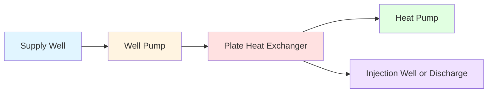
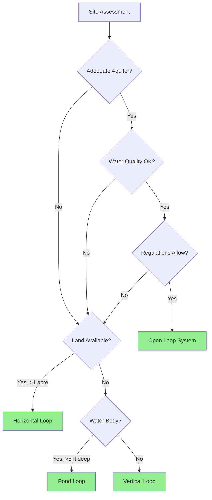

# Ground Loop Types for Ground-Source Heat Pumps

Ground loop configuration represents the most critical design decision for ground-source heat pump (GSHP) systems, directly affecting installation cost, thermal performance, and long-term reliability. The ground heat exchanger serves as the thermal reservoir, rejecting heat during cooling and extracting heat during heating. Selection depends on site geology, available land area, soil thermal properties, and groundwater conditions.

## Fundamental Heat Transfer Mechanisms

Heat transfer between the ground loop and surrounding earth occurs through three mechanisms operating simultaneously:

**Conduction** dominates in direct soil contact, governed by Fourier's law:

$$q = -k_{\text{soil}} A \frac{dT}{dx}$$

where $q$ is heat transfer rate (W), $k_{\text{soil}}$ is soil thermal conductivity (W/m·K), $A$ is surface area (m²), and $dT/dx$ is temperature gradient (K/m).

**Thermal diffusivity** determines transient response:

$$\alpha = \frac{k_{\text{soil}}}{\rho c_p}$$

where $\alpha$ is thermal diffusivity (m²/s), $\rho$ is soil density (kg/m³), and $c_p$ is specific heat (J/kg·K). Higher diffusivity allows faster heat dissipation but reduces thermal storage capacity.

**Groundwater movement** enhances heat transfer through advection when present, effectively increasing apparent thermal conductivity by 20-50% in saturated zones with significant flow.

## Closed-Loop Systems

### Vertical Borehole Configuration

Vertical loops utilize boreholes drilled 100-600 ft (30-180 m) deep, typically 4-6 inches (100-150 mm) diameter. High-density polyethylene (HDPE) U-tubes are inserted and the annular space filled with thermally-enhanced grout.

**Advantages:**
- Minimal land area requirement (150-200 ft² per ton capacity)
- Access to stable deep-earth temperatures
- Higher thermal conductivity in consolidated formations
- No seasonal performance degradation
- Suitable for retrofit applications

**Thermal Performance:**

Heat transfer per borehole:

$$q_{\text{bore}} = \frac{T_{\text{ground}} - T_{\text{fluid}}}{R_{\text{bore}} + R_{\text{grout}} + R_{\text{pipe}}}$$

where resistances are calculated per IGSHPA methodology. Typical extraction rates: 50-80 W/m in heating, 60-90 W/m in cooling, depending on geology.

**Required Bore Depth:**

$$L_{\text{total}} = \frac{q_{\text{net}} R_{\text{ground}}}{T_{\text{ground}} - T_{\text{loop avg}}} + \frac{q_{\text{pulse}}}{2 F_{\text{sc}}} \left( R_{\text{bore}} F_{\text{p}} + R_{\text{grout}} \right)$$

where $q_{\text{net}}$ is annual net heat rejection (W), $q_{\text{pulse}}$ is peak load (W), $R_{\text{ground}}$ is effective ground thermal resistance (m·K/W), $F_{\text{sc}}$ is short-circuit heat loss factor, and $F_{\text{p}}$ is pulse load factor.

### Horizontal Loop Configuration

Horizontal loops employ trenches 4-10 ft (1.2-3.0 m) deep with HDPE pipes in single-pipe, two-pipe, or four-pipe (spiral) configurations.

**Advantages:**
- Lower installation cost in suitable terrain
- Easier installation without specialized drilling
- Simple expansion or repair access
- Leverages solar gain in shallow soils

**Disadvantages:**
- Extensive land area (1500-3000 ft² per ton)
- Performance influenced by seasonal surface temperature variation
- Vulnerable to landscape changes
- Frost penetration concerns in cold climates

**Trench Depth Selection:**

Below frost line but within active solar influence zone. Heat transfer affected by:

$$T_{\text{soil}}(z,t) = T_{\text{mean}} + A_s e^{-z\sqrt{\frac{\pi}{\alpha P}}} \cos\left(\frac{2\pi t}{P} - z\sqrt{\frac{\pi}{\alpha P}}\right)$$

where $T_{\text{soil}}(z,t)$ is soil temperature at depth $z$ and time $t$, $T_{\text{mean}}$ is annual mean surface temperature, $A_s$ is surface temperature amplitude, $P$ is period (365 days), and $\alpha$ is thermal diffusivity.

### Slinky/Spiral Configuration

Overlapping coils increase heat transfer surface area per trench length by 2-4×, reducing land requirements but increasing pipe and pumping costs.

**Spacing Requirements:**
- Trench spacing: 10-20 ft (3-6 m) minimum
- Loop pitch: 12-24 inches (0.3-0.6 m)
- Prevents thermal interaction between adjacent loops

### Pond/Lake Systems

Submerged closed loops in water bodies utilize water's superior thermal properties:
- Thermal conductivity: 0.6 W/m·K (vs. 0.5-2.5 W/m·K for soil)
- Consistent temperature stratification
- Natural convection enhances heat transfer

**Requirements:**
- Minimum depth: 8-10 ft (2.4-3.0 m) to prevent freezing
- Minimum volume: 0.5 acre-ft per ton capacity
- Bottom placement for temperature stability
- Anchoring against buoyancy and ice forces

## Open-Loop Systems

Open-loop systems pump groundwater directly through a heat exchanger, then discharge to a second well or surface water body.

### System Components

### Design Criteria

**Flow Rate Requirement:**

$$\dot{m}_{\text{water}} = \frac{q_{\text{peak}}}{c_p \Delta T_{\text{water}}}$$

Typical $\Delta T_{\text{water}}$ = 10-15°F (5.5-8.3°C) through heat exchanger.

**Well Capacity:**
- 1.5-3.0 gpm per ton cooling capacity
- Continuous pumping capability for peak load duration
- Adequate drawdown recovery between cycles

**Water Quality Considerations:**

| Parameter | Maximum Acceptable | Impact if Exceeded |
|-----------|-------------------|-------------------|
| Iron (Fe) | 0.3 mg/L | Fouling, corrosion |
| Manganese (Mn) | 0.05 mg/L | Fouling, scaling |
| Hardness (CaCO₃) | 250 mg/L | Scaling in heat exchanger |
| pH | 6.5-8.5 | Corrosion or scaling |
| Total Dissolved Solids | <1000 mg/L | Reduced heat transfer |
| H₂S | <0.05 mg/L | Corrosion, odor |

### Advantages and Limitations

**Advantages:**
- Lower first cost (single well vs. bore field)
- Excellent thermal performance
- Minimal land area
- No thermal degradation concerns

**Limitations:**
- Requires suitable aquifer with sufficient yield
- Regulatory restrictions on water use/discharge
- Fouling risk requires maintenance
- Potential water rights issues
- Environmental concerns with discharge

## Ground Loop Comparison

| Parameter | Vertical Loop | Horizontal Loop | Pond Loop | Open Loop |
|-----------|--------------|-----------------|-----------|-----------|
| **Installed Cost** | $$-$$$$ | $$ | $$ | $$-$$$ |
| **Land Area Required** | Minimal | Extensive | N/A | Minimal |
| **Thermal Stability** | Excellent | Moderate | Good | Excellent |
| **Performance (COP)** | 3.5-4.5 | 3.2-4.0 | 3.5-4.3 | 3.8-5.0 |
| **Design Life** | 50+ years | 50+ years | 25-50 years | 25+ years |
| **Maintenance** | Minimal | Minimal | Moderate | Moderate-High |
| **Site Limitations** | Rock formations | Available land | Water body | Aquifer quality |

## Site Assessment and Selection Criteria

### Geological Investigation

**Thermal Conductivity Testing:**

In-situ thermal response testing (TRT) measures effective ground thermal conductivity:

$$k_{\text{eff}} = \frac{q}{4\pi m} \quad \text{where} \quad m = \frac{dT_{\text{fluid}}}{d(\ln t)}$$

Test duration: 48-72 hours minimum. Critical for vertical loop sizing accuracy.

**Soil Classification:**

| Soil/Rock Type | Thermal Conductivity (W/m·K) | Suitability |
|----------------|------------------------------|-------------|
| Dry sand/gravel | 0.4-0.8 | Poor |
| Moist sand/gravel | 1.5-2.5 | Good |
| Saturated sand/gravel | 2.0-3.0 | Excellent |
| Clay (dry) | 0.5-1.0 | Fair |
| Clay (moist) | 1.0-1.8 | Good |
| Limestone | 2.5-3.5 | Excellent |
| Granite | 2.5-4.0 | Excellent |
| Water | 0.6 | Reference |

### Groundwater Considerations

**Static Water Level:** Affects saturation zone and thermal performance. Seasonal fluctuation monitoring essential.

**Hydraulic Conductivity:** Determines groundwater flow contribution to heat transfer. Values >10⁻⁵ m/s significantly enhance performance.

### Site Constraints

**Decision Flow:**

## Heat Exchanger Sizing Methodology

### Closed-Loop Pipe Sizing

**Pressure Drop Constraint:**

$$\Delta P = f \frac{L}{D} \frac{\rho v^2}{2}$$

Target: <10 ft H₂O per ton (29.9 kPa/ton) total loop pressure drop to maintain pump efficiency.

**Reynolds Number:**

$$Re = \frac{\rho v D}{\mu}$$

Maintain turbulent flow (Re >4000) for optimal heat transfer. Typical velocities: 2-4 ft/s (0.6-1.2 m/s).

**Pipe Diameter Selection:**

| Capacity (Tons) | Loop Flow (gpm) | Pipe Size (SDR-11 HDPE) |
|----------------|-----------------|-------------------------|
| 1-3 | 3-9 | 3/4 inch |
| 3-6 | 9-18 | 1 inch |
| 6-12 | 18-36 | 1-1/4 inch |
| 12-20 | 36-60 | 1-1/2 inch |

### Borehole Thermal Resistance

**Total Thermal Resistance:**

$$R_{\text{total}} = R_{\text{pipe}} + R_{\text{grout}} + R_{\text{bore}}$$

**Borehole Resistance** (shape factor method):

$$R_{\text{bore}} = \frac{1}{2\pi k_{\text{grout}}} \ln\left(\frac{r_{\text{bore}}}{\sqrt{2} r_{\text{pipe}}}\right)$$

Typical values: 0.10-0.20 m·K/W for thermally-enhanced grout, 0.30-0.50 m·K/W for bentonite.

### Open-Loop Heat Exchanger

**Plate Heat Exchanger Design:**

$$UA = \frac{q}{\Delta T_{\text{lm}}}$$

where $U$ is overall heat transfer coefficient (typically 500-1000 W/m²·K for plate exchangers) and $A$ is heat transfer area.

**Log-Mean Temperature Difference:**

$$\Delta T_{\text{lm}} = \frac{(T_{\text{water,in}} - T_{\text{loop,out}}) - (T_{\text{water,out}} - T_{\text{loop,in}})}{\ln\left(\frac{T_{\text{water,in}} - T_{\text{loop,out}}}{T_{\text{water,out}} - T_{\text{loop,in}}}\right)}$$

Approach temperature: 2-5°F (1-3°C) for efficient heat transfer.

## Design Standards and Guidelines

**IGSHPA Design and Installation Standards** provide comprehensive methodology for:
- Thermal conductivity testing procedures
- Loop length calculations
- Grout specifications
- Pipe fusion requirements

**ASHRAE Handbook - HVAC Applications, Chapter 35** covers:
- Load calculation procedures
- Ground temperature estimation
- System design parameters
- Performance expectations

**International Ground Source Heat Pump Association (IGSHPA)** certification ensures installer competency and quality assurance.

## Conclusion

Ground loop selection fundamentally balances site conditions, thermal performance requirements, and economic constraints. Vertical boreholes offer superior performance and minimal land impact at higher installation cost. Horizontal loops provide economical solutions where land availability permits. Open-loop systems deliver excellent efficiency but face regulatory and water quality challenges. Proper site characterization through thermal testing and geological investigation ensures accurate sizing and long-term performance reliability.
