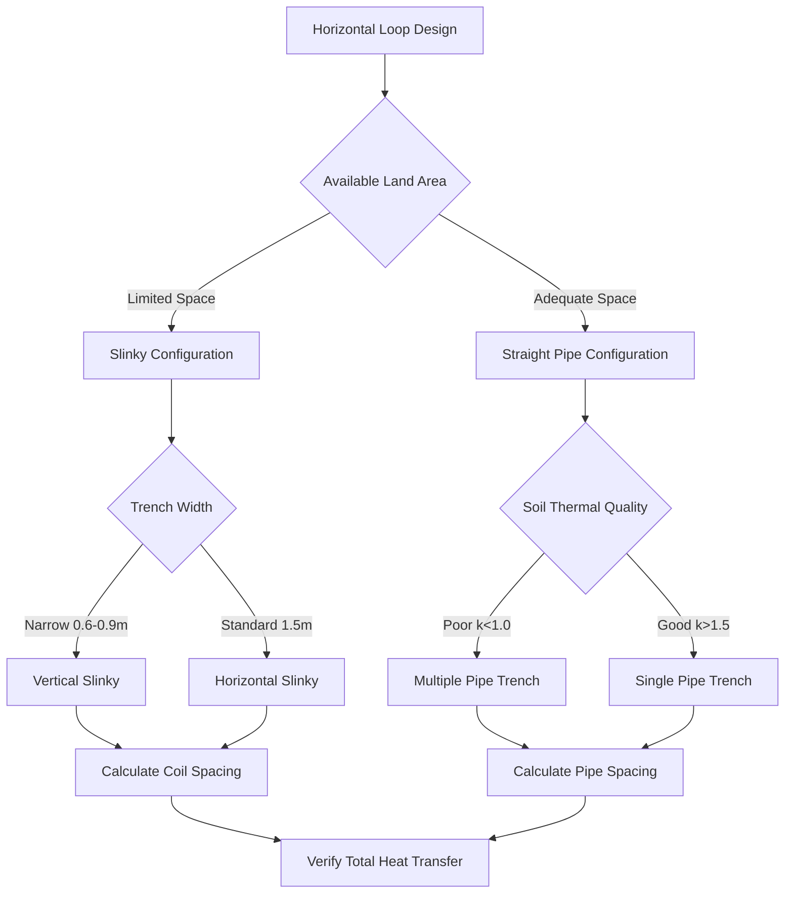

Horizontal closed-loop ground heat exchangers represent the most cost-effective ground coupling method for residential and small commercial ground source heat pump (GSHP) installations where adequate land area is available. These systems circulate an antifreeze solution through high-density polyethylene (HDPE) piping buried in shallow horizontal trenches, exchanging thermal energy with the surrounding soil mass.

## Physical Principles of Horizontal Heat Transfer

Heat transfer in horizontal ground loops occurs primarily through conduction between the circulating fluid and the surrounding soil. The heat transfer rate follows Fourier's law, modified for cylindrical geometry:

$$Q = \frac{2\pi k_s L (T_p - T_s)}{\ln(r_s/r_p)}$$

where $Q$ is the heat transfer rate (W), $k_s$ is soil thermal conductivity (W/m·K), $L$ is pipe length (m), $T_p$ is pipe surface temperature (K), $T_s$ is undisturbed soil temperature (K), $r_s$ is the radius of thermal influence (m), and $r_p$ is pipe outer radius (m).

The thermal resistance between the pipe and soil depends on soil moisture content, density, and mineralogy. Dry soils exhibit thermal conductivity as low as 0.3 W/m·K, while saturated sands may reach 2.5 W/m·K. This five-fold variation significantly impacts required loop length and system performance.

## Trench Configuration Methods

### Single Pipe Trenches

Single pipe configurations place one HDPE pipe (typically 3/4" or 1" diameter) in each trench at depths between 1.5 and 2.4 m (5-8 ft). This depth range balances installation cost against thermal performance, positioning pipes below the frost line while remaining accessible to standard excavation equipment.

The required trench length per ton of cooling capacity varies with soil thermal properties:

| Soil Type | Thermal Conductivity (W/m·K) | Trench Length (m/ton) | Trench Length (ft/ton) |
|-----------|------------------------------|----------------------|----------------------|
| Dry sand/gravel | 0.4-0.8 | 75-90 | 250-300 |
| Moist clay/silt | 1.0-1.6 | 50-65 | 165-215 |
| Saturated sand | 2.0-2.5 | 40-50 | 130-165 |
| Heavy clay (wet) | 1.5-2.0 | 45-55 | 150-180 |

Single pipe trenches offer superior thermal recovery between heating and cooling seasons due to minimal thermal interference. The isolated pipe geometry allows undisturbed soil surrounding each trench to serve as thermal reservoir, maintaining stable long-term performance.

### Double Pipe Trenches

Double pipe configurations install two HDPE pipes in parallel within a single trench, reducing excavation cost and land area requirements by approximately 40% compared to single pipe layouts. Pipes must maintain minimum centerline spacing of 300 mm (12 in) to limit thermal short-circuiting.

The supply and return pipes create overlapping thermal fields that reduce effective heat transfer by 10-15% compared to isolated pipes. Design calculations must apply thermal interaction factors to account for this performance penalty. Double pipe trenches require 15-25% additional pipe length compared to single pipe installations with equivalent capacity.

Optimal double pipe geometry places pipes in horizontal alignment rather than vertical stacking. Horizontal spacing maximizes soil contact area and improves thermal distribution. Vertical stacking concentrates thermal disturbance and exacerbates temperature stratification effects.

### Multiple Pipe Trenches

Four-pipe and six-pipe configurations further concentrate heat exchange capacity into minimal trench length. These dense arrangements suit sites with severe land restrictions but require careful thermal analysis to prevent excessive soil temperature drift.

The thermal interaction factor for multiple pipes decreases effective heat transfer. For two pipes separated by distance $d$, the temperature penalty factor is:

$$F_m = 1 - \frac{r_p}{d} \cdot e^{-d/(4\alpha t)}$$

where $\alpha$ is soil thermal diffusivity (m²/s) and $t$ is operating time (s). At typical spacing and seasonal operation, $F_m$ ranges from 0.85 to 0.95, indicating 5-15% reduction in heat transfer capacity compared to isolated pipes.

Multiple pipe trenches achieve 50-65% land area reduction but increase installation complexity. Pipe routing requires careful planning to maintain minimum spacing throughout the trench length. Manifold design becomes critical to ensure balanced flow distribution across multiple circuits.

## Slinky Coil Configurations

Slinky coils overlay HDPE pipe in sinusoidal or circular patterns to concentrate pipe length in reduced trench area. Standard slinky installations use 3/4" to 1-1/4" HDPE with coil diameters of 0.9-1.2 m (3-4 ft) and pitch spacing of 0.6-0.9 m (2-3 ft).

### Horizontal Slinky

Horizontal slinky coils lay flat in trenches 1.5-2.1 m (5-7 ft) deep. Each coil section typically contains 30-40 m (100-130 ft) of pipe occupying 6-9 m (20-30 ft) of trench length, yielding 4:1 to 5:1 pipe-to-trench ratios. The concentrated pipe mass creates higher thermal flux density, requiring wider trench spacing to prevent long-term soil temperature degradation.

Required land area for horizontal slinky systems ranges from 500-700 ft² per ton of cooling capacity, depending on soil thermal properties and climate. This represents 40-50% area reduction compared to single pipe trenches but requires increased pipe spacing to maintain thermal recovery performance.

Horizontal slinky installations demand precise coil fabrication and placement. Pre-fabricated coils arrive on spools sized for standard equipment handling. Field assembly requires adequate workspace for coil expansion and positioning. Trench geometry must accommodate full coil diameter with 150-300 mm (6-12 in) clearance to trench walls.

### Vertical Slinky

Vertical slinky installations stand coils on edge in narrow trenches 0.6-0.9 m (2-3 ft) wide and 1.5-2.1 m (5-7 ft) deep. This orientation increases soil contact area and improves performance in thermally stratified soils. Vertical configurations achieve 6:1 to 8:1 pipe-to-trench ratios while maintaining better thermal recovery.

The vertical orientation places pipe at varying depths from 1.2 to 2.4 m, accessing soil temperature gradients. This depth variation provides performance advantage in cooling-dominated applications where deeper soil remains cooler during summer peak loads.

Required land area for vertical slinky systems ranges from 400-550 ft² per ton, representing the most compact horizontal loop configuration. The narrow trench width facilitates installation in constrained sites while maintaining adequate thermal performance.

Vertical slinky trenches require specialized excavation equipment. Standard backhoes struggle to maintain consistent narrow trench geometry. Trenching machines or chain trenchers produce superior results with vertical walls and uniform width throughout the run.

### Slinky Coil Spacing Requirements

Slinky coil centerline spacing must account for concentrated thermal loading. Minimum spacing ranges from 4.5 m (15 ft) in high-conductivity soils to 7.5 m (25 ft) in poor thermal soils. Inadequate spacing causes cumulative soil temperature drift that degrades system efficiency over successive heating and cooling seasons.

## Burial Depth Requirements

### Frost Line Considerations

Pipe burial depth must exceed local frost penetration depth to prevent freeze damage and maintain thermal stability. Frost depth varies from 0.3 m (12 in) in southern climates to 2.4 m (96 in) in northern regions. IGSHPA standards require minimum burial depth of 1.2 m (4 ft) in all climates to ensure adequate thermal coupling.

Shallow burial depths below 1.2 m experience significant seasonal temperature variation that reduces system efficiency. Temperature amplitude at depth $z$ follows:

$$A_z = A_0 \cdot e^{-z\sqrt{\pi/(365\alpha)}}$$

where $A_z$ is temperature amplitude at depth (°C), $A_0$ is surface temperature amplitude, $z$ is depth (m), and $\alpha$ is thermal diffusivity (m²/s). At 1.5 m depth in typical soil, temperature amplitude reduces to 15% of surface variation.

### Optimal Depth Range

Standard horizontal loop installations target 1.5-1.8 m (5-6 ft) depth as optimal balance between thermal performance and installation cost. This depth range provides:

- Minimal annual temperature variation (±3-5°C from mean)
- Excavation accessible to standard equipment
- Adequate overburden for frost and traffic load protection
- Reasonable trenching cost per linear meter

Depths exceeding 2.1 m (7 ft) offer minimal thermal performance improvement while significantly increasing excavation cost. Specialized equipment requirements and soil disposal challenges make deep installations economically unfavorable except in extreme frost penetration zones.

### Traffic Load Considerations

Loops installed beneath driveways, parking areas, or equipment pads require increased burial depth or mechanical protection. Minimum depth under vehicular traffic loads is 1.8 m (6 ft) without protective measures. Alternatively, 1.2 m depth with concrete encasement or engineered fill provides equivalent protection.

## Pipe Spacing Requirements

Horizontal pipe spacing prevents thermal interference between adjacent circuits and trenches. IGSHPA guidelines establish minimum spacing based on soil thermal recovery characteristics:

- **Within-trench spacing**: 300 mm (12 in) minimum between parallel pipes
- **Between-trench spacing**: 3.0-6.0 m (10-20 ft) depending on soil thermal conductivity
- **Slinky coil spacing**: 4.5-7.5 m (15-25 ft) between coil centerlines
- **Property line setback**: 1.5 m (5 ft) minimum from boundaries

The thermal recovery time between heating and cooling seasons follows:

$$t_r = \frac{d^2}{4\alpha}$$

where $t_r$ is recovery time (s), $d$ is spacing between heat sources (m), and $\alpha$ is thermal diffusivity. For typical soils with $\alpha = 5 \times 10^{-7}$ m²/s and 4.5 m spacing, recovery time is approximately 90 days, adequate for seasonal transitions.

Insufficient spacing causes thermal ratcheting where soil temperature progressively increases (cooling mode) or decreases (heating mode) over multiple years. This effect manifests as declining system efficiency and capacity. Conservative spacing ensures 95% thermal recovery within 90-day seasonal transitions.

## Land Area Requirements

Required land area varies with trench configuration, soil properties, and system capacity:

| Configuration | Land Area per Ton | Notes |
|--------------|------------------|-------|
| Single pipe | 500-700 ft² | Assumes 5 ft trench spacing, good soil |
| Double pipe | 400-550 ft² | Reduced area but increased pipe length |
| Horizontal slinky | 500-700 ft² | Wide coil spacing requirement |
| Vertical slinky | 400-550 ft² | Most compact configuration |

Poor thermal conductivity soils require 30-50% additional area compared to values listed. Heating-dominated applications in cold climates require 20-30% area increase to accommodate higher extraction rates.

Available land area must account for:
- Setback requirements from structures, property lines, utilities
- Tree and landscape preservation zones
- Future construction or expansion areas
- Excavation access and staging areas
- Soil stockpile and equipment maneuvering space

Typical residential sites of 0.25-0.5 acres accommodate 3-5 ton horizontal loop systems with single or double pipe configurations. Larger systems or constrained sites require slinky configurations or alternative ground coupling methods (vertical boreholes, hybrid systems).

## Soil Thermal Properties

### Thermal Conductivity Effects

Soil thermal conductivity determines heat transfer efficiency and required loop length. In-situ thermal conductivity testing provides accurate design data, but classification-based estimates guide preliminary sizing:

| Soil Classification | Dry Conductivity | Saturated Conductivity | Moisture Impact |
|-------------------|-----------------|----------------------|-----------------|
| Coarse sand/gravel | 0.4-0.8 W/m·K | 1.8-2.5 W/m·K | 3-5× increase |
| Fine sand | 0.5-1.0 W/m·K | 2.0-2.8 W/m·K | 3-4× increase |
| Silt | 0.4-0.9 W/m·K | 1.4-2.0 W/m·K | 2-3× increase |
| Clay (heavy) | 0.3-0.7 W/m·K | 1.2-1.8 W/m·K | 2-4× increase |
| Organic soil/peat | 0.2-0.4 W/m·K | 0.5-0.8 W/m·K | 2-3× increase |

### Moisture Content Effects

Soil moisture content dominates thermal conductivity. Water exhibits thermal conductivity of 0.6 W/m·K compared to 0.025 W/m·K for air, so water-filled pores dramatically enhance heat transfer. The relationship follows:

$$k_{eff} = k_s^{1-\phi} \cdot k_f^{\phi}$$

where $k_{eff}$ is effective thermal conductivity, $k_s$ is solid phase conductivity, $k_f$ is fluid phase (water/air) conductivity, and $\phi$ is porosity. Saturated conditions increase thermal conductivity by 200-400% compared to dry conditions.

Seasonal moisture variation affects loop performance. Spring conditions with saturated soil provide peak heat transfer capacity. Summer drought reduces conductivity by 40-60% in sandy soils but only 15-25% in clay soils due to capillary water retention.

Ground loop design must account for worst-case dry soil conditions unless permanent saturation exists via high water table. Conservative design assumes 60% of saturated thermal conductivity for soils above water table.

### Thermal Diffusivity

Thermal diffusivity determines transient heat transfer and thermal recovery:

$$\alpha = \frac{k}{\rho c_p}$$

where $\rho$ is soil density (kg/m³) and $c_p$ is specific heat capacity (J/kg·K). Higher diffusivity accelerates temperature changes and improves seasonal recovery. Dense, dry soils exhibit high diffusivity ($8 \times 10^{-7}$ m²/s), while wet soils have lower diffusivity ($4 \times 10^{-7}$ m²/s) due to water's high heat capacity.

Low diffusivity soils retain thermal disturbance longer, requiring increased pipe spacing to prevent cumulative temperature drift. High diffusivity soils recover faster, allowing closer spacing and reduced land area requirements.

### Thermal Capacity

Soil volumetric heat capacity affects short-term thermal response and loop entering fluid temperature stability:

$$C_v = \rho_{bulk} \cdot c_p$$

Sandy soils exhibit volumetric heat capacity of 1.3-1.6 MJ/m³·K while wet clay soils reach 2.5-3.0 MJ/m³·K. Higher thermal capacity dampens temperature fluctuations during system cycling, providing more stable loop temperatures during variable load conditions.

## Seasonal Performance Variation

### Summer Cooling Performance

Horizontal loops experience higher entering fluid temperatures during cooling season as heat rejection raises soil temperature surrounding pipes. Temperature rise follows exponential decay with distance from pipe:

$$T(r,t) = T_{\infty} + (T_p - T_{\infty}) \cdot \frac{r_p}{r} \cdot \text{erfc}\left(\frac{r-r_p}{2\sqrt{\alpha t}}\right)$$

where $T(r,t)$ is temperature at radius $r$ and time $t$, $T_{\infty}$ is undisturbed soil temperature, and erfc is the complementary error function.

Peak loop temperatures occur in late summer (August-September in northern hemisphere) after cumulative heat rejection. Well-designed systems maintain entering fluid temperatures below 32°C (90°F) during peak cooling loads. Excessive temperatures indicate inadequate loop length or spacing.

### Winter Heating Performance

Heating operation extracts heat from soil, depressing temperatures surrounding pipes. Minimum loop temperatures occur in late winter (February-March) after sustained heat extraction. Design targets maintain entering fluid temperatures above -1°C (30°F) in antifreeze solutions to prevent viscosity issues and ensure adequate heat transfer.

Cold climate installations experience 15-25% capacity reduction during deep winter conditions compared to moderate temperature operation. Supplemental heating may be required for extreme design conditions or undersized loops.

### Shoulder Season Recovery

Spring and fall shoulder seasons allow thermal recovery as system load decreases. Soil temperatures gradually return toward undisturbed values through conduction from surrounding soil mass. Complete recovery requires 60-120 days depending on soil diffusivity and thermal disturbance magnitude.

Systems with adequate spacing and proper sizing exhibit complete thermal recovery annually. Long-term temperature monitoring should show stable year-to-year performance without progressive temperature drift.

### Multi-Year Performance Trends

Properly designed horizontal loops maintain stable performance over 25-50 year service life. Long-term monitoring should demonstrate:

- Stable entering fluid temperature range year-to-year
- Consistent COP throughout system lifetime
- No progressive efficiency degradation

Temperature drift exceeding 0.5°C per year indicates inadequate loop capacity, excessive spacing, or moisture content changes. Corrective measures include flow rate adjustment, supplemental heating/cooling, or loop field expansion.

## Installation Best Practices

Proper installation ensures design performance and system longevity:

1. **Trench excavation**: Maintain uniform depth and slope 0.5% minimum for air elimination
2. **Pipe placement**: Support pipes to prevent contact with trench bottom and maintain spacing
3. **Backfill material**: Use excavated soil or thermally enhanced grout for improved contact
4. **Compaction**: Compact backfill in 150-300 mm lifts to eliminate air pockets
5. **Pressure testing**: Test loops at 550 kPa (80 psi) for 24 hours before backfilling
6. **Flushing**: Flush loops with clean water before antifreeze charging
7. **Header placement**: Install supply/return headers in insulated vault below frost line
8. **Purging**: Provide adequate purge ports and air elimination during commissioning

### Pipe Material Requirements

High-density polyethylene (HDPE) pipe conforming to ASTM D3035 or D2737 serves as industry standard for ground loops. SDR-11 (160 psi) or SDR-9 (200 psi) ratings provide adequate pressure capacity with thermal cycling durability.

Thermal fusion joining creates monolithic pipe assemblies without mechanical connections in ground. Butt fusion for diameter ≥2" and socket fusion for smaller sizes ensure leak-free construction. All joints must be pressure tested before burial.

## Performance Comparison

| Configuration | Land Required | Installation Cost | Heat Transfer | Thermal Recovery | Best Application |
|--------------|---------------|-------------------|---------------|------------------|------------------|
| Single pipe | High (600-700 ft²/ton) | Low | Excellent | Excellent | Large lots, rural sites |
| Double pipe | Medium (450-550 ft²/ton) | Medium | Good | Good | Suburban residential |
| Horizontal slinky | Medium (500-700 ft²/ton) | Medium | Fair | Fair | Limited length sites |
| Vertical slinky | Low (400-550 ft²/ton) | High | Good | Good | Compact sites, poor access |

Horizontal closed-loop systems provide reliable, cost-effective ground coupling for appropriate sites. Proper configuration selection, adequate spacing, and attention to soil thermal properties ensure optimal long-term performance and energy efficiency. Site evaluation including soil thermal testing, area measurement, and load calculation determines optimal horizontal loop configuration for each application.
