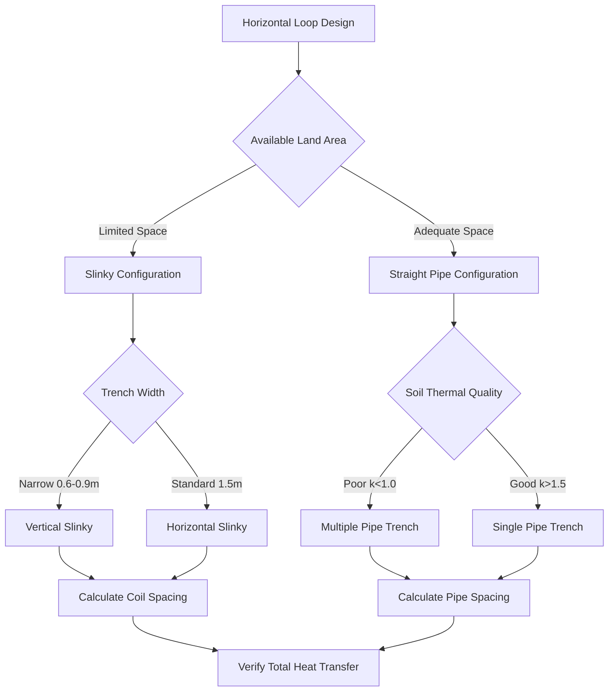

Horizontal closed-loop ground heat exchangers represent the most cost-effective ground coupling method for residential and small commercial ground source heat pump (GSHP) installations where adequate land area is available. These systems circulate an antifreeze solution through high-density polyethylene (HDPE) piping buried in shallow horizontal trenches, exchanging thermal energy with the surrounding soil mass.

## Physical Principles of Horizontal Heat Transfer

Heat transfer in horizontal ground loops occurs primarily through conduction between the circulating fluid and the surrounding soil. The heat transfer rate follows Fourier's law, modified for cylindrical geometry:

$$Q = \frac{2\pi k_s L (T_p - T_s)}{\ln(r_s/r_p)}$$

where $Q$ is the heat transfer rate (W), $k_s$ is soil thermal conductivity (W/m·K), $L$ is pipe length (m), $T_p$ is pipe surface temperature (K), $T_s$ is undisturbed soil temperature (K), $r_s$ is the radius of thermal influence (m), and $r_p$ is pipe outer radius (m).

The thermal resistance between the pipe and soil depends on soil moisture content, density, and mineralogy. Dry soils exhibit thermal conductivity as low as 0.3 W/m·K, while saturated sands may reach 2.5 W/m·K. This five-fold variation significantly impacts required loop length and system performance.

## Trench Configuration Methods

### Single Pipe Trenches

Single pipe configurations place one HDPE pipe (typically 3/4" or 1" diameter) in each trench at depths between 1.5 and 2.4 m (5-8 ft). This depth range balances installation cost against thermal performance, positioning pipes below the frost line while remaining accessible to standard excavation equipment.

The required trench length per ton of cooling capacity varies with soil thermal properties:

| Soil Type | Thermal Conductivity (W/m·K) | Trench Length (m/ton) |
|-----------|------------------------------|----------------------|
| Dry sand/gravel | 0.4-0.8 | 75-90 |
| Moist clay/silt | 1.0-1.6 | 50-65 |
| Saturated sand | 2.0-2.5 | 40-50 |
| Heavy clay (wet) | 1.5-2.0 | 45-55 |

### Multiple Pipe Trenches

Multiple pipe configurations install two, four, or six pipes in a single trench to reduce excavation requirements. Pipes must maintain adequate spacing to prevent thermal interference. IGSHPA Design and Installation Standards specify minimum horizontal spacing of 300 mm (12 in) between pipe centerlines for parallel installations.

The thermal interaction factor for multiple pipes decreases effective heat transfer. For two pipes separated by distance $d$, the temperature penalty factor is:

$$F_m = 1 - \frac{r_p}{d} \cdot e^{-d/(4\alpha t)}$$

where $\alpha$ is soil thermal diffusivity (m²/s) and $t$ is operating time (s). At typical spacing and seasonal operation, $F_m$ ranges from 0.85 to 0.95, indicating 5-15% reduction in heat transfer capacity compared to isolated pipes.

## Slinky Coil Configurations

Slinky coils overlay HDPE pipe in sinusoidal or circular patterns to concentrate pipe length in reduced trench area. Standard slinky installations use 3/4" to 1-1/4" HDPE with coil diameters of 0.9-1.2 m (3-4 ft) and pitch spacing of 0.6-0.9 m (2-3 ft).

### Horizontal Slinky

Horizontal slinky coils lay flat in trenches 1.5-2.1 m (5-7 ft) deep. Each coil section typically contains 30-40 m of pipe occupying 6-9 m of trench length, yielding 4:1 to 5:1 pipe-to-trench ratios. The concentrated pipe mass creates higher thermal flux density, requiring wider trench spacing to prevent long-term soil temperature degradation.

### Vertical Slinky

Vertical slinky installations stand coils on edge in narrow trenches 0.6-0.9 m (2-3 ft) wide and 1.5-2.1 m deep. This orientation increases soil contact area and improves performance in thermally stratified soils. Vertical configurations achieve 6:1 to 8:1 pipe-to-trench ratios while maintaining better thermal recovery.

## Pipe Spacing Requirements

Horizontal pipe spacing prevents thermal interference between adjacent circuits and trenches. IGSHPA guidelines establish minimum spacing based on soil thermal recovery characteristics:

- **Within-trench spacing**: 300 mm (12 in) minimum between parallel pipes
- **Between-trench spacing**: 3.0-6.0 m (10-20 ft) depending on soil thermal conductivity
- **Slinky coil spacing**: 4.5-7.5 m (15-25 ft) between coil centerlines

The thermal recovery time between heating and cooling seasons follows:

$$t_r = \frac{d^2}{4\alpha}$$

where $t_r$ is recovery time (s), $d$ is spacing between heat sources (m), and $\alpha$ is thermal diffusivity. For typical soils with $\alpha = 5 \times 10^{-7}$ m²/s and 4.5 m spacing, recovery time is approximately 90 days, adequate for seasonal transitions.

## Soil Thermal Conductivity Considerations

Soil thermal conductivity determines heat transfer efficiency and required loop length. In-situ thermal conductivity testing provides accurate design data, but classification-based estimates guide preliminary sizing.

### Moisture Content Effects

Soil moisture content dominates thermal conductivity. Water exhibits thermal conductivity of 0.6 W/m·K compared to 0.025 W/m·K for air, so water-filled pores dramatically enhance heat transfer. The relationship follows:

$$k_{eff} = k_s^{1-\phi} \cdot k_f^{\phi}$$

where $k_{eff}$ is effective thermal conductivity, $k_s$ is solid phase conductivity, $k_f$ is fluid phase (water/air) conductivity, and $\phi$ is porosity. Saturated conditions increase thermal conductivity by 200-400% compared to dry conditions.

### Thermal Diffusivity

Thermal diffusivity determines transient heat transfer and thermal recovery:

$$\alpha = \frac{k}{\rho c_p}$$

where $\rho$ is soil density (kg/m³) and $c_p$ is specific heat capacity (J/kg·K). Higher diffusivity accelerates temperature changes and improves seasonal recovery. Dense, dry soils exhibit high diffusivity, while wet soils have lower diffusivity due to water's high heat capacity.

## Installation Best Practices

Proper installation ensures design performance and system longevity:

1. **Trench excavation**: Maintain uniform depth and slope for air elimination
2. **Pipe placement**: Support pipes to prevent contact with trench bottom
3. **Backfill material**: Use excavated soil or thermally enhanced grout for improved contact
4. **Compaction**: Compact backfill in 150-300 mm lifts to eliminate air pockets
5. **Pressure testing**: Test loops at 550 kPa (80 psi) for 24 hours before backfilling
6. **Flushing**: Flush loops with clean water before antifreeze charging

## Performance Comparison

| Configuration | Land Required | Installation Cost | Heat Transfer | Thermal Recovery |
|--------------|---------------|-------------------|---------------|------------------|
| Single pipe | High | Low | Good | Excellent |
| Multiple pipe | Medium | Medium | Good | Good |
| Horizontal slinky | Medium | Medium | Fair | Fair |
| Vertical slinky | Low | High | Good | Good |

Horizontal closed-loop systems provide reliable, cost-effective ground coupling for appropriate sites. Proper configuration selection, adequate spacing, and attention to soil thermal properties ensure optimal long-term performance and energy efficiency.
