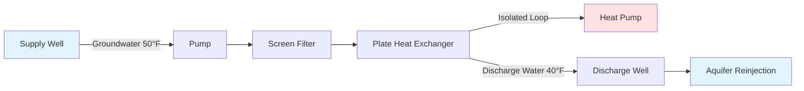
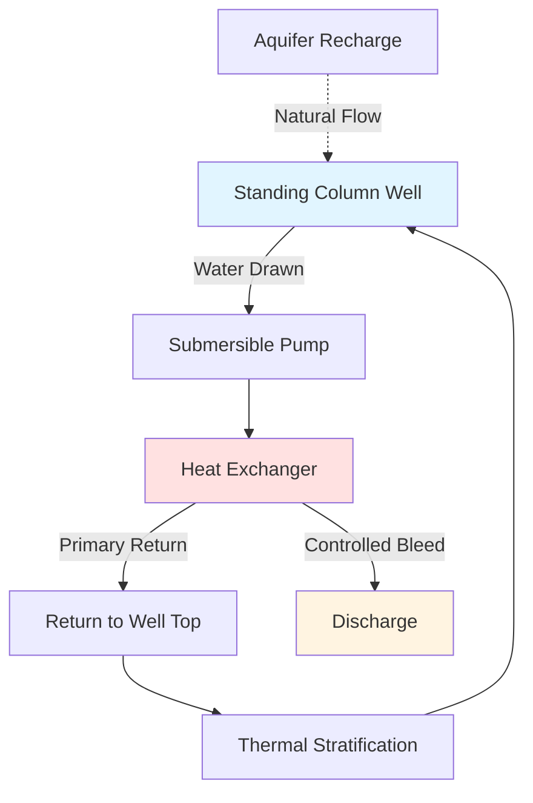

Open-loop ground source heat pump systems extract groundwater directly from aquifers, pass it through a heat exchanger, and discharge it back to the ground. These systems leverage the stable thermal properties of groundwater, which maintains temperatures between 45°F and 75°F (7°C to 24°C) depending on geographic location and depth.

## Fundamental Operating Principles

Open-loop systems operate by extracting thermal energy from flowing groundwater rather than conducting heat through soil. The heat transfer rate depends on water flow rate and temperature differential:

$$Q = \dot{m} \cdot c_p \cdot \Delta T = \rho \cdot \dot{V} \cdot c_p \cdot (T_{in} - T_{out})$$

Where:
- $Q$ = heat transfer rate (Btu/hr or kW)
- $\dot{m}$ = mass flow rate (lbm/hr or kg/s)
- $c_p$ = specific heat of water = 1.0 Btu/(lbm·°F) or 4.18 kJ/(kg·K)
- $\dot{V}$ = volumetric flow rate (gpm or L/s)
- $\rho$ = water density ≈ 62.4 lbm/ft³ or 1000 kg/m³
- $\Delta T$ = temperature change across heat exchanger

The required water flow rate for a given capacity:

$$\dot{V}_{gpm} = \frac{Q_{Btu/hr}}{500 \cdot \Delta T_{°F}}$$

Typical design values use $\Delta T$ = 10-15°F (5.5-8.3°C) for heating mode and 10-12°F (5.5-6.7°C) for cooling mode.

## System Configurations

### Supply and Discharge Well Systems

The most common configuration uses two separate wells: a supply well extracts groundwater while a discharge well returns it to the aquifer.

**Design Criteria:**
- Minimum well separation: 50-100 ft (15-30 m) to prevent thermal short-circuiting
- Supply well depth: determined by aquifer depth and static water level
- Discharge well location: downgradient from supply well when possible
- Well spacing increases with higher system capacity and continuous operation

### Standing Column Well (SCW)

Standing column wells use a single deep well (typically 200-1500 ft / 60-450 m) where water circulates in a column. A controlled bleed maintains thermal recovery.

**Operating Characteristics:**

The standing column operates under three conditions:

1. **No-bleed operation**: Water recirculates entirely within the well column
2. **Partial bleed**: Small percentage (1-5%) discharged to maintain efficiency
3. **Full bleed**: Maximum discharge during peak loads

Bleed rate calculation:

$$\text{Bleed \%} = \frac{\dot{V}_{bleed}}{\dot{V}_{total}} \times 100$$

$$\dot{V}_{bleed,gpm} = \frac{Q_{deficit,Btu/hr}}{500 \cdot \Delta T_{groundwater,°F}}$$

Where $Q_{deficit}$ represents the thermal load exceeding the well's natural recharge capacity.

**Advantages:**
- Single well reduces drilling costs
- No well separation requirements
- Suitable for sites with limited land area
- Effective in fractured bedrock formations

**Limitations:**
- Requires adequate aquifer recharge
- May need bleed during sustained peak loads
- Thermal capacity decreases over extended operation
- Bleed discharge requires approved disposal method

## Water Quality Requirements

Water quality directly affects heat exchanger performance and system longevity. Critical parameters must meet IGSHPA standards.

### Chemical Analysis Requirements

| Parameter | Maximum Limit | Impact if Exceeded |
|-----------|--------------|-------------------|
| Total Hardness (CaCO₃) | 250 mg/L | Scaling in heat exchanger |
| Iron (Fe) | 0.3 mg/L | Oxidation and fouling |
| Manganese (Mn) | 0.05 mg/L | Black oxide deposits |
| pH | 6.5 - 8.5 | Corrosion (low) or scaling (high) |
| Total Dissolved Solids | 500 mg/L | Accelerated corrosion |
| Hydrogen Sulfide (H₂S) | 0.05 mg/L | Corrosive gas, odor issues |
| Chlorides | 250 mg/L | Pitting corrosion |
| Sulfates | 250 mg/L | Scaling potential |

### Fouling and Scaling Indices

**Langelier Saturation Index (LSI):**

$$LSI = pH - pH_s$$

Where $pH_s$ is the saturation pH calculated from water chemistry.

- LSI > 0: Water is supersaturated, scaling likely
- LSI = 0: Water is balanced
- LSI < 0: Water is undersaturated, corrosive

**Ryznar Stability Index (RSI):**

$$RSI = 2 \cdot pH_s - pH$$

- RSI < 6.0: Severe scaling
- RSI 6.0-7.0: Moderate scaling
- RSI 7.0-7.5: Balanced
- RSI > 7.5: Corrosive

### Mitigation Strategies

For marginal water quality, implement isolation strategies:

**Plate and Frame Heat Exchanger Isolation:**

The groundwater passes through one side of a plate heat exchanger while a closed glycol or water loop connects to the heat pump. This protects the heat pump from direct exposure to poor-quality water.

$$UA_{total} = \frac{1}{\frac{1}{h_1 \cdot A_1} + \frac{t_{plate}}{k_{plate} \cdot A} + \frac{1}{h_2 \cdot A_2}}$$

The additional thermal resistance reduces overall system efficiency by 5-15% but eliminates heat pump fouling risk.

## Discharge and Disposal Methods

### Reinjection Wells

Return water to the same aquifer through a properly constructed discharge well. IGSHPA requires:

- Minimum 50 ft (15 m) separation from supply well
- Well screen in same aquifer zone
- Proper well development to maintain injection capacity
- Quarterly monitoring of injection pressure and flow rate

**Injection capacity testing:**

$$K = \frac{Q}{2\pi \cdot H \cdot s}$$

Where:
- $K$ = hydraulic conductivity (ft/day)
- $Q$ = injection flow rate (ft³/day)
- $H$ = saturated thickness (ft)
- $s$ = drawdown/buildup (ft)

### Surface Discharge

Where permitted by local regulations, surface discharge to:
- Storm sewers (thermal limits typically 68-86°F / 20-30°C)
- Surface water bodies (requires NPDES permit in USA)
- Drainage ditches or retention ponds

Temperature limits prevent thermal pollution:

$$T_{discharge} = T_{supply} \pm \Delta T_{system}$$

Most regulations limit $T_{discharge}$ to ambient water temperature ±5°F (2.8°C).

### Regulatory Considerations

**United States:**
- Underground Injection Control (UIC) regulations (EPA)
- State well construction codes
- Local groundwater protection ordinances
- NPDES permits for surface discharge

**Design Review Requirements:**
- Hydrogeological assessment
- Well yield testing (minimum 8-hour pump test)
- Water quality analysis (complete mineral analysis)
- Thermal impact modeling for large systems
- Permit applications and approvals before construction

## Well Yield and Sizing

Minimum well yield must exceed peak system flow rate with safety factor:

$$\dot{V}_{well,required} = \dot{V}_{system,peak} \times 1.25$$

For a 20-ton (70 kW) cooling system:

$$\dot{V}_{system} = \frac{20 \text{ tons} \times 12,000 \text{ Btu/hr/ton}}{500 \times 10°F} = 48 \text{ gpm}$$

$$\dot{V}_{well,required} = 48 \times 1.25 = 60 \text{ gpm minimum}$$

Pump sizing must overcome static lift, friction losses, and system pressure drop:

$$TDH = h_{static} + h_{friction} + h_{system} + h_{velocity}$$

Where total dynamic head (TDH) is measured in feet of water column.

## Performance Considerations

**Advantages of Open-Loop Systems:**
- Higher efficiency than closed-loop (stable source temperature)
- Lower installation cost for adequate aquifers
- No ground loop size constraints
- Excellent performance in heating and cooling modes

**Limitations:**
- Requires suitable aquifer with adequate yield
- Water quality impacts heat exchanger maintenance
- Regulatory approval requirements
- Potential for well fouling over time
- Disposal method must be permitted and sustainable

**Typical Performance:**
- Heating COP: 3.5-5.0 (EER 12-17)
- Cooling EER: 15-25 (COP 4.4-7.3)
- Source water temperature stability: ±2°F (1°C) annually

Open-loop systems deliver exceptional efficiency when aquifer conditions and water quality support sustainable operation. Proper design requires thorough hydrogeological investigation, water quality testing, and compliance with applicable regulations.

---

**References:**
- IGSHPA Design and Installation Standards (2021)
- ASHRAE Handbook - HVAC Applications, Chapter 34
- EPA Underground Injection Control Regulations (40 CFR Parts 144-148)
- NGWA Guidelines for Geothermal Heat Pump Well Construction
