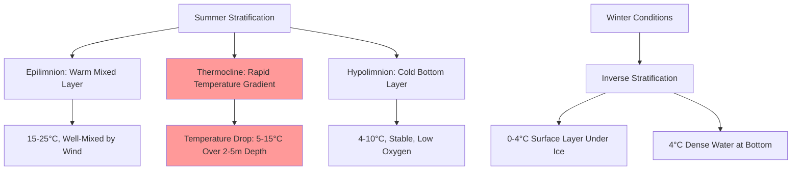
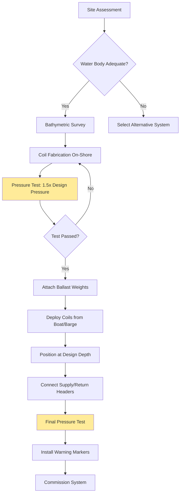

## Fundamental Heat Transfer Principles

Pond and lake loop systems utilize submerged heat exchanger coils to extract or reject thermal energy directly from water bodies. The convective heat transfer between the circulating antifreeze solution and the surrounding water provides significantly higher coefficients than ground-coupled systems due to water's superior thermal properties.

The heat transfer rate from a submerged coil is governed by:

$$Q = h_o A_o (T_w - T_{pipe})$$

where $h_o$ is the outside convective heat transfer coefficient (typically 150-600 W/m²·K depending on water velocity), $A_o$ is the external surface area, $T_w$ is the water temperature, and $T_{pipe}$ is the pipe wall temperature.

The thermal advantage stems from water's properties:
- Thermal conductivity: 0.6 W/m·K (vs. 1.5-3.5 W/m·K for saturated soil)
- Volumetric heat capacity: 4.18 MJ/m³·K (vs. 2.0-2.8 MJ/m³·K for soil)
- Natural convection currents that replenish heat at the coil interface

## Water Body Thermal Capacity Requirements

The minimum water body volume required depends on the building's thermal load and the acceptable temperature change over the operating season. IGSHPA guidelines specify minimum requirements to prevent excessive temperature drift.

### Volumetric Capacity Calculation

The required water volume is determined by energy balance:

$$V_{min} = \frac{Q_{season} \cdot t_{operation}}{\rho_w c_w \Delta T_{acceptable}}$$

where:
- $Q_{season}$ = seasonal average heat extraction or rejection rate (W)
- $t_{operation}$ = cumulative operating hours per season (h)
- $\rho_w$ = water density (1000 kg/m³)
- $c_w$ = specific heat of water (4186 J/kg·K)
- $\Delta T_{acceptable}$ = permissible seasonal temperature change (typically 2-5°C)

| Building Load | Minimum Water Volume | Minimum Surface Area | Minimum Depth |
|---------------|---------------------|---------------------|---------------|
| 3.5 kW (1 ton) | 1,900 m³ | 760 m² | 2.4 m |
| 10.5 kW (3 ton) | 5,700 m³ | 2,280 m² | 2.4 m |
| 17.5 kW (5 ton) | 9,500 m³ | 3,800 m² | 2.4 m |
| 35 kW (10 ton) | 19,000 m³ | 7,600 m² | 2.4 m |

*Values based on IGSHPA recommendations for cooling-dominated applications with 3°C seasonal temperature change*

### Depth Requirements

Water bodies must maintain sufficient depth to prevent:

1. **Surface freezing interference**: Coils must be positioned below the maximum ice thickness
2. **Thermal stratification effects**: Adequate depth ensures mixing and temperature stability
3. **Ecological protection**: Minimum water volume beneath coils to support aquatic life

The minimum depth $D_{min}$ must satisfy:

$$D_{min} = D_{ice} + D_{clearance} + D_{coil} + D_{bottom}$$

where:
- $D_{ice}$ = maximum anticipated ice thickness (0-0.6 m depending on climate)
- $D_{clearance}$ = clearance above coils (0.3-0.6 m)
- $D_{coil}$ = coil height (0.15-0.3 m)
- $D_{bottom}$ = clearance to bottom (0.3-0.6 m minimum)

IGSHPA recommends a minimum depth of 2.4 m (8 ft) with coils positioned at 1.5-2.1 m (5-7 ft) below the surface.

## Seasonal Temperature Variations and Stratification

Natural water bodies exhibit thermal stratification, particularly in summer, creating distinct temperature layers that affect heat exchanger performance.

### Thermocline Impact

The thermocline depth varies seasonally:

$$z_{thermocline} = f(A_{surface}, D_{max}, latitude, season)$$

For temperate climates, the thermocline typically establishes at 3-8 m depth in summer. Positioning coils above the thermocline ensures access to warmer water for heating mode, while placement below improves cooling performance.

### Turnover Events

Spring and fall turnover mix the water column when surface and bottom temperatures equilibrate near 4°C (water's maximum density point). These events redistribute thermal energy but create temporary performance variations.

## Submerged Coil Design and Configuration

### Coil Geometry

The most common configurations include:

**Slinky Coils**: Overlapped loops laid horizontally on the bottom
- Pipe diameter: 19-32 mm (3/4"-1.25")
- Loop diameter: 0.6-1.2 m
- Pitch: 0.15-0.45 m
- Heat extraction: 30-50 W/m of pipe (cooling mode)

**Spiral Coils**: Vertical or angled helical configurations
- Provides better surface area utilization
- Reduces bottom footprint
- Heat extraction: 40-60 W/m of pipe

**Straight Runs**: Parallel pipe arrays with headers
- Simpler installation
- Requires larger bottom area
- Heat extraction: 25-40 W/m of pipe

### Pipe Spacing Requirements

The spacing between parallel pipes must prevent thermal interference:

$$S_{min} = 2 \sqrt{\frac{\alpha_w t}{\pi}}$$

where $\alpha_w$ is the thermal diffusivity of water (1.43 × 10⁻⁷ m²/s) and $t$ is the operating time between shutdown periods. For continuous operation, IGSHPA recommends minimum spacing of 1.5-2.4 m between pipe centers.

### Material Selection

| Material | Advantages | Disadvantages | Typical Application |
|----------|-----------|---------------|---------------------|
| HDPE (High-Density Polyethylene) | Excellent corrosion resistance, flexibility, fusion welding | Lower thermal conductivity (0.4 W/m·K) | Standard choice for all installations |
| Crosslinked Polyethylene (PEX) | Flexibility, corrosion resistance | Cannot be fusion welded | Smaller residential systems |
| Polybutylene | Good flexibility, lower cost | Material availability issues | Legacy systems only |

HDPE pipe (SDR-11 or SDR-9) remains the industry standard due to its durability, UV resistance, and 50+ year service life.

## Installation Methodology

### Ballasting Requirements

Coils must be weighted to prevent flotation and movement. The required ballast mass per unit length:

$$m_{ballast} = \frac{\rho_w A_{pipe,outer} - m_{pipe,empty} - m_{fluid}}{\text{length}}$$

Typical solutions include:
- Concrete-filled steel chains: 15-30 kg/m of coil
- Concrete pads attached at intervals: 40-80 kg per anchor point
- Water-filled coil sections during installation (drained and filled with antifreeze)

## Antifreeze Solution Requirements

Unlike closed-loop ground systems, pond loops experience lower entering water temperatures in winter, necessitating lower antifreeze concentrations in heating-dominated climates.

### Concentration Determination

The required concentration prevents freezing at the minimum expected water temperature minus a safety margin:

$$T_{freeze,solution} \leq T_{water,min} - 5°C$$

For propylene glycol (preferred for environmental safety):

| Water Temperature | Required Concentration | Freeze Point | Viscosity Ratio (vs. Water) |
|-------------------|----------------------|--------------|----------------------|
| 10°C minimum | 10% by volume | -3.9°C | 1.2 |
| 5°C minimum | 15% by volume | -6.5°C | 1.4 |
| 0°C minimum | 25% by volume | -12.2°C | 2.1 |

The viscosity increase with antifreeze concentration raises pumping power requirements:

$$P_{pump} \propto \frac{\mu_{solution}}{\mu_{water}}$$

## Environmental Considerations and Regulations

### Ecological Impact Assessment

Submerged heat exchangers affect aquatic ecosystems through:

1. **Thermal Pollution**: Local temperature changes near coils
   - Cooling mode: Water temperature decrease of 0.5-2°C within 0.3 m of coils
   - Heating mode: Water temperature increase of 1-3°C near coils

2. **Habitat Disruption**: Physical obstruction on lake/pond bottom
   - Minimize footprint through compact coil designs
   - Avoid sensitive spawning areas and aquatic vegetation

3. **Antifreeze Leakage Risk**: Catastrophic failure scenarios
   - Use food-grade propylene glycol (not ethylene glycol)
   - Implement leak detection systems
   - Maintain pressure monitoring

### Regulatory Requirements

Typical permitting requirements include:

- **Water Rights**: Approval from state/provincial water resource agencies
- **Environmental Review**: Assessment of impact on aquatic life and water quality
- **Navigational Clearance**: Coast Guard or equivalent maritime authority
- **Riparian Rights**: Permission from all property owners with water access rights
- **Depth Soundings**: Certified bathymetric survey
- **Marker Buoys**: Surface indication of submerged infrastructure

### Water Quality Protection

To prevent contamination:
- Double-wall heat exchangers for high-sensitivity applications
- Leak detection via pressure monitoring (0.5 psi drop triggers alarm)
- Annual pressure testing during maintenance
- Dye testing capabilities for leak location

## Performance Characteristics

Pond and lake loops typically achieve entering water temperatures (EWT) that closely track the water body temperature with minimal thermal lag.

### Seasonal Performance Comparison

| Season | Water Temperature Range | EWT Range | Heat Pump COP | Notes |
|--------|------------------------|-----------|---------------|-------|
| Summer Cooling | 20-25°C | 22-27°C | 4.5-5.5 | Excellent performance, higher than ground loops |
| Winter Heating | 4-8°C | 2-6°C | 3.2-3.8 | Superior to air-source, comparable to ground loops |
| Spring/Fall | 10-15°C | 8-13°C | 4.0-4.8 | Optimal conditions for both modes |

The thermal mass of large water bodies provides exceptional temperature stability, with daily fluctuations typically less than 0.5°C compared to 2-5°C for air temperature swings.

### Economic Advantages

Compared to vertical borehole systems, pond loops offer:
- Installation cost reduction: 30-50% lower than drilling
- Higher heat transfer rates: 1.5-2× the capacity per meter of pipe
- Simplified maintenance access: No buried components (except shore connections)

However, they require suitable site conditions (adequate water body size and depth) that limit applicability to approximately 1-2% of building sites.

## Conclusion

Pond and lake loops represent an economically attractive ground-source heat pump option when adequate water bodies exist. The superior heat transfer characteristics of water, combined with lower installation costs, provide compelling advantages. Successful implementation requires careful assessment of water body thermal capacity, proper coil design for the site-specific depth and temperature profile, and compliance with environmental regulations to protect aquatic ecosystems. When these factors align, pond loops deliver reliable, efficient heating and cooling with minimal environmental footprint and operational costs comparable to or better than conventional ground-coupled systems.

