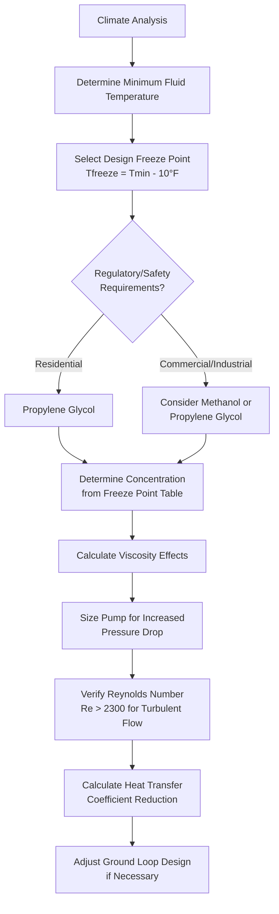

Heat transfer fluids circulate through ground loop heat exchangers to transport thermal energy between the earth and the heat pump. Fluid selection balances freeze protection requirements, heat transfer efficiency, pumping power consumption, material compatibility, and environmental safety.

## Freeze Protection Fundamentals

The ground loop fluid must remain liquid at the minimum expected soil temperature to prevent system damage from freezing. Freeze point depression follows colligative properties, where antifreeze concentration determines the crystallization temperature.

The freeze point depression $\Delta T_f$ relates to molal concentration through:

$$\Delta T_f = K_f \cdot m \cdot i$$

where $K_f$ is the cryoscopic constant (1.86 K·kg/mol for water), $m$ is molality (mol solute/kg solvent), and $i$ is the van't Hoff factor accounting for dissociation.

**Design freeze point:** IGSHPA standards require ground loop fluid freeze protection to at least 10°F (5.6°C) below the minimum expected fluid temperature. For most applications, this translates to freeze protection between 0°F and -10°F (-18°C to -23°C).

## Propylene Glycol Solutions

Propylene glycol represents the most common antifreeze for residential and commercial ground-source heat pump systems due to its low toxicity and environmental safety.

### Concentration Requirements

| Freeze Point | Propylene Glycol (% by volume) | Density at 68°F (lb/gal) | Specific Heat (Btu/lb·°F) |
|--------------|--------------------------------|--------------------------|---------------------------|
| 32°F (0°C)   | 0%                            | 8.34                     | 1.000                     |
| 26°F (-3°C)  | 10%                           | 8.42                     | 0.990                     |
| 18°F (-8°C)  | 20%                           | 8.50                     | 0.970                     |
| 10°F (-12°C) | 25%                           | 8.55                     | 0.960                     |
| 0°F (-18°C)  | 30%                           | 8.60                     | 0.945                     |
| -10°F (-23°C)| 35%                           | 8.66                     | 0.930                     |
| -20°F (-29°C)| 40%                           | 8.71                     | 0.910                     |

**Typical design concentration:** 20-30% propylene glycol provides adequate freeze protection for most climates while minimizing viscosity penalties and maintaining acceptable heat transfer characteristics.

### Viscosity and Pumping Effects

Propylene glycol increases fluid viscosity significantly, requiring higher pumping power. Dynamic viscosity $\mu$ affects both pressure drop and heat transfer coefficient.

The pressure drop in circular pipes follows the Darcy-Weisbach equation:

$$\Delta P = f \cdot \frac{L}{D} \cdot \frac{\rho v^2}{2}$$

where friction factor $f$ depends on Reynolds number $Re = \frac{\rho v D}{\mu}$. Increased viscosity reduces Reynolds number, potentially shifting flow from turbulent to transitional regime.

**Viscosity comparison at 40°F (4.4°C):**

| Fluid                      | Dynamic Viscosity (cP) | Relative to Water |
|----------------------------|------------------------|-------------------|
| Water                      | 1.55                   | 1.0×              |
| 20% Propylene Glycol       | 2.85                   | 1.8×              |
| 30% Propylene Glycol       | 4.20                   | 2.7×              |
| 40% Propylene Glycol       | 6.50                   | 4.2×              |

Pumping power increases approximately proportional to viscosity ratio for turbulent flow, meaning 30% propylene glycol requires 2.7× the pumping power of water at the same flow rate and pipe geometry.

### Heat Transfer Impact

Higher viscosity reduces convective heat transfer coefficient $h$ through decreased Reynolds number. The Gnielinski correlation for turbulent flow in pipes demonstrates this relationship:

$$Nu = \frac{(f/8)(Re-1000)Pr}{1+12.7(f/8)^{0.5}(Pr^{2/3}-1)}$$

where $Nu = \frac{hD}{k}$ is Nusselt number and $Pr = \frac{c_p\mu}{k}$ is Prandtl number.

Additionally, propylene glycol reduces fluid specific heat by approximately 5-10%, requiring higher mass flow rates to transport equivalent thermal energy:

$$\dot{Q} = \dot{m} \cdot c_p \cdot \Delta T$$

The combined effect typically reduces overall heat transfer coefficient by 10-20% compared to water.

## Methanol Solutions

Methanol (methyl alcohol) provides superior freeze protection performance with minimal viscosity increase, but safety concerns limit residential applications.

### Performance Characteristics

**Advantages:**
- Lower viscosity than glycol at equivalent freeze points (approximately 50% of propylene glycol viscosity)
- Higher thermal conductivity maintains better heat transfer
- Lower cost per gallon of antifreeze protection
- Less pumping power required

**Disadvantages:**
- Toxic if ingested (LD50: 5,628 mg/kg vs. 20,000 mg/kg for propylene glycol)
- Flammable (flash point: 52°F/11°C)
- Higher vapor pressure requires sealed systems
- More aggressive corrosion characteristics require robust inhibitor packages

| Freeze Point | Methanol (% by volume) | Viscosity at 40°F (cP) |
|--------------|------------------------|------------------------|
| 10°F (-12°C) | 18%                    | 1.90                   |
| 0°F (-18°C)  | 22%                    | 2.05                   |
| -10°F (-23°C)| 27%                    | 2.25                   |
| -20°F (-29°C)| 32%                    | 2.50                   |

IGSHPA standards permit methanol in commercial/industrial applications with proper safety protocols but generally recommend propylene glycol for residential installations.

## Ethanol Solutions

Ethanol (ethyl alcohol) offers similar freeze protection to methanol with reduced toxicity, though still considered flammable.

**Concentration for 0°F protection:** Approximately 24% ethanol by volume

Ethanol presents an intermediate option between propylene glycol and methanol, with lower viscosity than propylene glycol but higher safety concerns requiring sealed systems and proper ventilation.

## System Design Considerations

### Pumping Power Calculation

The additional pumping power required for antifreeze solution:

$$P_{pump} = \frac{\dot{V} \cdot \Delta P}{\eta_{pump}}$$

where $\dot{V}$ is volumetric flow rate, $\Delta P$ is total pressure drop, and $\eta_{pump}$ is pump efficiency.

For a typical residential system with 30% propylene glycol vs. water:
- Pressure drop increase: 2.7×
- Volumetric flow increase (lower specific heat): 1.05×
- Total pump power increase: approximately 2.8×

This translates to an additional 50-150 watts for typical residential ground loop pumps.

## Corrosion Inhibitors

All antifreeze solutions require corrosion inhibitor packages to protect system materials. Propylene glycol and methanol solutions typically contain:

- **Sodium benzoate:** General corrosion inhibitor
- **Sodium nitrite:** Ferrous metal protection
- **Sodium nitrate:** Aluminum protection
- **Sodium tetraborate:** pH buffer and inhibitor
- **Sodium tolyltriazole:** Copper and brass protection

**Inhibitor depletion:** Annual testing recommended to verify pH (8.0-10.5 for propylene glycol) and inhibitor concentrations. Replace fluid when pH drops below 7.5 or every 5-10 years regardless of testing results.

## Environmental and Safety Considerations

### Propylene Glycol Safety

Propylene glycol receives "Generally Recognized As Safe" (GRAS) status from FDA for food applications and presents minimal environmental hazard:

- **Toxicity:** LD50 oral (rat) = 20,000 mg/kg (very low toxicity)
- **Biodegradability:** Readily biodegradable (BOD5/COD > 0.5)
- **Aquatic toxicity:** LC50 (fish, 96hr) > 10,000 mg/L (practically non-toxic)
- **Groundwater protection:** Acceptable for open-loop systems and areas with groundwater concerns

### Methanol Safety

Methanol requires strict handling protocols:

- **Toxicity:** LD50 oral (rat) = 5,628 mg/kg (moderate toxicity)
- **Flammability:** Flash point 52°F requires sealed systems
- **Ventilation:** Required in mechanical rooms
- **Spill response:** Immediate containment and cleanup procedures necessary
- **Regulatory restrictions:** Prohibited in some jurisdictions for residential ground loops

### Leak Detection and Monitoring

Ground loop systems should include:

1. **Pressure monitoring:** Continuous monitoring to detect leaks
2. **Flow verification:** Annual flow rate measurement
3. **Fluid sampling:** Test antifreeze concentration and pH annually
4. **System inspection:** Visual inspection of accessible piping and connections

## Fluid Selection Decision Matrix

| Criterion                  | Water Only | Propylene Glycol | Methanol | Ethanol |
|----------------------------|------------|------------------|----------|---------|
| Freeze Protection          | Poor       | Good             | Excellent| Good    |
| Environmental Safety       | Excellent  | Excellent        | Poor     | Good    |
| Heat Transfer Efficiency   | Excellent  | Good             | Very Good| Good    |
| Pumping Power             | Lowest     | Moderate         | Low      | Low     |
| Cost                       | Lowest     | Moderate         | Low      | Moderate|
| Residential Applications   | Limited    | Preferred        | Restricted| Acceptable|
| Commercial Applications    | Limited    | Acceptable       | Common   | Acceptable|

## Maintenance and Fluid Testing

**Annual testing protocol (IGSHPA recommendations):**

1. **Freeze point test:** Refractometer or hydrometer measurement
2. **pH measurement:** Target 8.0-10.5 for propylene glycol
3. **Visual inspection:** Check for color change, sediment, or odor
4. **Concentration adjustment:** Add antifreeze if concentration drops below design value
5. **Complete replacement:** Every 5-10 years or when pH cannot be restored

**Signs requiring immediate fluid replacement:**
- pH below 7.0
- Significant color change (dark brown or black indicates oxidation)
- Sediment or particulate matter
- System corrosion evidence

## Performance Optimization

To minimize the performance penalty of antifreeze solutions:

1. **Use minimum necessary concentration:** Don't over-protect beyond design requirements
2. **Maintain proper flow rates:** Higher Reynolds numbers improve heat transfer
3. **Select larger pipe diameters:** Reduces pressure drop penalties
4. **Use high-efficiency pumps:** ECM pumps minimize energy consumption
5. **Regular maintenance:** Maintain inhibitor concentrations and pH levels
6. **Monitor performance:** Track entering/leaving fluid temperatures and flow rates

The selection and maintenance of ground loop heat transfer fluids directly impacts system efficiency, reliability, and operating cost. Propylene glycol solutions at 20-30% concentration provide the optimal balance for most residential and commercial ground-source heat pump installations, while methanol may be appropriate for industrial applications where environmental and safety protocols can be strictly maintained.
