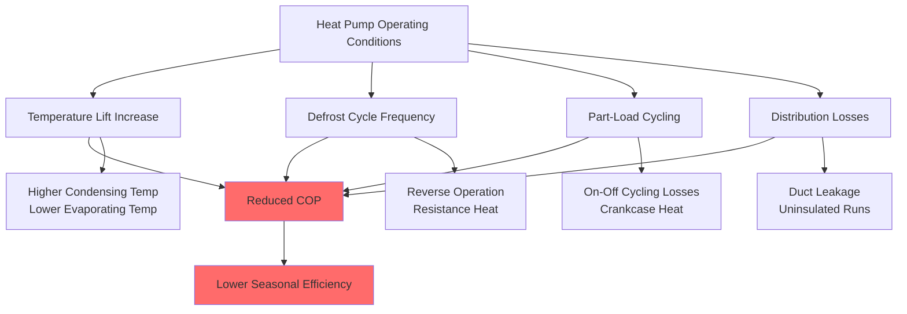

Heat pump performance metrics quantify the thermodynamic efficiency of converting electrical energy into heating or cooling capacity. Understanding these metrics is critical for equipment selection, energy modeling, and regulatory compliance.

## Coefficient of Performance (COP)

COP represents the instantaneous thermodynamic efficiency of a heat pump, defined as the ratio of useful heating or cooling output to electrical energy input:

$$\text{COP}_{\text{heating}} = \frac{Q_{\text{heating}}}{W_{\text{electrical}}} = \frac{Q_{\text{heating}}}{Q_{\text{heating}} - Q_{\text{cooling}}}$$

$$\text{COP}_{\text{cooling}} = \frac{Q_{\text{cooling}}}{W_{\text{electrical}}} = \frac{Q_{\text{cooling}}}{Q_{\text{heating}} - Q_{\text{cooling}}}$$

Where $Q_{\text{heating}}$ is condenser heat rejection, $Q_{\text{cooling}}$ is evaporator heat absorption, and $W_{\text{electrical}}$ is compressor power plus auxiliary loads.

### Theoretical Carnot COP

The theoretical maximum COP for a reversible heat pump operating between two thermal reservoirs is:

$$\text{COP}_{\text{Carnot,heating}} = \frac{T_{\text{condenser}}}{T_{\text{condenser}} - T_{\text{evaporator}}}$$

$$\text{COP}_{\text{Carnot,cooling}} = \frac{T_{\text{evaporator}}}{T_{\text{condenser}} - T_{\text{evaporator}}}$$

Where temperatures are absolute (Kelvin). Real heat pumps achieve 30-60% of Carnot efficiency due to irreversibilities: compressor inefficiency, pressure drops, heat exchanger temperature differentials, and superheat/subcooling requirements.

### Standard Rating Points

AHRI Standard 210/240 specifies COP rating conditions:

| Operating Mode | Outdoor Temperature | Indoor Temperature | Application |
|---|---|---|---|
| Heating (H1) | 47°F DB / 43°F WB | 70°F DB | Moderate heating |
| Heating (H2) | 17°F DB / 15°F WB | 70°F DB | Cold climate |
| Heating (H3) | 5°F DB | 70°F DB | Extreme cold |
| Cooling (A) | 95°F DB / 75°F WB | 80°F DB / 67°F WB | Standard cooling |

At 47°F outdoor temperature, efficient heat pumps achieve COP values of 3.0-4.5, meaning they deliver 3-4.5 units of heat for every unit of electricity consumed. At 17°F, COP typically degrades to 2.0-3.0 due to increased temperature lift and reduced refrigerant mass flow.

## Seasonal Performance Metrics

Seasonal metrics account for part-load operation, cycling losses, defrost cycles, and variable outdoor temperatures throughout the heating or cooling season.

### Heating Seasonal Performance Factor (HSPF)

HSPF represents the total heating output during a typical heating season divided by total electrical energy consumed, expressed in Btu/Wh:

$$\text{HSPF} = \frac{\sum Q_{\text{heating,seasonal}}}{\sum W_{\text{electrical,seasonal}}}$$

AHRI Standard 210/240 defines HSPF calculation using a bin method that weights performance at different outdoor temperatures by hours of occurrence in six climatic regions (I through VI, representing varying heating severity).

**HSPF2 Rating (DOE 2023 Standard):**

The updated HSPF2 metric uses more representative test conditions:

- Lower indoor temperature set point (68°F vs 70°F)
- Additional low-temperature test point (5°F)
- Updated geographic bin data
- Includes distribution system losses

HSPF2 values are typically 15-20% lower numerically than legacy HSPF, though they represent the same equipment. Minimum federal efficiency standards (effective January 2023):
- Split systems: HSPF2 ≥ 7.5 (equivalent to HSPF ≈ 8.8)
- Package systems: HSPF2 ≥ 6.7 (equivalent to HSPF ≈ 8.0)

### Regional HSPF Variations

Heat pump seasonal performance varies by climate region:

| AHRI Region | Representative City | Heating Hours | Typical HSPF Impact |
|---|---|---|---|
| Region I | Miami, FL | 200 HDD65 | Minimal heating |
| Region II | Phoenix, AZ | 1400 HDD65 | Moderate heating |
| Region III | Atlanta, GA | 2900 HDD65 | Standard heating |
| Region IV | Baltimore, MD | 4700 HDD65 | Primary heating |
| Region V | Chicago, IL | 6600 HDD65 | Extended heating |
| Region VI | Minneapolis, MN | 8400 HDD65 | Severe heating |

The same heat pump rated at HSPF2 = 8.5 in Region IV may deliver effective seasonal performance of HSPF2 = 7.0 in Region VI due to extended low-temperature operation where COP degrades.

### Seasonal Energy Efficiency Ratio (SEER)

SEER quantifies cooling-mode seasonal efficiency using the same bin methodology:

$$\text{SEER} = \frac{\sum Q_{\text{cooling,seasonal}}}{\sum W_{\text{electrical,seasonal}}}$$

**SEER2 Rating (DOE 2023 Standard):**

The updated SEER2 metric incorporates:
- Higher external static pressure (0.5 in. w.c. vs 0.1 in. w.c.)
- Lower indoor air flow (280-360 CFM/ton vs 300-450 CFM/ton)
- Updated test procedures

Minimum federal efficiency (effective January 2023):
- Northern states: SEER2 ≥ 13.4
- Southern states: SEER2 ≥ 14.3

High-efficiency equipment achieves SEER2 = 18-22 through variable-speed compressors, enhanced heat exchangers, and optimized refrigerant charge.

### Energy Efficiency Ratio (EER)

EER measures steady-state cooling efficiency at peak load conditions (95°F outdoor, 80°F/67°F indoor):

$$\text{EER} = \frac{Q_{\text{cooling,95F}}}{W_{\text{electrical,95F}}}$$

EER correlates with peak demand reduction and is critical for grid reliability. High-efficiency systems maintain EER ≥ 11-13 at design conditions.

## Integrated Part-Load Value (IPLV)

IPLV characterizes commercial heat pump efficiency across four load points weighted by typical operating hours:

$$\text{IPLV} = 0.01A + 0.42B + 0.45C + 0.12D$$

Where:
- A = EER at 100% load
- B = EER at 75% load
- C = EER at 50% load
- D = EER at 25% load

IPLV typically exceeds full-load EER by 15-30% for variable-capacity equipment, demonstrating superior part-load efficiency.

## Performance Degradation Mechanisms

### Temperature Lift Impact

Heat pump capacity and efficiency degrade with increasing temperature differential between source and sink. For air-source heat pumps, a 1°F increase in temperature lift typically reduces COP by 1-2%:

$$\frac{d(\text{COP})}{d(\Delta T)} \approx -0.01 \text{ to } -0.02 \text{ per °F}$$

This relationship explains why heat pumps excel in moderate climates but require supplemental heat in extreme cold.

### Defrost Penalty

Frost accumulation on outdoor coils when operating below 40°F with high humidity requires periodic defrost cycles. During defrost:

1. Reversing valve switches to cooling mode
2. Hot refrigerant melts frost (2-10 minutes)
3. Supplemental resistance heat maintains indoor comfort
4. Energy penalty: 5-15% of heating season energy

Demand defrost controls minimize this penalty by initiating defrost only when necessary based on coil temperature differential, reducing energy waste compared to time-based defrost.

## Efficiency Comparison

| Metric | Units | Application | Strengths | Limitations |
|---|---|---|---|---|
| COP | Dimensionless | Single condition | Thermodynamically precise | Doesn't reflect seasonal use |
| HSPF/HSPF2 | Btu/Wh | Seasonal heating | Accounts for climate | Regional variation |
| SEER/SEER2 | Btu/Wh | Seasonal cooling | Part-load weighted | Fixed geographic bins |
| EER | Btu/Wh | Peak cooling | Design condition | Single operating point |
| IPLV | Btu/Wh | Commercial cooling | Part-load emphasis | Limited to 4 points |

## Conversion Relationships

Approximate conversions between metrics (equipment-dependent):

$$\text{SEER} \approx 3.41 \times \text{Average COP}_{\text{cooling}}$$

$$\text{HSPF} \approx 3.41 \times \text{Average COP}_{\text{heating}}$$

$$\text{EER} = 3.41 \times \text{COP}_{\text{95F}}$$

The factor 3.41 converts COP (dimensionless) to Btu/Wh units. These conversions are approximations because seasonal metrics incorporate cycling, defrost, and distribution losses not captured in steady-state COP.

## Regulatory Standards

**AHRI Standard 210/240-2023** establishes test procedures and minimum efficiency requirements for unitary air conditioners and heat pumps. **DOE 10 CFR Part 430** mandates federal minimum efficiency standards, updated in 2023 to improve national energy savings by approximately 3 quadrillion Btu over 30 years.

Equipment selection should consider both minimum regulatory compliance and life-cycle cost optimization, where higher initial efficiency investment yields long-term energy savings that offset premium first costs.

## Components

- Heating Seasonal Performance Factor
- Hspf Calculation Regions
- Region Iv Hspf
- Region V Hspf
- Coefficient Of Performance Heating
- Cop At 47f
- Cop At 17f
- Energy Efficiency Ratio Cooling
- Seasonal Energy Efficiency Ratio
- Integrated Part Load Value
