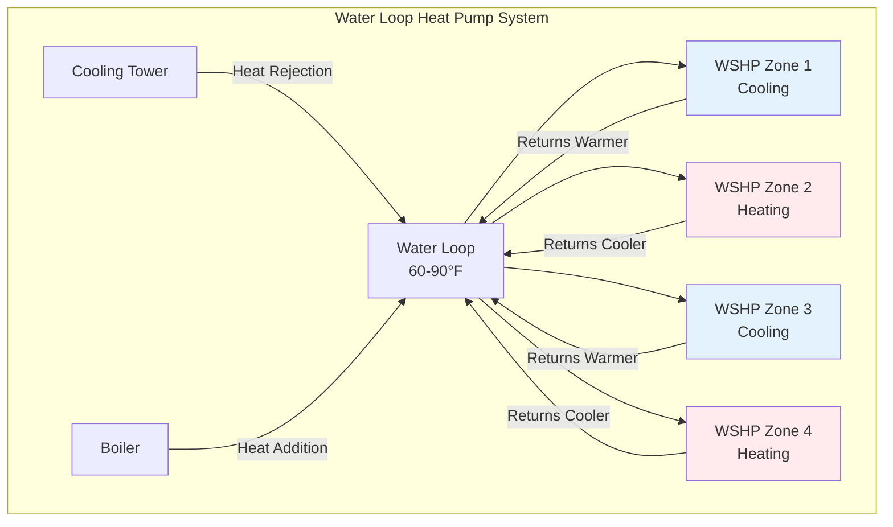

Water-source heat pumps (WSHPs) represent a significant advancement in building HVAC efficiency by utilizing a circulating water loop as both a heat source and heat sink. Unlike air-source systems, WSHPs extract or reject heat to a central water loop operating in the 60-90°F range, enabling simultaneous heating and cooling in different zones while recovering energy that would otherwise be wasted.

## Fundamental Operating Principles

The thermodynamic advantage of water-source systems stems from the stable temperature of the water loop compared to outdoor air. The coefficient of performance for a heat pump operating in cooling mode is:

$$\text{COP}_c = \frac{Q_c}{W} = \frac{Q_c}{Q_h - Q_c}$$

where $Q_c$ is cooling capacity, $Q_h$ is heat rejection, and $W$ is compressor work. In heating mode:

$$\text{COP}_h = \frac{Q_h}{W} = \frac{Q_h}{Q_h - Q_c}$$

The entering water temperature (EWT) directly affects these performance metrics. A WSHP operating with 85°F EWT in cooling mode achieves COP values of 4.0-5.5, compared to 2.5-3.5 for air-cooled systems operating at 95°F outdoor conditions. This improvement follows Carnot efficiency principles:

$$\eta_{\text{Carnot}} = 1 - \frac{T_c}{T_h}$$

Smaller temperature differentials between heat source and sink ($T_h - T_c$) yield higher theoretical and actual efficiency.

## Water Loop Heat Pump Configurations

### Closed-Loop Systems

The most common WSHP application uses a closed circulating water loop serving multiple decentralized heat pump units. Each unit operates independently based on zone requirements, either extracting heat (cooling mode) or rejecting heat (heating mode) to the loop.

The water loop temperature is maintained within operating limits by:

- **Cooling Tower/Fluid Cooler**: Activated when loop temperature exceeds upper setpoint (typically 85-90°F)
- **Boiler**: Activated when loop temperature falls below lower setpoint (typically 60-65°F)

Loop flow rate sizing follows standard hydronic principles:

$$\dot{m} = \frac{Q_{\text{total}}}{c_p \Delta T}$$

For a building with 1000 tons total capacity and 10°F design $\Delta T$:

$$\dot{m} = \frac{1000 \times 12000 \text{ Btu/h}}{1.0 \text{ Btu/lb·°F} \times 10°F} = 1,200,000 \text{ lb/h} = 2400 \text{ gpm}$$

### Open-Loop Systems

Open-loop configurations extract water from natural sources (lakes, rivers, aquifers) and discharge after heat exchange. The economics depend on water availability and regulatory constraints:

| Parameter | Closed-Loop | Open-Loop |
|-----------|-------------|-----------|
| Water Temperature Stability | Moderate (60-90°F) | Excellent (45-75°F) |
| Initial Cost | Higher (piping, tower, boiler) | Lower (minimal infrastructure) |
| Operating Cost | Moderate (pumping, tower/boiler) | Low (pumping only) |
| Regulatory Complexity | Low | High (permits, discharge limits) |
| Efficiency (EER) | 13-16 | 16-22 |
| Maintenance | Routine (water treatment) | Significant (fouling, scaling) |

## Heat Recovery and Simultaneous Heating-Cooling

The fundamental advantage of WSHP systems lies in internal heat recovery. When one zone rejects 100,000 Btu/h during cooling while another zone requires 80,000 Btu/h for heating, the system transfers energy directly through the water loop without external heat rejection or addition.

The net loop load determines auxiliary equipment operation:

$$Q_{\text{net}} = \sum Q_{\text{heating}} - \sum Q_{\text{cooling}}$$

When $Q_{\text{net}} > 0$, the loop requires boiler heat addition. When $Q_{\text{net}} < 0$, cooling tower heat rejection activates. During balanced conditions ($Q_{\text{net}} \approx 0$), neither operates, maximizing system efficiency.

Consider a building with internal zones requiring year-round cooling and perimeter zones needing heating during winter:

**Winter Morning (35°F Outdoor)**
- Internal zones: 600 tons cooling (heat rejection to loop)
- Perimeter zones: 400 tons heating (heat extraction from loop)
- Net loop load: 400 - 600 = -200 tons (requires cooling tower operation at reduced capacity)

**Spring Day (55°F Outdoor)**
- Internal zones: 500 tons cooling
- Perimeter zones: 500 tons heating
- Net loop load: 0 tons (no auxiliary equipment operates)

This heat recovery reduces annual energy consumption by 20-40% compared to conventional systems with separate heating and cooling plants.

## Cooling Tower and Boiler Integration

### Cooling Tower Operation

The cooling tower maintains loop temperature through evaporative heat rejection. The heat rejection capacity follows:

$$Q_{\text{tower}} = \dot{m}_w c_p (T_{\text{in}} - T_{\text{out}}) = \dot{m}_a h_{fg} \Delta \omega$$

where $\Delta \omega$ represents the change in humidity ratio and $h_{fg}$ is the latent heat of vaporization (approximately 1050 Btu/lb at standard conditions).

Tower approach temperature (loop supply temperature minus wet-bulb temperature) affects performance:

$$\text{Approach} = T_{\text{tower outlet}} - T_{wb}$$

Typical WSHP cooling towers maintain 7-10°F approach compared to 5-7°F for conventional chiller applications due to higher operating temperatures.

### Boiler Sizing

The auxiliary boiler compensates for heating-dominated conditions. Proper sizing requires analysis of:

1. **Building Load Imbalance**: Ratio of peak heating to peak cooling
2. **Climate**: Heating degree days and ambient temperature distribution
3. **Internal Loads**: Lighting, equipment, occupancy generating continuous cooling loads

Conservative sizing approaches use:

$$Q_{\text{boiler}} = Q_{\text{heating,design}} - 0.5 \times Q_{\text{cooling,design}}$$

This accounts for partial heat recovery from internal zones during peak heating conditions.

## Performance Ratings and Standards

AHRI Standard 320 specifies performance testing for WSHPs at standardized conditions:

| Operating Mode | EWT | LWT | Airflow | Rated Capacity |
|----------------|-----|-----|---------|----------------|
| Cooling | 85°F | 95°F | 400 cfm/ton | 12,000 Btu/h |
| Heating | 70°F | 60°F | 400 cfm/ton | 12,000 Btu/h |

Modern WSHPs achieve:
- **Cooling EER**: 13-18 Btu/W·h (AHRI 320 conditions)
- **Heating COP**: 3.5-4.5 (AHRI 320 conditions)
- **Part-Load Performance**: Scroll compressors with unloading or variable-speed operation

ASHRAE Standard 90.1 mandates minimum performance levels:

- Water-source heat pumps < 17,000 Btu/h: EER ≥ 12.2 (cooling), COP ≥ 4.3 (heating)
- Water-source heat pumps ≥ 135,000 Btu/h: EER ≥ 12.0 (cooling), COP ≥ 4.2 (heating)

## Design Considerations

**Water Treatment**: Closed loops require:
- pH control (7.5-8.5 range)
- Corrosion inhibitors
- Scale preventers
- Biological growth control

**Pump Energy**: Variable-speed pumping reduces annual energy:

$$P_{\text{pump}} = \frac{\dot{V} \Delta P}{3960 \eta_p}$$

At 50% flow, affinity laws yield:

$$P_2 = P_1 \left(\frac{\dot{V}_2}{\dot{V}_1}\right)^3 = P_1 (0.5)^3 = 0.125 P_1$$

**Diversity Factor**: Rarely do all heat pumps operate at full capacity simultaneously. Typical diversity factors of 0.6-0.8 allow loop and auxiliary equipment downsizing.

## Applications and System Selection

Water-source heat pumps excel in:

- **Mixed-Use Buildings**: Hotels, hospitals, office buildings with simultaneous heating-cooling requirements
- **Renovation Projects**: Decentralized units eliminate large central equipment rooms and vertical shafts
- **Geographically Constrained Sites**: Lakefront or riverfront properties with abundant water resources
- **Occupant-Controlled Environments**: Individual zone control without complex central systems

The system's modular nature provides incremental capacity addition and inherent redundancy, making WSHPs particularly suitable for phased construction and mission-critical facilities requiring high reliability.
