Energy consumption patterns in buildings reveal critical relationships between system design, operational practices, and resource utilization. Understanding these patterns enables targeted efficiency improvements and informed design decisions across all building sectors.

## Overview of Building Energy Consumption

Building energy consumption represents approximately 40% of total U.S. primary energy use according to DOE data. HVAC systems account for the largest share of this consumption, typically ranging from 40% to 60% depending on building type, climate zone, and operational characteristics.

The fundamental metric for characterizing energy consumption is energy use intensity (EUI):

$$
\text{EUI} = \frac{E_{\text{annual}}}{A_{\text{floor}}}
$$

where $E_{\text{annual}}$ represents annual energy consumption (kWh or kBtu) and $A_{\text{floor}}$ is the gross floor area (ft² or m²). This normalized metric facilitates comparisons across buildings of different sizes and types.

## Sectoral Energy Consumption

Energy consumption patterns vary significantly across building sectors based on occupancy characteristics, operating schedules, and functional requirements.

| Sector | Annual EUI Range | HVAC Share | Primary Drivers |
|--------|------------------|------------|-----------------|
| Residential | 50-80 kBtu/ft²-yr | 45-55% | Heating, cooling, envelope quality |
| Office | 70-110 kBtu/ft²-yr | 40-50% | Lighting, plug loads, ventilation |
| Retail | 90-140 kBtu/ft²-yr | 35-45% | Extended hours, lighting, displays |
| Healthcare | 200-350 kBtu/ft²-yr | 45-60% | Continuous operation, strict requirements |
| Education | 60-100 kBtu/ft²-yr | 40-50% | Ventilation, seasonal schedules |
| Warehouse | 30-60 kBtu/ft²-yr | 20-35% | Minimal conditioning, high ceilings |

### Residential Sector Characteristics

Single-family and multifamily residential buildings exhibit consumption patterns driven primarily by space conditioning needs. The residential sector consumed approximately 21.5 quadrillion Btu in 2022 (EIA data), with space heating representing 42%, space cooling 9%, and water heating 18% of total consumption.

Space heating energy consumption depends on heating degree days (HDD):

$$
Q_{\text{heating}} = \frac{UA \cdot \text{HDD} \cdot 24}{\eta_{\text{heating}}}
$$

where $U$ is the overall heat transfer coefficient (Btu/hr-ft²-°F), $A$ is the building envelope area (ft²), HDD is heating degree days (°F-days), and $\eta_{\text{heating}}$ is the heating system efficiency (decimal).

### Commercial Sector Characteristics

Commercial buildings consumed approximately 18.8 quadrillion Btu in 2022, with significantly different end-use distributions than residential. Internal gains from occupants, equipment, and lighting play a larger role in the energy balance, often shifting the dominant load from heating to cooling in many climate zones.

The commercial sector demonstrates higher cooling-to-heating energy ratios:

$$
\text{CHR} = \frac{E_{\text{cooling}}}{E_{\text{heating}}}
$$

Typical CHR values range from 0.3 in cold climates to 3.0 in hot climates, reflecting both climate conditions and internal load characteristics.

## End-Use Energy Profiles

Breaking down consumption by end use reveals opportunities for targeted efficiency improvements. HVAC-related end uses dominate in most building types:

**HVAC End-Use Distribution (Typical Office Building):**
- Space heating: 25-35%
- Space cooling: 15-25%
- Ventilation fans: 8-12%
- Pumps: 3-5%
- Heating water: 5-10%

**Non-HVAC End Uses:**
- Lighting: 20-25%
- Plug loads: 15-25%
- Refrigeration: 2-5%
- Elevators/escalators: 2-4%

The heating-to-cooling energy ratio provides insight into climate-specific patterns:

$$
\text{HCR} = \frac{E_{\text{heating}}}{E_{\text{cooling}}} = \frac{\text{HDD} \cdot (U_{\text{total}}/\eta_{\text{h}})}{\text{CDD} \cdot (\text{SHGC} + U_{\text{total}} + q_{\text{internal}})/\text{EER}}
$$

where CDD is cooling degree days, SHGC represents solar heat gain characteristics, $q_{\text{internal}}$ is internal heat generation, and EER is the cooling system efficiency.

## Temporal Consumption Patterns

Energy consumption varies across multiple time scales, creating distinct patterns that influence system design and operation.

### Seasonal Variations

Seasonal patterns reflect the dominant influence of outdoor air temperature on HVAC loads. Peak consumption typically occurs during summer months in cooling-dominated climates and winter months in heating-dominated climates.

The seasonal load factor quantifies this variation:

$$
\text{SLF} = \frac{E_{\text{average,month}}}{E_{\text{peak,month}}}
$$

Values typically range from 0.4 to 0.7, with lower values indicating greater seasonal variation and higher peak demands.

### Daily Load Profiles

Daily consumption patterns follow occupancy and outdoor temperature cycles. Commercial buildings exhibit pronounced diurnal patterns with peak loads occurring during occupied hours, typically 10:00 AM to 4:00 PM.

The daily load factor characterizes this variation:

$$
\text{DLF} = \frac{P_{\text{average,day}}}{P_{\text{peak,day}}}
$$

Residential buildings show different patterns, with evening peaks reflecting occupant return and morning warm-up loads.

### Peak Demand Characteristics

Peak demand periods drive utility infrastructure requirements and electricity pricing structures. The load factor relates average to peak demand:

$$
\text{LF} = \frac{E_{\text{total}}/t}{P_{\text{peak}}} = \frac{\bar{P}}{P_{\text{peak}}}
$$

where $E_{\text{total}}$ is total energy consumed over time period $t$, $\bar{P}$ is average power, and $P_{\text{peak}}$ is peak power demand.

Typical annual load factors range from 0.5 to 0.7 for commercial buildings and 0.3 to 0.5 for residential buildings, indicating significant capacity installed to meet relatively brief peak conditions.

```mermaid
graph TD
    A[Energy Consumption Analysis] --> B[Sectoral Analysis]
    A --> C[End-Use Analysis]
    A --> D[Temporal Analysis]

    B --> B1[Residential]
    B --> B2[Commercial]
    B --> B3[Industrial]

    B1 --> B1a[Space Heating 42%]
    B1 --> B1b[Space Cooling 9%]
    B1 --> B1c[Water Heating 18%]
    B1 --> B1d[Other 31%]

    B2 --> B2a[HVAC 40-60%]
    B2 --> B2b[Lighting 20-25%]
    B2 --> B2c[Plug Loads 15-25%]

    C --> C1[HVAC Systems]
    C --> C2[Lighting]
    C --> C3[Equipment]

    C1 --> C1a[Heating Energy]
    C1 --> C1b[Cooling Energy]
    C1 --> C1c[Ventilation]
    C1 --> C1d[Pumping]

    D --> D1[Seasonal Patterns]
    D --> D2[Daily Profiles]
    D --> D3[Peak Demand]

    D1 --> D1a[HDD Analysis]
    D1 --> D1b[CDD Analysis]

    D2 --> D2a[Occupied Hours]
    D2 --> D2b[Unoccupied Hours]

    D3 --> D3a[Summer Peak]
    D3 --> D3b[Winter Peak]
    D3 --> D3c[Load Factor]

    style A fill:#f9f,stroke:#333,stroke-width:3px
    style B fill:#bbf,stroke:#333,stroke-width:2px
    style C fill:#bfb,stroke:#333,stroke-width:2px
    style D fill:#fbb,stroke:#333,stroke-width:2px
```

## Energy Intensity Metrics

Beyond simple EUI, several metrics characterize consumption patterns and efficiency:

**Source Energy Intensity:**

$$
\text{SEI} = \frac{E_{\text{source}}}{A_{\text{floor}}}
$$

where $E_{\text{source}}$ accounts for generation and transmission losses, providing a more complete picture of primary energy consumption.

**Weather-Normalized EUI:**

$$
\text{EUI}_{\text{norm}} = \text{EUI}_{\text{actual}} \cdot \frac{\text{HDD}_{\text{typical}} + \text{CDD}_{\text{typical}}}{\text{HDD}_{\text{actual}} + \text{CDD}_{\text{actual}}}
$$

This normalization removes weather variation effects, enabling year-to-year comparisons and benchmarking.

## Data Sources and Analysis Methods

The U.S. Energy Information Administration (EIA) provides comprehensive consumption data through:

- Commercial Buildings Energy Consumption Survey (CBECS): Detailed end-use data for commercial buildings
- Residential Energy Consumption Survey (RECS): Household energy consumption patterns
- Monthly Energy Review: Aggregate sectoral consumption data

The U.S. Department of Energy (DOE) Building Performance Database contains measured consumption data from thousands of buildings, enabling statistical analysis of actual performance versus design predictions.

Understanding these consumption patterns informs system design, retrofit priorities, and operational optimization strategies. The temporal and end-use characteristics reveal where energy is consumed and when, directing efficiency investments toward maximum impact opportunities.
