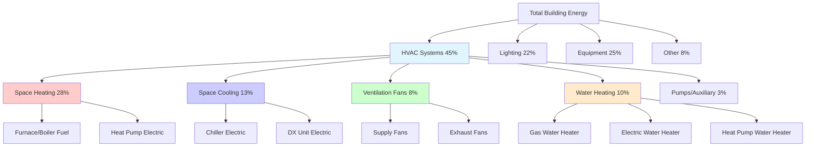

Energy end-use profiles quantify the distribution of total building energy consumption across individual HVAC components and systems. Understanding these profiles enables targeted efficiency improvements and accurate energy modeling for both residential and commercial facilities.

## Building Energy End-Use Distribution

The U.S. Energy Information Administration (EIA) Commercial Buildings Energy Consumption Survey (CBECS) and Residential Energy Consumption Survey (RECS) provide comprehensive data on energy consumption patterns across building types and climate zones.

### Total Building Energy Breakdown

Total building energy consumption is partitioned into discrete end-use categories:

$$E_{total} = E_{heating} + E_{cooling} + E_{ventilation} + E_{water\_heating} + E_{lighting} + E_{equipment} + E_{other}$$

For HVAC-specific analysis, the HVAC energy fraction is:

$$f_{HVAC} = \frac{E_{heating} + E_{cooling} + E_{ventilation}}{E_{total}}$$

In typical commercial buildings, HVAC systems account for 40-60% of total energy consumption, while residential buildings range from 50-70% depending on climate zone and building envelope performance.

## HVAC End-Use Categories

### Heating Energy

Heating represents the largest single HVAC end use in most climates. The heating energy proportion varies significantly by climate:

$$E_{heating} = \sum_{i=1}^{n} Q_{heating,i} \cdot \frac{1}{\eta_{heating,i}}$$

where $Q_{heating,i}$ is the heating load for period $i$ and $\eta_{heating,i}$ is the system efficiency.

**Climate Zone Impact:**
- Cold climates (Zones 6-7): 35-50% of total building energy
- Mixed climates (Zones 4-5): 20-35% of total building energy
- Hot climates (Zones 1-3): 5-15% of total building energy

### Cooling Energy

Cooling energy consumption depends on internal loads, solar gains, and outdoor conditions:

$$E_{cooling} = \sum_{i=1}^{n} \frac{Q_{cooling,i}}{COP_i}$$

where $COP_i$ is the coefficient of performance at operating condition $i$.

**Typical Proportions:**
- Hot-humid climates: 25-40% of total building energy
- Hot-dry climates: 20-35% of total building energy
- Mixed climates: 10-20% of total building energy
- Cold climates: 5-10% of total building energy

### Ventilation Energy

Ventilation energy includes fan power for supply air, return air, exhaust air, and outside air delivery:

$$E_{ventilation} = \sum_{i=1}^{n} P_{fan,i} \cdot t_i$$

where $P_{fan,i}$ is the fan power and $t_i$ is the operating duration.

Ventilation typically represents 5-15% of total HVAC energy in commercial buildings with mechanical ventilation systems. Demand-controlled ventilation can reduce this consumption by 20-40%.

### Water Heating Energy

While not always classified under HVAC, water heating represents significant energy consumption in many building types:

$$E_{water\_heating} = \frac{m \cdot c_p \cdot \Delta T}{\eta_{WH}}$$

where $m$ is water mass, $c_p$ is specific heat, $\Delta T$ is temperature rise, and $\eta_{WH}$ is water heater efficiency.

Water heating ranges from 10-20% of total energy in residential buildings and 5-15% in commercial buildings, with higher proportions in healthcare, hospitality, and food service facilities.

## End-Use Energy Tables by Building Type

### Commercial Building End-Use Distribution

| End Use Category | Office Buildings | Retail | Healthcare | Education | Warehouse |
|------------------|------------------|--------|------------|-----------|-----------|
| Heating | 25% | 22% | 18% | 28% | 35% |
| Cooling | 12% | 15% | 14% | 10% | 5% |
| Ventilation | 8% | 6% | 12% | 9% | 4% |
| Water Heating | 3% | 4% | 12% | 5% | 2% |
| Lighting | 25% | 30% | 18% | 22% | 18% |
| Equipment | 22% | 18% | 22% | 21% | 28% |
| Other | 5% | 5% | 4% | 5% | 8% |

### Residential Building End-Use Distribution

| End Use Category | Single-Family | Multi-Family | Mobile Home |
|------------------|---------------|--------------|-------------|
| Space Heating | 42% | 35% | 48% |
| Space Cooling | 16% | 18% | 14% |
| Water Heating | 18% | 20% | 16% |
| Lighting | 6% | 8% | 6% |
| Appliances | 14% | 15% | 12% |
| Electronics | 4% | 4% | 4% |

*Source: EIA CBECS 2018 and RECS 2020 data*

## HVAC Energy Flow Diagram

## Energy Intensity by End Use

Energy use intensity (EUI) normalizes consumption by building area:

$$EUI_{end-use} = \frac{E_{end-use}}{A_{floor}} \quad [kBtu/ft^2 \cdot yr \text{ or } kWh/m^2 \cdot yr]$$

**Typical Commercial Building EUI by End Use (kBtu/ft²·yr):**

| Building Type | Heating | Cooling | Ventilation | Water Heating | Total HVAC |
|---------------|---------|---------|-------------|---------------|------------|
| Small Office | 15-25 | 8-12 | 5-8 | 2-4 | 30-49 |
| Large Office | 12-18 | 10-15 | 8-12 | 2-3 | 32-48 |
| Retail | 18-28 | 12-18 | 4-7 | 3-5 | 37-58 |
| School | 22-35 | 8-14 | 6-10 | 4-7 | 40-66 |
| Hospital | 25-40 | 15-25 | 12-20 | 15-25 | 67-110 |
| Restaurant | 35-55 | 20-30 | 10-15 | 25-40 | 90-140 |

## Factors Affecting End-Use Proportions

**Climate Zone:** Heating dominates in cold climates, while cooling dominates in hot climates. Mixed climates show more balanced heating and cooling loads.

**Building Envelope:** High-performance envelopes reduce both heating and cooling proportions, increasing the relative importance of ventilation, plug loads, and process energy.

**Occupancy Patterns:** High-density occupancy increases ventilation energy requirements and internal heat gains, shifting the balance between heating and cooling.

**System Efficiency:** Equipment efficiency directly impacts end-use proportions. A low-efficiency heating system consumes disproportionate energy relative to its useful output.

**Operating Schedules:** Extended operating hours increase fan energy consumption and can shift peak loads, affecting the relative proportions of heating, cooling, and ventilation energy.

## Application to Energy Audits

End-use profiles guide energy audit priorities by identifying the largest energy consumers. Measurement and verification protocols compare pre- and post-retrofit end-use distributions to quantify savings:

$$\Delta E_{end-use} = E_{baseline,end-use} - E_{post-retrofit,end-use}$$

Building energy modeling software uses end-use profiles to validate simulation accuracy against metered data, with acceptable calibration typically requiring agreement within 5-15% for major end uses per ASHRAE Guideline 14.

Understanding end-use profiles enables engineers to target efficiency measures where they deliver maximum impact, optimize system designs for specific building types and climates, and establish realistic energy reduction goals based on empirical consumption data.
