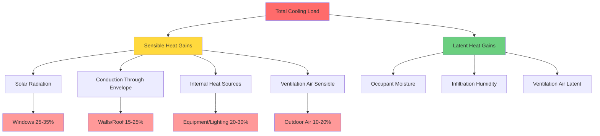

## Overview

Cooling energy represents one of the largest and fastest-growing components of building energy consumption, accounting for approximately 15-20% of total electricity use in residential buildings and up to 40% in commercial buildings located in hot climates. According to the U.S. Energy Information Administration (EIA), space cooling consumed approximately 430 billion kWh annually in the residential sector and 290 billion kWh in the commercial sector as of 2023. The Department of Energy (DOE) projects continued growth in cooling demand driven by climate change, urbanization, and rising living standards.

## Cooling Load Factors

Cooling loads result from multiple simultaneous heat gains that HVAC systems must counteract to maintain indoor comfort. Understanding these factors is essential for predicting energy consumption patterns.

## Cooling Degree Days

Cooling degree days (CDD) quantify the relationship between outdoor temperature and cooling energy demand. The standard calculation uses a base temperature of 65°F (18.3°C):

$$
\text{CDD} = \sum_{i=1}^{n} \max(T_{\text{avg},i} - T_{\text{base}}, 0)
$$

Where:
- $T_{\text{avg},i}$ = average outdoor temperature on day $i$ (°F)
- $T_{\text{base}}$ = base temperature, typically 65°F
- $n$ = number of days in the period

The relationship between cooling energy and CDD is approximately linear for a given building:

$$
E_{\text{cooling}} = E_{\text{base}} + k \cdot \text{CDD}
$$

Where:
- $E_{\text{cooling}}$ = total cooling energy consumption (kWh)
- $E_{\text{base}}$ = base energy use independent of cooling
- $k$ = slope coefficient relating energy to CDD (kWh/CDD)

## Energy Efficiency Ratio

The Energy Efficiency Ratio (EER) measures steady-state cooling efficiency at a single operating condition (typically 95°F outdoor, 80°F indoor dry-bulb, 67°F wet-bulb):

$$
\text{EER} = \frac{Q_{\text{cooling}}}{P_{\text{input}}} = \frac{\text{Cooling Capacity (Btu/hr)}}{\text{Power Input (W)}}
$$

For seasonal performance, the Seasonal Energy Efficiency Ratio (SEER) accounts for varying operating conditions:

$$
\text{SEER} = \frac{\sum Q_{\text{cooling,i}}}{\sum E_{\text{input,i}}} \times \text{PLF}
$$

Where PLF is the part-load factor accounting for cycling losses.

## Cooling Energy by Climate Zone

Cooling energy consumption varies dramatically by climate zone, as defined by ASHRAE Standard 90.1 and the International Energy Conservation Code (IECC).

| Climate Zone | Description | Annual CDD65 | Residential Cooling (kWh/ft²) | Commercial Cooling (kWh/ft²) | Peak Demand Months |
|--------------|-------------|--------------|-------------------------------|------------------------------|-------------------|
| 1A | Very Hot, Humid | 5000-6500 | 8.5-12.0 | 12.0-18.0 | May-September |
| 2A | Hot, Humid | 3500-5000 | 6.5-9.0 | 9.0-14.0 | June-September |
| 2B | Hot, Dry | 3500-5000 | 5.5-8.0 | 8.0-13.0 | June-September |
| 3A | Warm, Humid | 2500-3500 | 4.5-7.0 | 6.5-11.0 | June-August |
| 3B | Warm, Dry | 2500-3500 | 3.5-6.0 | 5.5-10.0 | June-August |
| 3C | Warm, Marine | 500-1500 | 1.0-2.5 | 2.0-5.0 | July-August |
| 4A | Mixed, Humid | 1500-2500 | 3.0-5.0 | 4.5-8.0 | June-August |
| 4B | Mixed, Dry | 1500-2500 | 2.5-4.5 | 4.0-7.5 | June-August |
| 4C | Mixed, Marine | 200-800 | 0.5-1.5 | 1.5-4.0 | July-August |
| 5A | Cool, Humid | 800-1500 | 1.5-3.0 | 2.5-5.5 | June-August |
| 5B | Cool, Dry | 800-1500 | 1.0-2.5 | 2.0-5.0 | June-August |

*Source: EIA Residential Energy Consumption Survey (RECS) and Commercial Buildings Energy Consumption Survey (CBECS) data, DOE Building America program*

## Peak Demand Characteristics

Cooling systems drive peak electrical demand on utility grids, particularly during afternoon hours in summer months when ambient temperatures reach maximum values and solar gains are substantial.

### Residential Peak Demand

- **Timing**: 3:00-7:00 PM on hot weekday afternoons
- **Magnitude**: 2-5 kW per household in hot climates
- **Diversity Factor**: 0.6-0.8 (not all homes peak simultaneously)
- **Temperature Sensitivity**: 2-4% demand increase per °F above 80°F

### Commercial Peak Demand

- **Timing**: 12:00-5:00 PM on hot weekdays
- **Magnitude**: 15-30 W/ft² in office buildings, 30-50 W/ft² in retail
- **Load Factor**: 0.3-0.5 (ratio of average to peak load)
- **Economic Impact**: Demand charges can represent 30-50% of utility costs

## Efficiency Improvements and Trends

Historical and projected efficiency improvements significantly impact cooling energy consumption:

| Technology Generation | Typical SEER | EER | Annual Energy (3-ton unit, Zone 3A) | Energy Savings vs. Baseline |
|----------------------|--------------|-----|-------------------------------------|----------------------------|
| Pre-1990 systems | 8-9 | 7.5-8.5 | 4,800-5,400 kWh | Baseline |
| 1992-2005 (10 SEER min) | 10-12 | 9.0-10.5 | 3,600-4,300 kWh | 20-30% |
| 2006-2014 (13 SEER min) | 13-16 | 11.0-12.5 | 2,700-3,300 kWh | 40-50% |
| 2015-present (14 SEER min) | 14-21 | 11.5-14.0 | 2,000-3,000 kWh | 45-60% |
| High-efficiency systems | 18-25+ | 13.0-16.0+ | 1,700-2,400 kWh | 55-65% |
| Variable-capacity inverter | 20-30+ | 14.0-18.0+ | 1,500-2,200 kWh | 60-70% |

*Assumptions: 3-ton (36,000 Btu/hr) cooling capacity, 1,200 cooling degree days, 1,500 full-load equivalent hours*

### Key Efficiency Technologies

1. **Variable-speed compressors**: Improve part-load efficiency by 15-30%
2. **Enhanced heat exchangers**: Microchannel coils reduce refrigerant charge, improve heat transfer
3. **Improved refrigerants**: R-410A, R-32 provide higher efficiency than R-22
4. **Smart controls**: Adaptive algorithms optimize operation for 5-15% savings
5. **Economizer integration**: Free cooling when outdoor conditions permit

## Climate Change Impact

Rising global temperatures directly increase cooling energy demand through several mechanisms:

- **Extended cooling season**: Additional 2-4 weeks of cooling per decade in mid-latitudes
- **Increased CDD**: Projected 10-30% increase by 2050 in most U.S. regions
- **Peak demand growth**: Urban heat island effects amplify temperature rises
- **Humidity impacts**: Higher absolute humidity increases latent loads

DOE projections estimate 15-25% growth in cooling energy consumption by 2050 under moderate climate scenarios, with larger increases in currently temperate regions experiencing shifting climate zones.

## Load Management Strategies

Utilities and building operators employ various strategies to manage cooling-driven peak demand:

1. **Demand response programs**: Cycle or setback AC during peak periods (10-30% peak reduction)
2. **Time-of-use rates**: Incentivize off-peak cooling and precooling
3. **Thermal energy storage**: Ice or chilled water storage for peak shaving
4. **Smart thermostats**: Automated setback and recovery algorithms
5. **Building envelope improvements**: Reduce cooling loads at the source

## Measurement and Verification

Accurate cooling energy monitoring requires:

- **Dedicated metering**: Separate circuits for cooling equipment
- **Temperature normalization**: Adjust consumption for weather variations
- **Baseline establishment**: Minimum 12 months of data for seasonal patterns
- **Efficiency metrics**: Calculate actual EER/SEER from field measurements

The International Performance Measurement and Verification Protocol (IPMVP) provides standardized methods for quantifying cooling energy savings from efficiency improvements.

## Future Trends

Emerging technologies and practices shaping cooling energy use:

- **Heat pump adoption**: Reversible systems improving heating efficiency drives cooling equipment upgrades
- **Grid-interactive efficient buildings**: Flexible cooling loads support renewable integration
- **Radiant cooling systems**: Reduced fan energy, improved comfort in appropriate climates
- **Desiccant dehumidification**: Separate sensible and latent cooling for efficiency
- **Advanced refrigerants**: Ultra-low GWP options (R-454B, R-32, propane) in development
