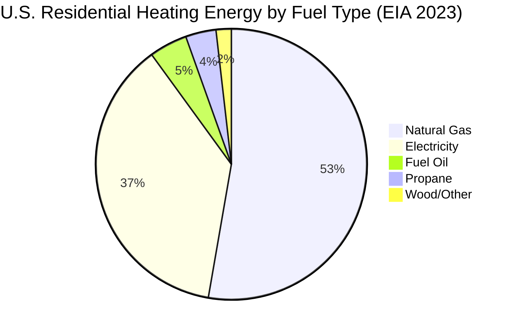

## Overview

Heating represents the largest single energy end-use in residential and commercial buildings across cold and moderate climate zones. According to the U.S. Energy Information Administration (EIA), space heating accounts for approximately 42% of residential energy consumption and 25% of commercial building energy use in the United States. The heating energy profile exhibits strong seasonal variation, climate dependence, and fuel diversity that distinguishes it from other HVAC end-uses.

## Heating Energy Fundamentals

The heating energy requirement for a building derives directly from heat loss through the building envelope and ventilation air. The fundamental relationship expresses the heating load as:

$$Q_h = UA(T_{in} - T_{out}) + \dot{m}c_p(T_{in} - T_{out})$$

where $Q_h$ represents the heating load (W), $U$ is the overall heat transfer coefficient (W/m²·K), $A$ is the envelope area (m²), $\dot{m}$ is the ventilation mass flow rate (kg/s), $c_p$ is the specific heat of air (1005 J/kg·K), and $T_{in}$ and $T_{out}$ are indoor and outdoor temperatures (K).

Seasonal heating energy consumption correlates strongly with heating degree days (HDD), calculated as:

$$HDD = \sum_{i=1}^{365} \max(0, T_{base} - T_{avg,i})$$

where $T_{base}$ is the balance point temperature (typically 65°F or 18.3°C) and $T_{avg,i}$ is the average daily outdoor temperature. This metric enables direct comparison of heating requirements across different climates and years.

## Heating Fuel Distribution

Natural gas dominates space heating in the United States, representing approximately 58% of residential heating energy and 67% of commercial heating energy. Electricity accounts for 41% of residential heating (including both resistance and heat pump systems), with fuel oil, propane, and wood comprising the remainder.

The fuel distribution shifts dramatically by climate zone. Cold regions (Climate Zones 6-7) show natural gas penetration exceeding 70%, while mild climates (Zones 1-3) exhibit higher electric heating shares due to lower annual heating loads that favor lower capital cost systems.

## Regional Heating Patterns

Heating energy consumption varies dramatically by U.S. census region, reflecting both climate severity and fuel availability:

| Region | Annual HDD (Base 65°F) | Primary Fuel | Avg. Heating Energy (MMBtu/household) | Heat Pump Penetration |
|--------|------------------------|--------------|---------------------------------------|----------------------|
| Northeast | 5,800 | Natural Gas (52%) | 48.2 | 8% |
| Midwest | 6,400 | Natural Gas (72%) | 52.6 | 5% |
| South | 2,200 | Electricity (58%) | 18.4 | 42% |
| West | 4,100 | Natural Gas (55%) | 32.7 | 22% |

The Midwest and Northeast consume 2-3 times more heating energy per household than the South, despite similar total energy use when cooling loads are included. This disparity drives different equipment selection priorities and efficiency standards across regions.

## Heating System Efficiency

Heating system efficiency directly impacts energy consumption for a given thermal load. The primary efficiency metrics are:

**Furnaces and Boilers:** Annual Fuel Utilization Efficiency (AFUE) measures the percentage of input fuel energy converted to useful heat over a heating season. Modern condensing equipment achieves AFUE values of 90-98%, while older non-condensing systems operate at 60-80% AFUE.

**Heat Pumps:** Heating Seasonal Performance Factor (HSPF) quantifies total heating output (Btu) divided by total electrical energy input (Wh) over a heating season. Current minimum standards require HSPF ≥ 8.8 (2.58 COP seasonal average), while high-efficiency models achieve HSPF 10-13 (2.93-3.81 COP).

The relationship between rated efficiency and annual energy consumption is:

$$E_{annual} = \frac{Q_{seasonal}}{\eta_{seasonal}}$$

where $E_{annual}$ is annual energy input, $Q_{seasonal}$ is the total seasonal heating requirement, and $\eta_{seasonal}$ is the seasonal efficiency (AFUE for combustion equipment, HSPF converted to seasonal COP for heat pumps).

## Heating by Fuel Type and Application

| Fuel Type | Typical Systems | Efficiency Range | Energy Cost ($/MMBtu) | Carbon Intensity (lb CO₂/MMBtu) |
|-----------|-----------------|------------------|----------------------|----------------------------------|
| Natural Gas | Furnaces, boilers, unit heaters | 80-98% AFUE | $8-15 | 117 |
| Electricity (Resistance) | Baseboard, unit heaters | 100% site efficiency | $25-40 | 180-400 (grid-dependent) |
| Electricity (Heat Pump) | Air-source, ground-source HP | 250-400% effective | $8-13 (effective) | 60-130 (grid-dependent) |
| Fuel Oil | Boilers, furnaces | 80-87% AFUE | $18-28 | 161 |
| Propane | Furnaces, unit heaters | 80-96% AFUE | $20-32 | 139 |

Natural gas maintains cost advantages in most markets despite lower site-to-source efficiency than heat pumps. However, heat pump economics improve as electricity grids decarbonize and natural gas prices increase.

## Electrification Trends

Heat pump adoption accelerated significantly since 2020, driven by:

1. **Improved cold-climate performance:** Modern cold-climate heat pumps maintain >100% capacity at 5°F (-15°C), enabling year-round operation in Climate Zones 5-6.

2. **Policy incentives:** Federal tax credits (up to $2,000) and state rebate programs reduce first costs by 20-40%.

3. **Decarbonization mandates:** Building codes in California, Washington, and New York increasingly restrict natural gas in new construction.

4. **Efficiency improvements:** HSPF ratings increased 25% since 2015, improving operating economics relative to combustion heating.

Heat pump market share in new residential construction reached 46% nationally in 2023, up from 35% in 2020. The South accounts for 68% of heat pump installations, but growth rates exceed 15% annually in previously furnace-dominated markets including the Northeast and Midwest.

## Peak Demand Characteristics

Heating creates peak energy demand during extreme cold weather events, particularly in regions dependent on electric heating or heat pumps. The peak heating load occurs at design outdoor temperatures and substantially exceeds average loads:

$$\frac{Q_{peak}}{Q_{avg}} = \frac{T_{in} - T_{design}}{T_{in} - T_{avg,heating season}}$$

For a Minneapolis location with $T_{design}$ = -10°F, $T_{avg}$ = 32°F during the heating season, and $T_{in}$ = 70°F, this ratio equals 1.9. Peak heating loads drive equipment sizing, infrastructure capacity, and grid stress during cold snaps.

Electric utilities in cold climates increasingly face winter peak demand that exceeds summer cooling peaks, reversing historical patterns and requiring infrastructure upgrades to support heating electrification.

## Efficiency Improvement Strategies

Reducing heating energy consumption requires addressing both the thermal load and system efficiency:

1. **Envelope improvements:** Air sealing, insulation upgrades, and high-performance windows reduce heating loads by 20-50% with typical payback periods of 3-8 years.

2. **Equipment upgrades:** Replacing 60-70% AFUE furnaces with 95% AFUE or HSPF 10+ heat pumps reduces heating energy by 25-60%.

3. **Setback strategies:** Programmable thermostats reducing nighttime temperatures by 8-10°F save 10-15% of heating energy in most climates.

4. **Zone control:** Multi-zone systems matching supply to occupied spaces reduce heating energy by 15-25% in larger buildings.

5. **Ventilation heat recovery:** Energy recovery ventilators (ERVs) recover 60-80% of exhaust air energy, reducing ventilation heating loads by 50-70%.

## Future Outlook

Heating energy consumption patterns face significant transformation over the next decade. Continued heat pump adoption, building envelope improvements, and grid decarbonization will reduce both total heating energy consumption and associated carbon emissions. Regional variations will persist, but the gap between high-heating and low-heating regions will narrow as efficiency improvements concentrate in cold climates where potential savings are greatest.
