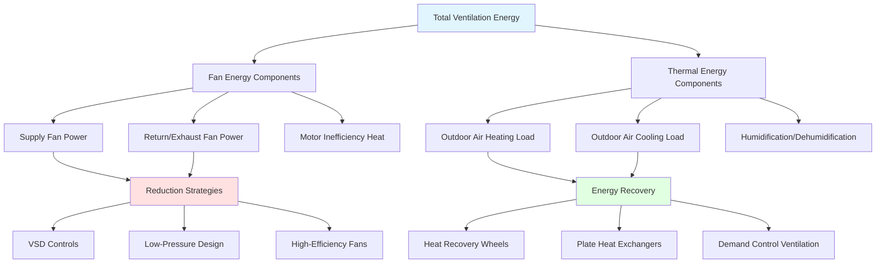

Ventilation energy consumption represents 20-40% of total HVAC energy use in commercial buildings, driven primarily by fan power requirements and the thermal energy needed to condition outdoor air. Understanding ventilation energy components enables targeted efficiency improvements through fan optimization, demand-controlled ventilation (DCV), and heat recovery strategies.

## Fan Power Fundamentals

Fan energy consumption is determined by airflow rate, pressure rise across the fan, and fan efficiency. The theoretical fan power follows from fluid mechanics:

$$P_{\text{fan}} = \frac{Q \cdot \Delta P}{\eta_{\text{fan}}}$$

Where:
- $P_{\text{fan}}$ = fan power (W)
- $Q$ = volumetric airflow rate (m³/s)
- $\Delta P$ = total pressure rise (Pa)
- $\eta_{\text{fan}}$ = fan total efficiency (dimensionless)

For constant-speed fans operating continuously, annual fan energy consumption becomes:

$$E_{\text{annual}} = P_{\text{fan}} \cdot t_{\text{op}} \cdot 10^{-3}$$

Where $E_{\text{annual}}$ is in kWh and $t_{\text{op}}$ is annual operating hours. Variable speed drives reduce this proportionally to load:

$$P_{\text{VSD}} = P_{\text{rated}} \left(\frac{Q_{\text{actual}}}{Q_{\text{design}}}\right)^3$$

This cubic relationship makes VSD control extremely effective for part-load operation.

## Pressure Drop Components

Total system pressure consists of multiple components that accumulate through the air distribution path:

$$\Delta P_{\text{total}} = \Delta P_{\text{filters}} + \Delta P_{\text{coils}} + \Delta P_{\text{duct}} + \Delta P_{\text{fittings}} + \Delta P_{\text{dampers}}$$

Duct friction pressure drop follows the Darcy-Weisbach equation adapted for air:

$$\Delta P_{\text{duct}} = f \cdot \frac{L}{D_h} \cdot \frac{\rho v^2}{2}$$

Where:
- $f$ = friction factor (dimensionless)
- $L$ = duct length (m)
- $D_h$ = hydraulic diameter (m)
- $\rho$ = air density (kg/m³)
- $v$ = air velocity (m/s)

Minimizing pressure drop through proper duct sizing, low-resistance components, and clean filters directly reduces fan energy consumption.

## ASHRAE 90.1 Fan Power Limits

ASHRAE Standard 90.1 establishes maximum fan power allowances based on system type and application. These limits prevent excessive energy consumption from poor design:

| System Type | Fan Power Limit (W/cfm) | Metric Equivalent (W/(L/s)) |
|-------------|--------------------------|------------------------------|
| Constant volume with electric resistance heat | 0.40 | 0.85 |
| Constant volume with other heating | 0.50 | 1.06 |
| Variable air volume | 0.65 | 1.38 |
| Single zone VAV or CAV | 0.45 | 0.95 |
| Energy recovery ventilator | 0.90 | 1.91 |
| Laboratory exhaust systems | 1.30 | 2.76 |

System design must demonstrate compliance through pressure drop calculations. Credits are available for unavoidable pressure components including HEPA filters, sound attenuation devices, and evaporative cooling media.

## Fan Energy by System Type

Different HVAC system configurations exhibit characteristic fan energy intensities based on operational requirements and distribution design:

| System Configuration | Typical Fan Energy (kWh/m²·yr) | % of Total HVAC | Primary Optimization |
|----------------------|----------------------------------|-----------------|----------------------|
| VAV with terminal reheat | 8-15 | 25-35% | Static pressure reset |
| CAV single-zone | 12-20 | 30-40% | Occupancy scheduling |
| Dedicated outdoor air system (DOAS) | 5-10 | 15-25% | Energy recovery |
| Underfloor air distribution | 6-12 | 20-30% | Low-pressure design |
| Displacement ventilation | 4-8 | 15-20% | Natural buoyancy assist |
| Laboratory 100% OA systems | 25-40 | 40-50% | VAV fume hoods, DCV |

Values assume office building operation at 2,500-3,000 annual operating hours. Actual consumption varies with climate, occupancy patterns, and control strategies.

## Demand-Controlled Ventilation Savings

DCV modulates outdoor air intake based on actual occupancy, measured through CO₂ sensors or occupancy counters. Energy savings derive from reduced fan operation and decreased thermal conditioning of outdoor air.

Theoretical ventilation energy with DCV:

$$E_{\text{DCV}} = E_{\text{base}} \cdot \left(\frac{OA_{\text{minimum}} + OA_{\text{variable}} \cdot f_{\text{occ}}}{OA_{\text{design}}}\right)$$

Where $f_{\text{occ}}$ represents the time-averaged occupancy fraction. For spaces with variable occupancy:

**DCV Energy Savings Potential:**

| Space Type | Average Occupancy | Fan Energy Savings | Thermal Energy Savings |
|------------|-------------------|--------------------|-----------------------|
| Conference rooms | 30-40% | 15-25% | 25-40% |
| Auditoriums/theaters | 40-60% | 10-20% | 20-35% |
| Retail spaces | 50-70% | 8-15% | 15-25% |
| Office areas | 60-80% | 5-12% | 10-20% |
| Schools/classrooms | 50-65% | 10-18% | 18-30% |

Savings are most significant in climates with extreme outdoor conditions and spaces with highly variable occupancy. DCV payback typically ranges from 2-5 years depending on installation complexity and utility rates.

## Outdoor Air Energy Impact

The thermal energy required to condition outdoor air often exceeds fan energy, particularly in extreme climates:

$$Q_{\text{OA}} = \dot{m}_{\text{OA}} \cdot c_p \cdot \Delta T = \rho \cdot Q_{\text{OA}} \cdot c_p \cdot (T_{\text{OA}} - T_{\text{supply}})$$

For a typical office requiring 10 L/s per person with 100 occupants, this represents approximately 1,000 L/s of outdoor air. At design conditions with a 30°C temperature difference, the sensible cooling load reaches:

$$Q_{\text{sensible}} = 1.2 \times 1.0 \times 1.006 \times 30 = 36.2 \text{ kW}$$

This thermal load operates whenever the system runs, making heat recovery and economizer strategies critical for energy efficiency.

## Energy Recovery Effectiveness

Heat recovery devices reduce outdoor air conditioning loads by transferring energy between exhaust and incoming outdoor air streams. Effectiveness determines energy recovery:

$$\varepsilon = \frac{T_{\text{OA,treated}} - T_{\text{OA}}}{T_{\text{exhaust}} - T_{\text{OA}}}$$

Typical effectiveness values:

- **Rotary heat wheels:** 70-85% (sensible + latent)
- **Plate heat exchangers:** 50-70% (sensible only)
- **Heat pipe exchangers:** 45-65% (sensible only)
- **Run-around loops:** 50-65% (sensible only)

Energy recovery becomes cost-effective when outdoor air quantities exceed 3,000-5,000 cfm (1,500-2,500 L/s) and systems operate 4,000+ hours annually. The added fan pressure (typically 0.3-0.8 in. w.g. or 75-200 Pa) must be justified by thermal energy savings.

## Optimization Strategies

**Fan Power Reduction:**
- Specify high-efficiency fans (65-75% total efficiency)
- Implement static pressure reset based on terminal box position
- Minimize ductwork pressure drop through proper sizing (velocities under 2,000 fpm in main ducts)
- Use air-side economizer controls to reduce cooling energy
- Schedule fan operation to match actual occupancy

**Outdoor Air Management:**
- Install DCV systems in variable-occupancy spaces
- Maximize economizer hours through integrated controls
- Deploy energy recovery where outdoor air volumes justify it
- Optimize outdoor air setpoints to minimum code requirements
- Consider dedicated outdoor air systems to decouple ventilation from thermal loads

Comprehensive ventilation energy management requires attention to both distribution efficiency and conditioning loads, with strategies selected based on building type, climate, and operational patterns.
