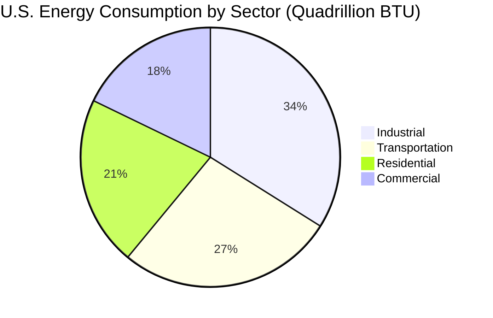
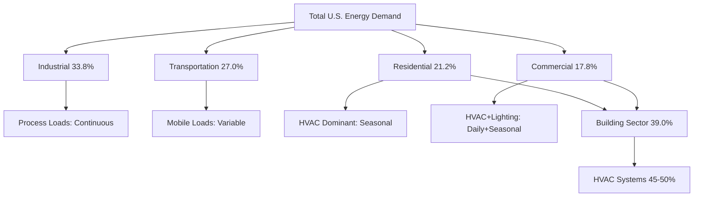

# Sectoral Energy Use

Energy consumption in the United States and globally is distributed across four primary sectors: residential, commercial, industrial, and transportation. Understanding these sectoral patterns is fundamental for HVAC professionals, as building-related energy use (residential and commercial) represents approximately 40% of total U.S. energy consumption, with HVAC systems accounting for the largest portion of this demand.

## U.S. Energy Consumption by Sector

According to the EIA Annual Energy Outlook, U.S. energy consumption follows a distinct sectoral distribution that has remained relatively stable over recent decades, though efficiency improvements and economic shifts continue to influence relative shares.

### Sectoral Energy Consumption Data

| Sector | Energy Use (Quads) | Percentage | Primary End Uses | HVAC Share |
|--------|-------------------|------------|------------------|------------|
| Industrial | 35.2 | 33.8% | Process heating, manufacturing, materials processing | 15-20% |
| Transportation | 28.1 | 27.0% | Vehicles, aviation, rail, marine | <5% |
| Residential | 22.0 | 21.2% | Space conditioning, water heating, appliances | 48-52% |
| Commercial | 18.5 | 17.8% | Space conditioning, lighting, office equipment | 42-46% |
| **Total** | **103.8** | **100%** | | |

## Residential Sector Characteristics

The residential sector encompasses single-family homes, multi-family buildings, and mobile homes. Energy consumption in this sector is dominated by space heating and cooling, which collectively account for nearly half of residential energy use.

### Residential Energy End-Use Distribution

- **Space Heating**: 42%
- **Space Cooling**: 10%
- **Water Heating**: 17%
- **Appliances & Electronics**: 18%
- **Lighting**: 7%
- **Other**: 6%

The residential sector exhibits strong seasonal variation and significant regional differences based on climate zones. Heating-dominated climates show winter peaks, while cooling-dominated regions experience summer maximums.

### Residential Energy Intensity

Energy intensity per household has declined over the past decades due to improved building codes and equipment efficiency standards:

$$E_{res} = \frac{Q_{total}}{N_{households}} = \frac{22.0 \times 10^{15} \text{ BTU}}{124.5 \times 10^6} = 176.7 \text{ MBTU/household}$$

Where:
- $E_{res}$ = average residential energy intensity
- $Q_{total}$ = total residential sector energy consumption
- $N_{households}$ = number of U.S. households

## Commercial Sector Characteristics

The commercial sector includes diverse building types: offices, retail, healthcare, education, hospitality, and warehouses. HVAC systems represent the largest energy end-use in most commercial buildings, though the relative share varies significantly by building type.

### Commercial Energy End-Use Distribution

- **Space Heating**: 25%
- **Space Cooling**: 17%
- **Ventilation**: 8%
- **Water Heating**: 7%
- **Lighting**: 21%
- **Office Equipment**: 12%
- **Refrigeration**: 6%
- **Other**: 4%

### Commercial Energy Intensity

Commercial energy intensity is typically expressed per unit floor area:

$$E_{com} = \frac{Q_{commercial}}{A_{floor}} = \frac{18.5 \times 10^{15} \text{ BTU}}{94.0 \times 10^9 \text{ ft}^2} = 196.8 \text{ kBTU/ft}^2$$

Where:
- $E_{com}$ = commercial energy use intensity (EUI)
- $A_{floor}$ = total commercial floor space

Energy intensity varies dramatically by building type, with healthcare facilities (250-350 kBTU/ft²) and data centers (500+ kBTU/ft²) at the high end, and warehouses (30-50 kBTU/ft²) at the low end.

## Industrial Sector Characteristics

The industrial sector is the largest energy consumer, with manufacturing processes dominating. While HVAC applications are less prominent than in buildings, industrial facilities require specialized climate control for process requirements, product storage, and personnel comfort in occupied areas.

### Industrial Energy Characteristics

- **Process Heating**: Primary energy use in most manufacturing
- **Boiler Fuel**: Steam generation for industrial processes
- **Machine Drive**: Motors and mechanical equipment
- **Process Cooling**: Refrigeration for industrial applications
- **HVAC**: Facility conditioning (15-20% of industrial total)
- **Other**: Electrolysis, lighting, other end uses

Industrial energy consumption shows less seasonal variation than building sectors, with production schedules and economic activity as primary drivers.

## Transportation Sector Characteristics

The transportation sector includes all vehicle types: light-duty vehicles, heavy trucks, aviation, rail, marine, and pipeline. HVAC applications in this sector focus on vehicle climate control systems.

### Transportation HVAC Considerations

Transportation HVAC differs fundamentally from building applications:

- **Mobile platform**: Weight and space constraints
- **Transient loads**: Rapid occupancy and solar load changes
- **Power constraints**: Limited by vehicle electrical or mechanical systems
- **Extreme conditions**: Wide operating temperature ranges

Vehicle air conditioning represents approximately 5-7% of fuel consumption for light-duty vehicles under typical operating conditions, increasing significantly in hot climates with heavy AC use.

## Sectoral Load Profiles and Interactions

### Cross-Sectoral Energy Comparison

The relative energy intensity per unit of economic activity varies significantly:

$$I_{sector} = \frac{E_{sector}}{GDP_{sector}}$$

Where:
- $I_{sector}$ = energy intensity (BTU per dollar of GDP)
- $E_{sector}$ = sectoral energy consumption
- $GDP_{sector}$ = sectoral gross domestic product contribution

The industrial sector typically shows the highest energy intensity per dollar of GDP, while the commercial sector shows the lowest, reflecting the service-oriented nature of commercial activities versus energy-intensive manufacturing.

## Implications for HVAC Design

Understanding sectoral energy patterns informs HVAC system design and operation:

1. **Building Sectors**: HVAC represents the dominant energy load, justifying significant investment in high-efficiency equipment and controls
2. **Load Profiles**: Residential and commercial sectors show strong time-dependent patterns requiring demand response capabilities
3. **Efficiency Priorities**: Building HVAC efficiency improvements have outsized impact on total U.S. energy consumption
4. **Grid Interactions**: Building HVAC loads drive peak electrical demand, particularly in summer cooling-dominated regions

### Sector-Specific Design Approaches

- **Residential**: Focus on occupant behavior, thermostat setback, envelope improvements
- **Commercial**: Emphasize schedule optimization, demand-controlled ventilation, economizer operation
- **Industrial**: Process integration, waste heat recovery, specialized conditioning for product requirements
- **Transportation**: Thermal storage, cabin pre-conditioning, high-efficiency compressors

## Regional and Climate Variations

Sectoral energy patterns vary significantly by region and climate zone. Cooling-dominated climates (southern U.S.) show higher summer peaks in building sectors, while heating-dominated regions (northern U.S.) exhibit winter maximum loads. Understanding these patterns enables climate-responsive HVAC design that optimizes performance for local conditions.

The EIA Annual Energy Outlook provides detailed projections of sectoral energy consumption trends, accounting for evolving building codes, equipment efficiency standards, fuel switching (particularly electrification), and economic growth patterns. These projections inform long-term HVAC industry strategy and policy development.
