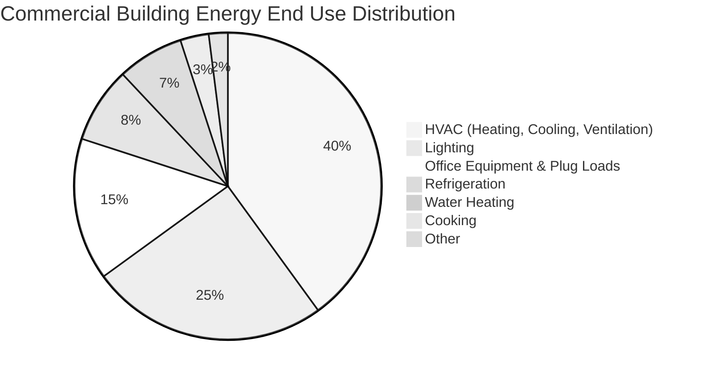

The commercial sector accounts for approximately 19% of total primary energy consumption in the United States, with HVAC systems representing the dominant end use. Understanding energy consumption patterns across building types enables effective benchmarking, performance evaluation, and identification of efficiency opportunities.

## Commercial Energy End Use Distribution

HVAC systems constitute 40% of commercial building energy consumption, making them the single largest energy consumer in this sector. This dominance stems from the need to maintain thermal comfort and indoor air quality across diverse building types with varying occupancy patterns, operating hours, and internal heat gains.

The heating component typically represents 15-18% of total building energy, cooling accounts for 12-15%, and ventilation contributes 8-10%. This distribution varies significantly by climate zone, with cooling-dominated climates showing ratios approaching 20-25% for cooling alone.

## Energy Use Intensity by Building Type

Energy Use Intensity (EUI), measured in kBtu/ft²/year, provides a normalized metric for comparing energy performance across buildings of different sizes. The EUI accounts for total source energy consumption divided by conditioned floor area:

$$
\text{EUI} = \frac{E_{\text{annual}}}{A_{\text{floor}}} = \frac{\sum_{i=1}^{n} E_i \cdot C_i}{A_{\text{floor}}}
$$

where $E_i$ represents energy consumption for each fuel type, $C_i$ is the source energy conversion factor, and $A_{\text{floor}}$ is the gross conditioned floor area.

### CBECS Benchmark Data

The Energy Information Administration's Commercial Buildings Energy Consumption Survey (CBECS) provides statistically representative energy use data. Median and 75th percentile EUI values by building type:

| Building Type | Median EUI (kBtu/ft²/yr) | 75th Percentile EUI | HVAC Fraction | Primary Driver |
|---------------|--------------------------|---------------------|---------------|----------------|
| Data Centers | 450-650 | 800-1,200 | 45-50% | High cooling loads |
| Food Service | 280-380 | 450-550 | 35-40% | Kitchen exhaust, high OA |
| Food Sales (Grocery) | 220-290 | 350-420 | 30-35% | Refrigeration, high latent |
| Healthcare (Inpatient) | 240-310 | 380-470 | 40-45% | 24/7 operation, high OA |
| Hospitals | 260-330 | 400-490 | 42-47% | Critical ventilation, humidification |
| Lodging (Hotel) | 120-170 | 200-250 | 38-42% | Guest room HVAC, DHW |
| Mercantile (Retail) | 90-130 | 160-210 | 35-40% | High infiltration, variable occupancy |
| Office (Large) | 85-115 | 140-180 | 38-43% | Internal gains, high ventilation |
| Office (Small) | 75-95 | 120-150 | 40-45% | Envelope-dominated |
| Education (K-12) | 70-95 | 110-145 | 42-48% | High ventilation rates |
| Warehouse | 35-55 | 70-95 | 30-35% | Low occupancy, minimal conditioning |

The wide variation in EUI reflects differences in operational intensity, equipment density, ventilation requirements, and occupancy patterns. Food service and data centers exhibit the highest intensities due to process loads and continuous high-density cooling requirements.

## Building Energy Benchmarking Methodology

Benchmarking normalizes energy performance to enable meaningful comparisons. The weather-normalized EUI adjusts for climate variations using heating degree days (HDD) and cooling degree days (CDD):

$$
\text{EUI}_{\text{normalized}} = \text{EUI}_{\text{measured}} \times \frac{\text{HDD}_{\text{typical}} + k \cdot \text{CDD}_{\text{typical}}}{\text{HDD}_{\text{actual}} + k \cdot \text{CDD}_{\text{actual}}}
$$

where $k$ represents the cooling-to-heating energy ratio, typically 0.8-1.2 depending on building characteristics and HVAC system efficiency.

For buildings with multiple fuel sources, the total source EUI combines site energy with conversion factors:

$$
\text{EUI}_{\text{source}} = \frac{1}{A_{\text{floor}}} \left( E_{\text{elec}} \cdot 3.167 + E_{\text{gas}} \cdot 1.084 + E_{\text{fuel oil}} \cdot 1.01 \right)
$$

The electricity multiplier (3.167) accounts for generation, transmission, and distribution losses, converting site kWh to source kBtu.

## HVAC System Impact by Building Category

The fraction of total energy consumed by HVAC systems varies by building type based on envelope characteristics, internal gains, and operational requirements:

**High HVAC Fraction (45-50%)**
- Schools and universities: High outside air requirements per occupant (15-20 CFM/person) combined with high occupant density increase ventilation loads
- Small offices: Envelope-dominated with minimal internal gains make heating and cooling the primary loads
- Data centers: Cooling represents 35-40% alone due to high server heat rejection

**Moderate HVAC Fraction (38-43%)**
- Large offices: Significant internal gains from lighting and equipment reduce heating loads but increase cooling requirements
- Healthcare facilities: Continuous operation, stringent humidity control (30-60% RH), and high outside air rates (6-8 ACH minimum) drive HVAC energy
- Hotels: Guest room HVAC operates continuously in occupied zones with individual zone control

**Lower HVAC Fraction (30-38%)**
- Retail and mercantile: High lighting loads and refrigeration in grocery stores shift energy distribution
- Food service: Kitchen equipment, refrigeration, and water heating dominate energy consumption
- Warehouses: Minimal conditioning requirements and low occupancy reduce HVAC energy relative to other end uses

## Performance Improvement Opportunities

Commercial buildings demonstrate significant energy performance variation within each category. The difference between median and 75th percentile performance represents achievable savings through:

1. **HVAC System Optimization**: Proper economizer operation, demand-controlled ventilation, and optimal start/stop control reduce operating hours by 15-30%

2. **Equipment Rightsizing**: Oversized HVAC equipment operates at reduced part-load efficiency; proper load calculations improve seasonal efficiency by 10-25%

3. **Envelope Enhancement**: Air sealing, insulation upgrades, and high-performance glazing reduce heating and cooling loads by 20-40%

4. **Control Strategies**: Occupancy-based setback, night purge cooling, and zone-level temperature reset decrease energy consumption by 15-35%

The economic justification for efficiency measures depends on the existing EUI, local utility rates, and building-specific operational constraints. Buildings performing above the 75th percentile EUI represent prime candidates for comprehensive energy audits and retrocommissioning.

## Climate Zone Considerations

HVAC energy distribution shifts dramatically across climate zones. Cooling-dominated climates (ASHRAE Zones 1-2) show cooling fractions of 55-65% of total HVAC energy, while heating-dominated climates (Zones 6-7) exhibit heating fractions of 60-75%. Mixed climates (Zones 3-5) demonstrate more balanced distributions with seasonal transitions creating unique optimization challenges.

Understanding these patterns enables targeted efficiency improvements, appropriate technology selection, and realistic energy modeling for commercial building design and retrofit applications.
