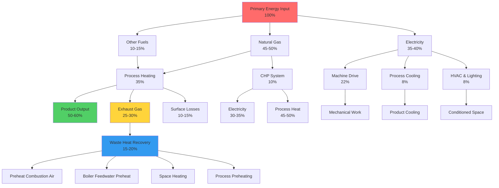

## Overview

The industrial sector represents approximately 33% of total U.S. primary energy consumption, according to EIA's Manufacturing Energy Consumption Survey (MECS). Unlike commercial and residential sectors where HVAC dominates energy use, industrial facilities allocate the majority of energy to production processes. Understanding the distribution between process loads and facility conditioning loads is essential for identifying energy efficiency opportunities.

## Industrial Energy End-Use Distribution

Industrial energy consumption differs fundamentally from other sectors due to the predominance of process-related loads over space conditioning requirements.

### Energy Use Breakdown by End Use

| End Use Category | Energy Share | Primary Applications |
|-----------------|--------------|---------------------|
| Process Heating | 38-42% | Furnaces, kilns, ovens, dryers |
| Machine Drive | 20-25% | Motors, pumps, fans, compressors |
| Process Cooling & Refrigeration | 10-12% | Process chillers, refrigeration systems |
| HVAC & Facility Lighting | 10-15% | Space conditioning, ventilation |
| Electrochemical Processes | 8-10% | Electrolysis, smelting, refining |
| Other Process Use | 5-8% | Material handling, auxiliary systems |

### Energy Use by Manufacturing Subsector

The distribution of energy consumption varies significantly across different manufacturing industries, reflecting the diverse thermal and mechanical requirements of production processes.

| Industry Subsector | Energy Intensity (TBtu/yr) | Primary Energy Form |
|-------------------|---------------------------|-------------------|
| Petroleum & Coal Products | 2,800-3,200 | Natural gas, refinery gas |
| Chemicals | 2,400-2,800 | Natural gas, electricity |
| Paper Manufacturing | 1,800-2,200 | Biomass, natural gas, coal |
| Primary Metals | 1,600-2,000 | Electricity, natural gas, coal |
| Food & Beverage | 900-1,200 | Natural gas, electricity |
| Fabricated Metals | 450-600 | Electricity, natural gas |
| Plastics & Rubber | 400-550 | Natural gas, electricity |
| Non-Metallic Minerals | 900-1,100 | Natural gas, coal, electricity |

## Process Energy Calculations

Industrial thermal processes require precise energy calculations to optimize efficiency and identify waste heat recovery opportunities.

### Process Heating Energy Requirements

The energy required for heating materials in industrial processes:

$$Q_{process} = m \cdot c_p \cdot \Delta T + m \cdot h_{fg}$$

Where:
- $Q_{process}$ = total process heat required (kJ)
- $m$ = mass of material (kg)
- $c_p$ = specific heat capacity (kJ/kg·K)
- $\Delta T$ = temperature change (K)
- $h_{fg}$ = latent heat of phase change if applicable (kJ/kg)

### Furnace Efficiency and Fuel Requirements

Actual fuel consumption accounting for equipment efficiency:

$$\dot{Q}_{fuel} = \frac{Q_{process}}{\eta_{furnace} \cdot t_{process}}$$

Where:
- $\dot{Q}_{fuel}$ = required fuel input rate (kW)
- $\eta_{furnace}$ = furnace thermal efficiency (typically 0.40-0.85)
- $t_{process}$ = process duration (s)

### Waste Heat Available for Recovery

The recoverable energy from exhaust streams:

$$\dot{Q}_{recoverable} = \dot{m}_{exhaust} \cdot c_{p,gas} \cdot (T_{exhaust} - T_{ambient}) \cdot \eta_{HX}$$

Where:
- $\dot{Q}_{recoverable}$ = recoverable heat rate (kW)
- $\dot{m}_{exhaust}$ = exhaust gas mass flow rate (kg/s)
- $c_{p,gas}$ = specific heat of exhaust gas (kJ/kg·K)
- $T_{exhaust}$ = exhaust gas temperature (K)
- $T_{ambient}$ = ambient or minimum achievable temperature (K)
- $\eta_{HX}$ = heat exchanger effectiveness (0.60-0.85)

### Combined Heat and Power Efficiency

The overall efficiency of CHP systems compared to separate generation:

$$\eta_{CHP} = \frac{W_{electric} + Q_{thermal,useful}}{Q_{fuel,input}}$$

Where:
- $\eta_{CHP}$ = overall CHP system efficiency (typically 0.65-0.85)
- $W_{electric}$ = electrical power output (kW)
- $Q_{thermal,useful}$ = useful thermal energy recovered (kW)
- $Q_{fuel,input}$ = total fuel energy input (kW)

## Industrial Energy Flow Diagram

The following diagram illustrates energy flows in a typical manufacturing facility, showing the relationship between primary energy inputs, process loads, facility loads, and waste heat recovery opportunities.

## Process vs. HVAC Energy Loads

The energy distribution in industrial facilities presents distinct characteristics compared to commercial buildings.

### Process Load Dominance

Process loads account for 70-85% of total facility energy consumption. These loads include:

- **Direct Process Heating**: Furnaces operating at 800-1800°C for metal treatment, glass melting, or ceramic firing
- **Drying Operations**: Convective and radiant dryers for paper, textiles, and food products at 100-300°C
- **Distillation and Separation**: Energy-intensive chemical separations requiring precise temperature control
- **Electrochemical Processes**: High electrical loads for aluminum smelting (13-15 kWh/kg Al) and chlor-alkali production

### HVAC Requirements in Industrial Settings

While smaller in proportion, industrial HVAC systems face unique challenges:

**High Bay Spaces**: Large manufacturing areas with ceiling heights of 10-15 m require destratification and specialized air distribution strategies.

**Contaminated Air Handling**: Many processes generate particulates, fumes, or vapors requiring substantial ventilation rates (10-30 air changes per hour in some areas).

**Make-Up Air Heating**: High ventilation requirements in cold climates can result in make-up air heating loads of 500-2000 kW for moderate-sized facilities.

**Process Environment Control**: Some manufacturing operations require tight temperature and humidity control (±1°C, ±5% RH) independent of comfort requirements.

## Waste Heat Recovery Opportunities

Industrial facilities represent the highest-potential sector for waste heat recovery due to the magnitude and temperature of available waste streams.

### Temperature-Based Recovery Potential

| Temperature Range | Recovery Technology | Typical Applications |
|------------------|-------------------|---------------------|
| >650°C (High) | Recuperators, regenerators | Furnace exhaust to combustion air preheat |
| 250-650°C (Medium) | Shell-and-tube HX, economizers | Boiler feedwater preheat, process preheating |
| 120-250°C (Low) | Plate HX, run-around loops | Space heating, low-temperature processes |
| <120°C (Very Low) | Heat pumps, organic Rankine cycle | Facility heating, power generation |

### Economic Considerations

Waste heat recovery projects in industrial settings typically achieve:
- Simple payback periods: 2-5 years for medium to high-temperature recovery
- Energy savings: 10-25% reduction in total facility energy consumption
- Capital costs: $100-500 per kW of recovered thermal capacity

## Combined Heat and Power Applications

CHP systems effectively utilize natural gas in industrial settings where both electrical and thermal loads exist simultaneously.

**Typical CHP Configurations**:
- Gas turbines with heat recovery steam generators (HRSG) for large facilities (5-50 MW)
- Reciprocating engines for medium-sized operations (500 kW - 5 MW)
- Microturbines for smaller distributed applications (30-300 kW)

**Performance Metrics**:
- Overall efficiency: 65-80% compared to 45-52% for separate heat and power
- Electrical efficiency: 25-42% depending on prime mover technology
- Heat-to-power ratio: 1.5-2.5 for reciprocating engines, 2.0-4.0 for gas turbines

The economic viability of CHP improves with higher annual operating hours (>6,000 hours/year), substantial coincident thermal and electrical loads, and favorable natural gas-to-electricity price ratios (typically <3:1 on energy basis).

## Energy Management Strategies

Effective industrial energy management integrates process optimization with facility systems:

1. **Load Profiling**: Detailed characterization of energy use patterns identifies demand response and load-shifting opportunities
2. **Process Integration**: Pinch analysis and heat integration studies minimize external heating and cooling requirements
3. **Equipment Efficiency**: Motor systems optimization through VFDs, proper sizing, and maintenance typically yields 10-20% savings
4. **Steam System Management**: Comprehensive steam system assessment addresses generation, distribution, and end-use efficiency

Industrial facilities implementing comprehensive energy management programs routinely achieve 10-30% energy intensity reductions while maintaining or improving production output.
