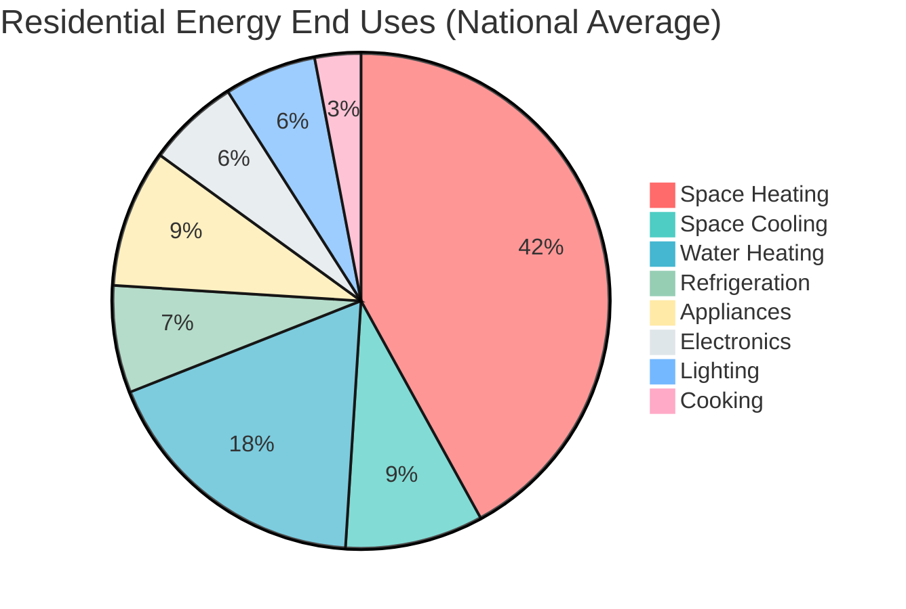

## Overview

The residential sector accounts for approximately 21 percent of total primary energy consumption in the United States, representing over 20 quadrillion BTU annually according to EIA data. Space conditioning—heating and cooling—dominates residential energy use, consuming over half of household energy expenditures and presenting significant opportunities for efficiency improvements.

Understanding residential energy consumption patterns enables targeted efficiency interventions, informs equipment sizing decisions, and supports energy policy development. Regional climate variations, building vintage, occupancy patterns, and equipment efficiency all contribute to substantial differences in household energy use intensity.

## Residential Energy End-Use Distribution

EIA Residential Energy Consumption Survey (RECS) data reveals the following approximate energy end-use breakdown for U.S. households:

Space heating represents the largest single energy end use at 42 percent of residential consumption, followed by water heating at 18 percent and space cooling at 9 percent. Combined, HVAC systems (space heating, cooling, and ventilation) account for approximately 51 percent of residential energy use, making them the primary target for energy efficiency programs.

## Energy Use Intensity Formulation

Residential energy use intensity (EUI) quantifies energy consumption normalized by floor area:

$$\text{EUI} = \frac{E_{\text{annual}}}{A_{\text{floor}}}$$

where:
- $\text{EUI}$ = energy use intensity (kBtu/ft²·yr or kWh/m²·yr)
- $E_{\text{annual}}$ = total annual energy consumption (kBtu or kWh)
- $A_{\text{floor}}$ = conditioned floor area (ft² or m²)

For space conditioning loads specifically:

$$\text{EUI}_{\text{HVAC}} = \frac{Q_{\text{heating}} + Q_{\text{cooling}} + W_{\text{fans}}}{A_{\text{floor}}}$$

where $Q_{\text{heating}}$ and $Q_{\text{cooling}}$ represent annual heating and cooling energy, and $W_{\text{fans}}$ represents ventilation and air circulation energy.

The heating degree days (HDD) and cooling degree days (CDD) normalized consumption provides climate-adjusted comparison:

$$\text{EUI}_{\text{norm}} = \frac{E_{\text{heating}}}{\text{HDD} \cdot A_{\text{floor}}} + \frac{E_{\text{cooling}}}{\text{CDD} \cdot A_{\text{floor}}}$$

## Regional Energy Consumption Variations

Climate zones exhibit substantial variations in residential energy consumption patterns. The following table presents typical annual energy use by major climate region based on RECS data:

| Climate Region | Heating (kBtu/ft²) | Cooling (kBtu/ft²) | Total HVAC (kBtu/ft²) | Dominant Fuel |
|----------------|-------------------|-------------------|----------------------|---------------|
| Cold/Very Cold (Zones 6-7) | 35-45 | 2-4 | 37-49 | Natural Gas |
| Mixed-Humid (Zone 4A) | 20-28 | 5-8 | 25-36 | Natural Gas/Electric |
| Hot-Humid (Zones 2A-3A) | 8-12 | 12-18 | 20-30 | Electric |
| Hot-Dry (Zones 2B-3B) | 10-15 | 10-15 | 20-30 | Natural Gas/Electric |
| Marine (Zone 4C) | 18-24 | 2-5 | 20-29 | Natural Gas/Electric |

Cold climate regions demonstrate heating-dominated consumption with annual heating loads 8 to 12 times greater than cooling loads. Conversely, hot-humid regions show cooling-dominated patterns with cooling loads potentially exceeding heating by factors of 2 to 3.

## Space Conditioning Share by Climate Zone

The proportion of total energy dedicated to space conditioning varies substantially by climate:

| ASHRAE Climate Zone | Space Heating (%) | Space Cooling (%) | Total HVAC (%) |
|---------------------|------------------|------------------|----------------|
| 1A (Very Hot-Humid) | 5-8 | 20-25 | 25-33 |
| 2A (Hot-Humid) | 10-15 | 15-20 | 25-35 |
| 3A (Warm-Humid) | 20-25 | 12-15 | 32-40 |
| 4A (Mixed-Humid) | 35-40 | 8-12 | 43-52 |
| 5A (Cool-Humid) | 45-50 | 5-8 | 50-58 |
| 6A (Cold-Humid) | 50-55 | 3-5 | 53-60 |
| 7 (Very Cold) | 55-62 | 1-3 | 56-65 |

Climate zones 6A and 7 demonstrate HVAC systems consuming 53 to 65 percent of total residential energy, while zone 1A shows 25 to 33 percent allocation. These variations directly inform equipment selection, sizing methodologies, and efficiency investment prioritization.

## Equipment Efficiency Trends

Residential HVAC equipment efficiency has improved substantially over the past three decades:

**Central Air Conditioning:**
- 1990 minimum: 10 SEER
- 2006 minimum: 13 SEER
- 2015 minimum: 14 SEER (North), 13 SEER (South)
- 2023 minimum: 14 SEER2 (North), 15 SEER2 (South)

**Gas Furnaces:**
- 1990 minimum: 78% AFUE
- 1992 minimum: 78% AFUE
- 2015 minimum: 80% AFUE (non-weatherized), 90% AFUE (weatherized in North)
- Current high-efficiency: 95-98% AFUE

**Heat Pumps:**
- 1990 minimum: 10 SEER / 6.8 HSPF
- 2006 minimum: 13 SEER / 7.7 HSPF
- 2023 minimum: 14 SEER2 / 7.5 HSPF2
- Current high-efficiency: 20+ SEER2 / 10+ HSPF2

These efficiency improvements translate to 30 to 50 percent reduction in space conditioning energy use compared to equipment from the 1990s, though stock turnover rates of 15 to 20 years mean substantial inefficient equipment remains in service.

## Efficiency Improvement Opportunities

Analysis of RECS data identifies primary residential energy efficiency opportunities:

**Building Envelope:**
- Air sealing reducing infiltration from 0.35 ACH50 to 0.25 ACH50: 10-15% heating/cooling reduction
- Attic insulation from R-19 to R-49: 8-12% heating reduction
- Window upgrades from single-pane to low-e double-pane (U-0.30): 12-18% HVAC reduction

**Equipment Replacement:**
- HVAC equipment upgrade from 10 SEER/80% AFUE to 16 SEER/95% AFUE: 25-35% reduction
- Heat pump water heater replacing electric resistance: 60-65% water heating reduction
- Smart thermostat installation: 8-12% HVAC reduction

**Operational Improvements:**
- Programmable setback (68°F occupied, 62°F unoccupied): 5-10% heating reduction
- Cooling setup (78°F occupied, 82°F unoccupied): 5-8% cooling reduction
- Regular filter changes and maintenance: 5-8% efficiency improvement

## Load Profile Characteristics

Residential energy consumption exhibits distinct temporal patterns:

- **Daily profiles:** Morning and evening peaks corresponding to occupancy, midday reduction during work hours
- **Weekly profiles:** Weekend consumption 15 to 25 percent higher than weekdays
- **Seasonal profiles:** Winter heating peaks in cold climates, summer cooling peaks in hot climates
- **Weather sensitivity:** Heating loads increase approximately 3 percent per degree Fahrenheit below 65°F balance point; cooling loads increase approximately 4 percent per degree above 75°F balance point

These patterns inform utility demand response programs, time-of-use rate structures, and energy storage system sizing.

## Policy and Program Implications

Residential sector energy consumption patterns drive multiple policy initiatives:

- **Building codes:** Progressive tightening of envelope and equipment requirements reducing EUI by 30 to 40 percent since 2000
- **Utility rebate programs:** Focus on HVAC equipment, insulation, and air sealing delivering typical 15 to 25 percent energy savings
- **Energy labeling:** ENERGY STAR certification identifying top 25 percent efficiency performers
- **Weatherization assistance:** Targeting low-income households with comprehensive envelope and equipment improvements

The dominance of space conditioning in residential energy use ensures HVAC systems remain the primary focus of residential energy efficiency policy and program development.

## References

- U.S. Energy Information Administration (EIA), Residential Energy Consumption Survey (RECS) 2020
- ASHRAE Handbook—Fundamentals, Chapter 19: Energy Resources
- DOE Building America Program, Residential Energy Efficiency Analysis
- ENERGY STAR Certified Products Database
