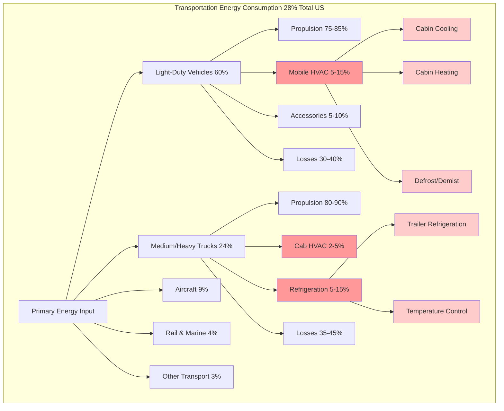

## Transportation Energy Overview

The transportation sector accounts for 28% of total U.S. primary energy consumption according to DOE data, making it the largest energy-consuming sector alongside buildings. While propulsion dominates transportation energy use, mobile HVAC systems represent a significant parasitic load that impacts fuel economy, electric vehicle range, and operating costs across all vehicle classes.

## Mobile HVAC Energy Consumption

Vehicle air conditioning systems impose measurable penalties on energy efficiency through compressor work, fan power, and thermal management requirements. The magnitude of this impact varies by vehicle type, climate conditions, and technology generation.

### Energy Consumption Formulas

The additional fuel consumption due to mobile AC operation follows:

$$
\Delta FC_{AC} = \frac{W_{comp}}{\eta_{eng} \cdot LHV_{fuel}} + \frac{W_{aux}}{\eta_{eng} \cdot LHV_{fuel}}
$$

Where:
- $\Delta FC_{AC}$ = Additional fuel consumption (kg/h)
- $W_{comp}$ = Compressor power requirement (kW)
- $W_{aux}$ = Auxiliary fan and control power (kW)
- $\eta_{eng}$ = Engine thermal efficiency (0.25-0.40)
- $LHV_{fuel}$ = Lower heating value of fuel (43-45 MJ/kg gasoline)

The compressor power demand is determined by cooling load and system efficiency:

$$
W_{comp} = \frac{Q_{cool}}{COP_{mobile}} = \frac{Q_{cool} \cdot (T_{evap} - T_{cond})}{T_{evap} \cdot \eta_{comp}}
$$

For electric vehicles, AC energy directly reduces battery range:

$$
\Delta Range_{AC} = \frac{E_{batt} \cdot \Delta SOC_{AC}}{EC_{base}} = \frac{P_{AC} \cdot t_{trip}}{EC_{base}}
$$

Where:
- $\Delta Range_{AC}$ = Range reduction due to AC (km)
- $E_{batt}$ = Battery capacity (kWh)
- $\Delta SOC_{AC}$ = State of charge consumed by AC (%)
- $EC_{base}$ = Base energy consumption (kWh/km)
- $P_{AC}$ = AC system power draw (kW)
- $t_{trip}$ = Trip duration (h)

## HVAC Impact on Vehicle Efficiency

Mobile air conditioning significantly affects fuel economy and range across all vehicle platforms. The impact intensifies in extreme climates and during urban driving cycles.

| Vehicle Type | AC Impact on Efficiency | Peak Power Draw | Annual Energy Cost |
|--------------|------------------------|-----------------|-------------------|
| Compact Car (ICE) | 10-20% fuel penalty | 2-4 kW | $120-240 |
| Mid-size Sedan (ICE) | 12-25% fuel penalty | 3-5 kW | $180-350 |
| SUV/Truck (ICE) | 15-30% fuel penalty | 4-7 kW | $250-500 |
| Battery Electric Vehicle | 15-35% range reduction | 2-6 kW | $85-200 |
| Plug-in Hybrid Electric | 20-40% on electric mode | 2-5 kW | $150-280 |
| Transit Bus (Diesel) | 8-15% fuel penalty | 15-25 kW | $1,200-2,400 |
| Class 8 Truck (Sleeper) | 5-10% fuel penalty | 3-5 kW | $800-1,600 |

*Data based on EPA testing protocols and DOE vehicle technologies research. Annual costs assume 12,000 miles/year, regional fuel prices, and 6-month AC season.*

## Transportation Energy Flow with HVAC

## Electric Vehicle HVAC Challenges

Electric vehicles face unique thermal management challenges because cabin heating and cooling draw directly from the traction battery, significantly impacting range. Unlike internal combustion vehicles that have waste heat available for cabin heating, EVs must generate heat electrically or use heat pump technology.

**EV Range Impact by Operating Condition:**

| Ambient Temperature | Climate Control Mode | Range Reduction | Mitigation Strategy |
|---------------------|---------------------|-----------------|---------------------|
| -10°C to 0°C | Resistive heating | 30-50% | Heat pump systems |
| 0°C to 15°C | Minimal conditioning | 5-10% | Thermal preconditioning |
| 15°C to 25°C | No conditioning | 0-5% | Ventilation only |
| 25°C to 35°C | Air conditioning | 15-25% | Efficient compressor |
| 35°C to 45°C | Maximum cooling | 25-40% | Cabin pre-cooling |

### Heat Pump Efficiency Advantage

Modern EV heat pumps achieve coefficient of performance (COP) values of 2.0-3.5, delivering 2-3.5 kW of heating for every 1 kW of electrical input. This represents a 50-70% energy savings compared to resistive heating:

$$
E_{saved} = E_{heat} \cdot \left(1 - \frac{1}{COP_{HP}}\right) = P_{heat} \cdot t \cdot \left(1 - \frac{1}{COP_{HP}}\right)
$$

For a 3 kW heating requirement over 1 hour with COP = 3.0:

$$
E_{saved} = 3 \text{ kW} \cdot 1 \text{ h} \cdot \left(1 - \frac{1}{3.0}\right) = 2 \text{ kWh}
$$

This 2 kWh energy savings translates to approximately 10-15 km of additional range in typical EVs.

## Fleet HVAC Energy Management

Commercial and government fleets represent concentrated opportunities for HVAC energy reduction through systematic technology deployment and operational strategies.

**Fleet HVAC Efficiency Strategies:**

- **Auxiliary power units (APU)** for truck sleeper cab conditioning, eliminating 6-8 hours of daily engine idling at 0.8-1.2 gallons/hour fuel consumption
- **Transport refrigeration units (TRU)** with electric standby capability, reducing diesel consumption by 50-75% during loading/unloading
- **Remote pre-conditioning** for electric fleet vehicles, conditioning cabins while grid-connected to preserve battery range
- **Solar-assisted ventilation** systems for parked vehicles, reducing initial thermal load by 30-50%
- **Thermal energy storage** using phase change materials, buffering peak cooling loads

### Transport Refrigeration Energy Use

Refrigerated transport represents a specialized high-energy HVAC application within the transportation sector. Temperature-controlled trailers consume substantial energy maintaining cold chain integrity.

| Refrigeration Application | Power Requirement | Daily Energy | Annual Fuel Cost |
|---------------------------|-------------------|--------------|------------------|
| Full-size trailer (frozen) | 8-12 kW | 150-200 kWh | $6,000-9,000 |
| Full-size trailer (chilled) | 5-8 kW | 90-140 kWh | $4,000-6,500 |
| Straight truck (frozen) | 4-7 kW | 70-110 kWh | $3,000-5,000 |
| Delivery van (chilled) | 2-4 kW | 30-60 kWh | $1,500-2,800 |

*Based on continuous operation during 10-12 hour delivery routes and diesel-powered refrigeration units.*

## Building Integration Considerations

While transportation HVAC is primarily mobile, building interfaces create energy implications:

- **Electric vehicle charging infrastructure** adds 3-20 kW per vehicle to building electrical demand, with peak charging periods often coinciding with building HVAC peaks
- **Fleet maintenance facilities** require heated/cooled service bays with high air change rates for exhaust ventilation
- **Transit stations and terminals** serve as building-transportation interface points with unique HVAC requirements for platform conditioning
- **Parking structure ventilation** systems must handle vehicle emissions while managing thermal loads from solar exposure

## Future Technology Trajectories

Advanced technologies continue improving mobile HVAC efficiency:

- **CO₂ heat pump systems** (R-744) offering superior cold-weather performance with GWP = 1
- **Thermoelectric cooling** for localized spot cooling, reducing whole-cabin conditioning requirements
- **Radiant heating/cooling surfaces** integrated into vehicle interior panels
- **Thermal management integration** combining battery, powertrain, and cabin conditioning into unified systems
- **Predictive climate control** using GPS and weather data to optimize preconditioning

According to DOE Advanced Vehicle Technologies research, next-generation mobile HVAC systems target 50% energy reduction compared to 2020 baseline technology through improved components, system integration, and intelligent controls.

## Summary

Mobile HVAC systems represent a measurable fraction of transportation sector energy consumption, with impacts ranging from 5-30% depending on vehicle type, climate, and technology. For electric vehicles specifically, thermal management directly competes with traction energy, making efficient HVAC critical for market acceptance. Fleet applications offer concentrated opportunities for energy savings through technology upgrades and operational optimization. As transportation electrification accelerates, thermal management efficiency becomes increasingly important for vehicle range, operating economics, and grid integration.
