HVAC energy consumption exhibits distinct temporal patterns across multiple time scales, driven by occupancy schedules, weather variations, and operational characteristics. Understanding these patterns enables accurate load forecasting, optimal equipment sizing, and effective demand management strategies.

## Hourly Load Patterns

Hourly variations represent the most granular temporal pattern, influenced primarily by occupancy schedules, equipment operation, and solar gains.

### Load Variability Factor

The hourly load factor quantifies the relationship between average and peak loads:

$$LF_h = \frac{\bar{Q}_h}{Q_{peak}} \times 100\%$$

where $\bar{Q}_h$ is the average hourly load and $Q_{peak}$ is the peak hourly load. Typical commercial buildings exhibit load factors of 60-75%, while residential applications range from 40-60%.

### Coincidence Factor

For multi-zone systems, the diversity of loads reduces peak demand:

$$CF = \frac{Q_{actual,peak}}{\sum_{i=1}^{n} Q_{i,peak}}$$

where $Q_{actual,peak}$ is the actual simultaneous peak load and $\sum Q_{i,peak}$ represents the sum of individual zone peak loads. Commercial buildings typically show coincidence factors of 0.70-0.85.

## Daily Consumption Cycles

Daily patterns reflect the 24-hour cycle of building operation, with distinct characteristics for different building types.

| Building Type | Peak Hours | Base Load (% of peak) | Daily Load Factor |
|---------------|------------|----------------------|-------------------|
| Office | 10:00-16:00 | 15-25% | 55-70% |
| Retail | 12:00-20:00 | 20-30% | 60-75% |
| Hospital | 08:00-18:00 | 70-85% | 85-95% |
| School | 09:00-15:00 | 10-20% | 45-60% |
| Data Center | Continuous | 90-98% | 95-100% |
| Hotel | 06:00-10:00, 18:00-22:00 | 40-55% | 65-80% |

### Unoccupied Period Energy

The ratio of unoccupied to occupied energy consumption indicates system efficiency:

$$R_{uo} = \frac{E_{unoccupied}}{E_{occupied}}$$

Well-optimized buildings achieve $R_{uo} < 0.30$, while poorly controlled systems may exceed $R_{uo} = 0.60$.

```mermaid
gantt
    title Daily HVAC Energy Consumption Pattern - Office Building
    dateFormat HH:mm
    axisFormat %H:%M

    section Energy Load
    Setback (15% peak)     :00:00, 06:00
    Morning Ramp-up (85%)  :06:00, 08:00
    Peak Period (100%)     :08:00, 18:00
    Evening Ramp-down (60%):18:00, 20:00
    Night Setback (15%)    :20:00, 24:00

    section Demand Events
    Pre-cooling            :06:00, 08:00
    Peak Demand Window     :14:00, 18:00
    Load Shedding Possible :15:00, 17:00
```

## Seasonal Variations

Seasonal patterns arise from weather-driven heating and cooling requirements, with amplitude depending on climate zone.

### Seasonal Energy Distribution

$$E_{season,i} = \int_{t_{start}}^{t_{end}} Q(T_{oa}(t), \phi(t)) \, dt$$

where $Q$ is the time-dependent load function, $T_{oa}$ is outdoor air temperature, and $\phi$ represents solar and internal gains.

| Season | Heating Load | Cooling Load | Ventilation Load | Total Distribution |
|--------|--------------|--------------|------------------|-------------------|
| Winter | 60-75% | 0-5% | 10-15% | 25-30% |
| Spring | 10-20% | 15-30% | 8-12% | 20-25% |
| Summer | 0-5% | 65-80% | 10-15% | 30-35% |
| Fall | 15-25% | 10-20% | 8-12% | 20-25% |

*Values shown for mixed-humid climate zone (ASHRAE 4A)*

### Degree-Day Correlation

Seasonal energy consumption correlates strongly with heating and cooling degree days:

$$E_{heating} = Q_{base} + \alpha_{HDD} \times HDD$$

$$E_{cooling} = Q_{base} + \alpha_{CDD} \times CDD$$

where $Q_{base}$ is weather-independent base load, $\alpha_{HDD}$ and $\alpha_{CDD}$ are temperature sensitivity coefficients (kWh/degree-day), and HDD/CDD represent heating and cooling degree days.

## Annual Energy Profiles

Annual patterns integrate all temporal scales and provide the basis for energy budgeting and utility planning.

### Annual Load Duration Curve

The load duration curve plots loads in descending order, revealing capacity utilization:

$$LDC(x) = Q(t) \text{ sorted descending, } x \in [0, 8760]$$

The area under the curve represents total annual energy. Equipment serving only the top 10-20% of hours (peak shaving) operates fewer than 1,000 hours annually.

### Peak Demand Characteristics

| Metric | Typical Range | Impact |
|--------|--------------|---------|
| Annual peak load | 100% | Demand charge basis |
| 95th percentile load | 85-95% | Equipment sizing target |
| 50th percentile load | 45-65% | Part-load operation zone |
| Annual load factor | 50-75% | System utilization |
| Peak-to-base ratio | 2.5-6.0 | Capacity reserve requirement |

## Utility Rate Structure Implications

Time-of-use (TOU) and demand-based rate structures create economic drivers for temporal load management.

### Demand Charge Impact

Monthly demand charges apply to peak 15-minute or 30-minute demand windows:

$$C_{demand} = D_{peak} \times R_{demand}$$

where $D_{peak}$ is the peak kW demand and $R_{demand}$ is the demand charge rate (\$/kW). Demand charges typically constitute 30-60% of total commercial utility bills in summer months.

### Time-of-Use Energy Optimization

$$C_{energy} = \sum_{p=1}^{n} E_p \times R_{TOU,p}$$

where $E_p$ is energy consumed during rate period $p$ and $R_{TOU,p}$ is the corresponding rate. Peak period rates may be 3-5 times higher than off-peak rates.

## Load Forecasting Applications

Temporal pattern analysis enables predictive load management:

$$\hat{Q}(t+\Delta t) = f(T_{oa,forecast}, DOW, HOD, Q_{historical})$$

where $\hat{Q}$ is the forecasted load, $DOW$ is day of week, $HOD$ is hour of day, and $Q_{historical}$ represents historical load data. Modern machine learning algorithms achieve forecasting accuracy within 5-10% MAPE (mean absolute percentage error) for next-day predictions.

Understanding temporal patterns allows designers to optimize equipment selection, implement effective control strategies, and minimize operating costs through demand response and load shifting techniques. Integration of thermal energy storage systems capitalizes on temporal load and rate variations to reduce peak demand and shift consumption to off-peak periods.
