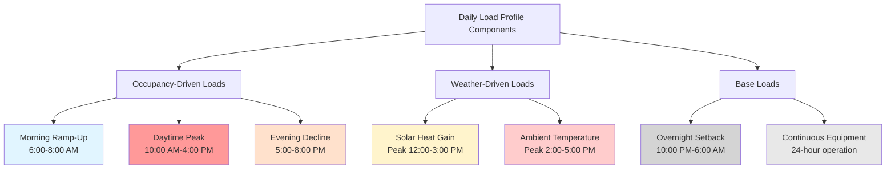
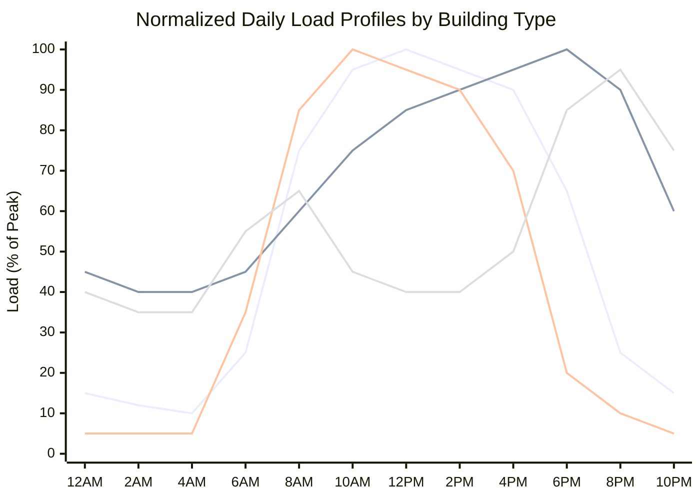

Daily load profiles characterize the time-varying HVAC energy consumption over a 24-hour period. Understanding these patterns enables proper equipment sizing, energy storage strategies, demand response implementation, and utility rate optimization. Load profiles differ significantly between building types, occupancy schedules, and day classifications.

## Load Factor Fundamentals

Load factor quantifies the relationship between average and peak demand over a specified period. For daily analysis:

$$\text{Load Factor} = \frac{\text{Average Load}}{\text{Peak Load}} = \frac{\int_0^{24} P(t) \, dt}{24 \cdot P_{\text{max}}}$$

Where $P(t)$ represents instantaneous power demand at time $t$ and $P_{\text{max}}$ is the maximum demand during the 24-hour period.

A higher load factor (approaching 1.0) indicates more uniform energy consumption, while lower values suggest pronounced peaks. The diversity factor relates individual equipment peaks to system peak:

$$\text{Diversity Factor} = \frac{\sum_{i=1}^{n} P_{\text{max},i}}{P_{\text{max,system}}}$$

The peak-to-average ratio provides another metric:

$$\text{Peak-to-Average Ratio} = \frac{1}{\text{Load Factor}} = \frac{P_{\text{max}}}{\bar{P}}$$

## Commercial Building Load Profiles

Commercial buildings exhibit pronounced daily cycles correlated with occupancy and business hours. DOE Commercial Reference Buildings data shows distinct patterns by building type.

### Office Buildings

Office buildings display sharp morning ramp-up as systems bring the building from setback to occupied conditions. The load rises rapidly between 6:00-8:00 AM as mechanical systems overcome night setback and prepare for occupancy. Peak demand occurs mid-morning (10:00 AM-12:00 PM) as occupancy reaches maximum and solar gains increase. Afternoon loads remain elevated but typically 5-15% below morning peaks. Evening setback begins 5:00-7:00 PM with rapid load reduction.

Typical office load factors range from 0.45-0.60, indicating significant peak-to-average ratios of 1.67-2.22. This load shape makes offices prime candidates for thermal energy storage and demand response programs.

### Retail Buildings

Retail facilities show later peak timing aligned with customer traffic patterns. Big-box retail maintains relatively flat profiles (load factor 0.65-0.75) due to consistent operating hours and internal gains from lighting and refrigeration. Small retail exhibits more variation with peaks occurring 12:00-6:00 PM and load factors of 0.50-0.65.

### Schools and Universities

Educational facilities demonstrate the most pronounced daily peaks, with load factors often below 0.40. The profile shows minimal overnight load, rapid morning ramp-up (6:00-8:00 AM), sustained peak during class hours (8:00 AM-3:00 PM), and quick evening decline. This extreme peaking creates challenges for utility infrastructure but provides excellent demand response opportunities.

## Residential Load Profiles

Residential HVAC loads follow occupancy and thermostat adjustment patterns rather than business hours. Single-family homes typically show bimodal patterns with morning (6:00-9:00 AM) and evening (5:00-10:00 PM) peaks separated by a midday valley when occupants are away. Load factors range from 0.35-0.50 for homes with aggressive setback strategies to 0.60-0.75 for minimal or no setback.

Multi-family buildings display flatter profiles (load factor 0.55-0.70) due to diversity among units—individual occupancy patterns average out across many apartments. Central systems serving multi-family buildings benefit from this diversity, experiencing peak demand 15-30% lower than the sum of individual unit peaks.

## Hourly Load Distribution by Building Type

| Hour | Office | Retail | School | Restaurant | Hotel | Residential |
|------|--------|--------|--------|------------|-------|-------------|
| 0:00 | 15% | 45% | 5% | 20% | 55% | 40% |
| 2:00 | 12% | 40% | 5% | 15% | 50% | 35% |
| 4:00 | 10% | 40% | 5% | 15% | 45% | 35% |
| 6:00 | 25% | 45% | 35% | 30% | 50% | 55% |
| 8:00 | 75% | 60% | 85% | 40% | 65% | 65% |
| 10:00 | 95% | 75% | 100% | 55% | 70% | 45% |
| 12:00 | 100% | 85% | 95% | 85% | 75% | 40% |
| 14:00 | 95% | 90% | 90% | 75% | 75% | 40% |
| 16:00 | 90% | 95% | 70% | 70% | 80% | 50% |
| 18:00 | 65% | 100% | 20% | 100% | 85% | 85% |
| 20:00 | 25% | 90% | 10% | 95% | 90% | 95% |
| 22:00 | 15% | 60% | 5% | 45% | 75% | 75% |

*Values shown as percentage of daily peak load. Based on DOE Commercial Reference Buildings and residential load research.*

## Weekend and Weekday Variations

Commercial buildings exhibit dramatic differences between weekday and weekend profiles. Office buildings show 40-70% lower weekend peak loads with flatter profiles (load factor increases to 0.70-0.85) due to reduced or eliminated occupancy. Retail, restaurant, and hotel loads show less weekend variation, with some retail categories experiencing higher weekend peaks.

Residential patterns show modest weekend shifts—later morning peaks (delayed 1-2 hours), higher midday loads due to home occupancy, and similar evening peaks. Weekend residential load factors typically increase 5-15% due to more distributed activity throughout the day.

## Daily Load Profile Visualization

## Typical Commercial vs Residential Load Curves

## Engineering Applications

Daily load profile analysis informs multiple design and operational decisions:

**Equipment Sizing**: Peak load timing determines chiller and boiler capacity requirements. Systems designed for peak conditions operate at partial load most hours, affecting efficiency.

**Thermal Energy Storage**: Buildings with high peak-to-average ratios (low load factors) benefit economically from storage systems that shift loads from peak to off-peak periods.

**Demand Response**: Understanding load profile timing enables targeted load curtailment during utility peak periods, generating revenue through capacity and energy markets.

**Utility Rate Optimization**: Time-of-use rates, demand charges, and real-time pricing strategies require detailed load profile knowledge to minimize costs.

**Control Strategies**: Optimal start algorithms use historical load profiles to determine pre-occupancy system startup times, balancing comfort and energy consumption.

## Profile Modification Strategies

Several approaches can improve load factors and reduce peak demand:

**Pre-cooling**: Running cooling systems during off-peak hours to reduce building temperature before peak periods. Effective in high-mass buildings where 2-4°F pre-cooling can reduce peak demand 15-30%.

**Setback Optimization**: Balancing energy savings from setback against morning ramp-up penalties. Optimal setback depths depend on building thermal mass, occupancy schedule, and utility rate structure.

**Staggered Scheduling**: In multi-zone or multi-building facilities, staggering startup times reduces coincident peak demand through diversity.

**Load Shedding**: Automatic reduction of non-critical loads during peak periods through building automation system control sequences.

Understanding daily load profiles provides the foundation for energy-efficient HVAC system design, operation, and continuous optimization throughout building lifecycle.
