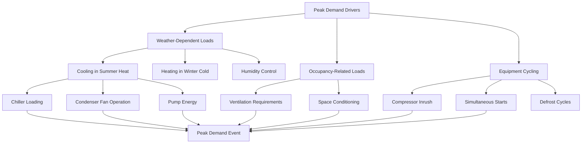

Peak demand characteristics define the maximum instantaneous power draw that HVAC systems impose on electrical infrastructure. Understanding peak demand behavior is essential for managing utility costs, sizing electrical services, and implementing demand response strategies. HVAC equipment typically represents 40-60% of peak electrical demand in commercial buildings and 30-50% in residential applications during extreme weather conditions.

## Peak Demand Fundamentals

Peak demand represents the highest average power consumption during a specified interval, typically measured in 15-minute increments by utility demand meters. The relationship between energy consumption and peak demand determines overall electrical costs and infrastructure requirements.

Load factor quantifies the ratio of average load to peak load over a billing period:

$$\text{Load Factor} = \frac{\text{Average Demand (kW)}}{\text{Peak Demand (kW)}} = \frac{\text{Total Energy (kWh)}}{\text{Peak Demand (kW)} \times \text{Hours in Period}}$$

A load factor approaching 1.0 indicates consistent demand, while lower values indicate significant peaks relative to average consumption. HVAC systems typically exhibit load factors of 0.3-0.6 in commercial buildings, reflecting their weather-dependent operation.

The diversity factor accounts for non-simultaneous operation of multiple loads:

$$\text{Diversity Factor} = \frac{\sum \text{Individual Peak Demands}}{\text{Coincident Peak Demand}}$$

For multi-zone HVAC systems, diversity factors typically range from 1.1 to 1.4, meaning individual equipment peaks do not occur simultaneously.

## Utility Demand Charges

Demand charges represent a significant portion of commercial electric bills, often 30-70% of total costs. Utilities impose demand charges to recover fixed infrastructure costs and incentivize load management. The demand charge structure varies by utility but typically follows this format:

$$\text{Monthly Demand Charge (\$)} = \text{Peak Demand (kW)} \times \text{Demand Rate (\$/kW)}$$

Advanced rate structures include:

**Ratchet Clauses**: Minimum monthly demand set at 50-80% of annual peak for 12 months

$$\text{Billed Demand} = \max(\text{Current Month Peak}, \text{Ratchet Percentage} \times \text{Annual Peak})$$

**Time-of-Use Demand Charges**: Different rates for on-peak, mid-peak, and off-peak periods

**Coincident Peak Charges**: Based on facility demand during utility system peak (typically summer afternoons)

| Demand Charge Component | Typical Range | Impact on HVAC Operations |
|------------------------|---------------|---------------------------|
| Facility Demand Charge | $5-25/kW | Based on 15-min peak any time during month |
| On-Peak Demand Charge | $8-35/kW | Applied during utility peak hours (12-8 PM) |
| Coincident Peak Charge | $3-15/kW | Based on demand during utility system peak |
| Ratchet Demand Charge | 50-80% of annual peak | Penalizes seasonal peaks for 12 months |

## HVAC Contribution to Peak Demand

HVAC systems create building peak demand through several mechanisms, each requiring different management strategies.

Peak demand factors vary significantly by building type based on occupancy patterns, equipment diversity, and thermal mass:

| Building Type | Peak Demand Factor | Load Factor | HVAC % of Peak | Primary Peak Driver |
|---------------|-------------------|-------------|----------------|---------------------|
| Office Building | 0.75-0.85 | 0.45-0.60 | 45-55% | Afternoon cooling, full occupancy |
| Retail | 0.80-0.95 | 0.40-0.55 | 50-65% | Peak shopping hours, high lighting |
| Hotel | 0.60-0.75 | 0.55-0.70 | 35-45% | Guest rooms, laundry operations |
| Hospital | 0.85-0.95 | 0.70-0.85 | 30-40% | 24/7 operation, critical loads |
| School | 0.70-0.85 | 0.30-0.45 | 50-60% | Occupied hours, minimal thermal mass |
| Data Center | 0.90-1.00 | 0.85-0.98 | 35-45% | Constant IT load + cooling |
| Manufacturing | 0.65-0.85 | 0.60-0.75 | 20-35% | Process equipment dominates |
| Warehouse | 0.55-0.70 | 0.35-0.50 | 40-55% | Intermittent HVAC, low diversity |

Peak demand factor represents the ratio of actual measured peak to theoretical maximum simultaneous load.

## Demand Response and Load Shedding

Demand response programs provide financial incentives for reducing electrical demand during utility peak periods or grid emergencies. HVAC systems are prime candidates for demand response due to their thermal storage capacity and controllability.

Common HVAC demand reduction strategies include:

**Pre-cooling**: Lower building temperature 2-4°F below setpoint 2-4 hours before peak period, utilizing thermal mass for load shifting

**Temperature Reset**: Raise cooling setpoint 2-6°F during peak periods, reducing chiller and air-side system energy

**Duty Cycling**: Temporarily shut down HVAC equipment on rotating schedules (typically 15 minutes per hour)

**Chiller Optimization**: Shift to most efficient operating point, potentially reducing capacity

**Supply Air Reset**: Increase supply air temperature 2-4°F to reduce cooling coil load

Demand reduction potential calculation:

$$\Delta P_{\text{DR}} = P_{\text{baseline}} \times \left(1 - \frac{T_{\text{setpoint,DR}} - T_{\text{outdoor}}}{T_{\text{setpoint,normal}} - T_{\text{outdoor}}}\right) \times \eta_{\text{control}}$$

Where $\eta_{\text{control}}$ represents control effectiveness (typically 0.7-0.9 accounting for response delays and partial system participation).

Automated demand response systems monitor real-time pricing signals or utility commands and implement pre-programmed load reduction sequences. Advanced implementations utilize predictive algorithms to optimize thermal pre-conditioning and minimize occupant impact.

## Grid Impact and Infrastructure Sizing

Peak demand determines required capacity for transformers, switchgear, conductors, and utility service equipment. Undersized infrastructure leads to voltage drop, overheating, and potential equipment failure.

Service entrance sizing follows:

$$\text{Service Capacity (A)} = \frac{\text{Peak Demand (kW)} \times 1000}{\sqrt{3} \times \text{Voltage (V)} \times \text{Power Factor}} \times \text{Safety Factor}$$

Safety factors typically range from 1.15 to 1.25 to accommodate future growth and transient conditions. HVAC equipment with low power factor (0.7-0.85 uncorrected) increases required ampacity by 15-40% compared to unity power factor loads.

Transformer sizing must account for non-coincident HVAC peaks:

$$\text{Transformer Capacity (kVA)} = \frac{\text{Peak Demand (kW)}}{\text{Average Power Factor}} \times \text{Diversity Factor}$$

Managing peak demand through HVAC optimization, energy storage, and demand response reduces infrastructure costs by $800-2,500 per kW of avoided peak capacity in new construction and enables operation within existing infrastructure limits in retrofit applications.

## Components

- Coincident Peak Demand
- Non Coincident Peak Demand
- Demand Charges Utility Rates
- Load Factor Annual Average To Peak
