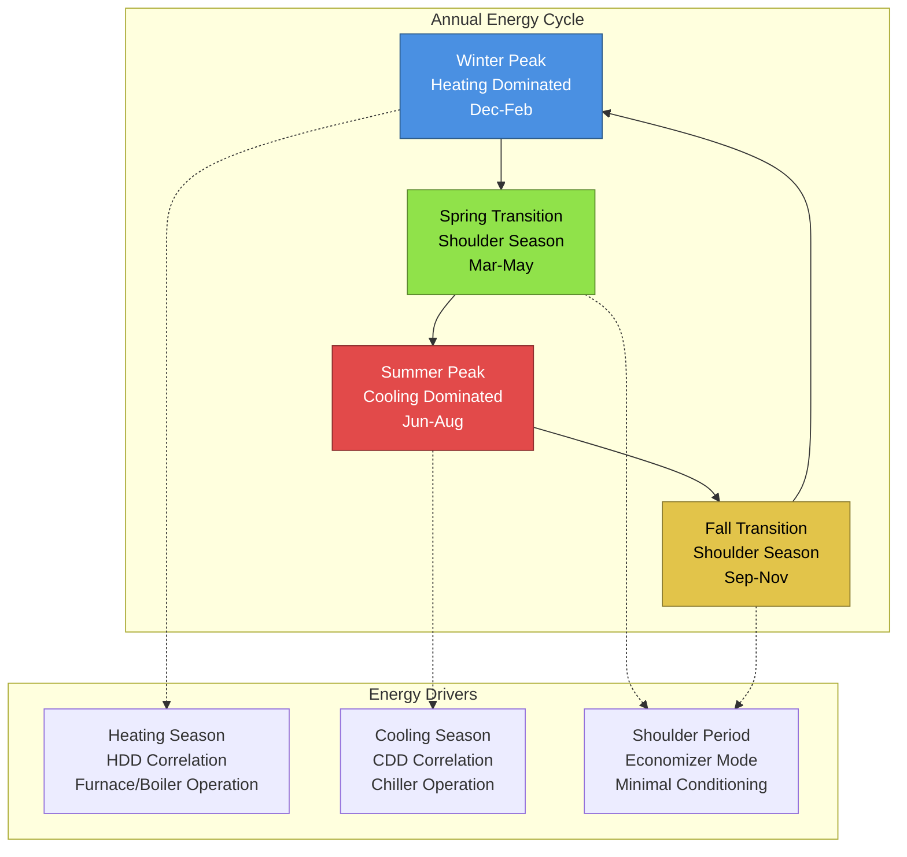

## Seasonal Energy Consumption Fundamentals

HVAC energy consumption follows predictable seasonal patterns driven by weather conditions, occupancy schedules, and building thermal characteristics. Understanding these variations enables accurate energy forecasting, utility cost management, and system optimization strategies. The annual energy cycle divides into three distinct periods: heating season, cooling season, and shoulder months.

## Heating Season Characteristics

The heating season occurs when outdoor temperatures fall below the building balance point, requiring mechanical heating to maintain comfort. Heating loads correlate directly with heating degree days (HDD), calculated from outdoor temperature:

$$\text{HDD}_{\text{base}} = \sum_{i=1}^{n} \max(T_{\text{base}} - T_{\text{outdoor,avg}}, 0)$$

where $T_{\text{base}}$ is the base temperature (typically 65°F or 18°C) and $T_{\text{outdoor,avg}}$ is the daily average outdoor temperature.

Monthly heating energy consumption follows:

$$Q_{\text{heating,month}} = \frac{UA \cdot \text{HDD}_{\text{month}} \cdot 24}{\eta_{\text{heating}}}$$

where:
- $U$ = overall heat transfer coefficient (Btu/h·ft²·°F)
- $A$ = building envelope area (ft²)
- $\eta_{\text{heating}}$ = heating system efficiency (decimal)

Heating season energy intensity peaks during mid-winter months when outdoor temperatures reach annual minimums and building heat loss rates maximize.

## Cooling Season Characteristics

The cooling season begins when outdoor temperatures exceed the building balance point, requiring mechanical cooling. Cooling degree days (CDD) quantify cooling requirements:

$$\text{CDD}_{\text{base}} = \sum_{i=1}^{n} \max(T_{\text{outdoor,avg}} - T_{\text{base}}, 0)$$

Cooling energy consumption includes both sensible and latent components:

$$Q_{\text{cooling,month}} = \frac{Q_{\text{sensible}} + Q_{\text{latent}}}{\text{EER/12}} \cdot \text{Operating Hours}$$

Cooling loads exhibit stronger diurnal variation than heating loads due to solar radiation effects and typically show higher peak-to-average ratios. Latent loads increase significantly in humid climates, potentially representing 30-40% of total cooling energy.

## Shoulder Season Operation

Shoulder months (spring and fall) feature moderate outdoor temperatures, minimal heating and cooling requirements, and maximum opportunity for free cooling through economizer operation. Energy consumption during shoulder periods typically represents 10-20% of peak season usage.

The transition from heating to cooling mode occurs at the building balance point temperature:

$$T_{\text{balance}} = T_{\text{indoor}} - \frac{Q_{\text{internal}}}{UA}$$

where $Q_{\text{internal}}$ represents internal heat gains from occupants, lighting, and equipment.

## Monthly Energy Consumption by Climate Zone

Representative monthly HVAC energy consumption patterns vary significantly across ASHRAE climate zones:

| Month | Zone 1A (Miami) | Zone 4A (NYC) | Zone 5A (Chicago) | Zone 7 (Duluth) |
|-------|-----------------|---------------|-------------------|-----------------|
|       | kWh/1000 ft²    | kWh/1000 ft²  | kWh/1000 ft²     | kWh/1000 ft²   |
| Jan   | 145             | 285           | 340              | 425            |
| Feb   | 140             | 260           | 310              | 390            |
| Mar   | 155             | 195           | 240              | 320            |
| Apr   | 180             | 140           | 165              | 215            |
| May   | 220             | 155           | 180              | 175            |
| Jun   | 265             | 195           | 230              | 185            |
| Jul   | 285             | 245           | 270              | 215            |
| Aug   | 280             | 240           | 265              | 205            |
| Sep   | 250             | 190           | 215              | 170            |
| Oct   | 195             | 150           | 175              | 210            |
| Nov   | 160             | 220           | 270              | 315            |
| Dec   | 150             | 270           | 325              | 405            |

**Note:** Values represent typical office building consumption. Actual values vary with building characteristics, occupancy, and equipment efficiency.

## Weather Correlation Analysis

Energy consumption correlates strongly with outdoor temperature through linear regression models:

$$E_{\text{daily}} = E_{\text{base}} + k_{\text{heating}} \cdot \max(T_{\text{base}} - T_{\text{outdoor}}, 0) + k_{\text{cooling}} \cdot \max(T_{\text{outdoor}} - T_{\text{base}}, 0)$$

where:
- $E_{\text{base}}$ = baseline energy (non-weather dependent loads)
- $k_{\text{heating}}$ = heating slope coefficient (energy per degree day)
- $k_{\text{cooling}}$ = cooling slope coefficient (energy per degree day)

Typical correlation coefficients (R²) between energy consumption and degree days exceed 0.85 for well-characterized buildings, enabling accurate energy prediction from weather forecasts.

## Seasonal Energy Pattern Visualization

## Utility Load Factor Implications

Seasonal variations impact utility load factors, defined as:

$$\text{Load Factor} = \frac{\text{Average Demand}}{\text{Peak Demand}} = \frac{\text{Total kWh}}{\text{Peak kW} \times \text{Hours}}$$

Buildings with extreme seasonal variations exhibit lower annual load factors (0.40-0.60), resulting in higher demand charges per kWh consumed. Balanced loads across seasons improve load factors (0.70-0.85) and reduce overall energy costs.

## Optimization Strategies

**Seasonal Commissioning:** Verify equipment operation before heating and cooling seasons to maximize efficiency during peak demand periods.

**Thermal Energy Storage:** Shift cooling loads from peak afternoon hours to nighttime operation, particularly effective during summer months.

**Economizer Control:** Maximize free cooling during shoulder seasons when outdoor conditions permit, potentially eliminating mechanical cooling for 15-30% of annual operating hours.

**Seasonal Temperature Reset:** Adjust supply air and water temperatures based on outdoor conditions, reducing energy consumption during mild weather while maintaining comfort.

## Annual Load Duration Curves

Load duration curves plot energy demand versus cumulative operating hours, revealing:

- Peak demand magnitude and frequency
- Base load levels during minimal conditioning periods
- Equipment sizing optimization opportunities
- Part-load operating characteristics

The area under the load duration curve represents total annual energy consumption, while curve shape indicates potential for demand reduction strategies and equipment rightsizing.

Understanding seasonal variations enables engineers to optimize system design, predict utility costs, and implement control strategies that minimize energy consumption while maintaining occupant comfort throughout the annual cycle.
