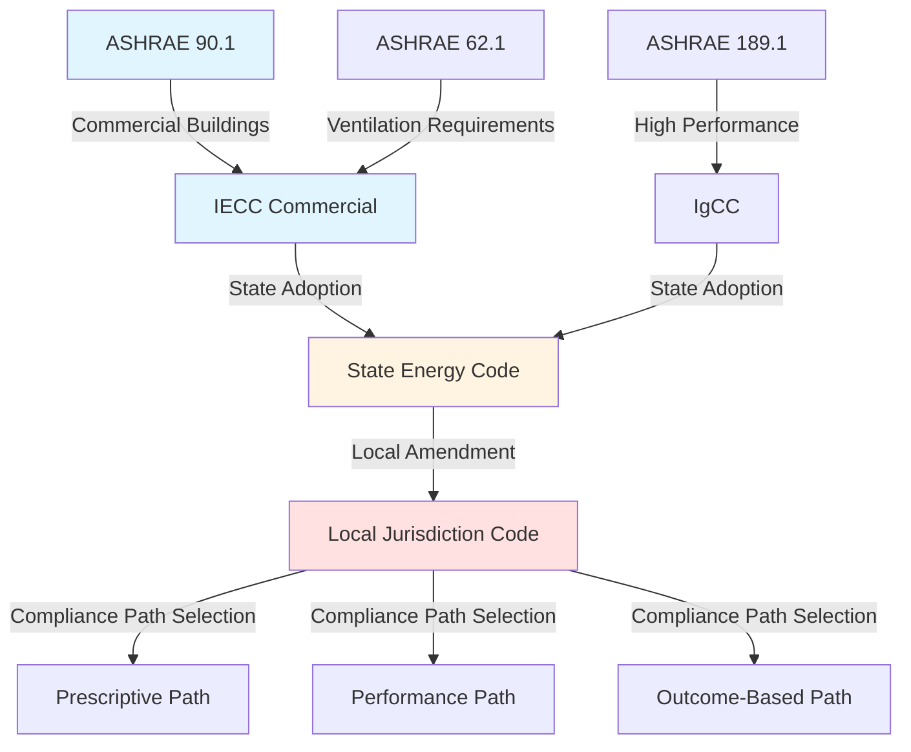

Energy policy establishes the regulatory framework and economic incentives that drive HVAC system efficiency, renewable energy adoption, and emissions reduction. These policies operate at federal, state, and local levels, creating a complex landscape that directly impacts system design, equipment selection, and operational strategies.

## Federal Energy Policy Framework

The United States Department of Energy (DOE) serves as the primary federal authority for energy efficiency standards, while the Environmental Protection Agency (EPA) regulates environmental impacts including refrigerant management and greenhouse gas emissions.

### DOE Efficiency Standards

DOE establishes minimum efficiency standards for HVAC equipment under the Energy Policy and Conservation Act (EPCA). These standards are technology-neutral, performance-based requirements that manufacturers must meet:

**Current Federal Minimum Efficiency Standards:**

| Equipment Type | Capacity Range | Minimum Efficiency | Effective Date |
|----------------|----------------|-------------------|----------------|
| Split System AC | <65,000 Btu/h | 14.0 SEER2 | Jan 1, 2023 |
| Package AC | <65,000 Btu/h | 13.4 SEER2 | Jan 1, 2023 |
| Air-Source Heat Pump | <65,000 Btu/h | 14.3 SEER2 / 7.5 HSPF2 | Jan 1, 2023 |
| Gas Furnace | <225,000 Btu/h | 80% AFUE | Varies by region |
| Commercial Rooftop Unit | 65,000-135,000 Btu/h | 11.2 EER / 11.0 IEER | Jan 1, 2018 |

Standards undergo periodic review and revision through a public rulemaking process. Each update requires economic analysis demonstrating that efficiency improvements are technologically feasible and economically justified based on life-cycle cost analysis.

### EPA Environmental Regulations

EPA authority extends to refrigerant management under the Clean Air Act. The American Innovation and Manufacturing (AIM) Act of 2020 directs EPA to phase down hydrofluorocarbon (HFC) production and consumption by 85% over 15 years:

- **2022-2023**: 10% reduction below baseline
- **2024-2028**: 40% reduction below baseline
- **2029-2033**: 70% reduction below baseline
- **2034-2036**: 80% reduction below baseline
- **2036+**: 85% reduction below baseline

This phasedown creates strong economic incentives for low-GWP refrigerants including HFO blends (R-454B, R-466A) and natural refrigerants (propane, CO₂, ammonia).

## Building Energy Codes

Model energy codes establish baseline performance requirements for new construction and major renovations. These codes are developed by standards organizations and adopted—sometimes with modifications—by state and local jurisdictions.

### Model Code Hierarchy

**ASHRAE Standard 90.1** provides the technical foundation for commercial building energy codes. It employs a three-year update cycle, with each edition incorporating efficiency improvements demonstrated through cost-effectiveness analysis. The standard divides the United States into eight climate zones, with requirements varying by zone to reflect heating and cooling load differences.

**International Energy Conservation Code (IECC)** serves residential and commercial sectors with a three-year update cycle aligned with the International Code Council development process. Jurisdictions typically lag 3-6 years behind the current code edition.

### Prescriptive vs. Performance Compliance

Codes offer multiple compliance paths:

**Prescriptive Path**: Meet component-specific requirements for insulation, window U-factors, HVAC efficiency, and lighting power density. This approach provides certainty but limits design flexibility.

**Performance Path**: Demonstrate that proposed building energy use does not exceed that of a baseline building meeting prescriptive requirements. This approach requires energy modeling (DOE-2, EnergyPlus, or equivalent) but allows trade-offs between building systems.

**Outcome-Based Path**: Verify actual energy performance through post-occupancy metering. This emerging approach addresses the performance gap between design intent and operational reality.

## Federal Incentive Programs

Tax credits and rebates reduce the first-cost barrier to high-efficiency equipment adoption.

### Inflation Reduction Act (IRA) Tax Credits

| Program | Credit Amount | Eligibility | Expiration |
|---------|---------------|-------------|------------|
| 25C Residential Efficiency | Up to $2,000 heat pumps Up to $1,200 other equipment | ENERGY STAR certification HSPF2 ≥ 7.8 for heat pumps | Dec 31, 2032 |
| 25D Renewable Energy | 30% of cost, no cap | Geothermal heat pumps Solar thermal systems | Dec 31, 2032 |
| 45L New Home Credit | $2,500-$5,000 per unit | ENERGY STAR or Zero Energy Ready Home | Dec 31, 2032 |
| 179D Commercial Buildings | Up to $5.00/sq ft | 50% energy cost savings vs. ASHRAE 90.1 | Permanent |

### ENERGY STAR Program

EPA's ENERGY STAR voluntary labeling program identifies products exceeding minimum efficiency standards by 10-20%. The label simplifies consumer choice and qualifies equipment for utility rebates and tax incentives. Specifications are periodically revised to maintain market differentiation as average efficiency improves.

## State and Regional Policies

States implement energy policies beyond federal minimums through enhanced building codes, appliance standards, and clean energy mandates.

### State Appliance Standards

California, New York, Washington, and other states establish efficiency requirements exceeding federal standards for equipment not covered by DOE regulations or during gaps in federal rulemaking. These standards can accelerate national market transformation when they apply to large markets.

### Renewable Portfolio Standards (RPS)

Thirty states plus Washington D.C. mandate that utilities source a specified percentage of electricity from renewable sources by target dates. RPS policies increase renewable generation, which reduces the carbon intensity of grid electricity and improves the environmental performance of electric heating and cooling systems.

### Building Performance Standards (BPS)

Cities including New York, Washington D.C., and Boston require existing buildings to meet energy or emissions targets, with penalties for non-compliance. These policies drive deep energy retrofits including HVAC system upgrades, controls optimization, and fuel switching from fossil fuels to electric heat pumps.

## Carbon Pricing Mechanisms

Carbon pricing internalizes the climate cost of greenhouse gas emissions through direct price signals.

### Cap-and-Trade Programs

The Regional Greenhouse Gas Initiative (RGGI) caps CO₂ emissions from power plants across eleven Northeast and Mid-Atlantic states. Allowances are auctioned quarterly, with proceeds funding energy efficiency programs. California operates a broader cap-and-trade program covering 75% of state emissions including electricity, natural gas, and transportation fuels.

Carbon pricing increases operating costs for fossil fuel heating systems relative to electric heat pumps, shifting life-cycle cost calculations toward electrification.

### Carbon Tax Proposals

A carbon tax directly prices emissions per ton of CO₂-equivalent. While federal carbon tax proposals have not advanced, some jurisdictions implement carbon pricing through building emissions performance standards that effectively tax high-emission buildings.

## Policy Impact on HVAC Design

Energy policy influences system design through multiple mechanisms:

**Equipment Selection**: Minimum efficiency standards eliminate low-efficiency options. Tax credits and utility incentives reduce the incremental cost of high-efficiency equipment, shifting the economic optimum toward premium products.

**Fuel Choice**: Carbon pricing, electrification mandates, and building performance standards favor electric heat pumps over fossil fuel heating. Grid decarbonization through RPS policies strengthens this advantage over time.

**System Optimization**: Performance-based codes and outcome-based compliance paths reward holistic design approaches including load reduction, economizer cycles, heat recovery, and advanced controls.

**Refrigerant Strategy**: HFC phasedown schedules drive equipment manufacturers toward low-GWP refrigerants. Early adoption positions contractors to service future equipment and avoid refrigerant supply constraints.

## Resources

- **DOE Building Energy Codes Program**: energycodes.gov
- **DOE Appliance Standards**: energy.gov/eere/buildings/appliance-and-equipment-standards-program
- **EPA Refrigerant Management**: epa.gov/section608
- **ENERGY STAR**: energystar.gov
- **DSIRE Database**: State incentive information at dsireusa.org
- **ASHRAE Standards**: ashrae.org/technical-resources/standards-and-guidelines

Understanding the policy landscape enables HVAC professionals to anticipate regulatory changes, leverage available incentives, and design systems that meet both current requirements and emerging mandates.
