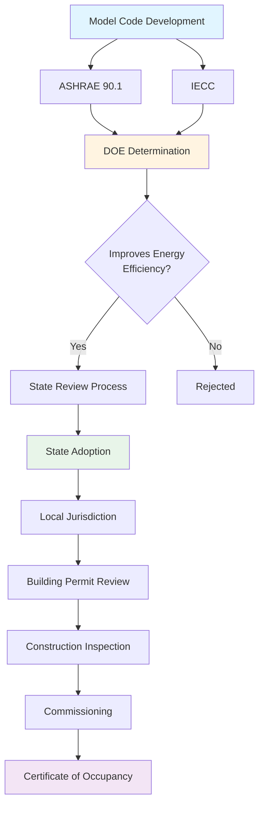

Building energy codes establish minimum requirements for energy-efficient design and construction, with HVAC systems representing 40-60% of building energy consumption. These codes directly influence equipment selection, system design, and operational performance through mandatory efficiency standards and compliance pathways.

## Code Development Framework

The DOE Building Energy Codes Program coordinates the development and implementation of model energy codes through a consensus-based process involving industry stakeholders, government agencies, and technical experts.

## Primary Model Codes

**ASHRAE Standard 90.1 - Energy Standard for Buildings Except Low-Rise Residential Buildings**

This comprehensive standard addresses building envelope, HVAC systems, service water heating, power, lighting, and other equipment. Updated on a three-year cycle, it serves as the foundation for commercial building energy requirements.

**International Energy Conservation Code (IECC)**

Published by the International Code Council on a three-year cycle, the IECC provides separate requirements for residential and commercial buildings. The commercial provisions reference ASHRAE 90.1 or provide equivalent prescriptive requirements.

## HVAC System Requirements

Building energy codes mandate specific HVAC performance criteria that directly impact system design:

**Equipment Efficiency Minimums**

Codes specify minimum efficiency levels for all HVAC equipment based on capacity and type. For example, air-cooled chillers above 150 tons must meet minimum integrated part-load values (IPLV), while packaged rooftop units require minimum energy efficiency ratios (EER) and seasonal energy efficiency ratios (SEER).

**System Design Requirements**

- Economizer requirements based on climate zone and cooling capacity
- Demand-controlled ventilation for spaces with variable occupancy above specified thresholds
- Energy recovery ventilation for systems exceeding outdoor air thresholds
- Supply air temperature reset based on outdoor conditions
- Hydronic system differential pressure reset
- Zone-level thermostatic controls with deadband requirements
- Automatic setback and optimum start controls

**Ventilation Integration**

Codes require compliance with ASHRAE Standard 62.1 for ventilation rates while mandating strategies to minimize energy penalties. This includes dedicated outdoor air systems (DOAS) in certain applications and heat recovery when outdoor air exceeds code-specified percentages.

## Compliance Pathways

Building energy codes offer multiple compliance approaches:

**Prescriptive Path**

This method requires meeting specific requirements for each building component and system. HVAC designers must verify equipment efficiency ratings, control sequences, and system configurations against code tables. The prescriptive path provides clear requirements but limited design flexibility.

**Performance Path**

Also called the energy cost budget method, this approach compares proposed building energy cost to a baseline building designed to prescriptive requirements. HVAC systems can trade efficiency with other building components, enabling innovation. Energy modeling software calculates annual energy performance for both designs.

**Additional Compliance Options**

- ASHRAE Standard 90.1 Appendix G (Performance Rating Method)
- Total building performance alternative
- Renewable energy trade-offs in select jurisdictions

## State Code Adoption Status

State adoption of model energy codes varies significantly, impacting HVAC design requirements across the country:

| Region | States at ASHRAE 90.1-2019/IECC 2021 | States at ASHRAE 90.1-2016/IECC 2018 | States with Older Codes | No Statewide Code |
|--------|--------------------------------------|--------------------------------------|-------------------------|-------------------|
| Northeast | MA, VT, RI, NY, NJ | PA, ME, NH | CT | - |
| Southeast | MD, VA, NC | FL, GA, SC | TN, AL | MS |
| Midwest | IL, OH | MI, WI, MN | IN, IA | MO, KS, ND, SD |
| Southwest | - | TX, NM | OK | - |
| West | CA, WA, OR | NV, CO | UT, ID, WY | AZ, MT |

*Note: This table represents approximate adoption status. Several states exceed model code requirements, particularly California with Title 24. Local jurisdictions in states without statewide codes may adopt more stringent requirements.*

## Code Enforcement and Compliance

**Plan Review Process**

Building departments review construction documents for code compliance before issuing permits. HVAC designers must submit equipment schedules, efficiency ratings, control sequences, and supporting calculations. Incomplete submittals delay project timelines.

**Field Inspection**

Inspectors verify installed equipment matches approved submittals, checking equipment nameplates, thermostat programming, and control sequences. Common violations include:

- Substitution of lower-efficiency equipment
- Omission of required economizers or energy recovery
- Incorrect control programming
- Missing or improperly set deadbands

**Commissioning Requirements**

Recent code editions mandate functional performance testing for HVAC systems above specified thresholds. Commissioning agents verify systems operate according to design intent, testing control sequences, sensor calibration, and integrated operation. Documentation requirements include commissioning reports and operator training verification.

## Code Impact on HVAC Design

Energy codes fundamentally shape HVAC system selection and design:

**Equipment Selection**: Minimum efficiency requirements eliminate lower-cost equipment options, increasing first costs but reducing operating expenses. Life-cycle cost analysis becomes essential for demonstrating value.

**System Complexity**: Required controls and sequences add complexity to system design and operation. Simpler systems may no longer comply, forcing designers toward more sophisticated approaches.

**Design Process**: Performance path compliance requires energy modeling early in design, influencing system selection before detailed engineering begins.

**Commissioning Integration**: Mandatory commissioning changes project delivery, requiring earlier control sequence documentation and extended construction timelines.

## DOE Determination Process

The Department of Energy reviews each model code update to determine if it improves energy efficiency compared to the previous edition. Positive determinations trigger state review requirements under federal law, compelling states to certify their codes meet or exceed the updated model within two years.

This federal oversight accelerates code adoption cycles, though states retain authority to adopt, modify, or reject model codes. The DOE provides technical assistance, compliance tools, and training to support state and local implementation.

## Future Code Directions

Building energy codes continue evolving toward more aggressive efficiency targets:

- Integration of grid-interactive efficient buildings (GEB) concepts
- Greater emphasis on heat pump technologies
- Increased renewable energy requirements
- Enhanced commissioning and verification protocols
- Carbon-based metrics supplementing energy-based requirements

HVAC professionals must track code development cycles and participate in comment periods to influence requirements affecting system design and implementation.
