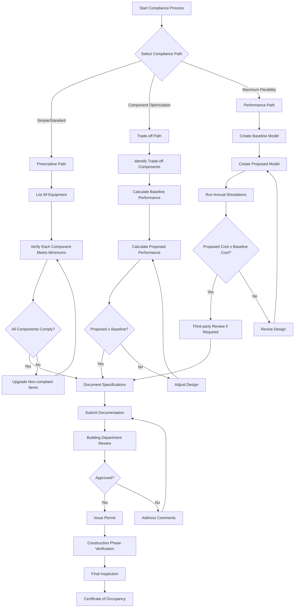

## Overview

Building energy code compliance demonstrates that HVAC system designs meet minimum energy efficiency requirements established by the International Energy Conservation Code (IECC) or ASHRAE Standard 90.1. Three primary compliance paths exist: prescriptive, trade-off, and performance-based methods. Each path offers distinct advantages depending on project complexity, design flexibility requirements, and available resources.

## Compliance Path Selection

Selecting the appropriate compliance path determines the documentation requirements, design flexibility, and evaluation methodology for the project.

| Compliance Path | Design Flexibility | Documentation Level | Best Application | Modeling Required |
|----------------|-------------------|---------------------|------------------|-------------------|
| Prescriptive | Low | Minimal | Standard designs | No |
| Trade-off | Medium | Moderate | Component optimization | Limited |
| Performance | High | Extensive | Innovative designs | Yes |
| Energy Cost Budget | Highest | Most extensive | Complex projects | Yes |

## Prescriptive Compliance Path

The prescriptive path requires each building system component to meet or exceed specific minimum efficiency requirements. This straightforward approach works well for conventional designs using standard equipment and construction methods.

**HVAC Equipment Requirements:**

- Minimum equipment efficiency ratings per equipment type and capacity
- Mandatory economizer requirements for cooling systems above threshold sizes
- Duct and pipe insulation R-values based on location and temperature differential
- Fan power limitations expressed as watts per cubic foot per minute (W/cfm)
- Control requirements including thermostat setback, ventilation controls, and demand control ventilation

**Key Prescriptive Requirements:**

The prescriptive path mandates compliance with every listed requirement. Single component non-compliance disqualifies the entire project from using this path unless the trade-off option is pursued.

Equipment efficiency minimums vary by:
- Equipment type (packaged unit, split system, chiller, boiler)
- Capacity range (equipment ratings change at specific tonnage or Btu/h thresholds)
- Heating or cooling function
- Climate zone (some requirements adjust based on location)

## Trade-off Compliance Path

The trade-off path allows design flexibility by permitting lower efficiency in some components when offset by higher efficiency in others. This method maintains overall building envelope or HVAC system performance at or above code minimum levels.

**IECC UA Trade-off Method:**

Calculates overall thermal transmittance (UA) of the proposed building envelope and compares it to a code-compliant baseline. If proposed UA ≤ baseline UA, the building complies even if individual components fall below prescriptive requirements.

**ASHRAE 90.1 Appendix G Trade-offs:**

Allows component trade-offs within the same system (envelope-to-envelope, HVAC-to-HVAC) but not across systems without full building performance analysis.

| Trade-off Type | Allowed Exchanges | Calculation Method | Limitations |
|---------------|-------------------|-------------------|-------------|
| Envelope | Wall U-value vs. window U-value | UA summation | Same climate zone factors |
| HVAC | Equipment efficiency vs. economizer | Energy equivalency | Same system type |
| Lighting | Fixture efficiency vs. controls | Watts per square foot | Same space type |

## Performance Compliance Path

Performance-based compliance uses whole-building energy simulation to demonstrate that annual energy cost or consumption of the proposed design does not exceed that of a baseline building designed to prescriptive requirements.

**Energy Cost Budget Method (ASHRAE 90.1):**

Compares annual energy costs between proposed and baseline designs. The proposed building must demonstrate equal or lower energy costs when:

- Both models use identical geometry, occupancy, and operating schedules
- Baseline building meets all prescriptive requirements
- Proposed building incorporates actual design specifications
- Identical utility rates apply to both models

**Total Building Performance Method:**

Similar to Energy Cost Budget but may use different compliance metrics including source energy, site energy, or carbon emissions depending on jurisdiction requirements.

## Modeling Requirements

Energy modeling for performance compliance must follow rigorous protocols to ensure accuracy and consistency.

**Baseline Model Requirements:**

- Building geometry matches proposed design exactly
- All systems meet minimum prescriptive requirements
- Standard occupancy schedules from ASHRAE 90.1 Appendix G
- Standard process loads unless actual loads are significantly different
- Orientation rotated in 90-degree increments and results averaged

**Proposed Model Requirements:**

- Actual equipment efficiencies and system configurations
- Actual control sequences and setpoints
- Documented assumptions for all inputs
- Reasonable modeling approaches for non-standard systems

## Documentation Requirements

Complete documentation proves compliance and facilitates building department review.

**Prescriptive Path Documentation:**

- Equipment schedules showing model numbers and efficiency ratings
- Duct and pipe insulation specifications
- Control sequences of operation
- Completed compliance forms (available from code authority)

**Performance Path Documentation:**

- Complete energy modeling report including inputs, outputs, and assumptions
- Baseline and proposed model input files
- Equipment schedules for both baseline and proposed designs
- Narrative explaining modeling methodology and non-standard approaches
- Third-party review certification if required by jurisdiction

## Commissioning Requirements

ASHRAE 90.1 mandates commissioning for specific building types and system complexities. Commissioning verification ensures installed systems operate as designed and meet code requirements.

**Minimum Commissioning Requirements:**

Buildings exceeding size thresholds require HVAC commissioning including:
- Design phase review of sequences and specifications
- Factory and site inspection of equipment
- Functional performance testing of systems and controls
- Documentation of test results and system performance
- Training of building operators

## Common Compliance Challenges

**Equipment Efficiency Verification:**

Verify equipment efficiencies using manufacturer data sheets, not catalog ratings. Part-load efficiency ratings (IPLV, SEER) differ from full-load ratings (EER, COP) and each has specific applications in compliance documentation.

**Climate Zone Determination:**

Requirements vary significantly between IECC climate zones 1-8. Verify the correct climate zone for the project location, as using incorrect zone requirements invalidates compliance.

**Economizer Requirements:**

Economizer thresholds, control types (differential dry-bulb, differential enthalpy, fixed dry-bulb), and exemptions vary between IECC and ASHRAE 90.1. Carefully review applicable requirements.

## Enforcement and Verification

Building departments enforce energy code compliance through plan review and field inspection. Inspectors verify:

- Installed equipment matches approved submittal specifications
- Field-installed insulation meets thickness and location requirements
- Control systems operate per submitted sequences
- Required commissioning activities were completed

Non-compliance discovered during inspection requires corrective action before final approval. Post-construction modifications maintain code compliance requirements.
