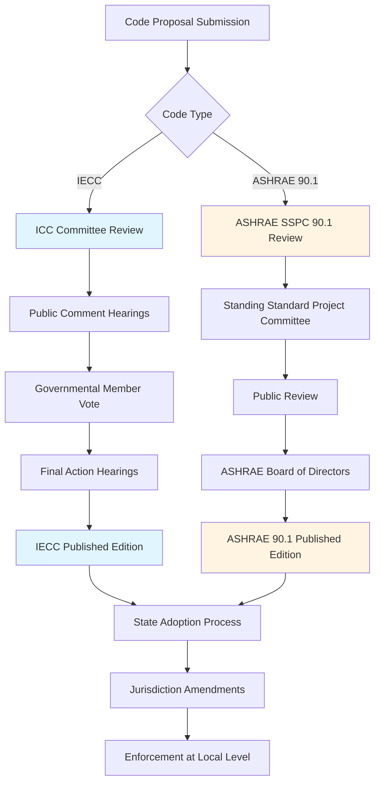

Model energy codes establish minimum requirements for building envelope, mechanical systems, lighting, and service water heating to promote energy efficiency. Two primary model codes dominate the United States: the International Energy Conservation Code (IECC) developed by the International Code Council (ICC) and ASHRAE Standard 90.1 developed by the American Society of Heating, Refrigerating and Air-Conditioning Engineers. These codes provide templates for state and local jurisdictions to adopt, modify, or use as baseline references.

## IECC vs ASHRAE 90.1: Primary Differences

The IECC and ASHRAE 90.1 serve different but overlapping functions in the energy code landscape. Understanding their distinctions enables proper application and compliance verification.

| Aspect | IECC | ASHRAE 90.1 |
|--------|------|-------------|
| Developing Organization | International Code Council (ICC) | American Society of Heating, Refrigerating and Air-Conditioning Engineers (ASHRAE) |
| Code Type | Prescriptive model building code | Performance-based consensus standard |
| Update Cycle | 3-year cycle (2021, 2024, 2027) | 3-year cycle (2019, 2022, 2025) |
| Primary Application | Residential and commercial buildings | Commercial buildings and high-rise residential |
| Adoption Mechanism | Direct adoption by jurisdictions | Referenced by federal buildings, often alternative to IECC |
| Compliance Paths | Prescriptive, performance, ERI | Prescriptive, building performance, energy cost budget |
| Language Style | Mandatory code language ("shall") | Standard language with mandatory provisions |
| Federal Recognition | Basis for many state codes | Required for federal buildings and DOE determinations |
| Coverage | Building envelope, mechanical, lighting, service water heating | Building envelope, HVAC, service water heating, power, lighting, other equipment |

## Code Development Process

Both IECC and ASHRAE 90.1 follow rigorous development processes with public input, though mechanisms differ substantially.

### ICC Code Development

The ICC employs a governmental consensus process for IECC development:

1. **Proposal Stage**: Anyone can submit code change proposals during designated windows
2. **Committee Review**: ICC committees evaluate proposals and issue recommendations
3. **Public Comment**: First round of public hearings where testimony is presented
4. **Governmental Vote**: Governmental members vote on proposals
5. **Final Action**: Additional hearings for contested items
6. **Publication**: New IECC edition published on 3-year cycle

### ASHRAE Standard Development

ASHRAE follows ANSI-accredited consensus procedures for 90.1:

1. **Continuous Maintenance**: Addenda processed continuously between publications
2. **Committee Review**: Standing Standard Project Committee (SSPC 90.1) reviews proposals
3. **Public Review**: 45-day public comment periods for proposed addenda
4. **Committee Response**: SSPC addresses all comments received
5. **Board Approval**: ASHRAE Board of Directors approves standard revisions
6. **Publication**: New editions published approximately every 3 years

## Compliance Pathways

Both codes offer multiple compliance approaches to accommodate different building types and design methodologies.

### IECC Compliance Methods

**Prescriptive Path**: Meet component requirements for insulation, fenestration, air leakage, mechanical efficiency, and lighting power density without performance calculations.

**Performance Path**: Demonstrate proposed building uses no more energy than baseline building through whole-building energy simulation (residential uses Energy Rating Index).

**Additional Efficiency Packages**: Select from menu of options to achieve compliance through combinations of measures.

### ASHRAE 90.1 Compliance Methods

**Prescriptive Path**: Meet minimum requirements in each major section: building envelope (Section 5), mechanical (Section 6), service water heating (Section 7), power (Section 8), lighting (Section 9), and other equipment (Section 10).

**Building Performance Option**: Conduct annual energy cost analysis demonstrating proposed design costs no more than budget building design.

**Energy Cost Budget Method**: Most flexible approach allowing trade-offs between systems if total building energy cost remains below baseline.

## State Adoption and Code Cycles

States adopt model codes on varying schedules, creating patchwork of effective requirements across jurisdictions.

| Adoption Pattern | States | Typical Lag | Notes |
|------------------|--------|-------------|-------|
| Statewide Mandatory Code | CA, FL, NY, WA, OR, MA | 1-3 years | State adopts single code edition for all jurisdictions |
| Statewide with Local Option | TX, NC, VA, CO | 2-4 years | State provides model, localities may adopt/amend |
| Local Adoption Only | MS, MO, KS, AZ | Varies widely | No statewide code, cities adopt independently |
| No Statewide Code | MS (portions) | N/A | Limited or no residential energy code requirements |

**Adoption Lag**: Most states adopt codes 1-4 years after publication. California often operates on accelerated timeline with Title 24 updates. Some jurisdictions remain on codes two or more cycles behind current editions.

**Amendment Authority**: States typically allow local jurisdictions to adopt more stringent requirements than state baseline but prohibit weakening provisions (preemption clauses vary by state).

## IECC and 90.1 Stringency Comparison

ASHRAE 90.1 and IECC commercial provisions have converged in stringency over recent code cycles, though specific requirements differ.

| Code Edition | Relative Stringency | Notable Differences |
|--------------|---------------------|---------------------|
| 2009 IECC vs 90.1-2007 | Generally equivalent | 90.1 more detailed, IECC simpler prescriptive tables |
| 2012 IECC vs 90.1-2010 | IECC slightly more stringent | IECC envelope requirements tighter in some climates |
| 2015 IECC vs 90.1-2013 | Generally equivalent | Similar outcomes, different calculation methods |
| 2018 IECC vs 90.1-2016 | 90.1 slightly more stringent | 90.1 lighting requirements more comprehensive |
| 2021 IECC vs 90.1-2019 | IECC more stringent | IECC introduces renewables requirements (C406) |

Department of Energy conducts periodic determinations comparing editions, finding recent versions achieve 30-50% energy savings compared to ASHRAE 90.1-2004 baseline.

## Code References and Federal Requirements

Federal facilities must comply with ASHRAE 90.1 per Energy Policy Act and subsequent regulations. Federal agencies cannot construct buildings less efficient than most recent 90.1 edition. Many state incentive programs reference IECC or 90.1 as baseline for above-code performance tiers.

DOE Building Energy Codes Program provides technical support, determination rulings, and compliance materials for both IECC and ASHRAE 90.1, facilitating nationwide code implementation and encouraging aggressive update cycles among states.
