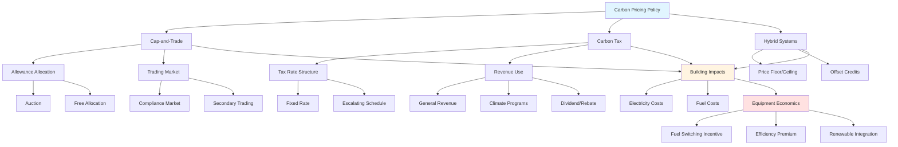

Carbon pricing assigns a monetary cost to greenhouse gas emissions, fundamentally altering the economic calculus of HVAC system design, equipment selection, and operational strategies. These market-based mechanisms directly impact building energy economics by making high-emission energy sources more expensive relative to low-carbon alternatives.

## Carbon Pricing Mechanisms

### Cap-and-Trade Systems (Emissions Trading)

Cap-and-trade establishes a maximum allowable quantity of emissions within a jurisdiction and creates tradeable emission allowances. Total emissions are capped, and allowances are either auctioned or allocated to emitters. Entities that reduce emissions below their allocation can sell surplus allowances to those exceeding limits.

**Key characteristics:**
- Environmental certainty (fixed emissions cap)
- Price volatility (market-determined allowance costs)
- Trading creates economic efficiency
- Allowance allocation methods affect cost distribution

The European Union Emissions Trading System (EU ETS) exemplifies this approach, covering approximately 40% of EU greenhouse gas emissions including power generation and large industrial facilities. Buildings are indirectly affected through electricity pricing.

### Carbon Tax

A carbon tax imposes a direct fee per tonne of CO₂ equivalent emissions, typically applied at the point of fossil fuel extraction or importation. This creates price certainty but allows emission quantities to fluctuate based on economic activity.

**Key characteristics:**
- Price certainty (legislated tax rate)
- Revenue can fund clean energy programs or general budgets
- Administrative simplicity relative to cap-and-trade
- Environmental outcome depends on tax level adequacy

The World Bank reports that carbon tax rates vary from less than $1 to over $130 per tonne CO₂e across implementing jurisdictions as of 2024.

### Hybrid and Offset Mechanisms

Some jurisdictions implement hybrid systems combining elements of both approaches, or allow carbon offsets where entities can meet obligations through verified emission reductions elsewhere. Offset programs may include forestry projects, renewable energy development, or building energy efficiency initiatives.

## Global Carbon Pricing Programs

The following table summarizes major carbon pricing initiatives affecting building energy costs:

| Region/Country | Mechanism | Coverage | Price Range (2024) | Building Impact |
|----------------|-----------|----------|-------------------|-----------------|
| European Union | ETS (cap-and-trade) | Power, industry | €60-90/tonne CO₂ | Indirect via electricity |
| California | Cap-and-trade | Power, fuel, industry | $30-40/tonne CO₂ | Electricity and natural gas |
| Canada | Federal carbon tax | Nationwide fuels | CAD $80/tonne CO₂ | Direct fuel surcharge |
| United Kingdom | Carbon price floor | Electricity generation | £18/tonne CO₂ | Electricity pricing |
| South Korea | ETS | Power, industry, buildings | $10-20/tonne CO₂ | Large buildings direct |
| New Zealand | ETS | All sectors | NZD $60-75/tonne CO₂ | All fossil fuels |
| Switzerland | Carbon tax + ETS | Fuels and industry | CHF 120/tonne CO₂ | Heating fuels direct |
| Singapore | Carbon tax | Large emitters | SGD $25-45/tonne CO₂ | Large facilities |

**Coverage statistics (World Bank 2024):**
- 70+ carbon pricing initiatives globally
- Covering approximately 23% of global greenhouse gas emissions
- Revenues exceeding $95 billion annually

## Impact on HVAC Economics

### Fuel Cost Differential

Carbon pricing increases the cost of fossil fuel combustion relative to electrification or renewable thermal energy. The magnitude depends on:

**Natural gas impact:**
- Natural gas: ~0.05 tonnes CO₂/MMBtu (HHV)
- At $50/tonne CO₂: adds ~$2.50/MMBtu
- 15-25% cost increase at typical gas prices

**Fuel oil impact:**
- No. 2 fuel oil: ~0.073 tonnes CO₂/MMBtu
- At $50/tonne CO₂: adds ~$3.65/MMBtu
- Higher carbon intensity increases relative cost disadvantage

### Electricity Grid Carbon Intensity

Carbon pricing on electricity generation creates variable impacts based on grid mix:

| Grid Type | Carbon Intensity | Cost Impact ($50/tonne) |
|-----------|------------------|-------------------------|
| Coal-heavy | 0.9-1.1 kg CO₂/kWh | $0.045-0.055/kWh |
| Natural gas | 0.4-0.5 kg CO₂/kWh | $0.020-0.025/kWh |
| Mixed renewable | 0.2-0.3 kg CO₂/kWh | $0.010-0.015/kWh |
| Hydro/nuclear | 0.02-0.05 kg CO₂/kWh | $0.001-0.003/kWh |

Regions with clean electricity grids see minimal pricing impact, making electric heat pumps increasingly economically favorable over fossil fuel systems in carbon-priced markets.

### Equipment Selection Implications

**Heating systems:**
Carbon pricing shifts lifecycle cost analysis toward high-efficiency electric heat pumps in regions with carbon taxes on natural gas but low-carbon electricity. A heat pump with COP of 3.0 using grid electricity at 0.3 kg CO₂/kWh produces 0.1 kg CO₂/kWh thermal, compared to 0.18-0.20 kg CO₂/kWh for high-efficiency condensing gas furnaces.

**Cooling systems:**
Variable refrigerant flow (VRF) systems with IEER values of 18-22 Btu/Wh demonstrate lower carbon exposure than constant-volume systems with EER of 10-12 Btu/Wh, reducing both energy consumption and carbon cost liability.

**Combined heat and power:**
Carbon pricing affects CHP economic viability differently than individual heating/cooling equipment. High-efficiency CHP (>80% total efficiency) may remain cost-effective despite carbon costs if displacing grid electricity with higher carbon intensity.

## Carbon Pricing Landscape

## Design and Operational Considerations

### Long-term Planning

Carbon prices typically escalate over time through scheduled increases or market dynamics. British Columbia's carbon tax, for example, increased from CAD $10/tonne in 2008 to $65/tonne by 2023, with further increases legislated. HVAC system design should anticipate price trajectories over equipment 15-25 year service life.

### Peak Demand Response

In carbon-priced electricity markets, demand response programs gain additional value by reducing both energy costs and carbon costs simultaneously during high-carbon-intensity periods (typically fossil fuel peaking generation).

### Refrigerant Considerations

Some jurisdictions price fluorinated greenhouse gases separately from energy-related CO₂. The EU F-gas regulation and similar programs create economic pressure to adopt low-GWP refrigerants (R-32, R-454B, R-290, R-744) independent of carbon pricing on energy consumption.

### Building Codes and Interaction

Carbon pricing interacts with building energy codes. Jurisdictions may tighten codes as carbon prices rise, or alternatively, high carbon prices may reduce regulatory pressure if market mechanisms achieve emission reduction targets.

## Economic Analysis Framework

Life-cycle cost analysis under carbon pricing requires:

1. **Baseline emissions calculation:** Annual energy consumption by fuel type multiplied by carbon intensity factors
2. **Carbon price projection:** Conservative, moderate, and high price scenarios over analysis period
3. **Discount rate selection:** Real discount rates of 3-7% typically used for building investments
4. **Technology learning curves:** Anticipated cost reductions for low-carbon alternatives
5. **Grid decarbonization:** Projected changes in electricity carbon intensity

The net present value calculation becomes:

**NPV = -C₀ + Σ(E_savings + C_savings)/(1+r)ⁿ**

Where:
- C₀ = initial capital cost differential
- E_savings = annual energy cost savings
- C_savings = annual carbon cost savings
- r = discount rate
- n = year

Carbon pricing fundamentally reshapes HVAC economic optimization by internalizing previously external environmental costs. Engineers must integrate carbon price forecasts into equipment selection, understand regional pricing mechanisms, and recognize that low-carbon systems gain economic advantage as carbon prices rise or clean energy costs decline.
