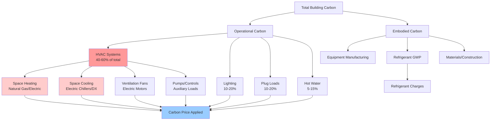

Carbon pricing mechanisms—whether through carbon taxes, cap-and-trade systems, or emissions trading schemes—fundamentally alter the economic landscape for building operations and HVAC system selection. These policies translate greenhouse gas emissions into direct financial costs, creating economic incentives for fuel switching, electrification, and energy efficiency improvements.

## Carbon Cost Impact on Building Operations

The total carbon cost for building operations depends on energy consumption, fuel carbon intensity, and the carbon price:

$$C_{carbon} = \sum_{i=1}^{n} E_i \cdot I_i \cdot P_{carbon}$$

Where:
- $C_{carbon}$ = annual carbon cost (\$/year)
- $E_i$ = annual energy consumption for fuel type $i$ (kWh or therms)
- $I_i$ = carbon intensity of fuel type $i$ (kg CO₂e/kWh)
- $P_{carbon}$ = carbon price (\$/tonne CO₂e)

For a natural gas heating system versus electric heat pump:

$$\Delta C = (Q_{heating} / \eta_{gas}) \cdot I_{gas} \cdot P_{carbon} - (Q_{heating} / COP) \cdot I_{elec} \cdot P_{carbon}$$

Where $Q_{heating}$ is annual heating load (kWh), $\eta_{gas}$ is gas furnace efficiency, and $COP$ is heat pump coefficient of performance.

## Carbon Intensity by Fuel Type

Different fuels carry vastly different carbon intensities, making fuel choice critical under carbon pricing:

| Fuel Type | Carbon Intensity | Energy Content | kg CO₂e per kWh |
|-----------|------------------|----------------|-----------------|
| Natural Gas | 53.1 kg CO₂e/MMBtu | 293 kWh/MMBtu | 0.181 |
| Fuel Oil #2 | 73.2 kg CO₂e/MMBtu | 293 kWh/MMBtu | 0.250 |
| Propane | 62.9 kg CO₂e/MMBtu | 273 kWh/MMBtu | 0.230 |
| Coal | 95.3 kg CO₂e/MMBtu | 293 kWh/MMBtu | 0.325 |
| Grid Electricity (US avg) | — | — | 0.386* |
| Grid Electricity (renewable) | — | — | 0.020-0.050 |

*US average grid intensity varies by region: 0.15-0.70 kg CO₂e/kWh

## Building Carbon Sources

## Electrification Economics Under Carbon Pricing

Carbon pricing significantly improves the economics of building electrification by penalizing fossil fuel combustion while the impact on electricity depends on grid carbon intensity.

### Breakeven Carbon Price

The carbon price at which electric heating becomes cost-competitive with gas:

$$P_{breakeven} = \frac{(E_{elec} \cdot C_{elec}) - (E_{gas} \cdot C_{gas})}{E_{gas} \cdot I_{gas} - E_{elec} \cdot I_{elec}}$$

Where:
- $E_{elec}$, $E_{gas}$ = annual energy consumption (kWh)
- $C_{elec}$, $C_{gas}$ = energy prices (\$/kWh, \$/therm)
- $I_{elec}$, $I_{gas}$ = carbon intensities (kg CO₂e/kWh)

**Example calculation:**
- Gas furnace: 95% efficiency, 100,000 kWh heating load
- Heat pump: COP 3.0
- Gas: \$0.08/kWh (\$0.80/therm), 0.181 kg CO₂e/kWh
- Electricity: \$0.12/kWh, 0.40 kg CO₂e/kWh

Gas energy: 100,000/0.95 = 105,263 kWh = 359 therms
Electric energy: 100,000/3.0 = 33,333 kWh

Annual cost without carbon price:
- Gas: 359 × \$0.80 = \$287
- Electric: 33,333 × \$0.12/kWh = \$4,000

Carbon emissions:
- Gas: 105,263 × 0.181 = 19,053 kg CO₂e = 19.05 tonnes
- Electric: 33,333 × 0.40 = 13,333 kg CO₂e = 13.33 tonnes

At \$100/tonne CO₂e:
- Gas total: \$287 + (19.05 × \$100) = \$2,192
- Electric total: \$4,000 + (13.33 × \$100) = \$5,333

Breakeven: \$100/tonne makes gas competitive despite lower efficiency.

At \$200/tonne CO₂e:
- Gas total: \$287 + \$3,810 = \$4,097
- Electric total: \$4,000 + \$2,666 = \$6,666

Note: This reverses when grid decarbonizes to <0.25 kg CO₂e/kWh.

## Operational vs. Embodied Carbon

Carbon pricing policies typically focus on operational emissions, but comprehensive building decarbonization requires addressing both:

| Carbon Category | HVAC Contribution | Policy Coverage | Mitigation Strategy |
|-----------------|-------------------|-----------------|---------------------|
| Operational Carbon | 40-60% of building total | Direct carbon pricing | Fuel switching, efficiency |
| Embodied Carbon (Equipment) | 5-10% of HVAC lifecycle | Rarely priced | Extended equipment life |
| Refrigerant Emissions | 10-30% of HVAC carbon | Some regulations | Low-GWP refrigerants |
| Grid Electricity | Indirect operational | Carbon price on generation | Clean grid procurement |

### Refrigerant Global Warming Potential

High-GWP refrigerants represent significant embodied carbon that may escape pricing:

$$C_{refrigerant} = M_{charge} \cdot L_{rate} \cdot GWP \cdot P_{carbon} \cdot t_{life}$$

Where:
- $M_{charge}$ = refrigerant charge mass (kg)
- $L_{rate}$ = annual leakage rate (typically 2-10%)
- $GWP$ = global warming potential (kg CO₂e/kg)
- $t_{life}$ = equipment lifetime (years)

**Example:** 50 kg R-410A charge (GWP 2,088), 5% annual leakage, 15-year life, \$100/tonne:

Annual leak: 50 × 0.05 = 2.5 kg
CO₂e: 2.5 × 2,088 = 5,220 kg = 5.22 tonnes
Carbon cost: 5.22 × \$100 = \$522/year

R-32 alternative (GWP 675):
CO₂e: 2.5 × 675 = 1,688 kg
Carbon cost: 1.69 × \$100 = \$169/year
Savings: \$353/year

## Fuel Switching Economic Signals

Carbon pricing creates clear economic signals favoring lower-carbon fuels:

**Carbon cost differential (annual heating example):**

At \$50/tonne CO₂e, 100,000 kWh heating load:
- Coal boiler (80% eff): 125,000 kWh × 0.325 × \$50 = \$2,031
- Oil boiler (85% eff): 117,647 kWh × 0.250 × \$50 = \$1,470
- Gas boiler (95% eff): 105,263 kWh × 0.181 × \$50 = \$953
- Heat pump (COP 3.0): 33,333 kWh × 0.40 × \$50 = \$667
- Heat pump with clean grid (COP 3.0): 33,333 × 0.05 × \$50 = \$83

The economic advantage of electrification increases linearly with carbon price and grid decarbonization.

## Renewable Energy Economics

Carbon pricing improves the payback of on-site renewable energy by providing value for both avoided electricity costs and avoided carbon costs:

$$NPV_{solar} = \sum_{t=1}^{n} \frac{E_{solar} \cdot (C_{elec} + I_{grid} \cdot P_{carbon})}{(1+r)^t} - C_{capital}$$

This dual value stream accelerates renewable energy adoption, particularly in regions with high grid carbon intensity.

## Policy Implications from Carbon Pricing Studies

Research on carbon pricing impacts in buildings shows:

**British Columbia Carbon Tax (2008-present):**
- \$50 CAD/tonne achieved 5-15% reduction in building fossil fuel use
- Accelerated heat pump adoption in residential sector by 30%
- Commercial building retrofits increased 25% above baseline

**EU Emissions Trading System (2005-present):**
- Building sector electrification rate doubled in high-price periods
- Carbon prices >€80/tonne triggered major fuel switching
- Combined heat and power (CHP) economics severely impacted

**California Cap-and-Trade (2013-present):**
- \$15-30/tonne range showed modest building sector impact
- Effect amplified when combined with building performance standards
- Electricity sector decarbonization had larger indirect effect than direct pricing

## Lifecycle Carbon Assessment

Comprehensive building carbon analysis under pricing regimes requires lifecycle assessment:

$$C_{lifecycle} = C_{embodied} + \sum_{t=1}^{n} \frac{C_{operational,t}}{(1+r)^t} + C_{refrigerant} + C_{disposal}$$

For HVAC systems, operational carbon typically dominates over 15-25 year equipment life, making operational efficiency and fuel choice paramount. However, refrigerant emissions and embodied carbon become significant at carbon prices >$100/tonne.

## Strategic Responses to Carbon Pricing

Building owners and operators should:

1. **Conduct carbon audits** to quantify emissions by source and fuel type
2. **Model carbon cost scenarios** at \$50, \$100, \$200/tonne to assess exposure
3. **Prioritize electrification** in regions with clean or decarbonizing grids
4. **Optimize equipment efficiency** to reduce both energy and carbon costs
5. **Select low-GWP refrigerants** to minimize unpriced or under-priced emissions
6. **Invest in on-site renewables** to capture dual energy and carbon value
7. **Monitor grid carbon intensity** to time electrification investments optimally

Carbon pricing transforms HVAC economics by making emissions a direct operating cost. As carbon prices rise globally—with many jurisdictions targeting \$100-200/tonne by 2030—building electrification and efficiency investments become increasingly economically compelling independent of energy costs alone.
