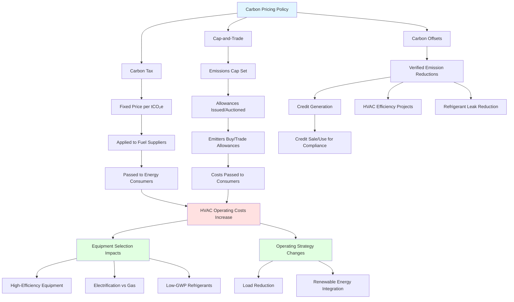

Carbon pricing mechanisms translate greenhouse gas emissions into financial costs, directly impacting HVAC system operating expenses and equipment selection decisions. These policy instruments establish economic incentives for reducing energy consumption and transitioning to low-carbon refrigerants and heating technologies.

## Primary Carbon Pricing Mechanisms

**Carbon Tax** imposes a fixed price per metric ton of CO₂ equivalent emissions. Utilities and energy suppliers pass these costs to end users through higher electricity and natural gas rates. HVAC systems consuming electricity from fossil fuel generation or burning natural gas directly face proportional cost increases based on energy consumption.

**Cap-and-Trade Systems** (emissions trading) establish a declining emissions cap with tradable allowances. Regulated entities must surrender allowances equal to their emissions. Market dynamics determine allowance prices, which fluctuate based on supply, demand, and economic conditions. Energy providers subject to cap-and-trade programs incorporate allowance costs into electricity and fuel rates.

**Carbon Offset Programs** allow emission reductions in one location to compensate for emissions elsewhere. HVAC energy efficiency projects, refrigerant leak reduction, and renewable energy installations can generate offset credits when verified by approved protocols.

## Mechanism Comparison

| Feature | Carbon Tax | Cap-and-Trade |
|---------|-----------|---------------|
| **Price Certainty** | Fixed $/tCO₂e, predictable costs | Market-determined, price volatility |
| **Emission Certainty** | Uncertain reduction level | Guaranteed cap achievement |
| **Administrative Complexity** | Simple collection mechanism | Complex tracking, verification, trading |
| **Revenue Generation** | Direct government revenue | Allowance auction revenue or free allocation |
| **Geographic Scope** | National or provincial | Regional or multi-jurisdiction |
| **HVAC Cost Impact** | Stable, predictable increases | Variable, market-dependent costs |
| **Implementation** | Tax on fuel suppliers/generators | Allowance system for large emitters |
| **Adjustment Mechanism** | Legislative rate changes | Cap tightening over time |

## HVAC System Cost Impacts

Carbon pricing affects HVAC operations through multiple pathways:

**Direct Fuel Costs**: Natural gas heating systems face carbon charges on combustion emissions. A carbon price of $50/tCO₂e adds approximately $0.27/therm to natural gas costs (0.0053 tCO₂e/therm × $50/tCO₂e).

**Electricity Costs**: Electric heating, cooling, and ventilation face carbon costs embedded in electricity rates. Impact depends on grid generation mix. Coal-heavy grids incur higher charges (0.9-1.0 tCO₂e/MWh) compared to natural gas (0.4-0.5 tCO₂e/MWh) or renewable-dominated systems.

**Refrigerant Emissions**: Some jurisdictions price high-GWP refrigerant emissions. HFC leakage from 100-ton chiller (2% annual leak rate, R-134a GWP 1,430) equals 2.9 tCO₂e annually. At $50/tCO₂e, this represents $145/year additional cost, incentivizing low-GWP alternatives.

## Carbon Pricing Mechanism Flow

## Existing Carbon Pricing Programs

**European Union Emissions Trading System (EU ETS)**: World's largest cap-and-trade program, covering power generation and industrial facilities. Allowance prices reached €80-100/tCO₂e in 2023. Building HVAC systems face indirect costs through electricity prices.

**Regional Greenhouse Gas Initiative (RGGI)**: Northeastern U.S. cap-and-trade program for power sector. Covers Connecticut, Delaware, Maine, Maryland, Massachusetts, New Hampshire, New Jersey, New York, Pennsylvania, Rhode Island, Vermont, Virginia. Allowance prices fluctuate $10-15/tCO₂e. Commercial HVAC electricity costs increase proportionally.

**California Cap-and-Trade**: Comprehensive system covering 85% of state emissions, including electricity generation and natural gas suppliers. Allowance prices range $25-35/tCO₂e. Both electric and gas HVAC systems face direct cost impacts.

**Canada Federal Carbon Tax**: Backstop carbon price applying to provinces without equivalent systems. Started at $20/tCO₂e (2019), increasing $15/year to $170/tCO₂e by 2030. Direct impact on natural gas heating costs.

**British Columbia Carbon Tax**: Provincial carbon tax on fossil fuels, reaching $65 CAD/tCO₂e (2023). Applied at point of fuel purchase/distribution. Significant impact on gas-fired heating economics.

## Design and Equipment Selection Implications

Carbon pricing fundamentally alters HVAC economic evaluations:

**Life-Cycle Cost Analysis**: Higher operating costs from carbon pricing improve payback periods for high-efficiency equipment. Systems with 10-20% efficiency improvements show enhanced economics under carbon pricing scenarios.

**Fuel Switching Economics**: Carbon pricing favors electrification in regions with low-carbon electricity grids. Heat pump installations become economically advantageous compared to natural gas furnaces when carbon prices exceed $30-50/tCO₂e in most climates.

**Refrigerant Selection**: Carbon pricing on high-GWP refrigerants accelerates transition to low-GWP alternatives (R-32, R-454B, R-1234yf, natural refrigerants). Economic analysis must include potential refrigerant emission costs over system lifetime.

**System Sizing**: Carbon pricing incentivizes right-sizing equipment to minimize oversizing-related inefficiencies. Load calculations become more critical as energy waste carries higher financial penalties.

## Compliance and Offset Opportunities

HVAC energy efficiency improvements can generate carbon offset credits under approved protocols:

**Energy Efficiency Protocols**: Building retrofits, HVAC system upgrades, and control optimization reducing verified energy consumption qualify for offset generation. Projects must demonstrate additionality (beyond business-as-usual) and permanent emission reductions.

**Refrigerant Management**: Leak reduction programs, proper recovery during service/decommissioning, and low-GWP refrigerant conversions generate offsets. Quantification requires baseline leak rate documentation and ongoing verification.

**Renewable Integration**: HVAC systems coupled with on-site solar, geothermal, or wind generation can monetize emission reductions. Geographic location and grid carbon intensity determine offset value.

## Strategic Planning Considerations

Organizations managing large HVAC portfolios should incorporate carbon pricing into:

- **Capital budgeting**: Model equipment replacement decisions under rising carbon price scenarios ($50-150/tCO₂e by 2030-2040 in many jurisdictions)
- **Energy procurement**: Evaluate renewable energy contracts, carbon-free power options, and hedging strategies
- **Maintenance programs**: Implement rigorous refrigerant leak detection/repair to minimize high-GWP emissions
- **Technology roadmaps**: Plan transitions to electric heating, low-GWP refrigerants, and high-efficiency equipment aligned with policy timelines

Carbon pricing mechanisms represent permanent policy fixtures in major economies, requiring integration into all HVAC engineering and operational decisions.

## Components

- Carbon Tax Emissions Fee
- Cap And Trade Emissions Trading
- Regional Greenhouse Gas Initiative Rggi
- California Cap And Trade
- Social Cost Carbon
- Carbon Offset Programs
