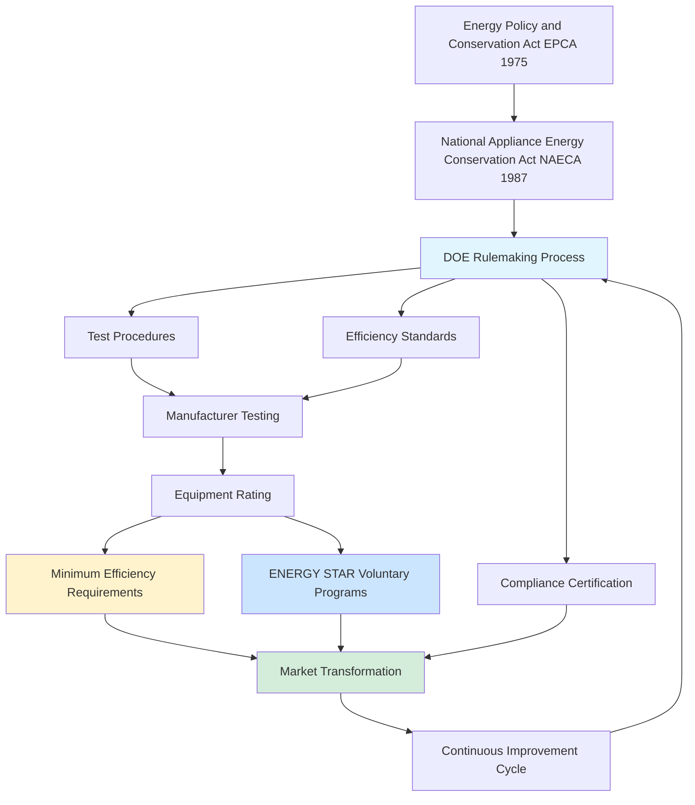

Federal efficiency standards establish minimum performance requirements for HVAC equipment sold in the United States. These regulations, primarily administered by the Department of Energy (DOE), transform markets by eliminating inefficient equipment and driving technological advancement.

## Regulatory Framework

## Federal Minimum Efficiency Standards

The DOE establishes minimum efficiency levels for residential and commercial HVAC equipment under authority granted by EPCA and amended by NAECA. Equipment failing to meet these minimums cannot be manufactured or imported for sale in the United States.

### Current Residential Standards (Effective 2023)

| Equipment Type | Region | Minimum Efficiency | Effective Date |
|----------------|--------|-------------------|----------------|
| Central AC (Split) | North | 14.0 SEER2 / 11.2 EER2 | January 1, 2023 |
| Central AC (Split) | South | 15.0 SEER2 / 11.7 EER2 | January 1, 2023 |
| Central AC (Split) | Southwest | 14.3 SEER2 / 12.2 EER2 | January 1, 2023 |
| Heat Pump (Split) | North | 15.0 SEER2 / 11.2 EER2 | January 1, 2023 |
| Heat Pump (Split) | South | 15.0 SEER2 / 11.7 EER2 | January 1, 2023 |
| Gas Furnace | All | 80% AFUE (non-weatherized) | Ongoing |
| Package Units | All | 14.0 SEER2 / 11.0 EER2 | January 1, 2023 |

The 2023 standards represent the most significant update in over a decade, introducing new test procedures (SEER2, EER2, HSPF2) that more accurately reflect real-world performance.

### Commercial Unitary Equipment Standards

| Equipment Category | Size Range | Minimum Efficiency | Standard |
|-------------------|------------|-------------------|----------|
| Commercial AC (Air-Cooled) | < 65,000 Btu/h | 14.0 SEER2 | ASHRAE 90.1 |
| Commercial AC (Air-Cooled) | ≥ 65,000 to < 135,000 Btu/h | 11.2 EER | ASHRAE 90.1 |
| Commercial AC (Air-Cooled) | ≥ 135,000 to < 240,000 Btu/h | 11.0 EER | ASHRAE 90.1 |
| Commercial AC (Water-Cooled) | < 65,000 Btu/h | 12.0 EER | ASHRAE 90.1 |
| Commercial Heat Pump | < 65,000 Btu/h | 14.0 SEER2 | ASHRAE 90.1 |
| Packaged Terminal AC (PTAC) | All | 11.9 - 0.213 × Cap/1000 EER | DOE |

Commercial standards reference ASHRAE Standard 90.1, which is updated triennially and subsequently adopted into federal regulations through DOE rulemaking.

## DOE Rulemaking Process

The DOE follows a structured process to establish and update efficiency standards:

1. **Framework Document** - Outlines scope, product classes, and analytical approach
2. **Preliminary Analysis** - Screens design options and estimates impacts
3. **Notice of Proposed Rulemaking (NOPR)** - Presents proposed standards for public comment
4. **Final Rule** - Establishes standards after considering public input
5. **Compliance Date** - Typically 3-5 years after final rule publication

This multi-year process allows manufacturers time to redesign products, retool production facilities, and transition inventory.

## Energy Labeling Requirements

### EnergyGuide Labels

The Federal Trade Commission (FTC) mandates EnergyGuide labels on most HVAC equipment. These yellow labels provide:

- Estimated annual energy consumption (kWh or therms)
- Estimated annual operating cost
- Efficiency rating (SEER2, EER2, AFUE, etc.)
- Comparison range showing most and least efficient similar models

### Efficiency Metric Display

Manufacturers must prominently display efficiency ratings:

- **SEER2/HSPF2** - On residential air conditioners and heat pumps
- **AFUE** - On furnaces and boilers
- **EER/IEER** - On commercial unitary equipment
- **COP/IPLV** - On chillers

These ratings enable consumers and specifiers to compare equipment performance objectively.

## ENERGY STAR Voluntary Program

ENERGY STAR, jointly administered by DOE and EPA, identifies products exceeding minimum standards by significant margins. Current ENERGY STAR criteria for residential equipment:

| Product | ENERGY STAR Minimum | Federal Minimum | Premium Above Standard |
|---------|---------------------|-----------------|------------------------|
| Central AC (North) | 15.0 SEER2 | 14.0 SEER2 | 7.1% |
| Central AC (South) | 16.0 SEER2 | 15.0 SEER2 | 6.7% |
| Heat Pump (Split) | 16.0 SEER2 | 15.0 SEER2 | 6.7% |
| Gas Furnace | 95% AFUE | 80% AFUE | 18.8% |

ENERGY STAR certification provides access to utility rebates, tax incentives, and procurement preferences while signaling premium performance to buyers.

## Market Transformation Impact

Efficiency standards transform HVAC markets through multiple mechanisms:

**Technology Advancement** - Standards drive investment in research and development. Manufacturers develop variable-speed compressors, advanced heat exchangers, and optimized refrigerant circuits to meet increasingly stringent requirements.

**Energy Savings** - DOE estimates that standards implemented from 1987 through 2030 will save consumers $2.1 trillion in energy costs while reducing carbon emissions by 7.6 billion metric tons.

**Product Availability** - Minimum standards eliminate the least efficient equipment from the market, simplifying specification and ensuring baseline performance. The average efficiency of equipment sold significantly exceeds minimums as manufacturers compete on performance.

**Cost-Effectiveness** - Standards follow economic analysis ensuring benefits exceed costs over equipment lifetime. Increased first costs are recovered through operating savings, typically within 3-5 years for residential equipment.

**Regional Differentiation** - Geographic variation in standards (North, South, Southwest regions) recognizes climate differences and optimizes national energy savings by requiring higher efficiency where cooling loads predominate.

## Compliance and Enforcement

Manufacturers must certify compliance through:

- Testing per DOE test procedures
- Certification filing with DOE
- Ongoing quality control testing
- Record retention for regulatory review

DOE enforcement includes marketplace surveillance, investigation of complaints, and penalties for non-compliance ranging from civil fines to equipment recalls.

## Future Standard Updates

DOE continuously reviews standards under statutory deadlines. Upcoming rulemakings address:

- Residential central air conditioners and heat pumps (potential 2027 update)
- Commercial packaged equipment (2025 review)
- Furnaces and boilers (ongoing litigation and analysis)
- Emerging technologies (heat pump water heaters, ductless systems)

Standards will continue driving efficiency improvements as technology advances and economic analysis supports higher performance levels.

Federal efficiency standards represent a cornerstone of national energy policy, reducing energy consumption, lowering utility bills, and decreasing environmental impacts while maintaining market competition and consumer choice within a framework of minimum acceptable performance.
