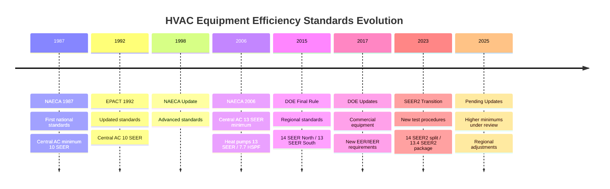

## Federal Minimum Efficiency Standards

The Department of Energy (DOE) establishes minimum efficiency standards for HVAC equipment sold in the United States under authority granted by the National Appliance Energy Conservation Act (NAECA) and subsequent Energy Policy Acts (EPACT). These standards eliminate the least efficient equipment from the market, establishing baseline performance requirements that manufacturers must meet.

Federal efficiency standards apply nationwide and set the absolute minimum performance levels. Regional standards impose higher requirements in specific climate zones where greater efficiency provides substantial energy savings. The DOE periodically reviews and updates these standards through a formal rulemaking process that includes technical analysis, economic assessment, and public comment periods.

## Current Federal Minimum Requirements

### Residential Air Conditioning and Heat Pumps

| Equipment Type | Capacity | Minimum Efficiency | Effective Date |
|----------------|----------|-------------------|----------------|
| Central AC (Split) | < 45,000 BTU/h | 14.0 SEER2 | January 1, 2023 |
| Central AC (Package) | < 45,000 BTU/h | 13.4 SEER2 | January 1, 2023 |
| Heat Pump (Split) | < 65,000 BTU/h | 14.3 SEER2 / 7.5 HSPF2 | January 1, 2023 |
| Heat Pump (Package) | < 65,000 BTU/h | 13.4 SEER2 / 6.7 HSPF2 | January 1, 2023 |

### Commercial Unitary Air Conditioners

| Equipment Type | Cooling Capacity | Minimum EER | Minimum IEER | Effective Date |
|----------------|------------------|-------------|--------------|----------------|
| Air-Cooled (3-phase) | < 65,000 BTU/h | 11.2 | 12.2 | January 1, 2018 |
| Air-Cooled (3-phase) | 65,000-135,000 BTU/h | 11.0 | 12.0 | January 1, 2018 |
| Air-Cooled (3-phase) | 135,000-240,000 BTU/h | 10.0 | 11.6 | January 1, 2018 |
| Air-Cooled (3-phase) | 240,000-760,000 BTU/h | 9.5 | 11.0 | January 1, 2018 |
| Water-Cooled | < 65,000 BTU/h | 12.1 | 13.1 | January 1, 2018 |
| Water-Cooled | ≥ 65,000 BTU/h | 12.5 | 13.9 | January 1, 2018 |

### Furnaces and Boilers

| Equipment Type | Minimum AFUE | Effective Date |
|----------------|--------------|----------------|
| Non-Weatherized Gas Furnace | 95% (North), 80% (South) | Variable by region |
| Weatherized Gas Furnace | 81% | May 1, 2013 |
| Mobile Home Gas Furnace | 80% | September 1, 2012 |
| Oil-Fired Furnace | 83% | May 1, 2013 |
| Hot Water Boiler (Gas) | 82% | March 2, 2012 |
| Steam Boiler (Gas) | 80% | March 2, 2012 |

## Regional Standards

The DOE divides the United States into regions with different minimum efficiency requirements based on climate characteristics. The regional approach recognizes that cooling equipment efficiency matters more in hot climates, while heating efficiency matters more in cold climates.

**Northern Region States:** Alaska, Colorado, Connecticut, Idaho, Illinois, Indiana, Iowa, Kansas, Maine, Massachusetts, Michigan, Minnesota, Missouri, Montana, Nebraska, New Hampshire, New Jersey, New York, North Dakota, Ohio, Oregon, Pennsylvania, Rhode Island, South Dakota, Utah, Vermont, Washington, West Virginia, Wisconsin, Wyoming

**Southern Region States:** Alabama, Arkansas, Arizona, California, Delaware, Florida, Georgia, Hawaii, Kentucky, Louisiana, Maryland, Mississippi, Nevada, New Mexico, North Carolina, Oklahoma, South Carolina, Tennessee, Texas, Virginia

Northern region furnace requirements reach 95% AFUE, while southern regions maintain 80% AFUE minimums. This reflects the reduced heating demand in milder climates where the incremental cost of high-efficiency equipment cannot be justified by energy savings.

## SEER to SEER2 Transition

Effective January 1, 2023, the DOE transitioned from Seasonal Energy Efficiency Ratio (SEER) to SEER2 ratings. SEER2 uses updated test procedures under ASHRAE Standard 210/240-2023 that better represent actual operating conditions, including higher external static pressure for ducted systems.

The transition requires new minimum efficiency levels:
- SEER 13 became SEER2 13.4 for package units
- SEER 14 became SEER2 14.0 for split systems

SEER2 ratings appear approximately 1 point lower than equivalent SEER ratings due to more stringent test conditions, but represent the same actual efficiency level.

## Key Legislation Timeline

## Test Procedure Requirements

Federal standards mandate standardized test procedures that ensure consistent, repeatable efficiency measurements. AHRI (Air-Conditioning, Heating, and Refrigeration Institute) certifies equipment compliance through independent laboratory testing. Test procedures specify:

**Operating Conditions:** Exact indoor and outdoor temperature/humidity combinations representing seasonal averages

**Installation Configuration:** Ductwork static pressure, airflow rates, refrigerant charge verification

**Measurement Parameters:** Power input accuracy, capacity measurement methods, cyclic performance

**Seasonal Calculations:** Weighting factors for different operating conditions reflecting actual use patterns

The DOE updates test procedures periodically to reflect technological advances and improve accuracy. Equipment rated under older test procedures cannot be directly compared to equipment rated under newer procedures without conversion factors.

## Upcoming Standard Changes

The DOE continuously evaluates efficiency standards through formal rulemaking processes. Current and pending actions include:

**Commercial Air Conditioning (Under Review):** Proposed increases in minimum EER and IEER requirements for rooftop units and split systems, potentially effective 2026-2027

**Residential Heat Pumps (Analysis Phase):** Evaluation of higher SEER2 and HSPF2 minimums reflecting improved heat pump technology and electrification initiatives

**Variable Refrigerant Flow (VRF) Systems:** Development of test procedures and minimum efficiency standards for VRF equipment not previously covered

**Energy Conservation Standards Process:** Follows a multi-year timeline including preliminary analysis, notice of proposed rulemaking, public comment, final rule publication, and compliance date typically 3-5 years after final rule

Manufacturers must redesign products, adjust production lines, and phase out non-compliant models before effective dates. The extended implementation timeline allows industry transition while preventing market disruption.

## Compliance and Enforcement

The DOE enforces efficiency standards through certification requirements, testing verification, and penalties for non-compliance. Manufacturers must:

- Certify all covered equipment models meet applicable standards
- Maintain test records demonstrating compliance
- Label equipment with efficiency ratings
- Submit data to AHRI for independent verification

Non-compliant equipment sales result in civil penalties calculated per unit sold. The Federal Trade Commission (FTC) enforces labeling requirements under separate authority, ensuring consumers receive accurate efficiency information.

State and local codes may adopt higher minimum efficiency requirements than federal standards but cannot establish lower minimums. California Title 24 and Washington State energy codes exemplify state-level standards exceeding federal minimums in response to regional energy policy priorities.

## Impact on Equipment Selection

Minimum efficiency standards establish the baseline for equipment comparison but do not represent optimal efficiency levels. Higher efficiency equipment remains available and often provides superior lifecycle value through reduced operating costs. Design professionals must evaluate:

**First Cost vs. Operating Cost:** Higher efficiency equipment costs more initially but saves energy over its lifetime

**Climate Factors:** More extreme climates justify higher efficiency investments through greater annual energy savings

**Utility Rates:** High electricity costs amplify the value of efficiency improvements

**Incentive Programs:** Utility rebates and tax credits often offset incremental costs of high-efficiency equipment

Federal minimums eliminate the worst-performing equipment but selecting equipment at minimum efficiency levels rarely represents optimal design practice.
