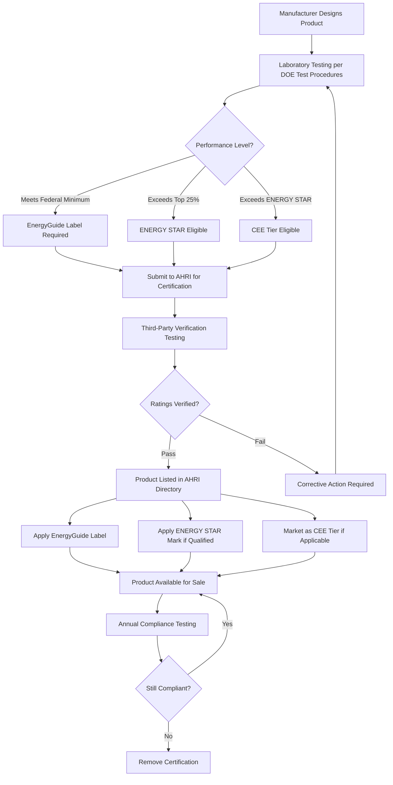

## Overview

Energy labeling programs provide standardized, consumer-facing information about HVAC equipment efficiency and operating costs. These programs serve dual purposes: mandatory disclosure requirements ensure consumers receive basic performance data, while voluntary certification programs identify premium-efficiency equipment. The U.S. Department of Energy (DOE) administers mandatory labeling through the EnergyGuide program, while the Environmental Protection Agency (EPA) manages the voluntary ENERGY STAR program.

## Major Labeling Programs Comparison

| Program | Type | Administrator | Scope | Performance Level | Label Requirements |
|---------|------|---------------|-------|-------------------|-------------------|
| **EnergyGuide** | Mandatory | DOE/FTC | All covered products | Minimum standards | Yellow label with annual cost |
| **ENERGY STAR** | Voluntary | EPA | Selected categories | Top 25% performers | Blue logo certification |
| **CEE Tiers** | Voluntary | Consortium | Premium products | Multiple performance levels | Tier 1-4 designation |
| **AHRI Certified** | Voluntary | Industry | All rated equipment | Verified ratings | Directory listing |

## EnergyGuide Label Requirements

The Federal Trade Commission (FTC) mandates EnergyGuide labels on all covered HVAC equipment sold in the United States. These yellow labels provide standardized information enabling side-by-side product comparisons.

**Required Label Information:**
- Equipment type and capacity
- Annual energy consumption (kWh/year or therms/year)
- Estimated annual operating cost based on national average energy rates
- Efficiency rating (SEER, AFUE, EER, HSPF as applicable)
- Comparison scale showing range for similar products
- Manufacturer and model identification

The EnergyGuide label uses DOE test procedures to establish energy consumption values. For central air conditioners, the label displays SEER2 ratings (as of January 2023) and estimated annual electricity costs based on 2,000 cooling hours at $0.13/kWh. For furnaces, AFUE percentages indicate the proportion of fuel converted to useful heat.

## ENERGY STAR Certification

The EPA's ENERGY STAR program identifies products exceeding minimum federal standards by significant margins. Qualifying equipment typically performs in the top 25% of its category for energy efficiency.

**Current ENERGY STAR Requirements (2024):**

| Equipment Type | Minimum Efficiency | Federal Minimum | Improvement |
|----------------|-------------------|-----------------|-------------|
| Central AC (Split) | 15.2 SEER2 (North) / 14.3 SEER2 (South) | 13.4-14.3 SEER2 | 6-13% |
| Heat Pump (Split) | 15.2 SEER2, 8.1 HSPF2 | 13.4-14.3 SEER2, 6.7-7.5 HSPF2 | 8-15% |
| Gas Furnace | 95% AFUE (North) / 90% AFUE (South) | 80-90% AFUE | 6-19% |
| Boiler (Gas) | 95% AFUE | 84-95% AFUE | Up to 13% |
| Ductless Mini-Split | 15.2 SEER2, 9.5 HSPF2 | No federal minimum | N/A |

ENERGY STAR specifications undergo periodic revision to maintain the top-quartile performance threshold as market efficiency improves. Equipment manufacturers must submit products to EPA-recognized laboratories for testing and certification before using the ENERGY STAR mark.

## Consortium for Energy Efficiency (CEE) Tiers

CEE establishes voluntary performance tiers beyond ENERGY STAR levels, creating pathways for utility rebate programs and premium efficiency incentives.

**CEE Tier Structure:**
- **Tier 1**: Exceeds ENERGY STAR by 5-10%
- **Tier 2**: Exceeds ENERGY STAR by 10-15%
- **Tier 3**: Exceeds ENERGY STAR by 15-20%
- **Tier 4**: Highest commercially available efficiency

Utilities and regional efficiency programs commonly structure rebates according to CEE tiers. For example, a Tier 1 heat pump might qualify for a $500 rebate, while a Tier 3 unit receives $1,500. This tiered approach incentivizes continuous efficiency improvements while recognizing diminishing returns at higher performance levels.

## AHRI Certification Program

The Air-Conditioning, Heating, and Refrigeration Institute (AHRI) operates an independent certification program verifying manufacturer-claimed ratings. While not an energy label per se, AHRI certification provides third-party validation of performance claims.

**AHRI Certified Directory includes:**
- SEER2, EER, and HSPF2 ratings for cooling equipment
- AFUE ratings for furnaces and boilers
- Sound ratings for residential equipment
- Matched system performance for split systems
- Capacity ratings at standard conditions

Equipment bearing the AHRI Certified mark undergoes random testing to verify published ratings fall within acceptable tolerances (±5% for capacity, ±5% for efficiency).

## Labeling Process and Certification Flow

## DOE Test Procedures and Standards

The Department of Energy establishes test procedures that form the foundation for all labeling programs. These standardized test methods ensure consistent, repeatable measurements across manufacturers.

**Key DOE Test Standards:**
- **10 CFR 430**: Energy conservation standards for residential equipment
- **ANSI/AHRI 210/240**: Performance rating of unitary air-conditioning equipment
- **ANSI/ASHRAE 103**: Method of testing for seasonal efficiency (AFUE)
- **ANSI/AHRI 1230**: Performance rating of variable refrigerant flow systems

Test procedures specify ambient conditions, control sequences, degradation coefficients, and calculation methodologies. The 2023 update to air conditioner testing increased the outdoor temperature from 95°F to 100°F for SEER2 calculations, better reflecting real-world operating conditions.

## Enforcement and Compliance

The FTC enforces EnergyGuide labeling requirements, imposing penalties for non-compliance up to $46,517 per violation. The EPA monitors ENERGY STAR mark usage, investigating complaints and conducting verification testing. Products found misrepresenting efficiency ratings face decertification, market withdrawal, and potential legal action.

Ongoing compliance involves annual product retesting, manufacturing quality controls, and maintenance of certification documentation. Manufacturers must notify certification bodies within 15 days of any design changes affecting rated performance.

## Impact on Consumer Decisions

Studies demonstrate that energy labels significantly influence purchasing decisions when consumers understand the information presented. The estimated annual operating cost on EnergyGuide labels proves particularly effective, translating abstract efficiency ratings into tangible dollar values. ENERGY STAR recognition serves as a simple decision shortcut for efficiency-conscious buyers, while CEE tiers enable sophisticated purchasers to identify premium options.

Utility rebate programs amplify labeling impact by directly tying financial incentives to certified performance levels. The combination of transparent labeling and economic incentives accelerates market transformation toward higher-efficiency HVAC equipment.

## Related Topics

- Energy Star Voluntary Program
- EnergyGuide Label Mandatory
- AHRI Certified Ratings
- EEM Exceptional Energy Performance
