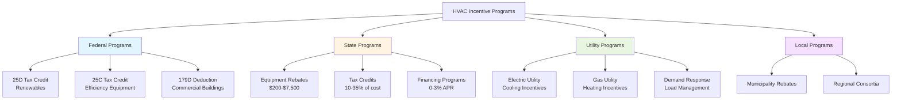

Financial incentive programs significantly reduce the capital cost of high-efficiency HVAC equipment and accelerate adoption of energy-saving technologies. These programs operate at federal, state, and utility levels, each with distinct qualification criteria and benefit structures.

## Federal Incentive Programs

The federal government provides tax-based incentives for residential and commercial HVAC installations through the Internal Revenue Code.

### Residential Energy Efficient Property Credit (25D)

Tax credit for renewable energy equipment installations in existing homes and new construction.

**Qualifying Equipment:**
- Geothermal heat pumps (water-to-water, water-to-air)
- Solar thermal systems for space heating or domestic hot water
- Small wind turbines used for residential purposes

**Credit Structure:**
- 30% of equipment and installation costs (no annual or lifetime cap)
- Valid through December 31, 2032
- Steps down to 26% in 2033, 22% in 2034
- Carryforward provision for unused credit amounts

### Energy Efficient Home Improvement Credit (25C)

Tax credit for high-efficiency HVAC equipment in existing residential properties.

**Qualifying Equipment (2024 criteria):**
- Central air conditioners: SEER2 ≥ 16.0
- Air-source heat pumps: SEER2 ≥ 16.0, HSPF2 ≥ 9.0
- Ductless mini-split heat pumps: SEER2 ≥ 16.0, HSPF2 ≥ 9.0
- Gas furnaces: AFUE ≥ 97%
- Natural gas, propane, or oil boilers: AFUE ≥ 95%

**Credit Limits:**
- Heat pumps: $2,000 per unit
- Central air conditioners: $600 per unit
- Gas furnaces and boilers: $600 per unit
- Annual household limit: $1,200 (heat pumps excepted)

### Commercial Buildings Energy Efficiency Tax Deduction (179D)

Deduction for energy-efficient commercial building systems, including HVAC.

**Qualification Requirements:**
- Building must reduce energy cost by ≥ 25% compared to ASHRAE 90.1 baseline
- HVAC system improvements qualify if they meet component-specific targets
- Maximum deduction: $5.00/ft² (for 50% energy cost reduction)
- Partial deduction: $0.50-$1.00/ft² per qualifying system

**Calculation Method:**
- Whole building energy modeling using approved software (DOE-2.2, EnergyPlus)
- Third-party certification required for deductions > $0.50/ft²
- Prevailing wage requirements for maximum deduction amounts

## State Incentive Programs

State-level programs vary significantly by jurisdiction. Most states offer direct rebates or tax credits for high-efficiency equipment.

| State Program Type | Mechanism | Typical HVAC Benefits | Example States |
|-------------------|-----------|----------------------|----------------|
| Equipment rebates | Direct payment after installation | $200-$2,500 per unit | CA, NY, MA, CT |
| Income tax credits | State tax reduction | 10-35% of equipment cost | AZ, ID, MT, OR |
| Sales tax exemptions | Point-of-sale discount | 4-10% cost reduction | FL, MD, NJ, TX |
| Property tax exemptions | Reduced assessment | Multi-year savings | CO, NH, NV, RI |
| Low-interest loans | Subsidized financing | 0-3% APR, 5-15 year terms | IL, MI, NC, WI |

### High-Impact State Programs

**California TECH Clean California Initiative:**
- Heat pump HVAC rebates: $3,000-$7,500 per system
- Heat pump water heaters: $2,000-$4,000
- Income-qualified multipliers: 1.5-2.0×
- Statewide standardized contractor training

**New York Clean Heat Program:**
- Air-source heat pumps: $1,000-$3,000
- Geothermal heat pumps: $3,000-$6,000
- Fuel conversion bonus: additional $500-$1,000
- Pre-approval required for projects > $10,000

**Massachusetts Mass Save Program:**
- Central air conditioning: $200-$600
- Ductless heat pumps: $500-$1,200 per zone (max 5 zones)
- Whole-home air sealing: up to $2,000
- Zero-interest HEAT Loan: up to $25,000, 7-year term

## Utility Incentive Programs

Electric and gas utilities operate demand-side management programs to reduce peak loads and overall energy consumption.

### Residential Utility Programs

**Equipment Rebate Structure:**

| Equipment Type | Typical Rebate Range | Qualification Threshold |
|----------------|---------------------|------------------------|
| Central AC (SEER2) | $200-$800 | ≥ 16.0-17.0 |
| Air-source heat pump | $500-$1,500 | SEER2 ≥ 16.0, HSPF2 ≥ 9.0 |
| Ductless mini-split | $300-$1,000/zone | SEER2 ≥ 18.0 |
| Geothermal heat pump | $1,000-$4,000 | EER ≥ 17.0, COP ≥ 3.5 |
| Gas furnace | $100-$500 | AFUE ≥ 95-97% |
| ECM furnace fan | $50-$150 | ECM motor replacement |
| Smart thermostat | $50-$150 | Demand response capable |

### Commercial Utility Programs

**Prescriptive Rebates:**
- Fixed dollar amount per ton, kW, or unit installed
- Pre-defined equipment efficiency thresholds
- Simplified application and verification process
- Typical range: $50-$300 per ton of cooling capacity

**Custom Incentives:**
- Engineering analysis of energy savings
- Incentive based on kWh or therm reduction (typically $0.08-$0.25/kWh saved)
- Requires baseline energy modeling and post-installation verification
- Applies to unique equipment configurations or deep energy retrofits

**Direct Installation Programs:**
- Utility provides equipment at no or reduced cost
- Common for small commercial buildings (< 50,000 ft²)
- Typical measures: programmable thermostats, economizers, RTU tune-ups
- Participation limits energy consumption requirements

## DSIRE Database

The Database of State Incentives for Renewables & Efficiency (DSIRE) serves as the comprehensive national resource for incentive program information.

**Database Features:**
- Searchable by state, technology, and sector
- Updated monthly with program changes
- Includes eligibility criteria, incentive amounts, and application procedures
- Links directly to program administrators and application portals

**Search Parameters:**
- Technology category (HVAC equipment, building envelope, controls)
- Incentive type (rebate, tax credit, loan, grant)
- Eligible sectors (residential, commercial, industrial, agricultural)
- Energy source (electric, gas, renewable)

## Incentive Program Landscape

## Application Strategy

**Incentive Stacking:**
Multiple incentive programs can often be combined for a single project.

**Typical Combinations:**
1. Federal 25C tax credit + state rebate + utility rebate
2. Federal 179D deduction + utility custom incentive + low-interest financing
3. State tax credit + municipal program + manufacturer rebate

**Application Sequence:**
1. Identify all applicable programs through DSIRE database search
2. Verify equipment meets all program efficiency requirements
3. Submit utility rebate application (often requires pre-approval)
4. Complete installation with qualified contractor
5. Submit state rebate applications with required documentation
6. Claim federal tax credits on annual tax return

**Documentation Requirements:**
- AHRI certificate of product ratings
- Contractor license and insurance verification
- Itemized invoice showing equipment model numbers
- Proof of payment
- Installation photos (for some programs)
- Energy modeling reports (for custom commercial incentives)

## Program Qualification Criteria

Equipment must meet minimum efficiency thresholds established by each program. Federal tax credits reference ENERGY STAR certification or specific efficiency metrics. Utility programs often set higher thresholds to target top-tier equipment.

**Contractor Qualification:**
Many programs require installation by licensed HVAC contractors with specific certifications:
- NATE (North American Technician Excellence) certification
- Manufacturer-specific training credentials
- State contractor license in good standing
- Liability and workers compensation insurance

**Income-Qualified Programs:**
Enhanced incentive levels for low-to-moderate income households, typically:
- 150-200% of area median income (AMI)
- Verification through tax returns or utility bill assistance enrollment
- Increased rebate amounts (1.5-3.0× standard levels)
- Direct installation or turnkey program options

Financial incentive programs transform the economics of high-efficiency HVAC equipment, reducing simple payback periods from 10-15 years to 3-7 years in many applications. The aggregated value of federal, state, and utility incentives can offset 30-60% of total installation costs for qualifying projects.
