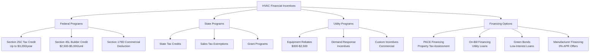

Financial incentives reduce the upfront cost of high-efficiency HVAC equipment and encourage adoption of energy-saving technologies. These programs combine federal tax credits, utility rebates, state incentives, and innovative financing mechanisms to improve economic viability of efficient systems.

## Federal Tax Credit Programs

The Inflation Reduction Act of 2022 expanded and extended HVAC-related tax incentives through 2032, creating substantial opportunities for residential and commercial property owners.

### Section 25C Energy Efficient Home Improvement Credit

The 25C credit applies to existing residential properties and covers qualified HVAC equipment installations:

| Equipment Type | Maximum Credit | Efficiency Requirements |
|----------------|----------------|------------------------|
| Central Air Conditioner | $600 | SEER2 ≥ 16, EER2 ≥ 12.5 |
| Air-Source Heat Pump | $2,000 | SEER2 ≥ 16, EER2 ≥ 12.5, HSPF2 ≥ 9 |
| Gas Furnace/Boiler | $600 | AFUE ≥ 95% |
| Oil Furnace/Boiler | $600 | AFUE ≥ 90% |
| Biomass Stove | $2,000 | 75% efficiency rating |
| Energy Audit | $150 | Home Energy Audit |

**Annual Aggregate Limit:** $3,200 per year ($1,200 for qualified equipment, $2,000 for heat pumps)

**Eligibility Requirements:**
- Equipment must be installed in taxpayer's primary residence
- Must meet or exceed ENERGY STAR Most Efficient certification levels
- Installation must occur between January 1, 2023 and December 31, 2032
- Manufacturer certification statement required for tax filing

### Section 45L New Energy Efficient Home Credit

Builder credit for new residential construction meeting energy performance standards:

| Performance Level | Credit Amount | Requirements |
|-------------------|---------------|--------------|
| ENERGY STAR Certification | $2,500 | Meets ENERGY STAR program requirements |
| Zero Energy Ready Home | $5,000 | DOE Zero Energy Ready Home certification |
| Multifamily Prevailing Wage | $5,000 | Meets prevailing wage requirements |

The credit applies per dwelling unit and requires third-party certification through RESNET HERS rating or equivalent.

## Utility Rebate Programs

Electric and gas utilities offer direct rebates for high-efficiency equipment to reduce peak demand and total energy consumption. Rebate structures vary by service territory but follow common patterns.

### Residential Utility Rebates

| Program Type | Typical Rebate Range | Common Requirements |
|--------------|---------------------|---------------------|
| Central AC Replacement | $300 - $1,000 | SEER2 ≥ 15-16 |
| Heat Pump Installation | $500 - $2,500 | SEER2 ≥ 16, HSPF2 ≥ 9 |
| Smart Thermostat | $50 - $150 | ENERGY STAR certified |
| Furnace Upgrade | $200 - $800 | AFUE ≥ 95% |
| Duct Sealing | $150 - $500 | Professional verification |
| Load Management Devices | $50 - $200 | Demand response enrollment |

### Commercial Utility Incentives

Commercial programs use custom calculations based on projected energy savings:

- **Prescriptive Rebates:** Fixed incentives per ton or unit (typically $100-$400 per ton for rooftop units)
- **Custom Incentives:** $0.08-$0.15 per kWh saved annually over 10-year measure life
- **Downstream Rebates:** Paid directly to customer after installation
- **Midstream/Upstream Rebates:** Paid to distributor or manufacturer, reducing customer cost

**Key Program Features:**
- Pre-approval often required before equipment purchase
- Professional installation verification mandatory
- Minimum efficiency thresholds exceed code requirements by 10-25%
- Rebates stackable with federal tax credits

## State and Local Incentives

State programs supplement federal incentives with additional tax credits, grants, and rebates:

**Common State Programs:**
- **State Income Tax Credits:** 10-25% of equipment cost up to $500-$1,500
- **Sales Tax Exemptions:** Waiver of sales tax on qualifying HVAC equipment (4-10% savings)
- **Property Tax Exemptions:** Exclusion of efficiency upgrade value from property assessment
- **Grant Programs:** Direct funding for low-income weatherization including HVAC upgrades

States with aggressive HVAC incentive programs include California, New York, Massachusetts, Connecticut, and Colorado. Database resources such as DSIRE (Database of State Incentives for Renewables & Efficiency) provide comprehensive program listings.

## Accelerated Depreciation Programs

Commercial property owners access additional financial benefits through accelerated depreciation:

### MACRS Depreciation

Modified Accelerated Cost Recovery System allows rapid depreciation of HVAC capital investments:

| System Type | Recovery Period | Method |
|-------------|----------------|--------|
| Commercial HVAC | 39 years (building) | Straight-line |
| HVAC Equipment (separate) | 5-7 years | 200% declining balance |
| Energy Property | 5 years | 200% declining balance |

### Section 179D Commercial Building Deduction

Provides immediate deduction for energy-efficient commercial building systems:

- **Maximum Deduction:** $5.00 per square foot (2023-2032)
- **Partial Deduction:** $0.50-$5.00 per square foot based on energy savings
- **Requirements:** 25-50% energy cost reduction vs. ASHRAE 90.1 baseline
- **Prevailing Wage Bonus:** 5x multiplier if prevailing wage requirements met

Government building designers can claim the deduction even though buildings are tax-exempt.

## Energy Efficiency Financing

Innovative financing mechanisms eliminate upfront cost barriers for efficiency upgrades.

### PACE Financing (Property Assessed Clean Energy)

Repayment through property tax assessment over 10-25 years:

**Advantages:**
- No upfront out-of-pocket costs
- Repayment obligation transfers with property sale
- Interest rates typically 5-8%
- Available for residential and commercial properties

**Limitations:**
- Creates senior lien on property (ahead of mortgage)
- Not available in all jurisdictions
- May complicate property refinancing

### On-Bill Financing

Utility-administered loan programs with repayment on monthly utility bills:

- Loan terms: 2-10 years
- Interest rates: 0-6% APR
- Loan amounts: $2,500-$25,000 residential; $50,000-$500,000 commercial
- Underwriting based on utility payment history rather than credit score

### Manufacturer and Contractor Financing

Equipment manufacturers and HVAC contractors offer promotional financing:

- 0% APR for 12-60 months (qualified credit)
- Deferred interest programs (interest accrues if not paid in full)
- Extended payment plans with competitive interest rates

## Incentive Stacking Strategies

Maximum financial benefit requires strategic combination of available incentives:

1. **Apply for utility rebate pre-approval** before equipment purchase
2. **Select equipment meeting highest federal tax credit thresholds**
3. **Verify state incentive eligibility** and application procedures
4. **Use financing if needed** to cover net cost after incentives
5. **Document all requirements** including manufacturer certifications
6. **File tax credits** in year equipment placed in service
7. **Apply commercial depreciation** strategies with tax professional

**Example Residential Heat Pump Installation:**
- Equipment cost: $12,000
- Federal 25C credit: -$2,000
- Utility rebate: -$1,500
- State tax credit: -$500
- Net cost: $8,000 (33% reduction)
- Additional savings from reduced energy bills

## Program Resources

**Federal Programs:**
- IRS Form 5695 (Residential Energy Credits)
- IRS Publication 974 (Premium Tax Credit)
- DOE ENERGY STAR Rebate Finder: energystar.gov/rebate-finder

**Utility Programs:**
- Utility-specific program websites
- Customer service HVAC rebate departments
- Trade ally contractor networks

**State Programs:**
- DSIRE Database: dsireusa.org
- State energy offices
- Regional energy efficiency organizations

Financial incentives significantly improve the economics of high-efficiency HVAC systems, reducing payback periods from 10+ years to 3-7 years in many applications. Proactive engagement with available programs maximizes return on investment while supporting grid reliability and environmental objectives.
