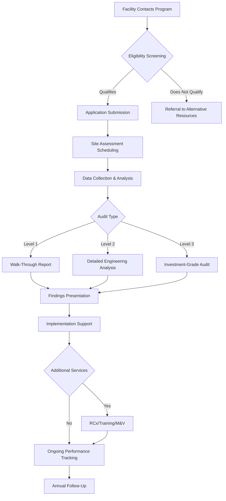

Technical assistance programs provide critical non-financial support to facility owners, managers, and HVAC professionals seeking to improve energy performance. These programs, often administered by the Department of Energy (DOE), utilities, and state energy offices, deliver expert guidance, training, and analytical services that reduce barriers to energy efficiency implementation.

## Program Categories

Technical assistance encompasses several distinct service types, each addressing specific aspects of HVAC energy management:

| Program Type | Service Scope | Typical Duration | Deliverables |
|--------------|---------------|------------------|--------------|
| Energy Audits | Facility assessment, load analysis | 2-8 weeks | Audit report, measure recommendations |
| Retro-Commissioning | System optimization, controls tuning | 3-6 months | RCx plan, implementation report |
| Benchmarking Support | Data collection, performance comparison | 1-3 months | ENERGY STAR score, comparison analysis |
| Technical Training | Equipment operation, maintenance practices | 1-5 days | Certification, training materials |
| Design Assistance | System design review, peer consultation | 2-4 weeks | Design recommendations, calculations |
| Measurement & Verification | Performance tracking, savings verification | 6-24 months | M&V report, savings documentation |

## Energy Audit Programs

Energy audits represent the foundational technical assistance service, providing systematic evaluation of building energy consumption and HVAC system performance.

**ASHRAE Audit Levels:**

- **Level 1 (Walk-Through):** Visual inspection, utility bill analysis, preliminary measure identification. Typical cost: $0.05-0.10/ft².
- **Level 2 (Energy Survey):** Detailed equipment inventory, system measurements, engineering analysis with financial evaluation. Typical cost: $0.15-0.30/ft².
- **Level 3 (Investment-Grade):** Comprehensive field monitoring, computer simulation, detailed cost-benefit analysis. Typical cost: $0.30-0.60/ft².

DOE's Industrial Assessment Centers (IAC) provide free Level 2 audits for small and medium-sized manufacturers through university partnerships. The program has completed over 19,000 assessments, identifying average savings of 5-15% of facility energy consumption.

## Retro-Commissioning Support

Retro-commissioning (RCx) programs assist building owners in optimizing existing HVAC systems without major capital investment. These programs typically achieve 5-20% energy savings through operational improvements.

**RCx Process Components:**

1. **Planning Phase:** Establish commissioning scope, team roles, performance objectives
2. **Investigation Phase:** Review documentation, conduct functional testing, identify deficiencies
3. **Implementation Phase:** Execute low-cost/no-cost measures, develop capital improvement recommendations
4. **Hand-off Phase:** Document findings, train operations staff, establish ongoing monitoring

Many utility programs subsidize 50-100% of RCx costs for commercial customers. The Building Commissioning Association estimates typical RCx investment of $0.20-0.40/ft² with simple payback periods of 1-3 years for most facilities.

## Benchmarking and Disclosure Programs

Building energy benchmarking programs enable performance comparison against similar facilities and track improvement over time. Technical assistance supports data collection, analysis, and compliance with disclosure ordinances.

**Key Benchmarking Metrics:**

| Metric | Units | Application |
|--------|-------|-------------|
| Energy Use Intensity (EUI) | kBtu/ft²/year | Whole-building comparison |
| Source EUI | kBtu/ft²/year | Accounts for generation/transmission losses |
| ENERGY STAR Score | 1-100 scale | Percentile ranking vs. peers |
| Weather-Normalized EUI | kBtu/ft²/year | Eliminates climate variation |

Portfolio Manager, EPA's free online tool, serves as the primary platform for commercial building benchmarking. Over 40 U.S. cities require annual benchmarking and disclosure for buildings exceeding size thresholds (typically 25,000-50,000 ft²).

## Training and Capacity Building

Technical training programs develop workforce capabilities essential for proper HVAC system design, installation, operation, and maintenance.

**DOE Training Initiatives:**

- **Better Buildings Workforce Accelerator:** Credentials training for building operators and technicians
- **Combined Heat and Power Technical Assistance Partnerships:** Regional experts providing CHP feasibility and implementation support
- **Advanced Manufacturing Office:** Industrial system optimization training (compressed air, process heating, pumping)

State energy offices frequently offer subsidized training on topics including:
- Building automation system programming and optimization
- Variable frequency drive application and commissioning
- Economizer setup and troubleshooting
- Refrigerant management and leak detection
- Demand-controlled ventilation implementation

## Technical Assistance Workflow

## Program Access and Eligibility

Access to technical assistance varies by program sponsor and target market segment:

**Utility Programs:** Generally available to customers of participating utilities, often with size or sector restrictions (e.g., commercial/industrial only). No direct cost to customer; funded through ratepayer mechanisms.

**State Energy Office Programs:** Typically focused on public sector, small business, or nonprofit facilities. May require cost-sharing of 0-50% depending on organization type.

**Federal Programs:** DOE Industrial Assessment Centers serve manufacturers with gross annual sales under $100 million and 250-500 employees. Better Buildings technical assistance targets large commercial portfolios.

## Maximizing Program Value

To derive maximum benefit from technical assistance programs:

1. **Prepare facility data:** Compile 12-24 months of utility bills, equipment schedules, maintenance records
2. **Engage operations staff:** Include personnel with institutional knowledge of system operation and issues
3. **Define objectives:** Establish clear goals (cost reduction, comfort improvement, equipment replacement planning)
4. **Request specific deliverables:** Ensure reports include implementation costs, savings estimates, and prioritization
5. **Plan for implementation:** Allocate capital and operational resources to execute high-value recommendations
6. **Verify results:** Track consumption post-implementation to validate projected savings

Technical assistance programs represent a high-value, low-risk pathway to HVAC energy efficiency. Leveraging these services provides expert guidance at minimal or no cost, accelerating identification and implementation of cost-effective efficiency measures.

## Components

- Energy Audits Assessments
- Retro Commissioning Programs
- Benchmarking Disclosure Requirements
- Technical Training Support
