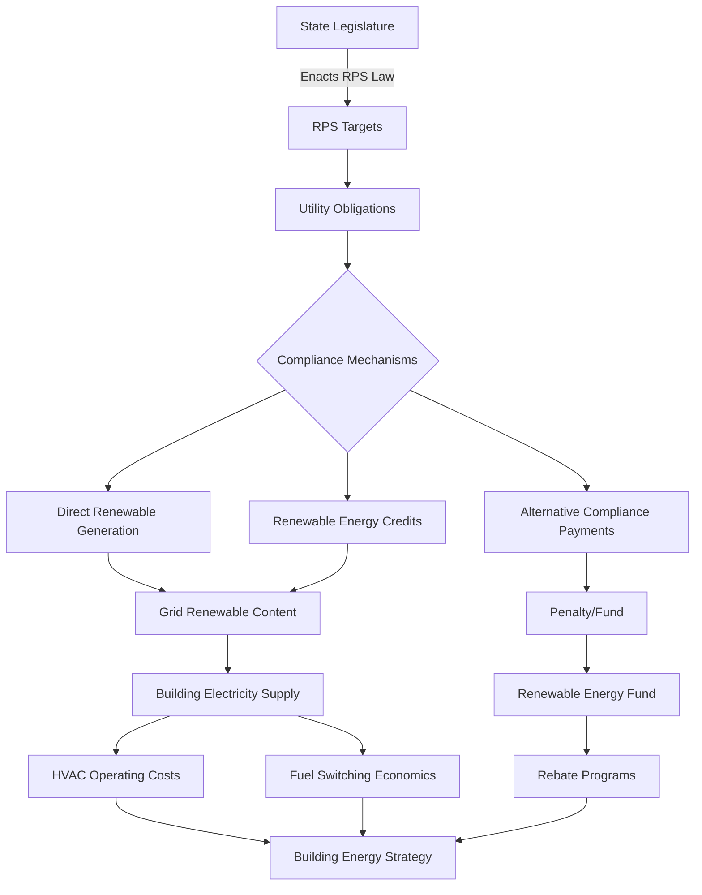

Renewable Portfolio Standards (RPS) establish mandatory targets for electricity suppliers to procure specified percentages of generation from renewable energy sources. These state-level policies fundamentally reshape the electricity grid composition, directly affecting HVAC system operating costs, fuel selection decisions, and building electrification economics.

## RPS Policy Framework

## RPS Requirements by State

State RPS policies vary significantly in target percentages, compliance timelines, and eligible technologies. The following table presents major state RPS targets based on DSIRE (Database of State Incentives for Renewables & Efficiency) and NCSL (National Conference of State Legislatures) data.

| State | RPS Target | Target Year | Carve-Outs/Special Provisions |
|-------|------------|-------------|-------------------------------|
| California | 100% zero-carbon | 2045 | 60% RPS by 2030, 100% clean by 2045 |
| New York | 70% renewable | 2030 | 100% zero-emission by 2040 |
| Massachusetts | 40% renewable | 2030 | Increasing 1% annually thereafter |
| New Jersey | 50% renewable | 2030 | 11% solar carve-out |
| Illinois | 50% renewable | 2040 | 40% by 2030, increasing to 50% |
| Colorado | 100% clean | 2050 | 80% by 2030 for IOUs |
| Washington | 100% clean | 2045 | 80% by 2030, coal elimination by 2025 |
| Virginia | 100% clean | 2050 | 65% RPS by 2035 for IOUs |
| Connecticut | 48% renewable | 2030 | Increasing 2% per year to 2030 |
| Minnesota | 31.5% renewable | 2020 | 26.5% for IOUs, higher for Xcel |
| Oregon | 50% renewable | 2040 | 27% by 2025, coal elimination by 2030 |
| Nevada | 50% renewable | 2030 | 12% solar by 2025 |

**Notes:** IOUs = Investor-Owned Utilities. Targets reflect legislative status as of January 2025. Several states distinguish between RPS (renewable-specific) and CES (clean energy standards including nuclear).

## Compliance Mechanisms

Utilities and load-serving entities employ three primary methods to satisfy RPS obligations:

**1. Direct Renewable Generation**

Utilities construct or contract for renewable generating capacity, including wind farms, solar photovoltaic installations, biomass facilities, and geothermal plants. This approach directly increases renewable content in the electricity grid supplying buildings.

**2. Renewable Energy Credits (RECs)**

RECs represent the environmental attributes of one megawatt-hour of renewable electricity generation. Utilities purchase RECs separately from electricity to meet RPS targets. REC markets create price signals that influence renewable project development.

**3. Alternative Compliance Payments (ACPs)**

When renewable procurement or REC purchases prove insufficient, utilities make penalty payments to state funds. ACP rates typically range from $25 to $75 per MWh, establishing effective price caps for REC markets.

## Impact on Building HVAC Systems

RPS policies influence HVAC design and operation through multiple pathways:

**Electricity Carbon Intensity Reduction**

As grid renewable content increases, electric heating and cooling systems operate with progressively lower greenhouse gas emissions. In states approaching 50%+ renewable electricity, heat pumps produce fewer emissions than natural gas furnaces over annual operation, even accounting for generation losses.

**Time-of-Use Rate Structures**

RPS compliance often coincides with increased solar generation. This creates afternoon electricity price depressions and evening/night price peaks. HVAC systems with thermal storage can leverage these price differentials, precooling during low-cost solar hours.

**Building Electrification Economics**

High RPS targets improve the economic case for all-electric buildings. As renewable electricity costs decline and REC values stabilize, electric heat pumps gain operational cost advantages over fossil fuel equipment, particularly when combined with on-site solar generation.

**Utility Incentive Programs**

ACP revenues and other RPS-related funds frequently finance building energy efficiency and electrification rebate programs. Many states direct RPS alternative compliance penalties toward heat pump rebates, weatherization programs, and renewable heating incentives.

## RPS and On-Site Solar Integration

Building-integrated photovoltaic systems interact with RPS policies through net metering and REC ownership provisions. Key considerations include:

- **REC Ownership:** Some utility RPS programs require customers to transfer RECs from on-site solar systems in exchange for financial incentives
- **Net Metering Credit Values:** RPS targets can support higher net metering compensation rates by demonstrating grid decarbonization benefits
- **Self-Supply Limitations:** Several states exclude customer-sited generation from RPS compliance, concentrating requirements on utility-scale projects

## Design Implications for HVAC Engineers

When designing HVAC systems in states with aggressive RPS targets:

1. **Evaluate heat pump lifecycle costs** using projected grid carbon intensity reductions rather than current electricity fuel mix
2. **Consider thermal energy storage** to exploit solar-driven time-of-use pricing differentials
3. **Size electrical services** to accommodate future building electrification as RPS policies improve electric heating economics
4. **Investigate utility rebate programs** funded through RPS alternative compliance mechanisms
5. **Calculate total cost of ownership** for electric vs. fossil fuel equipment over 15-20 year equipment life, incorporating RPS-driven electricity cost trends

## RPS Policy Trends

Current RPS policy evolution includes:

- **Transition to Clean Energy Standards (CES):** States expanding beyond renewable-only requirements to include nuclear, carbon capture, and other zero-emission sources
- **Increasing Targets:** Regular legislative increases in RPS percentages and acceleration of compliance timelines
- **Offshore Wind Carve-Outs:** Coastal states establishing specific procurement targets for offshore wind resources
- **Energy Storage Integration:** New requirements for pairing renewable generation with battery storage to address intermittency

These trends accelerate electricity grid decarbonization, progressively improving the emissions profile of electric HVAC equipment and strengthening the economic case for building electrification strategies.

## References and Data Sources

- **DSIRE (Database of State Incentives for Renewables & Efficiency):** Comprehensive tracking of state RPS policies, compliance requirements, and eligible technologies
- **NCSL (National Conference of State Legislatures):** Legislative analysis of state renewable energy standards and clean energy targets
- **State Public Utility Commissions:** RPS compliance reports, REC market data, and alternative compliance payment statistics
- **EIA Form 861:** Annual electric power industry data including RPS compliance metrics and renewable generation by state
